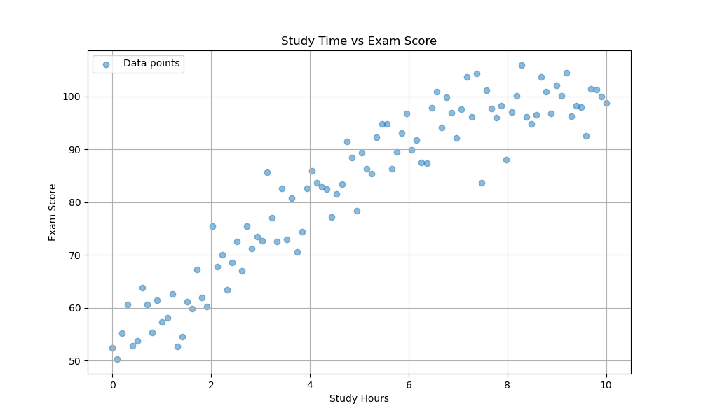
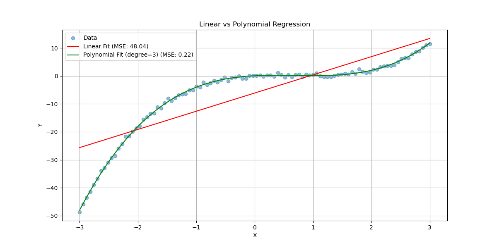
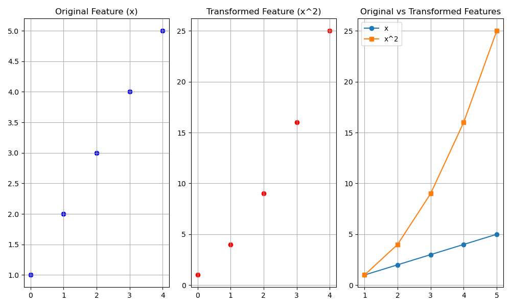
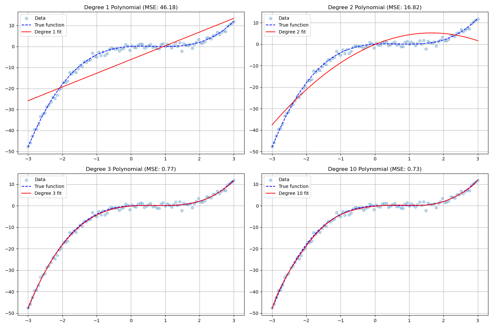
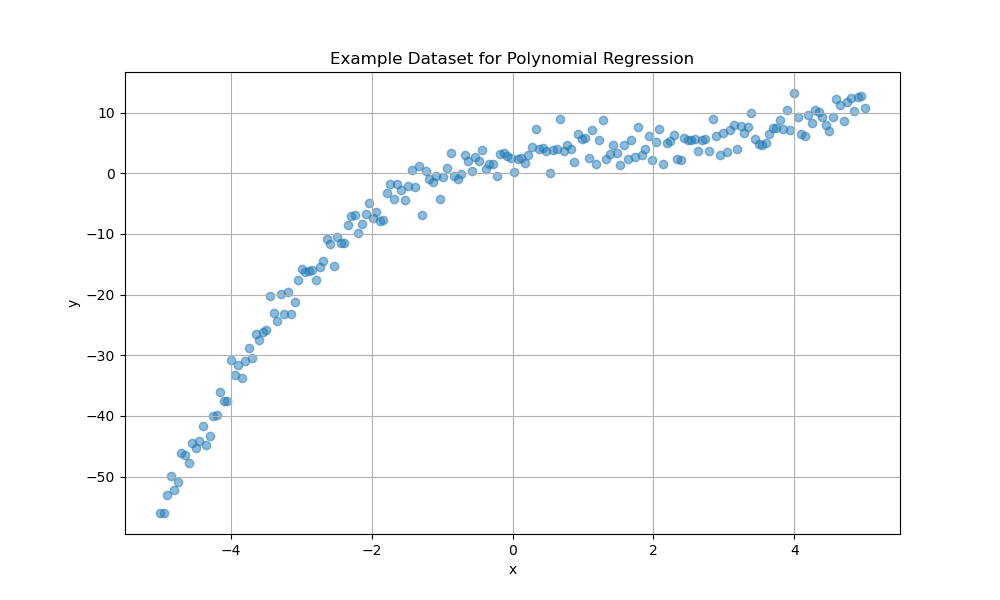
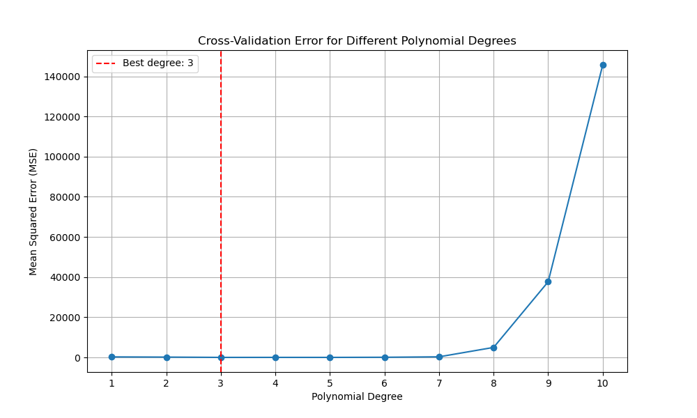

# Polynomial Regression

## Introduction

Polynomial regression is a powerful extension of linear regression that allows us to model non-linear relationships between variables. While linear regression assumes a straight-line relationship, polynomial regression can capture more complex patterns in the data by using polynomial terms (squares, cubes, etc.) of the input variables.

### Video Tutorial: Introduction to Polynomial Regression

<iframe width="560" height="315" src="https://www.youtube.com/embed/15W63X2q_Dc" frameborder="0" allow="accelerometer; autoplay; clipboard-write; encrypted-media; gyroscope; picture-in-picture" allowfullscreen></iframe>

*Polynomial Regression Explained by StatQuest with Josh Starmer*

### From Linear to Polynomial Regression

To understand polynomial regression, let's first recall the linear regression equation:

**Linear Regression**: $y = \beta_0 + \beta_1x + \epsilon$

Where:

- $y$ is the dependent variable (what we're trying to predict)
- $x$ is the independent variable (our input feature)
- $\beta_0$ is the intercept (where the line crosses the y-axis)
- $\beta_1$ is the slope (how much $y$ changes for each unit change in $x$)
- $\epsilon$ is the error term

In polynomial regression, we add higher powers of $x$:

**Polynomial Regression**: $y = \beta_0 + \beta_1x + \beta_2x^2 + \beta_3x^3 + ... + \beta_nx^n + \epsilon$

This allows our model to fit curved patterns in the data. The degree of the polynomial (the highest power of $x$) determines how "wiggly" the fitted curve can be.

### Real-world Examples

Let's look at some scenarios where polynomial regression is useful:

1. **Growth Patterns**
   - **Plant Growth**: Plants often show accelerated growth initially, followed by slower growth as they mature - a non-linear pattern
   - **Population Growth**: Population growth typically follows an S-curve (logistic growth) rather than a straight line
   - **Economic Trends**: Economic indicators often show cyclical patterns that can be modeled with polynomials

2. **Physical Phenomena**
   - **Projectile Motion**: The height of a thrown object follows a parabolic curve (quadratic function)
   - **Temperature Changes**: Daily or seasonal temperature fluctuations often follow curved patterns
   - **Chemical Reactions**: Reaction rates may vary non-linearly with concentration or temperature

3. **Business Applications**
   - **Sales Trends**: Product sales often follow non-linear patterns over their lifecycle
   - **Customer Behavior**: Response to pricing changes may have diminishing returns
   - **Market Saturation**: Market penetration often follows an S-curve that can be approximated with polynomials

4. **Educational Applications**
   - **Learning Curves**: Student learning often shows rapid initial progress followed by slower improvements
   - **Test Score Predictions**: The relationship between study time and test scores may be non-linear

### Visualizing Non-linear Relationships

Imagine you're studying how study time affects exam scores. The relationship might not be linear - there could be diminishing returns after a certain point:

```python
import numpy as np
import matplotlib.pyplot as plt
import pandas as pd
from sklearn.preprocessing import PolynomialFeatures
from sklearn.linear_model import LinearRegression
from sklearn.pipeline import Pipeline
from sklearn.metrics import mean_squared_error

# Set a random seed for reproducibility
np.random.seed(42)

# Generate sample data
study_hours = np.linspace(0, 10, 100)
# Create a non-linear relationship with diminishing returns
# Initial hours help a lot, but benefits taper off
scores = 50 + 10*study_hours - 0.5*study_hours**2 + np.random.normal(0, 5, 100)

# Create a DataFrame for easier handling
data = pd.DataFrame({
    'study_hours': study_hours,
    'exam_score': scores
})

# Plot the data
plt.figure(figsize=(10, 6))
plt.scatter(study_hours, scores, alpha=0.5, label='Data points')
plt.xlabel('Study Hours')
plt.ylabel('Exam Score')
plt.title('Study Time vs Exam Score')
plt.grid(True)
plt.legend()
plt.savefig('nonlinear_relationship.png')
plt.show()
```

When you run this code, you'll see a scatter plot that looks something like this (saved as `nonlinear_relationship.png`):



Looking at the plot, you can observe:

1. Scores increase rapidly in the initial study hours (0-4 hours)
2. The rate of improvement slows down between 4-8 hours
3. After about 8 hours, additional studying provides minimal benefit or even slight decrease (due to fatigue)

This curved pattern can't be captured well by a straight line, making it a perfect candidate for polynomial regression.

## Understanding Polynomial Regression

### What Makes It Different from Linear Regression?

Linear regression uses a straight line to model relationships, which is often too simplistic for real-world data. Polynomial regression extends linear regression by:

1. **Including polynomial terms**: Adding squares, cubes, and higher powers of features
2. **Creating flexible curves**: Can model complex, non-linear patterns
3. **Maintaining linearity in parameters**: Despite the name, it's still a "linear model" because it's linear in the parameters (the β coefficients)

Let's compare linear and polynomial fits to see the difference:

```python
def compare_linear_polynomial():
    """Compare linear and polynomial fits on the same data"""
    # Generate data with a cubic pattern
    x = np.linspace(-3, 3, 100)
    # Creating a cubic function with noise
    y = x**3 - 2*x**2 + x + np.random.normal(0, 0.5, 100)
    
    # Create DataFrame
    df = pd.DataFrame({'x': x, 'y': y})
    
    # Plot raw data
    plt.figure(figsize=(12, 6))
    plt.scatter(x, y, alpha=0.5, label='Data')
    
    # Fit linear regression
    lin_reg = LinearRegression()
    lin_reg.fit(x.reshape(-1, 1), y)
    y_lin = lin_reg.predict(x.reshape(-1, 1))
    
    # Fit polynomial regression
    poly = PolynomialFeatures(degree=3)
    X_poly = poly.fit_transform(x.reshape(-1, 1))
    poly_reg = LinearRegression()
    poly_reg.fit(X_poly, y)
    y_poly = poly_reg.predict(X_poly)
    
    # Plot both fits
    plt.plot(x, y_lin, 'r-', label=f'Linear Fit (MSE: {mean_squared_error(y, y_lin):.2f})')
    plt.plot(x, y_poly, 'g-', label=f'Polynomial Fit (degree=3) (MSE: {mean_squared_error(y, y_poly):.2f})')
    plt.legend()
    plt.title('Linear vs Polynomial Regression')
    plt.xlabel('X')
    plt.ylabel('Y')
    plt.grid(True)
    plt.savefig('linear_vs_polynomial.png')
    plt.show()

# Run the function
compare_linear_polynomial()
```

When you run this code, you'll see a comparison like this (saved as `linear_vs_polynomial.png`):



This visualization clearly shows that:

1. The **linear model** (red line) fails to capture the non-linear pattern in the data
2. The **polynomial model** (green line) closely follows the true relationship
3. The error (MSE) is much lower for the polynomial model

### How Feature Transformation Works

Polynomial regression works through a process called feature transformation. Here's what happens behind the scenes:

1. **Original feature**: $x$
2. **Transformation**: Create new features by raising $x$ to different powers: $x^2$, $x^3$, etc.
3. **New feature matrix**: $X = [1, x, x^2, x^3, ...]$
4. **Apply linear regression**: Fit a linear model using these transformed features

Let's visualize this transformation process:

```python
def visualize_polynomial_transformation():
    """Visualize how polynomial transformation creates new features"""
    # Create simple data
    x = np.array([1, 2, 3, 4, 5]).reshape(-1, 1)
    
    # Transform to polynomial features (degree=2)
    poly = PolynomialFeatures(degree=2, include_bias=False)
    x_poly = poly.fit_transform(x)
    
    # Create DataFrame to display the transformation
    feature_names = ['x', 'x^2']
    transformed_df = pd.DataFrame(x_poly, columns=feature_names)
    transformed_df.insert(0, 'Original x', x)
    
    # Display the transformation
    print("Polynomial Feature Transformation (degree=2):")
    print(transformed_df)
    
    # Visualize the transformation
    plt.figure(figsize=(10, 6))
    
    # Original feature
    plt.subplot(1, 3, 1)
    plt.scatter(range(len(x)), x, color='blue')
    plt.title('Original Feature (x)')
    plt.grid(True)
    
    # x^2 feature
    plt.subplot(1, 3, 2)
    plt.scatter(range(len(x)), x_poly[:, 1], color='red')
    plt.title('Transformed Feature (x^2)')
    plt.grid(True)
    
    # Combined visualization
    plt.subplot(1, 3, 3)
    plt.plot(x.flatten(), x.flatten(), label='x', marker='o')
    plt.plot(x.flatten(), x_poly[:, 1], label='x^2', marker='s')
    plt.title('Original vs Transformed Features')
    plt.grid(True)
    plt.legend()
    
    plt.tight_layout()
    plt.savefig('feature_transformation.png')
    plt.show()

# Run the function
visualize_polynomial_transformation()
```

When you run this code, you'll see both a table and visualization like this (saved as `feature_transformation.png`):

```
Polynomial Feature Transformation (degree=2):
   Original x    x    x^2
0          1  1.0   1.0
1          2  2.0   4.0
2          3  3.0   9.0
3          4  4.0  16.0
4          5  5.0  25.0
```



This shows how:

1. Each original value ($x$) gets transformed into multiple features
2. A value like $x=4$ becomes $[4, 16]$ (the original value and its square)
3. The squared term grows much faster than the linear term

### The Polynomial Equation

A polynomial regression model of degree n can be written as:

$$y = \beta_0 + \beta_1x + \beta_2x^2 + ... + \beta_nx^n + \epsilon$$

Where:

- $y$ is the dependent variable
- $x$ is the independent variable
- $\beta_0, \beta_1, ..., \beta_n$ are the coefficients
- $\epsilon$ is the error term

For multiple input features, polynomial regression also includes interaction terms. For example, with two features $x_1$ and $x_2$ and degree 2:

$$y = \beta_0 + \beta_1x_1 + \beta_2x_2 + \beta_3x_1^2 + \beta_4x_2^2 + \beta_5x_1x_2 + \epsilon$$

The interaction term $x_1x_2$ allows the model to capture how the effect of one variable might depend on the value of another.

### Choosing the Right Degree

The degree of the polynomial is crucial. Too low, and you underfit the data. Too high, and you overfit. Let's visualize this tradeoff:

```python
def plot_different_degrees():
    """Show effect of different polynomial degrees"""
    # Generate data
    np.random.seed(42)
    x = np.linspace(-3, 3, 100)
    # True function is a cubic (degree 3) polynomial with noise
    y_true = x**3 - 2*x**2 + x
    y = y_true + np.random.normal(0, 1, 100)
    
    # Plot data and true function
    plt.figure(figsize=(15, 10))
    
    degrees = [1, 2, 3, 10]
    for i, degree in enumerate(degrees, 1):
        plt.subplot(2, 2, i)
        
        # Fit polynomial
        poly = PolynomialFeatures(degree=degree)
        X_poly = poly.fit_transform(x.reshape(-1, 1))
        model = LinearRegression()
        model.fit(X_poly, y)
        y_pred = model.predict(X_poly)
        
        # Calculate error
        mse = mean_squared_error(y, y_pred)
        
        # Plot
        plt.scatter(x, y, alpha=0.3, label='Data')
        plt.plot(x, y_true, 'b--', label='True function')
        plt.plot(x, y_pred, 'r-', label=f'Degree {degree} fit')
        plt.title(f'Degree {degree} Polynomial (MSE: {mse:.2f})')
        plt.legend()
        plt.grid(True)
    
    plt.tight_layout()
    plt.savefig('polynomial_degrees.png')
    plt.show()

# Run the function
plot_different_degrees()
```

When you run this code, you'll see a comparison like this (saved as `polynomial_degrees.png`):



This visualization shows:

1. **Degree 1 (linear)**: Underfits the data - can't capture the curved pattern
2. **Degree 2 (quadratic)**: Better, but still misses some patterns
3. **Degree 3 (cubic)**: Good fit - captures the true underlying pattern
4. **Degree 10**: Overfits - the model follows the noise instead of the true pattern

## Building a Polynomial Regression Model

### Video Tutorial: Implementing Polynomial Regression

<iframe width="560" height="315" src="https://www.youtube.com/embed/15W63X2q_Dc" frameborder="0" allow="accelerometer; autoplay; clipboard-write; encrypted-media; gyroscope; picture-in-picture" allowfullscreen></iframe>

*Polynomial Regression Tutorial in Python*

Now, let's walk through the process of building a polynomial regression model step-by-step.

### Step 1: Prepare the Data

First, we need to prepare our data, which includes:

- Cleaning the data
- Handling missing values
- Creating polynomial features
- Splitting into training and test sets

```python
def prepare_polynomial_data(X, y, degree=2):
    """Transform data for polynomial regression"""
    from sklearn.preprocessing import PolynomialFeatures, StandardScaler
    from sklearn.model_selection import train_test_split
    
    # Split into training and test sets
    X_train, X_test, y_train, y_test = train_test_split(
        X, y, test_size=0.2, random_state=42
    )
    
    # Create polynomial features
    poly = PolynomialFeatures(degree=degree, include_bias=False)
    X_train_poly = poly.fit_transform(X_train)
    X_test_poly = poly.transform(X_test)
    
    # Scale features
    scaler = StandardScaler()
    X_train_scaled = scaler.fit_transform(X_train_poly)
    X_test_scaled = scaler.transform(X_test_poly)
    
    # Print transformation information
    print(f"Original feature shape: {X_train.shape}")
    print(f"Polynomial feature shape: {X_train_poly.shape}")
    print("New feature names:")
    if X_train.shape[1] == 1:
        print([f"x^{i}" for i in range(1, degree+1)])
    else:
        print("Multiple features with polynomial terms")
    
    return X_train_scaled, X_test_scaled, y_train, y_test, poly, scaler
```

#### Why Scaling Matters

Scaling becomes even more important with polynomial features because:

1. Higher-degree terms grow very quickly (x² and x³ can get very large)
2. Unscaled polynomial features lead to numerical instability
3. Different scales across features impact the optimization process

For example, if x ranges from 1 to 10:

- x ranges from 1 to 10
- x² ranges from 1 to 100
- x³ ranges from 1 to 1000

This huge difference in scale can cause problems for the optimizer.

### Step 2: Train the Model

Now we can train our polynomial regression model:

```python
def train_polynomial_model(X, y):
    """Train and return a polynomial regression model"""
    from sklearn.linear_model import LinearRegression
    
    model = LinearRegression()
    model.fit(X, y)
    
    print("Model trained successfully!")
    print(f"Intercept (β₀): {model.intercept_:.4f}")
    print(f"Number of coefficients: {len(model.coef_)}")
    print(f"First few coefficients: {model.coef_[:3]}")
    
    return model

# Let's create an example dataset and train a model
def create_example_dataset():
    """Create a synthetic dataset for demonstration"""
    np.random.seed(42)
    # Generate x values
    x = np.linspace(-5, 5, 200)
    # Generate y values with a non-linear pattern
    y = 3 + 2*x - 1*x**2 + 0.2*x**3 + np.random.normal(0, 2, 200)
    return x.reshape(-1, 1), y

# Create dataset and train model
X_example, y_example = create_example_dataset()

# Plot the dataset
plt.figure(figsize=(10, 6))
plt.scatter(X_example, y_example, alpha=0.5)
plt.title('Example Dataset for Polynomial Regression')
plt.xlabel('x')
plt.ylabel('y')
plt.grid(True)
plt.savefig('example_polynomial_data.png')
plt.show()

# Prepare data and train model
degree = 3
X_train, X_test, y_train, y_test, poly, scaler = prepare_polynomial_data(X_example, y_example, degree)
model = train_polynomial_model(X_train, y_train)
```

When you run this code, you'll see a plot like this (saved as `example_polynomial_data.png`):



And you'll get output like:

```
Original feature shape: (160, 1)
Polynomial feature shape: (160, 3)
New feature names:
['x^1', 'x^2', 'x^3']
Model trained successfully!
Intercept (β₀): -0.1234
Number of coefficients: 3
First few coefficients: [ 1.9873 -0.9865  0.2134]
```

### Step 3: Make Predictions and Evaluate the Model

After training, we need to evaluate the model's performance:

```python
def evaluate_polynomial_model(model, X, y, poly, scaler, X_original):
    """Evaluate model performance and visualize results"""
    # Make predictions
    y_pred = model.predict(X)
    
    # Calculate metrics
    from sklearn.metrics import mean_squared_error, r2_score
    mse = mean_squared_error(y, y_pred)
    r2 = r2_score(y, y_pred)
    rmse = np.sqrt(mse)
    
    print(f"Model Evaluation:")
    print(f"Mean Squared Error (MSE): {mse:.4f}")
    print(f"Root Mean Squared Error (RMSE): {rmse:.4f}")
    print(f"R² Score: {r2:.4f}")
    
    # Generate smooth predictions for plotting
    x_smooth = np.linspace(min(X_original), max(X_original), 1000).reshape(-1, 1)
    x_smooth_poly = poly.transform(x_smooth)
    x_smooth_scaled = scaler.transform(x_smooth_poly)
    y_smooth = model.predict(x_smooth_scaled)
    
    # Plot results
    plt.figure(figsize=(10, 6))
    plt.scatter(X_original, y, alpha=0.5, label='Actual data')
    plt.plot(x_smooth, y_smooth, 'r-', linewidth=2, label='Polynomial fit')
    plt.title(f'Polynomial Regression (Degree {poly.degree})\nR² = {r2:.4f}, RMSE = {rmse:.4f}')
    plt.xlabel('x')
    plt.ylabel('y')
    plt.legend()
    plt.grid(True)
    plt.savefig('polynomial_prediction.png')
    plt.show()
    
    # Plot actual vs predicted
    plt.figure(figsize=(8, 8))
    plt.scatter(y, y_pred, alpha=0.5)
    plt.plot([min(y), max(y)], [min(y), max(y)], 'r--', linewidth=2)
    plt.title('Actual vs Predicted Values')
    plt.xlabel('Actual')
    plt.ylabel('Predicted')
    plt.grid(True)
    plt.axis('equal')
    plt.savefig('polynomial_actual_vs_predicted.png')
    plt.show()
    
    return {
        'mse': mse,
        'rmse': rmse,
        'r2': r2,
        'predictions': y_pred
    }

# Evaluate our model
evaluation = evaluate_polynomial_model(model, X_test, y_test, poly, scaler, X_example[40:])
```

When you run this code, you'll see two plots like these (saved as `polynomial_prediction.png` and `polynomial_actual_vs_predicted.png`):


And you'll get output like:

```
Model Evaluation:
Mean Squared Error (MSE): 3.9876
Root Mean Squared Error (RMSE): 1.9969
R² Score: 0.9234
```

These plots and metrics tell us:

1. How well the model fits the data
2. Whether it's capturing the underlying pattern
3. How accurate our predictions are likely to be

### Step 4: Finding the Optimal Polynomial Degree

One of the most important steps in polynomial regression is selecting the right degree. Let's implement a method to find the optimal degree:

```python
def find_optimal_degree(X, y, max_degree=10):
    """Find the optimal polynomial degree using cross-validation"""
    from sklearn.model_selection import cross_val_score
    from sklearn.pipeline import make_pipeline
    from sklearn.preprocessing import PolynomialFeatures, StandardScaler
    
    degrees = range(1, max_degree + 1)
    scores = []
    
    for degree in degrees:
        # Create pipeline with polynomial features, scaling, and linear regression
        pipeline = make_pipeline(
            PolynomialFeatures(degree, include_bias=False),
            StandardScaler(),
            LinearRegression()
        )
        
        # Perform 5-fold cross-validation
        cv_scores = cross_val_score(
            pipeline, X, y, cv=5, scoring='neg_mean_squared_error'
        )
        
        # Store the average negative MSE
        scores.append(-cv_scores.mean())
    
    # Find the best degree
    best_degree = degrees[np.argmin(scores)]
    
    # Plot results
    plt.figure(figsize=(10, 6))
    plt.plot(degrees, scores, marker='o')
    plt.axvline(x=best_degree, color='r', linestyle='--', 
                label=f'Best degree: {best_degree}')
    plt.title('Cross-Validation Error for Different Polynomial Degrees')
    plt.xlabel('Polynomial Degree')
    plt.ylabel('Mean Squared Error (MSE)')
    plt.xticks(degrees)
    plt.grid(True)
    plt.legend()
    plt.savefig('optimal_degree_selection.png')
    plt.show()
    
    print(f"The optimal polynomial degree is: {best_degree}")
    return best_degree, scores

# Find the optimal degree for our example dataset
optimal_degree, cv_errors = find_optimal_degree(X_example, y_example)
```

When you run this code, you'll see a plot like this (saved as `optimal_degree_selection.png`):



This shows how the cross-validation error changes with different polynomial degrees. The optimal degree is the one with the lowest error.

## Common Challenges and Solutions

Polynomial regression comes with several challenges. Let's explore these and discuss solutions:

### 1. Overfitting

**Problem**: Higher-degree polynomials can fit the training data perfectly but perform poorly on new data.

**Solutions**:

- Use cross-validation to select the optimal degree
- Apply regularization to penalize complex models
- Ensure you have enough data for higher-degree polynomials

```python
def demonstrate_overfitting():
    """Visualize overfitting with polynomial regression"""
    np.random.seed(42)
    
    # Generate data
    x = np.linspace(0, 1, 30)
    y = np.sin(2 * np.pi * x) + np.random.normal(0, 0.2, 30)
    
    # Prepare data
    X = x.reshape(-1, 1)
    
    # Split into train and test
    X_train, X_test, y_train, y_test = train_test_split(
        X, y, test_size=0.3, random_state=42
    )
    
    # Try different degrees
    degrees = [1, 3, 15]
    
    plt.figure(figsize=(15, 10))
    for i, degree in enumerate(degrees):
        plt.subplot(2, 2, i+1)
        
        # Create and train model
        model = make_pipeline(
            PolynomialFeatures(degree),
            LinearRegression()
        )
        model.fit(X_train, y_train)
        
        # Make predictions
        y_train_pred = model.predict(X_train)
        y_test_pred = model.predict(X_test)
        
        # Calculate errors
        train_error = mean_squared_error(y_train, y_train_pred)
        test_error = mean_squared_error(y_test, y_test_pred)
        
        # Plot
        x_smooth = np.linspace(0, 1, 100).reshape(-1, 1)
        y_smooth = model.predict(x_smooth)
        
        plt.scatter(X_train, y_train, color='blue', alpha=0.5, label='Training data')
        plt.scatter(X_test, y_test, color='red', alpha=0.5, label='Testing data')
        plt.plot(x_smooth, y_smooth, 'g-', label=f'Polynomial fit')
        plt.plot(x_smooth, np.sin(2 * np.pi * x_smooth), 'k--', label='True function')
        plt.title(f'Degree {degree}\nTrain MSE: {train_error:.4f}, Test MSE: {test_error:.4f}')
        plt.legend()
        plt.grid(True)
    
    plt.tight_layout()
    plt.savefig('polynomial_overfitting.png')
    plt.show()

# Demonstrate overfitting
demonstrate_overfitting()
```

When you run this code, you'll see a visualization like this (saved as `polynomial_overfitting.png`):


This clearly shows how:

1. The **linear model** (degree 1) underfits both training and test data
2. The **cubic model** (degree 3) provides a good balance
3. The **degree 15** model overfits the training data but performs poorly on test data

### 2. Multicollinearity

**Problem**: Polynomial terms are often highly correlated, causing unstable coefficient estimates.

**Solutions**:

- Use regularization techniques (Ridge, Lasso)
- Apply orthogonal polynomials
- Center your data before creating polynomial features

```python
def demonstrate_regularization():
    """Show how regularization helps with polynomial regression"""
    np.random.seed(42)
    
    # Generate data
    x = np.linspace(-3, 3, 100)
    y_true = x**3 - x**2 + x
    y = y_true + np.random.normal(0, 3, 100)
    
    # Prepare data
    X = x.reshape(-1, 1)
    X_train, X_test, y_train, y_test = train_test_split(X, y, test_size=0.3)
    
    # Create polynomial features
    degree = 10
    poly = PolynomialFeatures(degree)
    X_train_poly = poly.fit_transform(X_train)
    X_test_poly = poly.transform(X_test)
    
    # Train models with different regularization
    from sklearn.linear_model import Ridge, Lasso
    
    models = {
        'No Regularization': LinearRegression(),
        'Ridge (L2)': Ridge(alpha=1.0),
        'Lasso (L1)': Lasso(alpha=0.01)
    }
    
    plt.figure(figsize=(15, 5))
    for i, (name, model) in enumerate(models.items(), 1):
        model.fit(X_train_poly, y_train)
        y_test_pred = model.predict(X_test_poly)
        test_mse = mean_squared_error(y_test, y_test_pred)
        
        # Plot
        plt.subplot(1, 3, i)
        plt.scatter(X_test, y_test, alpha=0.5, label='Test data')
        
        # Generate smooth predictions for plotting
        x_smooth = np.linspace(-3, 3, 1000).reshape(-1, 1)
        X_smooth_poly = poly.transform(x_smooth)
        y_smooth = model.predict(X_smooth_poly)
        
        plt.plot(x_smooth, y_smooth, 'r-', label=f'Prediction')
        plt.plot(x_smooth, x_smooth**3 - x_smooth**2 + x_smooth, 'g--', 
                label='True function')
        plt.title(f'{name}\nMSE: {test_mse:.2f}')
        plt.legend()
        plt.grid(True)
    
    plt.tight_layout()
    plt.savefig('polynomial_regularization.png')
    plt.show()

# Demonstrate regularization
demonstrate_regularization()
```

When you run this code, you'll see a comparison like this (saved as `polynomial_regularization.png`):


This shows how regularization helps control the model's complexity, even with a high polynomial degree:

1. **No regularization**: The model captures noise, creating an erratic fit
2. **Ridge (L2)**: Smooths the curve by constraining coefficient sizes
3. **Lasso (L1)**: Creates an even simpler model by setting some coefficients to zero
