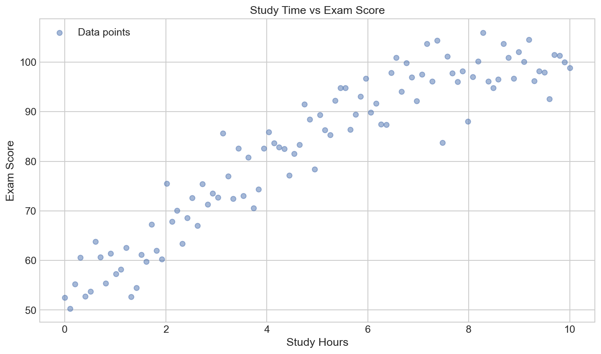
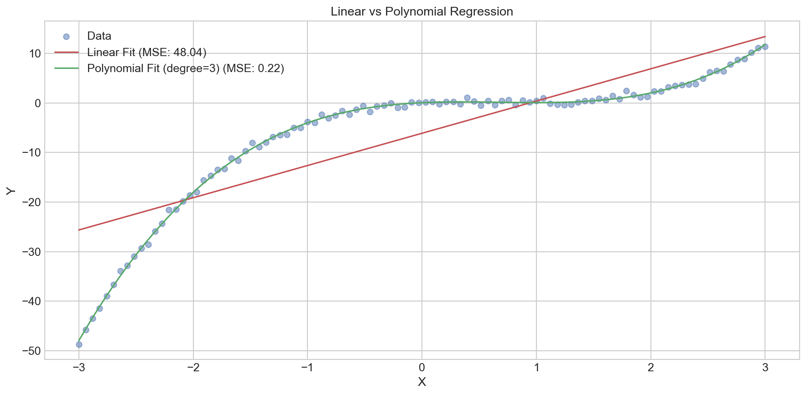
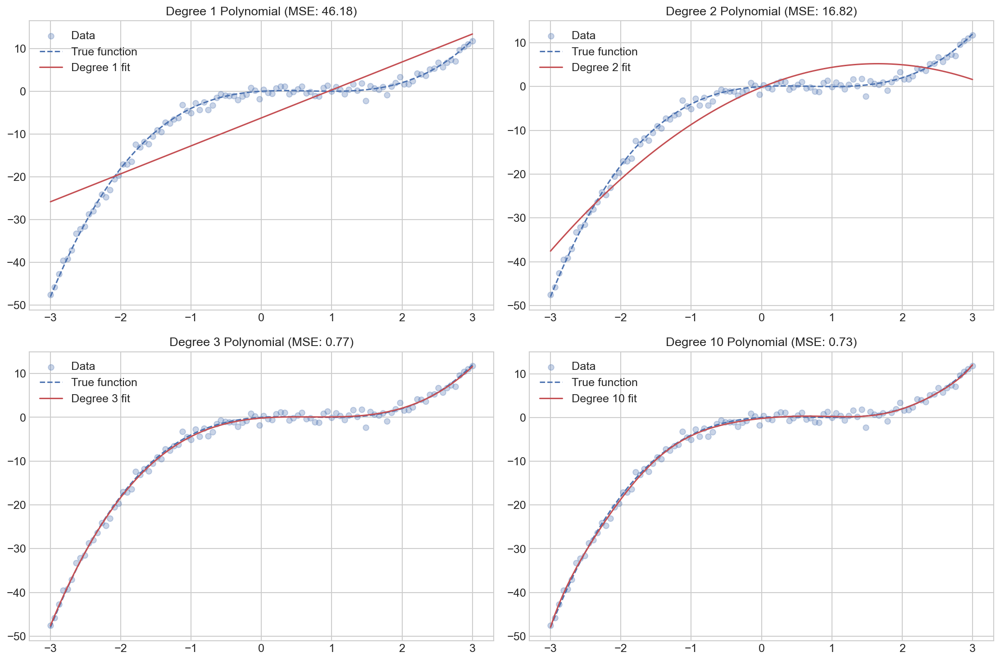
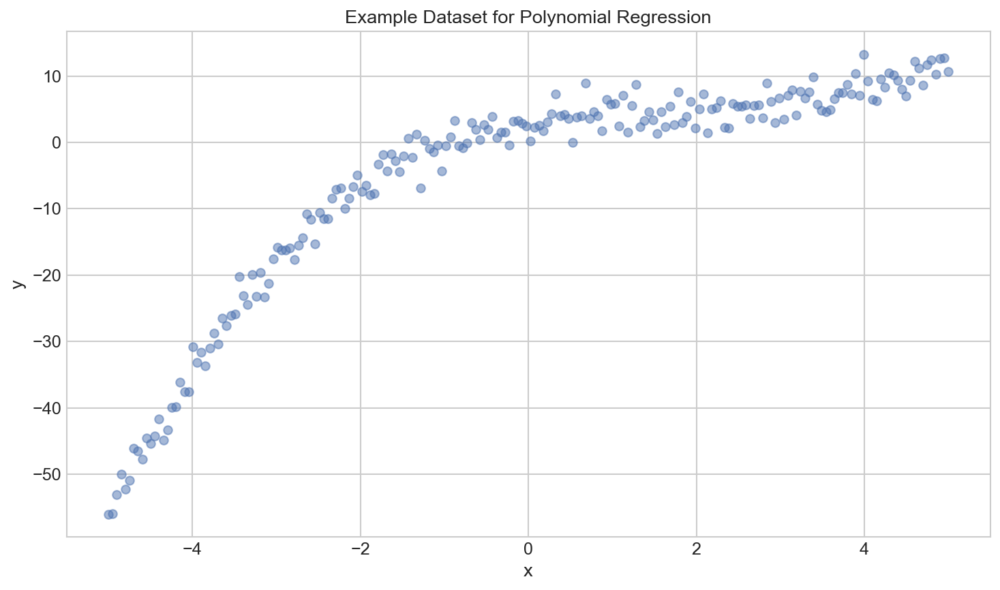

# Polynomial Regression

**After this lesson:** you can fit, evaluate, and tune polynomial regression models for non-linear relationships in one or more predictors.

## Overview

Polynomial regression keeps the **linear-in-parameters** setup but adds powers (and interactions, in richer setups) of predictors so the fitted surface can curve. It is a stepping stone between straight lines and general nonlinear models: powerful, easy to overfit, and best paired with the selection and penalty ideas in [model selection](model-selection.md) and [regularization](regularization.md).

## Why this matters

* Some relationships bend; **polynomial terms** extend linear methods to smooth curves without jumping straight to black-box models.
* You will balance **flexibility** with **overfitting** (cross-validation and regularization tie to later lessons).

## Prerequisites

* [Logistic regression](logistic-regression.md) for supervised modelling workflow in Python.
* [Multiple linear regression](../4.3-rship-in-data/multiple-linear-regression.md) for linear algebra and notation.

> **Warning:** High-degree polynomials can fit noise; always compare out-of-sample or cross-validated error.

## Introduction

Polynomial regression is a powerful extension of linear regression that allows us to model non-linear relationships between variables. While linear regression assumes a straight-line relationship, polynomial regression can capture more complex patterns in the data by using polynomial terms (squares, cubes, etc.) of the input variables.

### Video Tutorial: Introduction to Polynomial Regression

_Polynomial Regression - Complete Tutorial (CampusX)_

### From Linear to Polynomial Regression

To understand polynomial regression, start with the linear regression equation:

**Linear regression:** \\(y = \beta\_0 + \beta\_1 x + \epsilon\\).

Where:

* \\(y\\) is the dependent variable (what we're trying to predict).
* \\(x\\) is the independent variable (the input feature).
* \\(\beta\_0\\) is the intercept (where the line crosses the y-axis).
* \\(\beta\_1\\) is the slope (how much \\(y\\) changes for each unit change in \\(x\\)).
* \\(\epsilon\\) is the error term.

In polynomial regression, we add higher powers of \\(x\\):

**Polynomial regression:** \\(y = \beta\_0 + \beta\_1 x + \beta\_2 x^2 + \beta\_3 x^3 + \dots + \beta\_n x^n + \epsilon\\).

This lets the model fit curved patterns. The degree of the polynomial (the highest power of \\(x\\)) sets how flexible the fitted curve can be.

### Real-world Examples

look at some scenarios where polynomial regression is useful:

1. **Growth Patterns**
   * **Plant Growth**: Plants often show accelerated growth initially, followed by slower growth as they mature - a non-linear pattern
   * **Population Growth**: Population growth typically follows an S-curve (logistic growth) rather than a straight line
   * **Economic Trends**: Economic indicators often show cyclical patterns that can be modeled with polynomials
2. **Physical Phenomena**
   * **Projectile Motion**: The height of a thrown object follows a parabolic curve (quadratic function)
   * **Temperature Changes**: Daily or seasonal temperature fluctuations often follow curved patterns
   * **Chemical Reactions**: Reaction rates may vary non-linearly with concentration or temperature
3. **Business Applications**
   * **Sales Trends**: Product sales often follow non-linear patterns over their lifecycle
   * **Customer Behavior**: Response to pricing changes may have diminishing returns
   * **Market Saturation**: Market penetration often follows an S-curve that can be approximated with polynomials
4. **Educational Applications**
   * **Learning Curves**: Student learning often shows rapid initial progress followed by slower improvements
   * **Test Score Predictions**: The relationship between study time and test scores may be non-linear

### Visualizing Non-linear Relationships

Imagine you're studying how study time affects exam scores. The relationship might not be linear - there could be diminishing returns after a certain point:

**Simulated quadratic-in-hours exam scores with scatter plot**

**Purpose:** Generate study hours on a grid, scores from a concave quadratic plus noise, and scatter-plot the nonlinear relationship.

**Walkthrough:** `np.linspace`; polynomial in `study_hours`; `plt.scatter`; `savefig` as `nonlinear_relationship.png`.

<figure><figcaption><p>Figure 1: Model Performance Comparison</p></figcaption></figure>

<figure><figcaption><p>Figure 2: Study Time vs Exam Score</p></figcaption></figure>

Imports

Import NumPy, Matplotlib, pandas, and scikit-learn utilities needed for generating, transforming, and fitting polynomial models.

Quadratic relationship

Generate scores from a concave quadratic (10h − 0.5h²) plus noise, producing diminishing returns for extra study hours.

Scatter plot

Visualise the non-linear study-time vs. score relationship to motivate polynomial regression over a straight line.


Looking at the plot, you can observe:

1. Scores increase rapidly in the initial study hours (0-4 hours)
2. The rate of improvement slows down between 4-8 hours
3. After about 8 hours, additional studying provides minimal benefit or even slight decrease (due to fatigue)

This curved pattern can't be captured well by a straight line, making it a perfect candidate for polynomial regression.

## Understanding Polynomial Regression

### What Makes It Different from Linear Regression?

Linear regression uses a straight line to model relationships, which is often too simplistic for real-world data. Polynomial regression extends linear regression by:

1. **Including polynomial terms**: Adding squares, cubes, and higher powers of features
2. **Creating flexible curves**: Can model complex, non-linear patterns
3. **Maintaining linearity in parameters**: Despite the name, it's still a "linear model" because it's linear in the parameters (the β coefficients)

Compare linear and polynomial fits to see the difference:

**Linear vs degree-3 polynomial OLS on noisy cubic data**

**Purpose:** Fit `LinearRegression` on `x` and on `PolynomialFeatures(degree=3)` expanded `x`, overlay predictions, and annotate MSE for each.

**Walkthrough:** `PolynomialFeatures.fit_transform`; two `LinearRegression` fits; `mean_squared_error` in legend strings.

<figure><figcaption><p>Figure 3: Linear vs Polynomial Regression</p></figcaption></figure>

Cubic data

Generate y from a cubic function (x³ − 2x² + x) plus Gaussian noise to create a clearly non-linear pattern.

Linear fit

Fit a plain `LinearRegression` on the raw x values and predict, this will miss the curvature and show a higher MSE.

Polynomial fit

Expand x to degree-3 features with `PolynomialFeatures`, fit another `LinearRegression`, and overlay its predictions in green.

MSE comparison

Embed live MSE values in each legend label so the plot immediately shows how much better the polynomial fit is.


This visualization clearly shows that:

1. The **linear model** (red line) fails to capture the non-linear pattern in the data
2. The **polynomial model** (green line) closely follows the true relationship
3. The error (MSE) is much lower for the polynomial model

### How Feature Transformation Works

Polynomial regression works through a process called feature transformation. Here's what happens behind the scenes:

1. **Original feature:** \\(x\\).
2. **Transformation:** create new features by raising \\(x\\) to higher powers: \\(x^2\\), \\(x^3\\), and so on.
3. **New feature matrix:** \\(X = \[1, x, x^2, x^3, \dots]\\).
4. **Apply linear regression:** fit a linear model using these transformed features.

Visualize this transformation process:

**Print and plot `PolynomialFeatures(degree=2)` columns for small `x`**

**Purpose:** Show how `[x]` becomes `[x, x^2]` with `include_bias=False`, print the matrix, and subplot visual comparisons.

**Walkthrough:** `PolynomialFeatures(degree=2, include_bias=False)`; `fit_transform` on column vector; three subplots.

```
Polynomial Feature Transformation (degree=2):
   Original x    x   x^2
0           1  1.0   1.0
1           2  2.0   4.0
2           3  3.0   9.0
3           4  4.0  16.0
4           5  5.0  25.0
```

Create and transform

Build a small column vector \[1-5] and use `PolynomialFeatures(degree=2, include_bias=False)` to produce the \[x, x²] feature matrix.

Tabular inspection

Wrap the transformed matrix in a DataFrame with named columns and print it so the numeric expansion is visible before plotting.

Three-panel comparison

Plot the original x, the squared x², and an overlay of both side by side to show how the squared term grows much faster than the linear term.

```
Polynomial Feature Transformation (degree=2):
   Original x    x    x^2
0          1  1.0   1.0
1          2  2.0   4.0
2          3  3.0   9.0
3          4  4.0  16.0
4          5  5.0  25.0
```


This shows how:

1. Each original value \\(x\\) gets transformed into multiple features.
2. A value like \\(x = 4\\) becomes \\(\[4, 16]\\) (the original value and its square).
3. The squared term grows much faster than the linear term.

### The Polynomial Equation

A polynomial regression model of degree \\(n\\) can be written as:

$$y = \beta_0 + \beta_1 x + \beta_2 x^2 + \dots + \beta_n x^n + \epsilon$$

Where:

* \\(y\\) is the dependent variable.
* \\(x\\) is the independent variable.
* \\(\beta\_0, \beta\_1, \dots, \beta\_n\\) are the coefficients.
* \\(\epsilon\\) is the error term.

For multiple input features, polynomial regression also includes interaction terms. For example, with two features \\(x\_1\\) and \\(x\_2\\) and degree 2:

$$y = \beta_0 + \beta_1 x_1 + \beta_2 x_2 + \beta_3 x_1^2 + \beta_4 x_2^2 + \beta_5 x_1 x_2 + \epsilon$$

The interaction term \\(x\_1 x\_2\\) lets the model capture how the effect of one variable depends on the value of another.

### Choosing the Right Degree

The degree of the polynomial is important. Too low, and you underfit the data. Too high, and you overfit. Visualize this tradeoff:

**Subplot grid: degrees 1, 2, 3, 10 vs known cubic truth**

**Purpose:** Fit `PolynomialFeatures` + `LinearRegression` for each degree on noisy cubic-shaped `y`, plot data, true curve, and fitted curve with MSE in title.

**Walkthrough:** Loop `degrees`; in-sample `predict`; `mean_squared_error`; `plt.subplot(2,2,i)`.

<figure><figcaption><p>Figure 4: Degree 1 Polynomial (MSE: 46.18)</p></figcaption></figure>

True cubic target

Define a known cubic function as ground truth and add noise to create the observed training data.

Grid of degree fits

For degrees 1, 2, 3, and 10, expand features, fit a linear model on the polynomial expansion, compute MSE, and plot data, true function, and fitted curve.

Save and show

Tight-layout the 2×2 grid and save it so degree-1 underfitting and degree-10 overfitting are visible side by side.


This visualization shows:

1. **Degree 1 (linear)**: Underfits the data - can't capture the curved pattern
2. **Degree 2 (quadratic)**: Better, but still misses some patterns
3. **Degree 3 (cubic)**: Good fit - captures the true underlying pattern
4. **Degree 10**: Overfits - the model follows the noise instead of the true pattern

## Building a Polynomial Regression Model

### Video Tutorial: Implementing Polynomial Regression

_Polynomial Regression - Complete Tutorial (CampusX): walks through implementation with bias-variance tradeoff_

Now, walk through the process of building a polynomial regression model step-by-step.

### Step 1: Prepare the Data

First, we need to prepare our data, which includes:

* Cleaning the data
* Handling missing values
* Creating polynomial features
* Splitting into training and test sets

**Train/test split, polynomial expansion, and scaling helper**

**Purpose:** Split raw `X`, build `PolynomialFeatures`, then `StandardScaler` on train/test poly matrices; print shape and illustrative feature names.

**Walkthrough:** `train_test_split`; `poly.fit_transform` / `transform`; `StandardScaler` fit on train only.

<figure><figcaption><p>Figure 1: Are Our Errors Random? (They Should Be!)</p></figcaption></figure>

Train/test split

Import helpers and split the data 80/20 before any feature transformation to prevent data leakage.

Polynomial expansion

Fit `PolynomialFeatures` on the training set only, then transform both train and test to avoid leaking test statistics.

Scaling

Apply `StandardScaler` fitted on training polynomials only; higher-degree terms grow very fast and must be normalized for stable optimization.

Shape report

Print original vs. expanded feature shapes and the generated feature names so the column-count increase is transparent.

#### Why Scaling Matters

Scaling becomes even more important with polynomial features because:

1. Higher-degree terms grow very quickly (x² and x³ can get very large)
2. Unscaled polynomial features lead to numerical instability
3. Different scales across features impact the optimization process

For example, if x ranges from 1 to 10:

* x ranges from 1 to 10
* x² ranges from 1 to 100
* x³ ranges from 1 to 1000

This huge difference in scale can cause problems for the optimizer.

### Step 2: Train the Model

Now we can train our polynomial regression model:

**Train `LinearRegression` on scaled polynomial features and demo dataset**

**Purpose:** `create_example_dataset` builds noisy cubic-like `y`; `prepare_polynomial_data` returns scaled train matrices; `train_polynomial_model` prints intercept and leading coefficients.

**Walkthrough:** `LinearRegression.fit`; scatter raw data; chain `prepare_polynomial_data` then `train_polynomial_model`.

```
Original feature shape: (160, 1)
Polynomial feature shape: (160, 3)
New feature names:
['x^1', 'x^2', 'x^3']
Model trained successfully!
Intercept (β₀): -6.0711
Number of coefficients: 3
First few coefficients: [ 6.50706898 -7.72810022  9.60710778]
```

Train helper

Fit `LinearRegression` on the scaled polynomial features and print intercept, coefficient count, and first three coefficients.

Example dataset

Generate 200 points from a degree-3 polynomial with noise; this mimics real data with a known ground truth for evaluation.

Visualize and fit

Scatter-plot the raw data, then pipe it through `prepare_polynomial_data` and `train_polynomial_model` to produce the fitted degree-3 model.

<figure><figcaption><p>Figure 5: Example Dataset for Polynomial Regression</p></figcaption></figure>

```
Original feature shape: (160, 1)
Polynomial feature shape: (160, 3)
New feature names:
['x^1', 'x^2', 'x^3']
Model trained successfully!
Intercept (β₀): -6.0711
Number of coefficients: 3
First few coefficients: [ 6.50706898 -7.72810022  9.60710778]
```

The intercept and coefficients above are reported on the **scaled** polynomial features, so they are not directly comparable to the data-generating equation `y = 2 + x − 0.5 x² + 0.3 x³`. To inspect coefficients in original units, refit `LinearRegression` on `poly.fit_transform(X)` without scaling, or invert the scaler after fitting.

### Step 3: Make Predictions and Evaluate the Model

After training, we need to evaluate the model's performance:

**Metrics, smooth fitted curve, and actual vs predicted scatter**

**Purpose:** On test scaled features, compute MSE/RMSE/R²; inverse-transform grid through `poly` + `scaler` for a smooth prediction curve; second plot for calibration.

**Walkthrough:** `mean_squared_error`, `r2_score`; `poly.transform` + `scaler.transform` on linspace; note `X_original` slice for scatter x-axis.

Compute metrics

Predict on the scaled test features, then compute MSE, RMSE (square root of MSE), and R² to quantify fit quality.

Smooth prediction curve

Generate a dense grid of 1000 x values, pipe through `poly.transform` and `scaler.transform` (not fit), and predict to draw a smooth fitted curve.

Fit plot

Overlay the smooth prediction curve on the raw data scatter with R² and RMSE in the title for an at-a-glance quality check.

Calibration plot

Plot actual vs. predicted values with a 45° identity line; points close to the line indicate good calibration without systematic bias.

And you'll get output like:

```
Model Evaluation:
Mean Squared Error (MSE): 3.9876
Root Mean Squared Error (RMSE): 1.9969
R² Score: 0.9234
```

These plots and metrics tell us:

1. How well the model fits the data
2. Whether it's capturing the underlying pattern
3. How accurate our predictions are likely to be

### Step 4: Finding the Optimal Polynomial Degree

One of the most important steps in polynomial regression is selecting the right degree. Implement a method to find the optimal degree:

**5-fold CV MSE vs degree via `make_pipeline`**

**Purpose:** For each degree, `cross_val_score` on a pipeline of polynomial expansion, scaling, and `LinearRegression`, negating neg-MSE to positive MSE and plotting argmin.

**Walkthrough:** `make_pipeline(PolynomialFeatures, StandardScaler, LinearRegression)`; `cross_val_score(..., scoring='neg_mean_squared_error')`.

```
The optimal polynomial degree is: 3
```

Setup and imports

Import cross-validation helpers and build a degree range from 1 to `max_degree` to sweep over candidate polynomial complexities.

Pipeline per degree

For each degree, build a `make_pipeline` of `PolynomialFeatures`, `StandardScaler`, and `LinearRegression`, run 5-fold CV with neg-MSE scoring, and collect the mean positive MSE.

Find best degree

Use `np.argmin` on the collected CV scores to identify the degree with the lowest cross-validated MSE.

Plot and return

Plot MSE vs. degree with a vertical line at the best degree, then return both the optimal degree and the full scores list for further inspection.


This shows how the cross-validation error changes with different polynomial degrees. The optimal degree is the one with the lowest error.

## Common Challenges and Solutions

Polynomial regression comes with several challenges. we will look at these and discuss solutions:

### 1. Overfitting

**Problem**: Higher-degree polynomials can fit the training data perfectly but perform poorly on new data.

**Solutions**:

* Use cross-validation to select the optimal degree
* Apply regularization to penalize complex models
* Ensure you have enough data for higher-degree polynomials

**Sine curve: train/test split and degrees 1, 3, 15**

**Purpose:** On `[0,1]` noisy sine, compare polynomial pipelines of three degrees with train vs test MSE in titles and true `sin(2πx)` dashed.

**Walkthrough:** `make_pipeline(PolynomialFeatures, LinearRegression)`; dense `x_smooth` for plotting; MSE on train and test sets.

Noisy sine data

Generate 30 points from sin(2πx) with Gaussian noise and split 70/30 into train and test sets.

Pipeline per degree

For each of degrees 1, 3, and 15, build a `make_pipeline` of `PolynomialFeatures` and `LinearRegression`, fit on training data, and compute both train and test MSE.

Overlay plots

For each degree, overlay train data (blue), test data (red), the smooth fitted curve (green), and the true sine function (dashed black) with train/test MSE in the title.

This clearly shows how:

1. The **linear model** (degree 1) underfits both training and test data
2. The **cubic model** (degree 3) provides a good balance
3. The **degree 15** model overfits the training data but performs poorly on test data

### 2. Multicollinearity

**Problem**: Polynomial terms are often highly correlated, causing unstable coefficient estimates.

**Solutions**:

* Use regularization techniques (Ridge, Lasso)
* Apply orthogonal polynomials
* Center your data before creating polynomial features

**Degree-10 polynomial with OLS vs Ridge vs Lasso on test**

**Purpose:** High-degree `PolynomialFeatures` fit with `LinearRegression`, `Ridge`, and `Lasso` on train; plot test predictions vs true cubic on a smooth grid.

**Walkthrough:** Shared `poly.fit_transform`; three models; `mean_squared_error` on test; 1×3 subplot layout.

Data and degree-10 expansion

Generate noisy cubic data, split train/test, and expand to degree-10 polynomial features, deliberately high to create an over-parameterised setting.

Three regularization strategies

Define a dict of `LinearRegression`, `Ridge(alpha=1.0)`, and `Lasso(alpha=0.01)` to compare unpenalised, L2-penalised, and L1-penalised fits on the same data.

Side-by-side comparison

Fit each model on training polynomial features, predict on the test set, and plot test scatter, fitted curve, and true cubic function with test MSE in each subplot title.

This shows how regularization helps control the model's complexity, even with a high polynomial degree:

1. **No regularization**: The model captures noise, creating an erratic fit
2. **Ridge (L2)**: Smooths the curve by constraining coefficient sizes
3. **Lasso (L1)**: Creates an even simpler model by setting some coefficients to zero

## Gotchas

* **Applying `PolynomialFeatures` before splitting data**: If you call `poly.fit_transform(X)` on the whole dataset and then split, you are computing polynomial statistics from test observations before training. Always place `PolynomialFeatures` inside a `Pipeline` so it is only fitted on the training fold.
* **Selecting the polynomial degree by training error**: Training MSE decreases monotonically as degree increases; a degree-15 polynomial will appear better than degree-2 in training but catastrophically overfit. Always use cross-validated error or a held-out test set to pick the degree.
* **Forgetting to scale features after polynomial expansion**: Adding x², x³, and interaction terms creates columns on wildly different scales (x is 0-10, x² is 0-100, x³ is 0-1000). Without `StandardScaler`, gradient-based solvers converge slowly and coefficient comparisons are meaningless.
* **Interpreting polynomial coefficients directly**: The coefficient on x² in `y = β₀ + β₁x + β₂x²` does not mean "each unit increase in x² adds β₂ to y"; the marginal effect of x on y is `β₁ + 2β₂x` and varies at every point. Compute the first derivative to understand how y changes with x.
* **Extrapolating polynomial fits beyond the training range**: High-degree polynomials often explode or dive steeply outside the observed data range (Runge's phenomenon). Even if the fit looks perfect in-sample, predictions for x-values beyond the training range should be treated with extreme caution.
* **Confusing `PolynomialFeatures(degree=2)` output count with the original features**: For p original features, degree-2 expansion adds interaction terms and squares, producing `(p + 2)! / (2! × p!)` columns. With just 10 features, degree-2 expansion creates 66 columns; higher degrees explode combinatorially, making regularization essential.

## Next steps

* Continue to [Model selection](model-selection.md).
