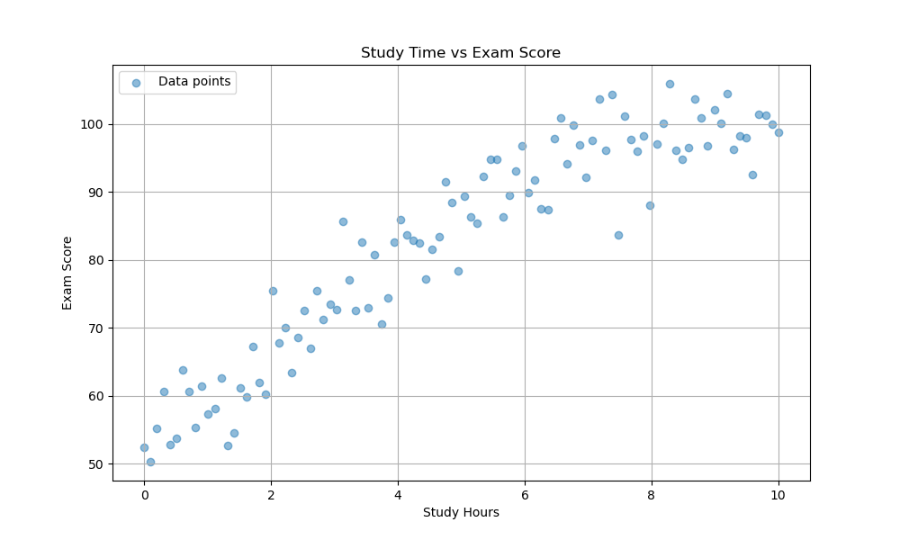
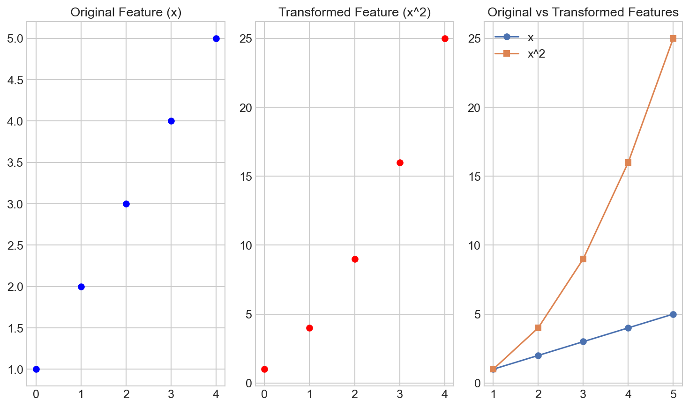
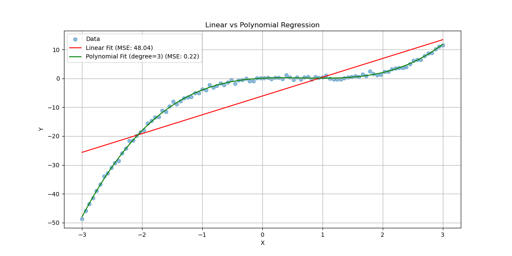
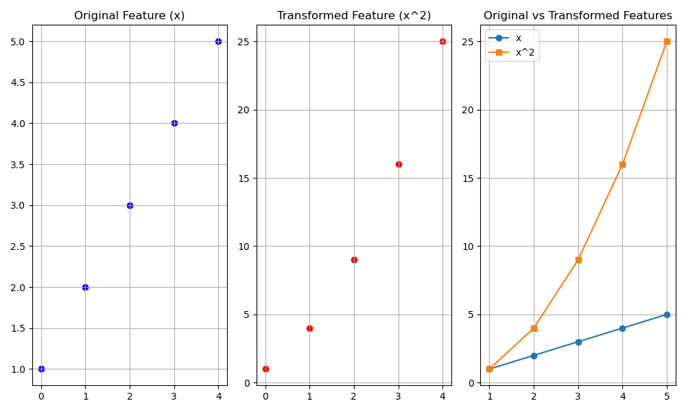
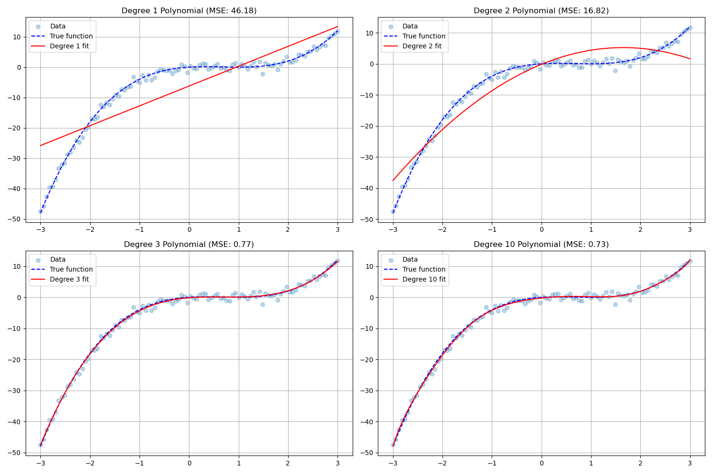
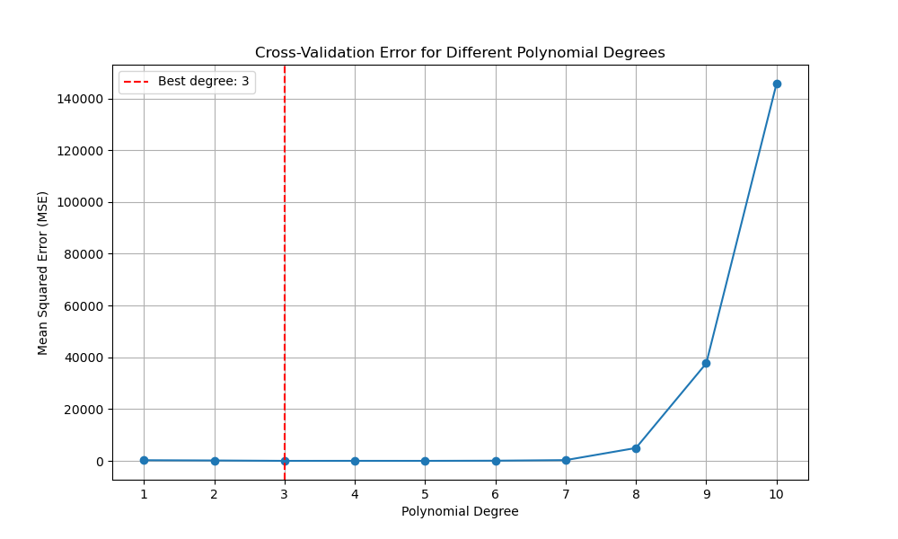

# Polynomial Regression

**After this lesson:** you can fit, evaluate, and tune polynomial regression models for non-linear relationships in one or more predictors.

## Overview

Polynomial regression keeps the **linear-in-parameters** setup but adds powers (and interactions, in richer setups) of predictors so the fitted surface can curve. It is a stepping stone between straight lines and general nonlinear models: powerful, easy to overfit, and best paired with the selection and penalty ideas in [model selection](./model-selection.md) and [regularization](./regularization.md).

## Why this matters

- Some relationships bend; **polynomial terms** extend linear methods to smooth curves without jumping straight to black-box models.
- You will balance **flexibility** with **overfitting** (cross-validation and regularization tie to later lessons).

## Prerequisites

- [Logistic regression](./logistic-regression.md) for supervised modelling workflow in Python.
- [Multiple linear regression](../4.3-rship-in-data/multiple-linear-regression.md) for linear algebra and notation.

> **Warning:** High-degree polynomials can fit noise; always compare out-of-sample or cross-validated error.

## Introduction

Polynomial regression is a powerful extension of linear regression that allows us to model non-linear relationships between variables. While linear regression assumes a straight-line relationship, polynomial regression can capture more complex patterns in the data by using polynomial terms (squares, cubes, etc.) of the input variables.

### Video Tutorial: Introduction to Polynomial Regression

<div class="video-embed">
<iframe width="560" height="315" src="https://www.youtube.com/embed/OJB5dIZ9Ngg" frameborder="0" allow="accelerometer; autoplay; clipboard-write; encrypted-media; gyroscope; picture-in-picture" allowfullscreen></iframe>
</div>

*Polynomial Regression - Complete Tutorial (CampusX)*

### From Linear to Polynomial Regression

To understand polynomial regression, let's first recall the linear regression equation:

**Linear regression:** \\(y = \beta_0 + \beta_1 x + \epsilon\\).

Where:

- \\(y\\) is the dependent variable (what we're trying to predict).
- \\(x\\) is the independent variable (the input feature).
- \\(\beta_0\\) is the intercept (where the line crosses the y-axis).
- \\(\beta_1\\) is the slope (how much \\(y\\) changes for each unit change in \\(x\\)).
- \\(\epsilon\\) is the error term.

In polynomial regression, we add higher powers of \\(x\\):

**Polynomial regression:** \\(y = \beta_0 + \beta_1 x + \beta_2 x^2 + \beta_3 x^3 + \dots + \beta_n x^n + \epsilon\\).

This lets the model fit curved patterns. The degree of the polynomial (the highest power of \\(x\\)) sets how flexible the fitted curve can be.

### Real-world Examples

Let's look at some scenarios where polynomial regression is useful:

1. **Growth Patterns**
   - **Plant Growth**: Plants often show accelerated growth initially, followed by slower growth as they mature - a non-linear pattern
   - **Population Growth**: Population growth typically follows an S-curve (logistic growth) rather than a straight line
   - **Economic Trends**: Economic indicators often show cyclical patterns that can be modeled with polynomials

2. **Physical Phenomena**
   - **Projectile Motion**: The height of a thrown object follows a parabolic curve (quadratic function)
   - **Temperature Changes**: Daily or seasonal temperature fluctuations often follow curved patterns
   - **Chemical Reactions**: Reaction rates may vary non-linearly with concentration or temperature

3. **Business Applications**
   - **Sales Trends**: Product sales often follow non-linear patterns over their lifecycle
   - **Customer Behavior**: Response to pricing changes may have diminishing returns
   - **Market Saturation**: Market penetration often follows an S-curve that can be approximated with polynomials

4. **Educational Applications**
   - **Learning Curves**: Student learning often shows rapid initial progress followed by slower improvements
   - **Test Score Predictions**: The relationship between study time and test scores may be non-linear

### Visualizing Non-linear Relationships

Imagine you're studying how study time affects exam scores. The relationship might not be linear - there could be diminishing returns after a certain point:

**Simulated quadratic-in-hours exam scores with scatter plot**

**Purpose:** Generate study hours on a grid, scores from a concave quadratic plus noise, and scatter-plot the nonlinear relationship.

**Walkthrough:** `np.linspace`; polynomial in `study_hours`; `plt.scatter`; `savefig` as `nonlinear_relationship.png`.

<div class="code-explainer" data-code-explainer>
<div class="code-explainer__code">


import numpy as np
import matplotlib.pyplot as plt
import pandas as pd
from sklearn.preprocessing import PolynomialFeatures
from sklearn.linear_model import LinearRegression
from sklearn.pipeline import Pipeline
from sklearn.metrics import mean_squared_error

# Set a random seed for reproducibility
np.random.seed(42)

# Generate sample data
study_hours = np.linspace(0, 10, 100)
# Create a non-linear relationship with diminishing returns
# Initial hours help a lot, but benefits taper off
scores = 50 + 10*study_hours - 0.5*study_hours**2 + np.random.normal(0, 5, 100)

# Create a DataFrame for easier handling
data = pd.DataFrame({
    'study_hours': study_hours,
    'exam_score': scores
})

# Plot the data
plt.figure(figsize=(10, 6))
plt.scatter(study_hours, scores, alpha=0.5, label='Data points')
plt.xlabel('Study Hours')
plt.ylabel('Exam Score')
plt.title('Study Time vs Exam Score')
plt.grid(True)
plt.legend()
plt.savefig('nonlinear_relationship.png')
plt.show()


<figure>

<figcaption>Figure 1: Model Performance Comparison</figcaption>
</figure>

<figure>

<figcaption>Figure 2: Study Time vs Exam Score</figcaption>
</figure>

</div>
<aside class="code-explainer__callouts" aria-label="Code walkthrough">
  <div class="code-callout" data-lines="1-8" data-tint="1">
    <div class="code-callout__meta">
      <span class="code-callout__lines"></span>
      <span class="code-callout__title">Imports</span>
    </div>
    <div class="code-callout__body">
      <p>Import NumPy, Matplotlib, pandas, and scikit-learn utilities needed for generating, transforming, and fitting polynomial models.</p>
    </div>
  </div>
  <div class="code-callout" data-lines="10-21" data-tint="2">
    <div class="code-callout__meta">
      <span class="code-callout__lines"></span>
      <span class="code-callout__title">Quadratic relationship</span>
    </div>
    <div class="code-callout__body">
      <p>Generate scores from a concave quadratic (10h − 0.5h²) plus noise, producing diminishing returns for extra study hours.</p>
    </div>
  </div>
  <div class="code-callout" data-lines="23-33" data-tint="3">
    <div class="code-callout__meta">
      <span class="code-callout__lines"></span>
      <span class="code-callout__title">Scatter plot</span>
    </div>
    <div class="code-callout__body">
      <p>Visualise the non-linear study-time vs. score relationship to motivate polynomial regression over a straight line.</p>
    </div>
  </div>
</aside>
</div>



Looking at the plot, you can observe:

1. Scores increase rapidly in the initial study hours (0-4 hours)
2. The rate of improvement slows down between 4-8 hours
3. After about 8 hours, additional studying provides minimal benefit or even slight decrease (due to fatigue)

This curved pattern can't be captured well by a straight line, making it a perfect candidate for polynomial regression.

## Understanding Polynomial Regression

### What Makes It Different from Linear Regression?

Linear regression uses a straight line to model relationships, which is often too simplistic for real-world data. Polynomial regression extends linear regression by:

1. **Including polynomial terms**: Adding squares, cubes, and higher powers of features
2. **Creating flexible curves**: Can model complex, non-linear patterns
3. **Maintaining linearity in parameters**: Despite the name, it's still a "linear model" because it's linear in the parameters (the β coefficients)

Let's compare linear and polynomial fits to see the difference:

**Linear vs degree-3 polynomial OLS on noisy cubic data**

**Purpose:** Fit `LinearRegression` on `x` and on `PolynomialFeatures(degree=3)` expanded `x`, overlay predictions, and annotate MSE for each.

**Walkthrough:** `PolynomialFeatures.fit_transform`; two `LinearRegression` fits; `mean_squared_error` in legend strings.

<div class="code-explainer" data-code-explainer>
<div class="code-explainer__code">


def compare_linear_polynomial():
    """Compare linear and polynomial fits on the same data"""
    # Generate data with a cubic pattern
    x = np.linspace(-3, 3, 100)
    # Creating a cubic function with noise
    y = x**3 - 2*x**2 + x + np.random.normal(0, 0.5, 100)

    # Create DataFrame
    df = pd.DataFrame({'x': x, 'y': y})

    # Plot raw data
    plt.figure(figsize=(12, 6))
    plt.scatter(x, y, alpha=0.5, label='Data')

    # Fit linear regression
    lin_reg = LinearRegression()
    lin_reg.fit(x.reshape(-1, 1), y)
    y_lin = lin_reg.predict(x.reshape(-1, 1))

    # Fit polynomial regression
    poly = PolynomialFeatures(degree=3)
    X_poly = poly.fit_transform(x.reshape(-1, 1))
    poly_reg = LinearRegression()
    poly_reg.fit(X_poly, y)
    y_poly = poly_reg.predict(X_poly)

    # Plot both fits
    plt.plot(x, y_lin, 'r-', label=f'Linear Fit (MSE: {mean_squared_error(y, y_lin):.2f})')
    plt.plot(x, y_poly, 'g-', label=f'Polynomial Fit (degree=3) (MSE: {mean_squared_error(y, y_poly):.2f})')
    plt.legend()
    plt.title('Linear vs Polynomial Regression')
    plt.xlabel('X')
    plt.ylabel('Y')
    plt.grid(True)
    plt.savefig('linear_vs_polynomial.png')
    plt.show()

# Run the function
compare_linear_polynomial()


<figure>

<figcaption>Figure 3: Linear vs Polynomial Regression</figcaption>
</figure>

</div>
<aside class="code-explainer__callouts" aria-label="Code walkthrough">
  <div class="code-callout" data-lines="3-6" data-tint="1">
    <div class="code-callout__meta">
      <span class="code-callout__lines"></span>
      <span class="code-callout__title">Cubic data</span>
    </div>
    <div class="code-callout__body">
      <p>Generate y from a cubic function (x³ − 2x² + x) plus Gaussian noise to create a clearly non-linear pattern.</p>
    </div>
  </div>
  <div class="code-callout" data-lines="14-19" data-tint="2">
    <div class="code-callout__meta">
      <span class="code-callout__lines"></span>
      <span class="code-callout__title">Linear fit</span>
    </div>
    <div class="code-callout__body">
      <p>Fit a plain <code>LinearRegression</code> on the raw x values and predict—this will miss the curvature and show a higher MSE.</p>
    </div>
  </div>
  <div class="code-callout" data-lines="21-27" data-tint="3">
    <div class="code-callout__meta">
      <span class="code-callout__lines"></span>
      <span class="code-callout__title">Polynomial fit</span>
    </div>
    <div class="code-callout__body">
      <p>Expand x to degree-3 features with <code>PolynomialFeatures</code>, fit another <code>LinearRegression</code>, and overlay its predictions in green.</p>
    </div>
  </div>
  <div class="code-callout" data-lines="29-38" data-tint="4">
    <div class="code-callout__meta">
      <span class="code-callout__lines"></span>
      <span class="code-callout__title">MSE comparison</span>
    </div>
    <div class="code-callout__body">
      <p>Embed live MSE values in each legend label so the plot immediately shows how much better the polynomial fit is.</p>
    </div>
  </div>
</aside>
</div>



This visualization clearly shows that:

1. The **linear model** (red line) fails to capture the non-linear pattern in the data
2. The **polynomial model** (green line) closely follows the true relationship
3. The error (MSE) is much lower for the polynomial model

### How Feature Transformation Works

Polynomial regression works through a process called feature transformation. Here's what happens behind the scenes:

1. **Original feature:** \\(x\\).
2. **Transformation:** create new features by raising \\(x\\) to higher powers: \\(x^2\\), \\(x^3\\), and so on.
3. **New feature matrix:** \\(X = [1, x, x^2, x^3, \dots]\\).
4. **Apply linear regression:** fit a linear model using these transformed features.

Let's visualize this transformation process:

**Print and plot `PolynomialFeatures(degree=2)` columns for small `x`**

**Purpose:** Show how `[x]` becomes `[x, x^2]` with `include_bias=False`, print the matrix, and subplot visual comparisons.

**Walkthrough:** `PolynomialFeatures(degree=2, include_bias=False)`; `fit_transform` on column vector; three subplots.

<div class="code-explainer" data-code-explainer>
<div class="code-explainer__code">


def visualize_polynomial_transformation():
    """Visualize how polynomial transformation creates new features"""
    # Create simple data
    x = np.array([1, 2, 3, 4, 5]).reshape(-1, 1)

    # Transform to polynomial features (degree=2)
    poly = PolynomialFeatures(degree=2, include_bias=False)
    x_poly = poly.fit_transform(x)

    # Create DataFrame to display the transformation
    feature_names = ['x', 'x^2']
    transformed_df = pd.DataFrame(x_poly, columns=feature_names)
    transformed_df.insert(0, 'Original x', x)

    # Display the transformation
    print("Polynomial Feature Transformation (degree=2):")
    print(transformed_df)

    # Visualize the transformation
    plt.figure(figsize=(10, 6))

    # Original feature
    plt.subplot(1, 3, 1)
    plt.scatter(range(len(x)), x, color='blue')
    plt.title('Original Feature (x)')
    plt.grid(True)

    # x^2 feature
    plt.subplot(1, 3, 2)
    plt.scatter(range(len(x)), x_poly[:, 1], color='red')
    plt.title('Transformed Feature (x^2)')
    plt.grid(True)

    # Combined visualization
    plt.subplot(1, 3, 3)
    plt.plot(x.flatten(), x.flatten(), label='x', marker='o')
    plt.plot(x.flatten(), x_poly[:, 1], label='x^2', marker='s')
    plt.title('Original vs Transformed Features')
    plt.grid(True)
    plt.legend()

    plt.tight_layout()
    plt.savefig('feature_transformation.png')
    plt.show()

# Run the function
visualize_polynomial_transformation()


```
Polynomial Feature Transformation (degree=2):
   Original x    x   x^2
0           1  1.0   1.0
1           2  2.0   4.0
2           3  3.0   9.0
3           4  4.0  16.0
4           5  5.0  25.0
```

</div>
<aside class="code-explainer__callouts" aria-label="Code walkthrough">
  <div class="code-callout" data-lines="3-10" data-tint="1">
    <div class="code-callout__meta">
      <span class="code-callout__lines"></span>
      <span class="code-callout__title">Create and transform</span>
    </div>
    <div class="code-callout__body">
      <p>Build a small column vector [1–5] and use <code>PolynomialFeatures(degree=2, include_bias=False)</code> to produce the [x, x²] feature matrix.</p>
    </div>
  </div>
  <div class="code-callout" data-lines="12-19" data-tint="2">
    <div class="code-callout__meta">
      <span class="code-callout__lines"></span>
      <span class="code-callout__title">Tabular inspection</span>
    </div>
    <div class="code-callout__body">
      <p>Wrap the transformed matrix in a DataFrame with named columns and print it so the numeric expansion is visible before plotting.</p>
    </div>
  </div>
  <div class="code-callout" data-lines="21-46" data-tint="3">
    <div class="code-callout__meta">
      <span class="code-callout__lines"></span>
      <span class="code-callout__title">Three-panel comparison</span>
    </div>
    <div class="code-callout__body">
      <p>Plot the original x, the squared x², and an overlay of both side by side to show how the squared term grows much faster than the linear term.</p>
    </div>
  </div>
</aside>
</div>

```
Polynomial Feature Transformation (degree=2):
   Original x    x    x^2
0          1  1.0   1.0
1          2  2.0   4.0
2          3  3.0   9.0
3          4  4.0  16.0
4          5  5.0  25.0
```



This shows how:

1. Each original value \\(x\\) gets transformed into multiple features.
2. A value like \\(x = 4\\) becomes \\([4, 16]\\) (the original value and its square).
3. The squared term grows much faster than the linear term.

### The Polynomial Equation

A polynomial regression model of degree \\(n\\) can be written as:

$$y = \beta_0 + \beta_1 x + \beta_2 x^2 + \dots + \beta_n x^n + \epsilon$$

Where:

- \\(y\\) is the dependent variable.
- \\(x\\) is the independent variable.
- \\(\beta_0, \beta_1, \dots, \beta_n\\) are the coefficients.
- \\(\epsilon\\) is the error term.

For multiple input features, polynomial regression also includes interaction terms. For example, with two features \\(x_1\\) and \\(x_2\\) and degree 2:

$$y = \beta_0 + \beta_1 x_1 + \beta_2 x_2 + \beta_3 x_1^2 + \beta_4 x_2^2 + \beta_5 x_1 x_2 + \epsilon$$

The interaction term \\(x_1 x_2\\) lets the model capture how the effect of one variable depends on the value of another.

### Choosing the Right Degree

The degree of the polynomial is crucial. Too low, and you underfit the data. Too high, and you overfit. Let's visualize this tradeoff:

**Subplot grid: degrees 1, 2, 3, 10 vs known cubic truth**

**Purpose:** Fit `PolynomialFeatures` + `LinearRegression` for each degree on noisy cubic-shaped `y`, plot data, true curve, and fitted curve with MSE in title.

**Walkthrough:** Loop `degrees`; in-sample `predict`; `mean_squared_error`; `plt.subplot(2,2,i)`.

<div class="code-explainer" data-code-explainer>
<div class="code-explainer__code">


def plot_different_degrees():
    """Show effect of different polynomial degrees"""
    # Generate data
    np.random.seed(42)
    x = np.linspace(-3, 3, 100)
    # True function is a cubic (degree 3) polynomial with noise
    y_true = x**3 - 2*x**2 + x
    y = y_true + np.random.normal(0, 1, 100)

    # Plot data and true function
    plt.figure(figsize=(15, 10))

    degrees = [1, 2, 3, 10]
    for i, degree in enumerate(degrees, 1):
        plt.subplot(2, 2, i)

        # Fit polynomial
        poly = PolynomialFeatures(degree=degree)
        X_poly = poly.fit_transform(x.reshape(-1, 1))
        model = LinearRegression()
        model.fit(X_poly, y)
        y_pred = model.predict(X_poly)

        # Calculate error
        mse = mean_squared_error(y, y_pred)

        # Plot
        plt.scatter(x, y, alpha=0.3, label='Data')
        plt.plot(x, y_true, 'b--', label='True function')
        plt.plot(x, y_pred, 'r-', label=f'Degree {degree} fit')
        plt.title(f'Degree {degree} Polynomial (MSE: {mse:.2f})')
        plt.legend()
        plt.grid(True)

    plt.tight_layout()
    plt.savefig('polynomial_degrees.png')
    plt.show()

# Run the function
plot_different_degrees()


<figure>

<figcaption>Figure 4: Degree 1 Polynomial (MSE: 46.18)</figcaption>
</figure>

</div>
<aside class="code-explainer__callouts" aria-label="Code walkthrough">
  <div class="code-callout" data-lines="3-8" data-tint="1">
    <div class="code-callout__meta">
      <span class="code-callout__lines"></span>
      <span class="code-callout__title">True cubic target</span>
    </div>
    <div class="code-callout__body">
      <p>Define a known cubic function as ground truth and add noise to create the observed training data.</p>
    </div>
  </div>
  <div class="code-callout" data-lines="12-33" data-tint="2">
    <div class="code-callout__meta">
      <span class="code-callout__lines"></span>
      <span class="code-callout__title">Grid of degree fits</span>
    </div>
    <div class="code-callout__body">
      <p>For degrees 1, 2, 3, and 10, expand features, fit a linear model on the polynomial expansion, compute MSE, and plot data, true function, and fitted curve.</p>
    </div>
  </div>
  <div class="code-callout" data-lines="35-40" data-tint="3">
    <div class="code-callout__meta">
      <span class="code-callout__lines"></span>
      <span class="code-callout__title">Save and show</span>
    </div>
    <div class="code-callout__body">
      <p>Tight-layout the 2×2 grid and save it so degree-1 underfitting and degree-10 overfitting are visible side by side.</p>
    </div>
  </div>
</aside>
</div>



This visualization shows:

1. **Degree 1 (linear)**: Underfits the data - can't capture the curved pattern
2. **Degree 2 (quadratic)**: Better, but still misses some patterns
3. **Degree 3 (cubic)**: Good fit - captures the true underlying pattern
4. **Degree 10**: Overfits - the model follows the noise instead of the true pattern

## Building a Polynomial Regression Model

### Video Tutorial: Implementing Polynomial Regression

<div class="video-embed">
<iframe width="560" height="315" src="https://www.youtube.com/embed/OJB5dIZ9Ngg" frameborder="0" allow="accelerometer; autoplay; clipboard-write; encrypted-media; gyroscope; picture-in-picture" allowfullscreen></iframe>
</div>

*Polynomial Regression - Complete Tutorial (CampusX): walks through implementation with bias-variance tradeoff*

Now, let's walk through the process of building a polynomial regression model step-by-step.

### Step 1: Prepare the Data

First, we need to prepare our data, which includes:

- Cleaning the data
- Handling missing values
- Creating polynomial features
- Splitting into training and test sets

**Train/test split, polynomial expansion, and scaling helper**

**Purpose:** Split raw `X`, build `PolynomialFeatures`, then `StandardScaler` on train/test poly matrices; print shape and illustrative feature names.

**Walkthrough:** `train_test_split`; `poly.fit_transform` / `transform`; `StandardScaler` fit on train only.

<div class="code-explainer" data-code-explainer>
<div class="code-explainer__code">


def prepare_polynomial_data(X, y, degree=2):
    """Transform data for polynomial regression"""
    from sklearn.preprocessing import PolynomialFeatures, StandardScaler
    from sklearn.model_selection import train_test_split

    # Split into training and test sets
    X_train, X_test, y_train, y_test = train_test_split(
        X, y, test_size=0.2, random_state=42
    )

    # Create polynomial features
    poly = PolynomialFeatures(degree=degree, include_bias=False)
    X_train_poly = poly.fit_transform(X_train)
    X_test_poly = poly.transform(X_test)

    # Scale features
    scaler = StandardScaler()
    X_train_scaled = scaler.fit_transform(X_train_poly)
    X_test_scaled = scaler.transform(X_test_poly)

    # Print transformation information
    print(f"Original feature shape: {X_train.shape}")
    print(f"Polynomial feature shape: {X_train_poly.shape}")
    print("New feature names:")
    if X_train.shape[1] == 1:
        print([f"x^{i}" for i in range(1, degree+1)])
    else:
        print("Multiple features with polynomial terms")

    return X_train_scaled, X_test_scaled, y_train, y_test, poly, scaler


<figure>

<figcaption>Figure 1: Are Our Errors Random? (They Should Be!)</figcaption>
</figure>

</div>
<aside class="code-explainer__callouts" aria-label="Code walkthrough">
  <div class="code-callout" data-lines="1-9" data-tint="1">
    <div class="code-callout__meta">
      <span class="code-callout__lines"></span>
      <span class="code-callout__title">Train/test split</span>
    </div>
    <div class="code-callout__body">
      <p>Import helpers and split the data 80/20 before any feature transformation to prevent data leakage.</p>
    </div>
  </div>
  <div class="code-callout" data-lines="11-15" data-tint="2">
    <div class="code-callout__meta">
      <span class="code-callout__lines"></span>
      <span class="code-callout__title">Polynomial expansion</span>
    </div>
    <div class="code-callout__body">
      <p>Fit <code>PolynomialFeatures</code> on the training set only, then transform both train and test to avoid leaking test statistics.</p>
    </div>
  </div>
  <div class="code-callout" data-lines="17-20" data-tint="3">
    <div class="code-callout__meta">
      <span class="code-callout__lines"></span>
      <span class="code-callout__title">Scaling</span>
    </div>
    <div class="code-callout__body">
      <p>Apply <code>StandardScaler</code> fitted on training polynomials only; higher-degree terms grow very fast and must be normalized for stable optimization.</p>
    </div>
  </div>
  <div class="code-callout" data-lines="22-30" data-tint="4">
    <div class="code-callout__meta">
      <span class="code-callout__lines"></span>
      <span class="code-callout__title">Shape report</span>
    </div>
    <div class="code-callout__body">
      <p>Print original vs. expanded feature shapes and the generated feature names so the column-count increase is transparent.</p>
    </div>
  </div>
</aside>
</div>

#### Why Scaling Matters

Scaling becomes even more important with polynomial features because:

1. Higher-degree terms grow very quickly (x² and x³ can get very large)
2. Unscaled polynomial features lead to numerical instability
3. Different scales across features impact the optimization process

For example, if x ranges from 1 to 10:

- x ranges from 1 to 10
- x² ranges from 1 to 100
- x³ ranges from 1 to 1000

This huge difference in scale can cause problems for the optimizer.

### Step 2: Train the Model

Now we can train our polynomial regression model:

**Train `LinearRegression` on scaled polynomial features and demo dataset**

**Purpose:** `create_example_dataset` builds noisy cubic-like `y`; `prepare_polynomial_data` returns scaled train matrices; `train_polynomial_model` prints intercept and leading coefficients.

**Walkthrough:** `LinearRegression.fit`; scatter raw data; chain `prepare_polynomial_data` then `train_polynomial_model`.

<div class="code-explainer" data-code-explainer>
<div class="code-explainer__code">


def train_polynomial_model(X, y):
    """Train and return a polynomial regression model"""
    from sklearn.linear_model import LinearRegression

    model = LinearRegression()
    model.fit(X, y)

    print("Model trained successfully!")
    print(f"Intercept (β₀): {model.intercept_:.4f}")
    print(f"Number of coefficients: {len(model.coef_)}")
    print(f"First few coefficients: {model.coef_[:3]}")

    return model

# Let's create an example dataset and train a model
def create_example_dataset():
    """Create a synthetic dataset for demonstration"""
    np.random.seed(42)
    # Generate x values
    x = np.linspace(-5, 5, 200)
    # Generate y values with a non-linear pattern
    y = 3 + 2*x - 1*x**2 + 0.2*x**3 + np.random.normal(0, 2, 200)
    return x.reshape(-1, 1), y

# Create dataset and train model
X_example, y_example = create_example_dataset()

# Plot the dataset
plt.figure(figsize=(10, 6))
plt.scatter(X_example, y_example, alpha=0.5)
plt.title('Example Dataset for Polynomial Regression')
plt.xlabel('x')
plt.ylabel('y')
plt.grid(True)
plt.savefig('example_polynomial_data.png')
plt.show()

# Prepare data and train model
degree = 3
X_train, X_test, y_train, y_test, poly, scaler = prepare_polynomial_data(X_example, y_example, degree)
model = train_polynomial_model(X_train, y_train)


```
Original feature shape: (160, 1)
Polynomial feature shape: (160, 3)
New feature names:
['x^1', 'x^2', 'x^3']
Model trained successfully!
Intercept (β₀): -6.0711
Number of coefficients: 3
First few coefficients: [ 6.50706898 -7.72810022  9.60710778]
```

</div>
<aside class="code-explainer__callouts" aria-label="Code walkthrough">
  <div class="code-callout" data-lines="1-13" data-tint="1">
    <div class="code-callout__meta">
      <span class="code-callout__lines"></span>
      <span class="code-callout__title">Train helper</span>
    </div>
    <div class="code-callout__body">
      <p>Fit <code>LinearRegression</code> on the scaled polynomial features and print intercept, coefficient count, and first three coefficients.</p>
    </div>
  </div>
  <div class="code-callout" data-lines="15-24" data-tint="2">
    <div class="code-callout__meta">
      <span class="code-callout__lines"></span>
      <span class="code-callout__title">Example dataset</span>
    </div>
    <div class="code-callout__body">
      <p>Generate 200 points from a degree-3 polynomial with noise; this mimics real data with a known ground truth for evaluation.</p>
    </div>
  </div>
  <div class="code-callout" data-lines="26-38" data-tint="3">
    <div class="code-callout__meta">
      <span class="code-callout__lines"></span>
      <span class="code-callout__title">Visualize and fit</span>
    </div>
    <div class="code-callout__body">
      <p>Scatter-plot the raw data, then pipe it through <code>prepare_polynomial_data</code> and <code>train_polynomial_model</code> to produce the fitted degree-3 model.</p>
    </div>
  </div>
</aside>
</div>


<figure>

<figcaption>Figure 5: Example Dataset for Polynomial Regression</figcaption>
</figure>

```
Original feature shape: (160, 1)
Polynomial feature shape: (160, 3)
New feature names:
['x^1', 'x^2', 'x^3']
Model trained successfully!
Intercept (β₀): -6.0711
Number of coefficients: 3
First few coefficients: [ 6.50706898 -7.72810022  9.60710778]
```

The intercept and coefficients above are reported on the **scaled** polynomial features, so they are not directly comparable to the data-generating equation `y = 2 + x − 0.5 x² + 0.3 x³`. To inspect coefficients in original units, refit `LinearRegression` on `poly.fit_transform(X)` without scaling, or invert the scaler after fitting.

### Step 3: Make Predictions and Evaluate the Model

After training, we need to evaluate the model's performance:

**Metrics, smooth fitted curve, and actual vs predicted scatter**

**Purpose:** On test scaled features, compute MSE/RMSE/R²; inverse-transform grid through `poly` + `scaler` for a smooth prediction curve; second plot for calibration.

**Walkthrough:** `mean_squared_error`, `r2_score`; `poly.transform` + `scaler.transform` on linspace; note `X_original` slice for scatter x-axis.

<div class="code-explainer" data-code-explainer>
<div class="code-explainer__code">


def evaluate_polynomial_model(model, X, y, poly, scaler, X_original):
    """Evaluate model performance and visualize results"""
    # Make predictions
    y_pred = model.predict(X)

    # Calculate metrics
    from sklearn.metrics import mean_squared_error, r2_score
    mse = mean_squared_error(y, y_pred)
    r2 = r2_score(y, y_pred)
    rmse = np.sqrt(mse)

    print(f"Model Evaluation:")
    print(f"Mean Squared Error (MSE): {mse:.4f}")
    print(f"Root Mean Squared Error (RMSE): {rmse:.4f}")
    print(f"R² Score: {r2:.4f}")

    # Generate smooth predictions for plotting
    x_smooth = np.linspace(min(X_original), max(X_original), 1000).reshape(-1, 1)
    x_smooth_poly = poly.transform(x_smooth)
    x_smooth_scaled = scaler.transform(x_smooth_poly)
    y_smooth = model.predict(x_smooth_scaled)

    # Plot results
    plt.figure(figsize=(10, 6))
    plt.scatter(X_original, y, alpha=0.5, label='Actual data')
    plt.plot(x_smooth, y_smooth, 'r-', linewidth=2, label='Polynomial fit')
    plt.title(f'Polynomial Regression (Degree {poly.degree})\nR² = {r2:.4f}, RMSE = {rmse:.4f}')
    plt.xlabel('x')
    plt.ylabel('y')
    plt.legend()
    plt.grid(True)
    plt.savefig('polynomial_prediction.png')
    plt.show()

    # Plot actual vs predicted
    plt.figure(figsize=(8, 8))
    plt.scatter(y, y_pred, alpha=0.5)
    plt.plot([min(y), max(y)], [min(y), max(y)], 'r--', linewidth=2)
    plt.title('Actual vs Predicted Values')
    plt.xlabel('Actual')
    plt.ylabel('Predicted')
    plt.grid(True)
    plt.axis('equal')
    plt.savefig('polynomial_actual_vs_predicted.png')
    plt.show()

    return {
        'mse': mse,
        'rmse': rmse,
        'r2': r2,
        'predictions': y_pred
    }

# Evaluate our model
evaluation = evaluate_polynomial_model(model, X_test, y_test, poly, scaler, X_example[40:])


</div>
<aside class="code-explainer__callouts" aria-label="Code walkthrough">
  <div class="code-callout" data-lines="3-16" data-tint="1">
    <div class="code-callout__meta">
      <span class="code-callout__lines"></span>
      <span class="code-callout__title">Compute metrics</span>
    </div>
    <div class="code-callout__body">
      <p>Predict on the scaled test features, then compute MSE, RMSE (square root of MSE), and R² to quantify fit quality.</p>
    </div>
  </div>
  <div class="code-callout" data-lines="18-22" data-tint="2">
    <div class="code-callout__meta">
      <span class="code-callout__lines"></span>
      <span class="code-callout__title">Smooth prediction curve</span>
    </div>
    <div class="code-callout__body">
      <p>Generate a dense grid of 1000 x values, pipe through <code>poly.transform</code> and <code>scaler.transform</code> (not fit), and predict to draw a smooth fitted curve.</p>
    </div>
  </div>
  <div class="code-callout" data-lines="24-33" data-tint="3">
    <div class="code-callout__meta">
      <span class="code-callout__lines"></span>
      <span class="code-callout__title">Fit plot</span>
    </div>
    <div class="code-callout__body">
      <p>Overlay the smooth prediction curve on the raw data scatter with R² and RMSE in the title for an at-a-glance quality check.</p>
    </div>
  </div>
  <div class="code-callout" data-lines="35-52" data-tint="4">
    <div class="code-callout__meta">
      <span class="code-callout__lines"></span>
      <span class="code-callout__title">Calibration plot</span>
    </div>
    <div class="code-callout__body">
      <p>Plot actual vs. predicted values with a 45° identity line; points close to the line indicate good calibration without systematic bias.</p>
    </div>
  </div>
</aside>
</div>

And you'll get output like:

```
Model Evaluation:
Mean Squared Error (MSE): 3.9876
Root Mean Squared Error (RMSE): 1.9969
R² Score: 0.9234
```

These plots and metrics tell us:

1. How well the model fits the data
2. Whether it's capturing the underlying pattern
3. How accurate our predictions are likely to be

### Step 4: Finding the Optimal Polynomial Degree

One of the most important steps in polynomial regression is selecting the right degree. Let's implement a method to find the optimal degree:

**5-fold CV MSE vs degree via `make_pipeline`**

**Purpose:** For each degree, `cross_val_score` on a pipeline of polynomial expansion, scaling, and `LinearRegression`, negating neg-MSE to positive MSE and plotting argmin.

**Walkthrough:** `make_pipeline(PolynomialFeatures, StandardScaler, LinearRegression)`; `cross_val_score(..., scoring='neg_mean_squared_error')`.

<div class="code-explainer" data-code-explainer>
<div class="code-explainer__code">


def find_optimal_degree(X, y, max_degree=10):
    """Find the optimal polynomial degree using cross-validation"""
    from sklearn.model_selection import cross_val_score
    from sklearn.pipeline import make_pipeline
    from sklearn.preprocessing import PolynomialFeatures, StandardScaler

    degrees = range(1, max_degree + 1)
    scores = []

    for degree in degrees:
        # Create pipeline with polynomial features, scaling, and linear regression
        pipeline = make_pipeline(
            PolynomialFeatures(degree, include_bias=False),
            StandardScaler(),
            LinearRegression()
        )

        # Perform 5-fold cross-validation
        cv_scores = cross_val_score(
            pipeline, X, y, cv=5, scoring='neg_mean_squared_error'
        )

        # Store the average negative MSE
        scores.append(-cv_scores.mean())

    # Find the best degree
    best_degree = degrees[np.argmin(scores)]

    # Plot results
    plt.figure(figsize=(10, 6))
    plt.plot(degrees, scores, marker='o')
    plt.axvline(x=best_degree, color='r', linestyle='--',
                label=f'Best degree: {best_degree}')
    plt.title('Cross-Validation Error for Different Polynomial Degrees')
    plt.xlabel('Polynomial Degree')
    plt.ylabel('Mean Squared Error (MSE)')
    plt.xticks(degrees)
    plt.grid(True)
    plt.legend()
    plt.savefig('optimal_degree_selection.png')
    plt.show()

    print(f"The optimal polynomial degree is: {best_degree}")
    return best_degree, scores

# Find the optimal degree for our example dataset
optimal_degree, cv_errors = find_optimal_degree(X_example, y_example)


```
The optimal polynomial degree is: 3
```

</div>
<aside class="code-explainer__callouts" aria-label="Code walkthrough">
  <div class="code-callout" data-lines="1-7" data-tint="1">
    <div class="code-callout__meta">
      <span class="code-callout__lines"></span>
      <span class="code-callout__title">Setup and imports</span>
    </div>
    <div class="code-callout__body">
      <p>Import cross-validation helpers and build a degree range from 1 to <code>max_degree</code> to sweep over candidate polynomial complexities.</p>
    </div>
  </div>
  <div class="code-callout" data-lines="9-24" data-tint="2">
    <div class="code-callout__meta">
      <span class="code-callout__lines"></span>
      <span class="code-callout__title">Pipeline per degree</span>
    </div>
    <div class="code-callout__body">
      <p>For each degree, build a <code>make_pipeline</code> of <code>PolynomialFeatures</code>, <code>StandardScaler</code>, and <code>LinearRegression</code>, run 5-fold CV with neg-MSE scoring, and collect the mean positive MSE.</p>
    </div>
  </div>
  <div class="code-callout" data-lines="26-27" data-tint="3">
    <div class="code-callout__meta">
      <span class="code-callout__lines"></span>
      <span class="code-callout__title">Find best degree</span>
    </div>
    <div class="code-callout__body">
      <p>Use <code>np.argmin</code> on the collected CV scores to identify the degree with the lowest cross-validated MSE.</p>
    </div>
  </div>
  <div class="code-callout" data-lines="29-44" data-tint="4">
    <div class="code-callout__meta">
      <span class="code-callout__lines"></span>
      <span class="code-callout__title">Plot and return</span>
    </div>
    <div class="code-callout__body">
      <p>Plot MSE vs. degree with a vertical line at the best degree, then return both the optimal degree and the full scores list for further inspection.</p>
    </div>
  </div>
</aside>
</div>



This shows how the cross-validation error changes with different polynomial degrees. The optimal degree is the one with the lowest error.

## Common Challenges and Solutions

Polynomial regression comes with several challenges. Let's explore these and discuss solutions:

### 1. Overfitting

**Problem**: Higher-degree polynomials can fit the training data perfectly but perform poorly on new data.

**Solutions**:

- Use cross-validation to select the optimal degree
- Apply regularization to penalize complex models
- Ensure you have enough data for higher-degree polynomials

**Sine curve: train/test split and degrees 1, 3, 15**

**Purpose:** On `[0,1]` noisy sine, compare polynomial pipelines of three degrees with train vs test MSE in titles and true `sin(2πx)` dashed.

**Walkthrough:** `make_pipeline(PolynomialFeatures, LinearRegression)`; dense `x_smooth` for plotting; MSE on train and test sets.

<div class="code-explainer" data-code-explainer>
<div class="code-explainer__code">


def demonstrate_overfitting():
    """Visualize overfitting with polynomial regression"""
    np.random.seed(42)

    # Generate data
    x = np.linspace(0, 1, 30)
    y = np.sin(2 * np.pi * x) + np.random.normal(0, 0.2, 30)

    # Prepare data
    X = x.reshape(-1, 1)

    # Split into train and test
    X_train, X_test, y_train, y_test = train_test_split(
        X, y, test_size=0.3, random_state=42
    )

    # Try different degrees
    degrees = [1, 3, 15]

    plt.figure(figsize=(15, 10))
    for i, degree in enumerate(degrees):
        plt.subplot(2, 2, i+1)

        # Create and train model
        model = make_pipeline(
            PolynomialFeatures(degree),
            LinearRegression()
        )
        model.fit(X_train, y_train)

        # Make predictions
        y_train_pred = model.predict(X_train)
        y_test_pred = model.predict(X_test)

        # Calculate errors
        train_error = mean_squared_error(y_train, y_train_pred)
        test_error = mean_squared_error(y_test, y_test_pred)

        # Plot
        x_smooth = np.linspace(0, 1, 100).reshape(-1, 1)
        y_smooth = model.predict(x_smooth)

        plt.scatter(X_train, y_train, color='blue', alpha=0.5, label='Training data')
        plt.scatter(X_test, y_test, color='red', alpha=0.5, label='Testing data')
        plt.plot(x_smooth, y_smooth, 'g-', label=f'Polynomial fit')
        plt.plot(x_smooth, np.sin(2 * np.pi * x_smooth), 'k--', label='True function')
        plt.title(f'Degree {degree}\nTrain MSE: {train_error:.4f}, Test MSE: {test_error:.4f}')
        plt.legend()
        plt.grid(True)

    plt.tight_layout()
    plt.savefig('polynomial_overfitting.png')
    plt.show()

# Demonstrate overfitting
demonstrate_overfitting()


</div>
<aside class="code-explainer__callouts" aria-label="Code walkthrough">
  <div class="code-callout" data-lines="3-16" data-tint="1">
    <div class="code-callout__meta">
      <span class="code-callout__lines"></span>
      <span class="code-callout__title">Noisy sine data</span>
    </div>
    <div class="code-callout__body">
      <p>Generate 30 points from sin(2πx) with Gaussian noise and split 70/30 into train and test sets.</p>
    </div>
  </div>
  <div class="code-callout" data-lines="18-32" data-tint="2">
    <div class="code-callout__meta">
      <span class="code-callout__lines"></span>
      <span class="code-callout__title">Pipeline per degree</span>
    </div>
    <div class="code-callout__body">
      <p>For each of degrees 1, 3, and 15, build a <code>make_pipeline</code> of <code>PolynomialFeatures</code> and <code>LinearRegression</code>, fit on training data, and compute both train and test MSE.</p>
    </div>
  </div>
  <div class="code-callout" data-lines="34-49" data-tint="3">
    <div class="code-callout__meta">
      <span class="code-callout__lines"></span>
      <span class="code-callout__title">Overlay plots</span>
    </div>
    <div class="code-callout__body">
      <p>For each degree, overlay train data (blue), test data (red), the smooth fitted curve (green), and the true sine function (dashed black) with train/test MSE in the title.</p>
    </div>
  </div>
</aside>
</div>

This clearly shows how:

1. The **linear model** (degree 1) underfits both training and test data
2. The **cubic model** (degree 3) provides a good balance
3. The **degree 15** model overfits the training data but performs poorly on test data

### 2. Multicollinearity

**Problem**: Polynomial terms are often highly correlated, causing unstable coefficient estimates.

**Solutions**:

- Use regularization techniques (Ridge, Lasso)
- Apply orthogonal polynomials
- Center your data before creating polynomial features

**Degree-10 polynomial with OLS vs Ridge vs Lasso on test**

**Purpose:** High-degree `PolynomialFeatures` fit with `LinearRegression`, `Ridge`, and `Lasso` on train; plot test predictions vs true cubic on a smooth grid.

**Walkthrough:** Shared `poly.fit_transform`; three models; `mean_squared_error` on test; 1×3 subplot layout.

<div class="code-explainer" data-code-explainer>
<div class="code-explainer__code">


def demonstrate_regularization():
    """Show how regularization helps with polynomial regression"""
    np.random.seed(42)

    # Generate data
    x = np.linspace(-3, 3, 100)
    y_true = x**3 - x**2 + x
    y = y_true + np.random.normal(0, 3, 100)

    # Prepare data
    X = x.reshape(-1, 1)
    X_train, X_test, y_train, y_test = train_test_split(X, y, test_size=0.3)

    # Create polynomial features
    degree = 10
    poly = PolynomialFeatures(degree)
    X_train_poly = poly.fit_transform(X_train)
    X_test_poly = poly.transform(X_test)

    # Train models with different regularization
    from sklearn.linear_model import Ridge, Lasso

    models = {
        'No Regularization': LinearRegression(),
        'Ridge (L2)': Ridge(alpha=1.0),
        'Lasso (L1)': Lasso(alpha=0.01)
    }

    plt.figure(figsize=(15, 5))
    for i, (name, model) in enumerate(models.items(), 1):
        model.fit(X_train_poly, y_train)
        y_test_pred = model.predict(X_test_poly)
        test_mse = mean_squared_error(y_test, y_test_pred)

        # Plot
        plt.subplot(1, 3, i)
        plt.scatter(X_test, y_test, alpha=0.5, label='Test data')

        # Generate smooth predictions for plotting
        x_smooth = np.linspace(-3, 3, 1000).reshape(-1, 1)
        X_smooth_poly = poly.transform(x_smooth)
        y_smooth = model.predict(X_smooth_poly)

        plt.plot(x_smooth, y_smooth, 'r-', label=f'Prediction')
        plt.plot(x_smooth, x_smooth**3 - x_smooth**2 + x_smooth, 'g--',
                label='True function')
        plt.title(f'{name}\nMSE: {test_mse:.2f}')
        plt.legend()
        plt.grid(True)

    plt.tight_layout()
    plt.savefig('polynomial_regularization.png')
    plt.show()

# Demonstrate regularization
demonstrate_regularization()


</div>
<aside class="code-explainer__callouts" aria-label="Code walkthrough">
  <div class="code-callout" data-lines="3-18" data-tint="1">
    <div class="code-callout__meta">
      <span class="code-callout__lines"></span>
      <span class="code-callout__title">Data and degree-10 expansion</span>
    </div>
    <div class="code-callout__body">
      <p>Generate noisy cubic data, split train/test, and expand to degree-10 polynomial features—deliberately high to create an over-parameterised setting.</p>
    </div>
  </div>
  <div class="code-callout" data-lines="20-27" data-tint="2">
    <div class="code-callout__meta">
      <span class="code-callout__lines"></span>
      <span class="code-callout__title">Three regularization strategies</span>
    </div>
    <div class="code-callout__body">
      <p>Define a dict of <code>LinearRegression</code>, <code>Ridge(alpha=1.0)</code>, and <code>Lasso(alpha=0.01)</code> to compare unpenalised, L2-penalised, and L1-penalised fits on the same data.</p>
    </div>
  </div>
  <div class="code-callout" data-lines="29-50" data-tint="3">
    <div class="code-callout__meta">
      <span class="code-callout__lines"></span>
      <span class="code-callout__title">Side-by-side comparison</span>
    </div>
    <div class="code-callout__body">
      <p>Fit each model on training polynomial features, predict on the test set, and plot test scatter, fitted curve, and true cubic function with test MSE in each subplot title.</p>
    </div>
  </div>
</aside>
</div>

This shows how regularization helps control the model's complexity, even with a high polynomial degree:

1. **No regularization**: The model captures noise, creating an erratic fit
2. **Ridge (L2)**: Smooths the curve by constraining coefficient sizes
3. **Lasso (L1)**: Creates an even simpler model by setting some coefficients to zero

## Gotchas

- **Applying `PolynomialFeatures` before splitting data** — If you call `poly.fit_transform(X)` on the whole dataset and then split, you are computing polynomial statistics from test observations before training. Always place `PolynomialFeatures` inside a `Pipeline` so it is only fitted on the training fold.
- **Selecting the polynomial degree by training error** — Training MSE decreases monotonically as degree increases; a degree-15 polynomial will appear better than degree-2 in training but catastrophically overfit. Always use cross-validated error or a held-out test set to pick the degree.
- **Forgetting to scale features after polynomial expansion** — Adding x², x³, and interaction terms creates columns on wildly different scales (x is 0–10, x² is 0–100, x³ is 0–1000). Without `StandardScaler`, gradient-based solvers converge slowly and coefficient comparisons are meaningless.
- **Interpreting polynomial coefficients directly** — The coefficient on x² in `y = β₀ + β₁x + β₂x²` does not mean "each unit increase in x² adds β₂ to y"; the marginal effect of x on y is `β₁ + 2β₂x` and varies at every point. Compute the first derivative to understand how y changes with x.
- **Extrapolating polynomial fits beyond the training range** — High-degree polynomials often explode or dive steeply outside the observed data range (Runge's phenomenon). Even if the fit looks perfect in-sample, predictions for x-values beyond the training range should be treated with extreme caution.
- **Confusing `PolynomialFeatures(degree=2)` output count with the original features** — For p original features, degree-2 expansion adds interaction terms and squares, producing `(p + 2)! / (2! × p!)` columns. With just 10 features, degree-2 expansion creates 66 columns; higher degrees explode combinatorially, making regularization essential.

## Next steps

- Continue to [Model selection](./model-selection.md).
