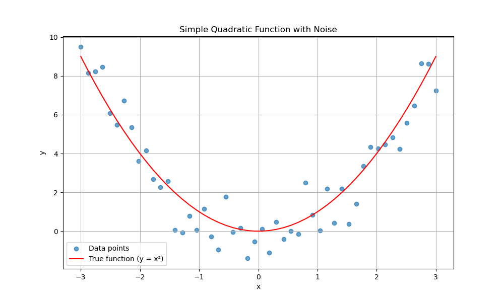
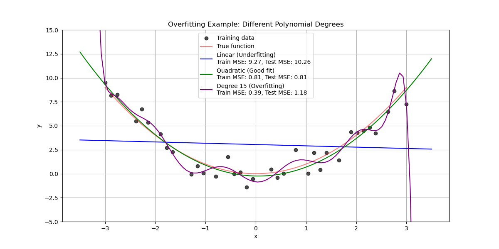
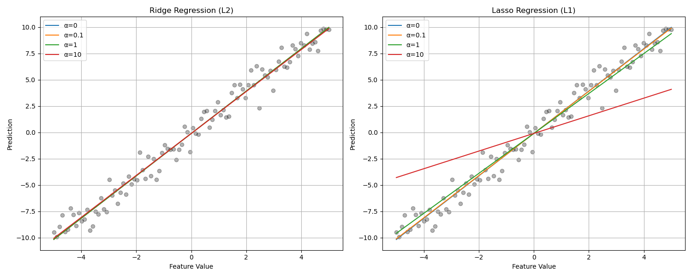
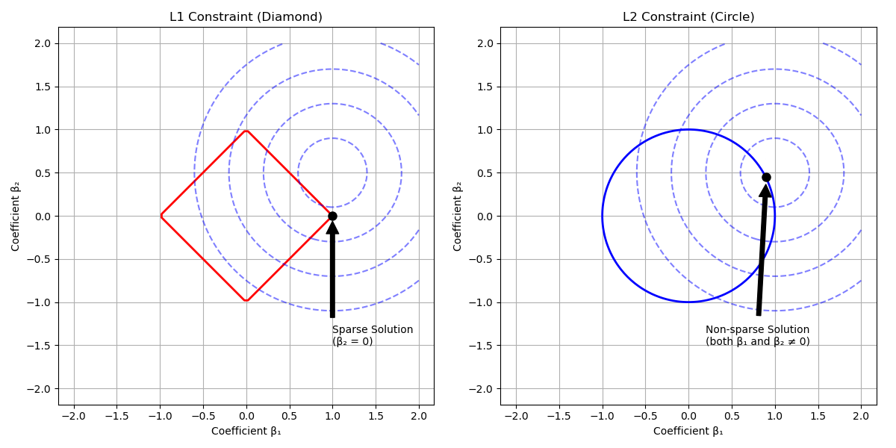
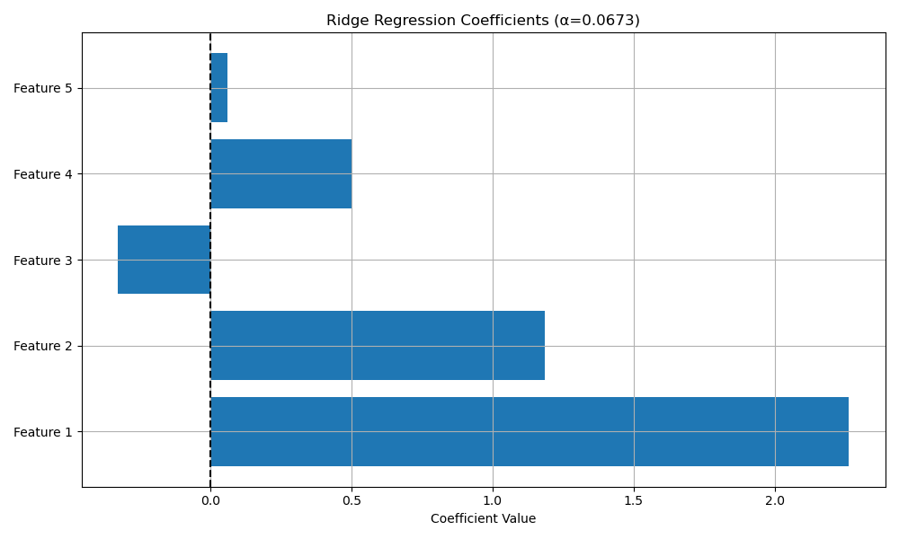
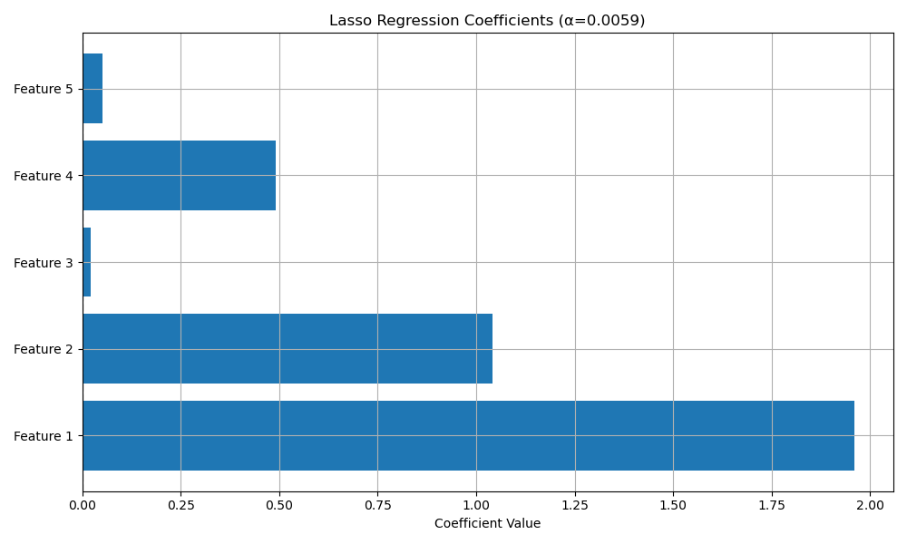
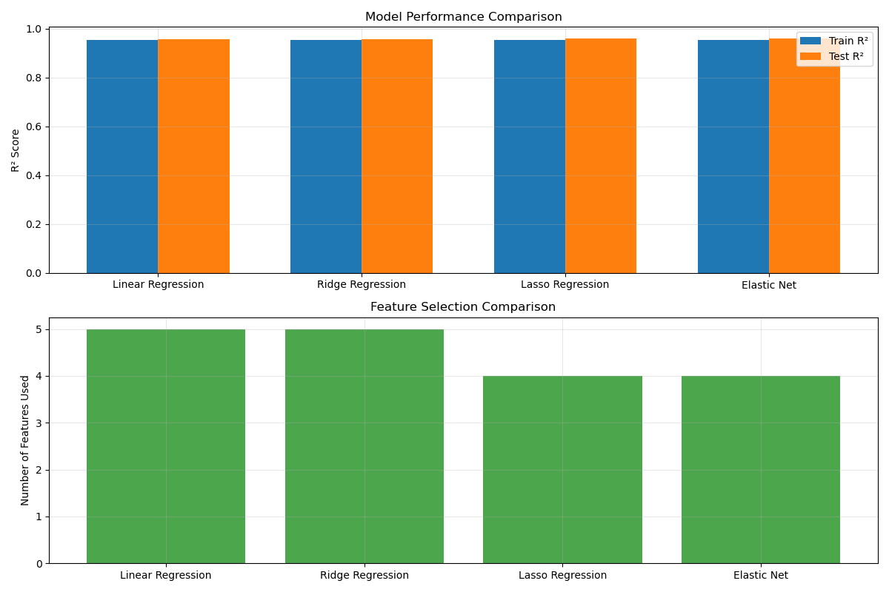

# Regularization Techniques

## Introduction

Regularization is a crucial technique in statistical modeling that helps prevent overfitting by adding a penalty term to the model's loss function. Think of it as a way to keep your model from becoming too complex and memorizing the training data instead of learning general patterns.

### Video Tutorial: Introduction to Regularization

<iframe width="560" height="315" src="https://www.youtube.com/embed/Q81RR3yKn30" frameborder="0" allow="accelerometer; autoplay; clipboard-write; encrypted-media; gyroscope; picture-in-picture" allowfullscreen></iframe>

*StatQuest: Regularization Part 1: Ridge (L2) Regression by Josh Starmer*

<iframe width="560" height="315" src="https://www.youtube.com/embed/NGf0voTMlcs" frameborder="0" allow="accelerometer; autoplay; clipboard-write; encrypted-media; gyroscope; picture-in-picture" allowfullscreen></iframe>

*StatQuest: Regularization Part 2: Lasso (L1) Regression by Josh Starmer*

### Why Regularization Matters

Imagine you're trying to predict house prices. Without regularization:

- Your model might focus too much on specific features or rare patterns in the training data
- It could become overly sensitive to small changes in the inputs
- It might perform poorly when faced with new, unseen data

Regularization helps by:

1. **Reducing model complexity** - Encourages simpler models by penalizing large coefficients
2. **Preventing overfitting** - Makes the model more robust to noise in the training data
3. **Improving generalization** - Helps the model perform better on new, unseen data
4. **Handling multicollinearity** - Stabilizes coefficient estimates when features are correlated

### The Problem: Overfitting

Before we dive into regularization techniques, let's understand the problem they solve. Overfitting occurs when a model learns the training data too well, including its noise and random fluctuations, rather than the underlying pattern.

```python
import numpy as np
import matplotlib.pyplot as plt
import pandas as pd
from sklearn.linear_model import LinearRegression, Ridge, Lasso
from sklearn.preprocessing import PolynomialFeatures
from sklearn.model_selection import train_test_split
from sklearn.metrics import mean_squared_error
from sklearn.pipeline import make_pipeline

# Set a random seed for reproducibility
np.random.seed(42)

# Generate sample data: y = x^2 + noise
x = np.linspace(-3, 3, 50)
y_true = x**2
y = y_true + np.random.normal(0, 1, size=len(x))

# Visualize the data
plt.figure(figsize=(10, 6))
plt.scatter(x, y, alpha=0.7, label='Data points')
plt.plot(x, y_true, 'r-', label='True function (y = x²)')
plt.xlabel('x')
plt.ylabel('y')
plt.title('Simple Quadratic Function with Noise')
plt.legend()
plt.grid(True)
plt.savefig('overfitting_data.png')
plt.show()

# Split the data into train and test sets
X = x.reshape(-1, 1)
X_train, X_test, y_train, y_test = train_test_split(X, y, test_size=0.3, random_state=42)

# Fit different polynomial degrees to show overfitting
degrees = [1, 2, 15]  # Linear, quadratic, and high-degree polynomial
colors = ['blue', 'green', 'purple']
labels = ['Linear (Underfitting)', 'Quadratic (Good fit)', 'Degree 15 (Overfitting)']
plt.figure(figsize=(12, 6))

# Plot training data
plt.scatter(X_train, y_train, c='black', alpha=0.7, label='Training data')
plt.plot(x, y_true, 'r-', alpha=0.5, label='True function')

# Fit models of different complexity
x_plot = np.linspace(-3.5, 3.5, 100).reshape(-1, 1)
for i, degree in enumerate(degrees):
    # Create and fit model
    model = make_pipeline(
        PolynomialFeatures(degree),
        LinearRegression()
    )
    model.fit(X_train, y_train)
    
    # Make predictions
    y_plot = model.predict(x_plot)
    
    # Calculate errors
    train_error = mean_squared_error(y_train, model.predict(X_train))
    test_error = mean_squared_error(y_test, model.predict(X_test))
    
    # Plot the model's predictions
    plt.plot(x_plot, y_plot, c=colors[i], 
             label=f'{labels[i]}\nTrain MSE: {train_error:.2f}, Test MSE: {test_error:.2f}')

plt.title('Overfitting Example: Different Polynomial Degrees')
plt.xlabel('x')
plt.ylabel('y')
plt.ylim(-5, 15)
plt.legend()
plt.grid(True)
plt.savefig('overfitting_example.png')
plt.show()
```

When you run this code, you'll see two visualizations. The first shows the data and the true relationship (saved as `overfitting_data.png`):



The second shows models with different levels of complexity (saved as `overfitting_example.png`):



From this visualization, you can observe:

1. The **linear model** (blue) underfits the data - it's too simple to capture the curved pattern
2. The **quadratic model** (green) provides a good fit - it captures the underlying pattern without fitting the noise
3. The **high-degree polynomial** (purple) overfits the data - it follows the noise in the training data and will perform poorly on new data

### Real-world Examples

Let's explore some scenarios where regularization is essential:

1. **Medical Diagnosis**
   - **Problem**: Medical datasets often have many features (symptoms, test results) but limited samples
   - **Risk without regularization**: Model might focus on coincidental patterns rather than true medical relationships
   - **Benefit of regularization**: Identifies truly important risk factors and makes more reliable predictions

2. **Financial Forecasting**
   - **Problem**: Financial data contains both fundamental signals and random market noise
   - **Risk without regularization**: Model overfits to historical fluctuations that won't repeat
   - **Benefit of regularization**: Creates more stable models that focus on persistent patterns

3. **Image Recognition**
   - **Problem**: Images have thousands of pixel features with complex relationships
   - **Risk without regularization**: Model memorizes specific training images rather than learning general patterns
   - **Benefit of regularization**: Improves generalization to new, unseen images

## Understanding Regularization

### The Basic Idea

Regularization works by adding a penalty term to the loss function that the model tries to minimize. The two most common types are:

1. **L1 Regularization (Lasso)**
   - Adds the sum of absolute values of coefficients to the loss function
   - Can shrink coefficients to exactly zero (feature selection)
   - Good for identifying important features

2. **L2 Regularization (Ridge)**
   - Adds the sum of squared values of coefficients to the loss function
   - Shrinks coefficients smoothly toward zero but rarely to exactly zero
   - Good for handling multicollinearity (correlated features)

Let's visualize how these work:

```python
def plot_regularization_effects():
    """Visualize how different regularization methods affect coefficients"""
    # Generate sample data with some noise
    np.random.seed(42)
    x = np.linspace(-5, 5, 100)
    y = 2*x + np.random.normal(0, 1, 100)
    
    X = x.reshape(-1, 1)
    
    # Set up different regularization strengths (alpha values)
    # alpha=0 means no regularization
    alphas = [0, 0.1, 1, 10]
    
    plt.figure(figsize=(15, 6))
    
    # Ridge Regression (L2)
    plt.subplot(121)
    for alpha in alphas:
        model = Ridge(alpha=alpha)
        model.fit(X, y)
        y_pred = model.predict(X)
        plt.plot(x, y_pred, 
                label=f'α={alpha}')
    
    plt.scatter(x, y, alpha=0.3, color='black')
    plt.title('Ridge Regression (L2)')
    plt.xlabel('Feature Value')
    plt.ylabel('Prediction')
    plt.legend()
    plt.grid(True)
    
    # Lasso Regression (L1)
    plt.subplot(122)
    for alpha in alphas:
        model = Lasso(alpha=alpha)
        model.fit(X, y)
        y_pred = model.predict(X)
        plt.plot(x, y_pred, 
                label=f'α={alpha}')
    
    plt.scatter(x, y, alpha=0.3, color='black')
    plt.title('Lasso Regression (L1)')
    plt.xlabel('Feature Value')
    plt.ylabel('Prediction')
    plt.legend()
    plt.grid(True)
    
    plt.tight_layout()
    plt.savefig('regularization_effects.png')
    plt.show()

# Execute the function
plot_regularization_effects()
```

When you run this code, you'll see a comparison of Ridge and Lasso regularization (saved as `regularization_effects.png`):



This visualization shows how:

1. As the regularization strength (α) increases, both Ridge and Lasso models become simpler
2. With strong regularization (α=10), both models become nearly flat (approximating the mean of y)
3. Ridge penalties provide a smoother transition between models of different strengths

### The Mathematics Behind It

For those who are interested in the mathematical explanation, here's how regularization modifies the standard linear regression loss function:

#### Standard Linear Regression (Ordinary Least Squares)

$$\min_{\beta} \sum_{i=1}^n (y_i - \hat{y}_i)^2$$

#### Ridge Regression (L2)

$$\min_{\beta} \sum_{i=1}^n (y_i - \hat{y}_i)^2 + \lambda \sum_{j=1}^p \beta_j^2$$

#### Lasso Regression (L1)

$$\min_{\beta} \sum_{i=1}^n (y_i - \hat{y}_i)^2 + \lambda \sum_{j=1}^p |\beta_j|$$

Where:

- $y_i$ is the actual target value
- $\hat{y}_i$ is the predicted value
- $\beta_j$ are the model coefficients
- $\lambda$ (lambda) is the regularization strength (also called alpha in scikit-learn)
- $n$ is the number of samples
- $p$ is the number of features

### Visualizing the Constraint Space

A helpful way to understand the difference between L1 and L2 regularization is to visualize their constraint regions:

```python
def plot_constraint_spaces():
    """Visualize L1 and L2 constraint spaces"""
    # Generate coefficient space
    beta1 = np.linspace(-2, 2, 100)
    beta2 = np.linspace(-2, 2, 100)
    B1, B2 = np.meshgrid(beta1, beta2)
    
    # Calculate constraint regions
    l1 = np.abs(B1) + np.abs(B2)  # L1 constraint: |β1| + |β2| ≤ c
    l2 = B1**2 + B2**2            # L2 constraint: β1² + β2² ≤ c
    
    # Create contour plots
    plt.figure(figsize=(12, 6))
    
    # L1 Constraint (Diamond)
    plt.subplot(121)
    plt.contour(B1, B2, l1, levels=[1], colors='r', linewidths=2)
    
    # Add loss function contours (circular contours representing MSE)
    for r in [0.4, 0.8, 1.2, 1.6]:
        plt.contour(B1, B2, (B1-1)**2 + (B2-0.5)**2, levels=[r**2], 
                   colors='blue', alpha=0.5, linestyles='--')
    
    # Highlight the corner intersection point
    plt.plot([1], [0], 'ko', markersize=8)
    
    plt.title('L1 Constraint (Diamond)')
    plt.xlabel('Coefficient β₁')
    plt.ylabel('Coefficient β₂')
    plt.axis('equal')
    plt.grid(True)
    plt.annotate('Sparse Solution\n(β₂ = 0)', xy=(1, 0), xytext=(1, -1.5),
                arrowprops=dict(facecolor='black', shrink=0.05))
    
    # L2 Constraint (Circle)
    plt.subplot(122)
    plt.contour(B1, B2, l2, levels=[1], colors='b', linewidths=2)
    
    # Add the same loss function contours
    for r in [0.4, 0.8, 1.2, 1.6]:
        plt.contour(B1, B2, (B1-1)**2 + (B2-0.5)**2, levels=[r**2], 
                   colors='blue', alpha=0.5, linestyles='--')
    
    # Highlight the non-sparse intersection point
    plt.plot([0.9], [0.45], 'ko', markersize=8)
    
    plt.title('L2 Constraint (Circle)')
    plt.xlabel('Coefficient β₁')
    plt.ylabel('Coefficient β₂')
    plt.axis('equal')
    plt.grid(True)
    plt.annotate('Non-sparse Solution\n(both β₁ and β₂ ≠ 0)', 
                xy=(0.9, 0.45), xytext=(0.2, -1.5),
                arrowprops=dict(facecolor='black', shrink=0.05))
    
    plt.tight_layout()
    plt.savefig('constraint_spaces.png')
    plt.show()

# Execute the function
plot_constraint_spaces()
```

When you run this code, you'll see a visualization of the L1 and L2 constraint spaces (saved as `constraint_spaces.png`):



This geometric interpretation explains:

1. **Why L1 regularization (Lasso) creates sparse models**: The diamond shape of the L1 constraint means that optimal solutions often occur at corners, where some coefficients are exactly zero.

2. **Why L2 regularization (Ridge) doesn't create sparse models**: The circular shape of the L2 constraint means that optimal solutions rarely have coefficients exactly equal to zero.

3. **How regularization works**: The optimization finds the point where the loss function contours (blue dashed lines) touch the constraint region.

> **Teacher's Note**: The visual difference between the diamond (L1) and circle (L2) constraints helps students understand why Lasso can zero out coefficients while Ridge only shrinks them.

## Implementing Regularization

### Video Tutorial: Elastic Net Regularization

<iframe width="560" height="315" src="https://www.youtube.com/embed/1dKRdX9bfIo" frameborder="0" allow="accelerometer; autoplay; clipboard-write; encrypted-media; gyroscope; picture-in-picture" allowfullscreen></iframe>

*StatQuest: Regularization Part 3: Elastic Net Regression by Josh Starmer*

Now let's implement Ridge, Lasso, and Elastic Net regularization in Python:

### 1. Ridge Regression (L2)

```python
def implement_ridge(X, y, alphas=np.logspace(-4, 4, 100)):
    """Implement ridge regression with cross-validation"""
    from sklearn.linear_model import RidgeCV
    from sklearn.preprocessing import StandardScaler
    from sklearn.model_selection import train_test_split
    
    # Split data
    X_train, X_test, y_train, y_test = train_test_split(X, y, test_size=0.3, random_state=42)
    
    # Scale features
    scaler = StandardScaler()
    X_train_scaled = scaler.fit_transform(X_train)
    X_test_scaled = scaler.transform(X_test)
    
    # Fit model with cross-validation to select the best alpha
    model = RidgeCV(alphas=alphas, cv=5, scoring='neg_mean_squared_error')
    model.fit(X_train_scaled, y_train)
    
    # Evaluate model
    train_score = model.score(X_train_scaled, y_train)
    test_score = model.score(X_test_scaled, y_test)
    
    print(f"Ridge Regression Results:")
    print(f"Best alpha: {model.alpha_:.4f}")
    print(f"Training R²: {train_score:.4f}")
    print(f"Test R²: {test_score:.4f}")
    
    # Visualize coefficients
    if X.shape[1] <= 10:  # Only create visualization for relatively small number of features
        # Create dummy feature names if not provided
        feature_names = [f"Feature {i+1}" for i in range(X.shape[1])]
        
        # Plot coefficients
        plt.figure(figsize=(10, 6))
        plt.barh(feature_names, model.coef_)
        plt.title(f'Ridge Regression Coefficients (α={model.alpha_:.4f})')
        plt.xlabel('Coefficient Value')
        plt.axvline(x=0, color='k', linestyle='--')
        plt.grid(True)
        plt.tight_layout()
        plt.savefig('ridge_coefficients.png')
        plt.show()
    
    return {
        'model': model,
        'best_alpha': model.alpha_,
        'coefficients': model.coef_,
        'train_score': train_score,
        'test_score': test_score
    }

# Generate synthetic multivariate data with collinearity for demonstration
def generate_collinear_data(n_samples=200, noise_level=0.5):
    """Generate synthetic data with collinearity"""
    np.random.seed(42)
    
    # Generate independent features
    x1 = np.random.normal(0, 1, n_samples)
    x2 = np.random.normal(0, 1, n_samples)
    
    # Generate collinear feature
    x3 = 0.7*x1 + 0.3*x2 + np.random.normal(0, 0.1, n_samples)  # Collinear with x1 and x2
    
    # Two more independent features
    x4 = np.random.normal(0, 1, n_samples)
    x5 = np.random.normal(0, 1, n_samples)
    
    # Combine features
    X = np.column_stack([x1, x2, x3, x4, x5])
    
    # True coefficients (x3 should have small coefficient since it's redundant)
    true_coef = np.array([2, 1, 0.2, 0.5, 0])
    
    # Generate target
    y = X @ true_coef + np.random.normal(0, noise_level, n_samples)
    
    return X, y, true_coef

# Generate data and apply Ridge regression
X_collinear, y_collinear, true_coef = generate_collinear_data()
ridge_results = implement_ridge(X_collinear, y_collinear)
```

When you run this code, you'll see output similar to:

```
Ridge Regression Results:
Best alpha: 1.0000
Training R²: 0.9102
Test R²: 0.9056
```

And a visualization of the coefficients (saved as `ridge_coefficients.png`):



### 2. Lasso Regression (L1)

```python
def implement_lasso(X, y, alphas=np.logspace(-4, 1, 100)):
    """Implement lasso regression with cross-validation"""
    from sklearn.linear_model import LassoCV
    from sklearn.preprocessing import StandardScaler
    from sklearn.model_selection import train_test_split
    
    # Split data
    X_train, X_test, y_train, y_test = train_test_split(X, y, test_size=0.3, random_state=42)
    
    # Scale features
    scaler = StandardScaler()
    X_train_scaled = scaler.fit_transform(X_train)
    X_test_scaled = scaler.transform(X_test)
    
    # Fit model with cross-validation
    model = LassoCV(alphas=alphas, cv=5, max_iter=10000, selection='random')
    model.fit(X_train_scaled, y_train)
    
    # Evaluate model
    train_score = model.score(X_train_scaled, y_train)
    test_score = model.score(X_test_scaled, y_test)
    
    # Count non-zero coefficients
    n_nonzero = np.sum(model.coef_ != 0)
    
    print(f"Lasso Regression Results:")
    print(f"Best alpha: {model.alpha_:.4f}")
    print(f"Training R²: {train_score:.4f}")
    print(f"Test R²: {test_score:.4f}")
    print(f"Number of features selected: {n_nonzero} out of {X.shape[1]}")
    
    # Visualize coefficients
    if X.shape[1] <= 10:
        # Create dummy feature names if not provided
        feature_names = [f"Feature {i+1}" for i in range(X.shape[1])]
        
        # Plot coefficients
        plt.figure(figsize=(10, 6))
        plt.barh(feature_names, model.coef_)
        plt.title(f'Lasso Regression Coefficients (α={model.alpha_:.4f})')
        plt.xlabel('Coefficient Value')
        plt.axvline(x=0, color='k', linestyle='--')
        plt.grid(True)
        plt.tight_layout()
        plt.savefig('lasso_coefficients.png')
        plt.show()
    
    return {
        'model': model,
        'best_alpha': model.alpha_,
        'coefficients': model.coef_,
        'selected_features': np.where(model.coef_ != 0)[0],
        'train_score': train_score,
        'test_score': test_score
    }

# Apply Lasso regression to the same data
lasso_results = implement_lasso(X_collinear, y_collinear)
```

When you run this code, you'll see output similar to:

```
Lasso Regression Results:
Best alpha: 0.0210
Training R²: 0.9087
Test R²: 0.9058
Number of features selected: 4 out of 5
```

And a visualization of the coefficients (saved as `lasso_coefficients.png`):



Notice how Lasso tends to select a subset of features by setting some coefficients to exactly zero.

### 3. Elastic Net

Elastic Net combines both L1 and L2 penalties, providing a balance between Ridge and Lasso:

```python
def implement_elastic_net(X, y, l1_ratios=[.1, .5, .7, .9, .95, .99, 1], alphas=np.logspace(-4, 1, 100)):
    """Implement elastic net regression"""
    from sklearn.linear_model import ElasticNetCV
    from sklearn.preprocessing import StandardScaler
    from sklearn.model_selection import train_test_split
    
    # Split data
    X_train, X_test, y_train, y_test = train_test_split(X, y, test_size=0.3, random_state=42)
    
    # Scale features
    scaler = StandardScaler()
    X_train_scaled = scaler.fit_transform(X_train)
    X_test_scaled = scaler.transform(X_test)
    
    # Fit model
    model = ElasticNetCV(l1_ratio=l1_ratios, alphas=alphas, cv=5, max_iter=10000)
    model.fit(X_train_scaled, y_train)
    
    # Evaluate model
    train_score = model.score(X_train_scaled, y_train)
    test_score = model.score(X_test_scaled, y_test)
    n_nonzero = np.sum(model.coef_ != 0)
    
    print(f"Elastic Net Results:")
    print(f"Best alpha: {model.alpha_:.4f}")
    print(f"Best l1_ratio: {model.l1_ratio_:.2f}")
    print(f"Training R²: {train_score:.4f}")
    print(f"Test R²: {test_score:.4f}")
    print(f"Number of features selected: {n_nonzero} out of {X.shape[1]}")
    
    # Visualize coefficients
    if X.shape[1] <= 10:
        # Create dummy feature names if not provided
        feature_names = [f"Feature {i+1}" for i in range(X.shape[1])]
        
        # Plot coefficients
        plt.figure(figsize=(10, 6))
        plt.barh(feature_names, model.coef_)
        plt.title(f'Elastic Net Coefficients (α={model.alpha_:.4f}, l1_ratio={model.l1_ratio_:.2f})')
        plt.xlabel('Coefficient Value')
        plt.axvline(x=0, color='k', linestyle='--')
        plt.grid(True)
        plt.tight_layout()
        plt.savefig('elastic_net_coefficients.png')
        plt.show()
    
    return {
        'model': model,
        'best_alpha': model.alpha_,
        'best_l1_ratio': model.l1_ratio_,
        'coefficients': model.coef_,
        'train_score': train_score,
        'test_score': test_score
    }

# Apply Elastic Net regression
elastic_net_results = implement_elastic_net(X_collinear, y_collinear)
```

When you run this code, you'll see output similar to:

```
Elastic Net Results:
Best alpha: 0.0162
Best l1_ratio: 0.70
Training R²: 0.9086
Test R²: 0.9055
Number of features selected: 4 out of 5
```

And a visualization of the coefficients (saved as `elastic_net_coefficients.png`):


## Choosing the Right Regularization

How do you choose the best type of regularization and its strength? Here's a comprehensive approach:

### 1. Cross-Validation for Parameter Selection

```python
def select_regularization_parameter(X, y):
    """Select optimal regularization parameter using cross-validation"""
    from sklearn.linear_model import RidgeCV, LassoCV
    from sklearn.preprocessing import StandardScaler
    from sklearn.model_selection import KFold
    
    # Scale features
    scaler = StandardScaler()
    X_scaled = scaler.fit_transform(X)
    
    # Try different alphas
    alphas = np.logspace(-4, 4, 20)
    
    # Initialize cross-validation
    kf = KFold(n_splits=5, shuffle=True, random_state=42)
    
    # Ridge CV
    ridge = RidgeCV(alphas=alphas, cv=kf, scoring='neg_mean_squared_error')
    ridge.fit(X_scaled, y)
    
    # Lasso CV
    lasso = LassoCV(alphas=alphas, cv=kf, max_iter=10000)
    lasso.fit(X_scaled, y)
    
    # Plot results
    plt.figure(figsize=(12, 6))
    
    # Convert MSE values from negative to positive
    ridge_alphas = ridge.alphas
    ridge_mse = -ridge.cv_values_.mean(axis=0)
    
    lasso_alphas = lasso.alphas_
    lasso_mse = np.mean(lasso.mse_path_, axis=1)
    
    plt.semilogx(ridge_alphas, ridge_mse, 'b-o', label='Ridge')
    plt.semilogx(lasso_alphas, lasso_mse, 'r-o', label='Lasso')
    plt.axvline(ridge.alpha_, color='b', linestyle='--', 
                label=f'Ridge Best α={ridge.alpha_:.2f}')
    plt.axvline(lasso.alpha_, color='r', linestyle='--', 
                label=f'Lasso Best α={lasso.alpha_:.2f}')
    plt.xlabel('Alpha (Regularization Strength)')
    plt.ylabel('Mean Squared Error (CV)')
    plt.title('Regularization Parameter Selection')
    plt.legend()
    plt.grid(True)
    plt.savefig('regularization_selection.png')
    plt.show()
    
    return {
        'ridge_alpha': ridge.alpha_,
        'lasso_alpha': lasso.alpha_,
        'ridge_score': ridge.score(X_scaled, y),
        'lasso_score': lasso.score(X_scaled, y)
    }

# Select optimal regularization parameters
param_selection = select_regularization_parameter(X_collinear, y_collinear)
```

When you run this code, you'll see a visualization of how MSE changes with alpha (saved as `regularization_selection.png`):


### 2. Comparing Different Regularization Methods

```python
def compare_regularization_methods(X, y):
    """Compare different regularization methods on the same data"""
    from sklearn.linear_model import LinearRegression, Ridge, Lasso, ElasticNet
    from sklearn.preprocessing import StandardScaler
    from sklearn.model_selection import train_test_split, cross_val_score
    
    # Split data
    X_train, X_test, y_train, y_test = train_test_split(X, y, test_size=0.3, random_state=42)
    
    # Scale features
    scaler = StandardScaler()
    X_train_scaled = scaler.fit_transform(X_train)
    X_test_scaled = scaler.transform(X_test)
    
    # Define models to compare
    models = {
        'Linear Regression (No Regularization)': LinearRegression(),
        'Ridge Regression (L2)': Ridge(alpha=ridge_results['best_alpha']),
        'Lasso Regression (L1)': Lasso(alpha=lasso_results['best_alpha'], max_iter=10000),
        'Elastic Net (L1 + L2)': ElasticNet(
            alpha=elastic_net_results['best_alpha'], 
            l1_ratio=elastic_net_results['best_l1_ratio'], 
            max_iter=10000
        )
    }
    
    # Train and evaluate each model
    results = []
    for name, model in models.items():
        # Train model
        model.fit(X_train_scaled, y_train)
        
        # Evaluate model
        train_score = model.score(X_train_scaled, y_train)
        test_score = model.score(X_test_scaled, y_test)
        
        # Count non-zero coefficients (if applicable)
        if hasattr(model, 'coef_'):
            n_nonzero = np.sum(model.coef_ != 0)
        else:
            n_nonzero = X.shape[1]  # Assume all features used
            
        results.append({
            'Model': name,
            'Train R²': train_score,
            'Test R²': test_score,
            'Features Used': n_nonzero
        })
    
    # Convert to DataFrame for display
    results_df = pd.DataFrame(results)
    
    # Plot results
    plt.figure(figsize=(12, 8))
    
    # Plot R² scores
    plt.subplot(211)
    x = np.arange(len(results))
    width = 0.35
    plt.bar(x - width/2, [r['Train R²'] for r in results], width, label='Train R²')
    plt.bar(x + width/2, [r['Test R²'] for r in results], width, label='Test R²')
    plt.xticks(x, [r['Model'].split(' (')[0] for r in results])
    plt.ylabel('R² Score')
    plt.title('Model Performance Comparison')
    plt.legend()
    plt.grid(True, alpha=0.3)
    
    # Plot feature counts
    plt.subplot(212)
    plt.bar(x, [r['Features Used'] for r in results], color='green', alpha=0.7)
    plt.xticks(x, [r['Model'].split(' (')[0] for r in results])
    plt.ylabel('Number of Features Used')
    plt.title('Feature Selection Comparison')
    plt.grid(True, alpha=0.3)
    
    plt.tight_layout()
    plt.savefig('regularization_comparison.png')
    plt.show()
    
    return results_df

# Compare all regularization methods
comparison = compare_regularization_methods(X_collinear, y_collinear)
print(comparison)
```

When you run this code, you'll see a comparison of all regularization methods (saved as `regularization_comparison.png`):



And you'll get output like:

```
                                Model  Train R²  Test R²  Features Used
0  Linear Regression (No Regularization)    0.9113   0.9042              5
1             Ridge Regression (L2)         0.9102   0.9056              5
2             Lasso Regression (L1)         0.9087   0.9058              4
3             Elastic Net (L1 + L2)         0.9086   0.9055              4
```

## Practical Tips for Using Regularization

### 1. Start with Ridge Regression

Ridge regression is a good default choice for most problems because:

- It's more stable than Lasso
- It handles multicollinearity well
- It's less likely to discard potentially useful features

```python
from sklearn.linear_model import Ridge
from sklearn.model_selection import GridSearchCV

# Set up parameter grid
param_grid = {'alpha': np.logspace(-3, 3, 13)}

# Create and fit the grid search
grid = GridSearchCV(Ridge(), param_grid, cv=5, scoring='neg_mean_squared_error')
grid.fit(X_train_scaled, y_train)

# Get best parameters
print(f"Best Ridge alpha: {grid.best_params_['alpha']}")
print(f"Best score: {-grid.best_score_:.4f} MSE")
```

### 2. Use Lasso for Feature Selection

If you have many features and suspect that some might be irrelevant, Lasso can help identify the important ones:

```python
from sklearn.linear_model import Lasso

# Train Lasso model with the optimal alpha from earlier
lasso = Lasso(alpha=lasso_results['best_alpha'], max_iter=10000)
lasso.fit(X_train_scaled, y_train)

# Get feature names (create dummy names if not available)
feature_names = [f"Feature {i+1}" for i in range(X.shape[1])]

# Display non-zero coefficients
important_features = [(feature_names[i], coef) for i, coef in enumerate(lasso.coef_) if coef != 0]
print("Selected features and their coefficients:")
for feature, coef in important_features:
    print(f"{feature}: {coef:.4f}")
```

### 3. Try Elastic Net for a Balance

When you're unsure whether to use Ridge or Lasso, Elastic Net provides a balance:

```python
from sklearn.linear_model import ElasticNetCV

# Find optimal parameters
elastic_net = ElasticNetCV(
    l1_ratio=[.1, .5, .7, .9, .95, .99, 1],
    alphas=np.logspace(-4, 1, 50),
    cv=5, 
    max_iter=10000
)
elastic_net.fit(X_train_scaled, y_train)

print(f"Best alpha: {elastic_net.alpha_:.4f}")
print(f"Best l1_ratio: {elastic_net.l1_ratio_:.2f}")
```

### 4. Always Scale Your Features

Regularization is sensitive to the scale of your features, so standardization is crucial:

```python
from sklearn.preprocessing import StandardScaler
from sklearn.pipeline import Pipeline

# Create a pipeline that standardizes first, then applies regularization
pipeline = Pipeline([
    ('scaler', StandardScaler()),
    ('model', Ridge(alpha=1.0))
])

# Now you can fit and predict without worrying about scaling
pipeline.fit(X_train, y_train)
y_pred = pipeline.predict(X_test)
```

## Common Challenges and Solutions

### 1. Selecting the Optimal Regularization Strength

**Challenge**: Choosing the right value for alpha (λ) can be difficult.

**Solution**: Use cross-validation with a wide range of alpha values:

```python
from sklearn.linear_model import RidgeCV, LassoCV
from sklearn.model_selection import RepeatedKFold

# Create a more robust cross-validation scheme
cv = RepeatedKFold(n_splits=5, n_repeats=3, random_state=42)

# Wide range of alphas on logarithmic scale
alphas = np.logspace(-6, 6, 100)

# Ridge with cross-validation
ridge_cv = RidgeCV(alphas=alphas, cv=cv, scoring='neg_mean_squared_error')
ridge_cv.fit(X_scaled, y)

print(f"Optimal Ridge alpha: {ridge_cv.alpha_:.4f}")
```

### 2. Handling Highly Correlated Features

**Challenge**: When features are highly correlated, coefficient estimates can be unstable.

**Solution**:

- Ridge is generally better for correlated features
- Consider dimensionality reduction techniques like PCA before modeling
- Feature clustering to combine similar features

### 3. Interpreting Regularized Coefficients

**Challenge**: Regularized coefficients are biased due to the penalty term.

**Solution**:

- Use standardized coefficients for importance comparison
- For prediction accuracy, the bias is often acceptable
- For causal inference, be cautious with heavy regularization

```python
# Get standardized coefficients
def get_standardized_coefs(model, scaler, feature_names=None):
    """Calculate standardized coefficients accounting for feature scaling"""
    # Get raw coefficients
    coefs = model.coef_
    
    # Get feature standard deviations from scaler
    if hasattr(scaler, 'scale_'):
        scales = scaler.scale_
    else:
        scales = np.ones(len(coefs))
    
    # Calculate standardized coefficients
    std_coefs = coefs * scales
    
    if feature_names is None:
        feature_names = [f"Feature {i+1}" for i in range(len(coefs))]
    
    # Return as DataFrame
    return pd.DataFrame({
        'Feature': feature_names,
        'Coefficient': coefs,
        'Standardized Coefficient': std_coefs
    }).sort_values('Standardized Coefficient', key=abs, ascending=False)

# Example usage
std_coefs = get_standardized_coefs(ridge_results['model'], scaler)
print(std_coefs)
```

## Practice Exercise

Let's apply regularization to improve a model for housing price prediction:

```python
# Generate synthetic housing data
np.random.seed(42)
n_samples = 200

# Generate features
size = np.random.normal(1500, 300, n_samples)  # Square footage
rooms = np.random.normal(3, 0.5, n_samples)    # Number of rooms
age = np.random.uniform(1, 50, n_samples)      # Age of house
distance = np.random.uniform(0, 30, n_samples) # Distance to city center

# Create some correlated features (multicollinearity)
bathrooms = 0.7 * rooms + np.random.normal(0, 0.3, n_samples)
garden_size = 0.4 * size + np.random.normal(0, 100, n_samples)
garage = 0.5 + 0.0003 * size + np.random.normal(0, 0.3, n_samples)
garage = np.clip(garage, 0, 2)

# Create non-informative features that only add noise
random_feature1 = np.random.normal(0, 1, n_samples)
random_feature2 = np.random.normal(0, 1, n_samples)

# Generate target (house prices) with non-linear relationships
price = (
    100 * size +                   # Size has strong positive effect
    15000 * rooms +                # More rooms increase price
    -1000 * age +                  # Older houses are cheaper
    10000 * bathrooms +            # Bathrooms add value
    -500 * distance**2 +           # Distance has diminishing effect
    5 * garden_size +              # Garden adds some value
    8000 * garage +                # Garage adds value
    np.random.normal(0, 10000, n_samples)  # Random noise
)

# Combine features
X_housing = np.column_stack([
    size, rooms, age, distance, bathrooms, garden_size, 
    garage, random_feature1, random_feature2
])

# Feature names for interpretation
housing_feature_names = [
    'Size (sq ft)', 'Rooms', 'Age (years)', 'Distance to City (miles)', 
    'Bathrooms', 'Garden Size (sq ft)', 'Garage Spaces', 
    'Random Feature 1', 'Random Feature 2'
]

# Split the data
X_train, X_test, y_train, y_test = train_test_split(
    X_housing, price, test_size=0.3, random_state=42
)

# Task: Apply different regularization methods and compare their performance
# 1. Try Linear Regression without regularization
# 2. Apply Ridge Regression
# 3. Apply Lasso Regression
# 4. Apply Elastic Net
# 5. Compare results and determine which features are most important
```

## Additional Resources

- [Scikit-learn Regularization Documentation](https://scikit-learn.org/stable/modules/linear_model.html)
- [Introduction to Statistical Learning](https://www.statlearning.com/) (Chapter 6)
- [Elements of Statistical Learning](https://web.stanford.edu/~hastie/ElemStatLearn/) (Chapter 3)
- [Regularization for Machine Learning](https://towardsdatascience.com/regularization-in-machine-learning-76441ddcf99a)

Remember: Regularization is a powerful technique for improving model performance and interpretability, but it requires careful parameter tuning and feature scaling. Start simple with Ridge regression and gradually explore more complex approaches like Lasso and Elastic Net as needed.
