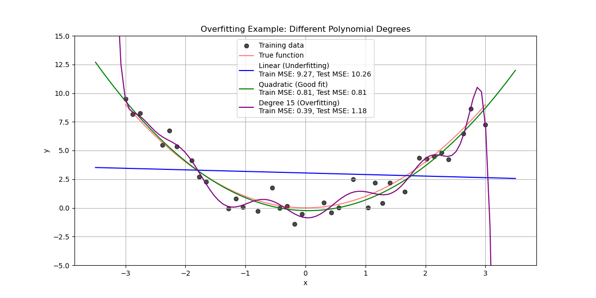
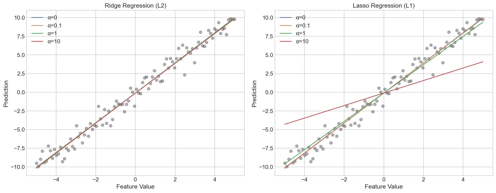
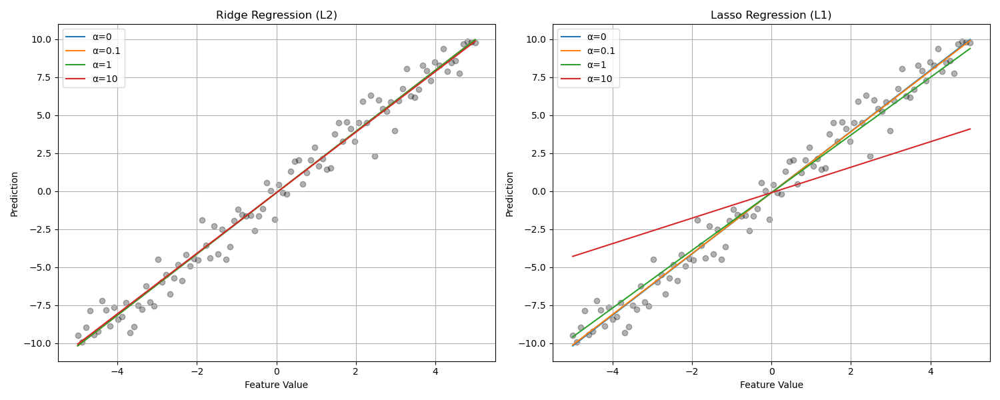

# Regularization Techniques

**After this lesson:** you can fit, tune, and choose between Ridge, Lasso, and Elastic Net models to control overfitting and stabilise coefficients.

## TLDR

* **Why regularize?** Prevent overfitting by penalising large coefficients, constrains the model's freedom to memorise noise.
* **Ridge (L2):** adds `α × Σβ²` to the loss. Shrinks all coefficients toward zero smoothly; never zeros them out. Best when features are correlated.
* **Lasso (L1):** adds `α × Σ|β|`. Can zero out irrelevant features entirely, automatic feature selection. Best when only a few features truly matter.
* **Elastic Net:** blend of L1 + L2, controlled by `l1_ratio`. Use when you're unsure which to choose.
* **Always scale features first** (`StandardScaler`), penalties are not unit-invariant, so raw feature scale skews which coefficients get shrunk.
* **Tune `alpha` with cross-validation** (`RidgeCV`, `LassoCV`), never accept the default `alpha=1.0`.
* **sklearn naming:** `alpha` in Ridge/Lasso = λ. In `LogisticRegression`, `C = 1/α`, smaller `C` means _more_ regularization.

## Overview

Regularization adds a **penalty** on coefficient size (or count) to the usual sum of squared errors or log-likelihood. Ridge pulls weights smoothly toward zero; Lasso can zero some out entirely. Both reduce variance when predictors are noisy or correlated, common in real tables, and need sensible scaling and tuning, topics you began in [model selection](model-selection.md).

## Why this matters

* **Ridge** and **Lasso** shrink coefficients to reduce variance and, in Lasso's case, perform feature selection.
* You will tune penalty strength without guessing from a single train/test split.

## Prerequisites

* [Model selection](model-selection.md).
* [Multiple linear regression](../4.3-rship-in-data/multiple-linear-regression.md) for coefficient interpretation.

> **Note:** Scale features before Ridge/Lasso; penalties are not invariant to units.

## Introduction

Regularization is a important technique in statistical modeling that helps prevent overfitting by adding a penalty term to the model's loss function. Think of it as a way to keep your model from becoming too complex and memorizing the training data instead of learning general patterns.

### Video Tutorial: Introduction to Regularization

_StatQuest: Regularization Part 1: Ridge (L2) Regression by Josh Starmer_

_StatQuest: Regularization Part 2: Lasso (L1) Regression by Josh Starmer_

### Why Regularization Matters

Imagine you're trying to predict house prices. Without regularization:

* Your model might focus too much on specific features or rare patterns in the training data
* It could become overly sensitive to small changes in the inputs
* It might perform poorly when faced with new, unseen data

Regularization helps by:

1. **Reducing model complexity** - Encourages simpler models by penalizing large coefficients
2. **Preventing overfitting** - Makes the model more reliable to noise in the training data
3. **Improving generalization** - Helps the model perform better on new, unseen data
4. **Handling multicollinearity** - Stabilizes coefficient estimates when features are correlated

### The Problem: Overfitting

Before we dive into regularization techniques, get clear on the problem they solve. Overfitting occurs when a model learns the training data too well, including its noise and random fluctuations, rather than the underlying pattern.

**Noisy quadratic data: polynomial pipelines and train vs test MSE**

**Purpose:** Simulate \\(y \approx x^2\\) with noise, compare degree 1/2/15 `PolynomialFeatures` + `LinearRegression` on a train split, and overlay predictions on a dense grid.

**Walkthrough:** `train_test_split`; `make_pipeline(PolynomialFeatures(degree), LinearRegression())`; `mean_squared_error` train/test; multi-series line plot.

<figure><figcaption><p>Figure 1: Simple Quadratic Function with Noise</p></figcaption></figure>

<figure><figcaption><p>Figure 2: Overfitting Example: Different Polynomial Degrees</p></figcaption></figure>

Import numpy as np

Imports the libraries, sets a random seed, and generates noisy quadratic data y = x² + noise.

Y\_true = x\*\*2

Plots the scatter of noisy data against the true quadratic function and saves the figure.

Split the data into train and test sets

Splits the data into train and test sets and defines the polynomial degrees to compare.

Fit models of different complexity

Sets up the comparison plot and loops over each polynomial degree to fit a pipeline.

Train\_error = mean\_squared\_error(y\_train, mod…

Computes train and test MSE for each model and overlays its predictions on the plot.




From this visualization, you can observe:

1. The **linear model** (blue) underfits the data - it's too simple to capture the curved pattern
2. The **quadratic model** (green) provides a good fit - it captures the underlying pattern without fitting the noise
3. The **high-degree polynomial** (purple) overfits the data - it follows the noise in the training data and will perform poorly on new data

### Real-world Examples

Some scenarios where regularization is essential:

1. **Medical Diagnosis**: Datasets have many features but few samples; regularization finds true risk factors instead of coincidental patterns.
2. **Financial Forecasting**: Markets mix real signal with noise; regularization yields stable models focused on persistent patterns rather than historical fluctuations.
3. **Image Recognition**: Images have thousands of pixel features; regularization improves generalization instead of memorizing specific training images.

> **🎯 Key points**
>
> * Regularization adds a penalty on coefficient size to stop a model from memorizing noise.
> * It reduces complexity, prevents overfitting, improves generalization, and stabilizes correlated features.
> * Overfitting (e.g. a degree-15 polynomial) fits training noise and fails on new data.
> * It is most valuable when you have many features, few samples, or noisy data.

## Understanding Regularization

### The Basic Idea

Regularization works by adding a penalty term to the loss function that the model tries to minimize. The two most common types are:

1. **L1 Regularization (Lasso)**
   * Adds the sum of absolute values of coefficients to the loss function
   * Can shrink coefficients to exactly zero (feature selection)
   * Good for identifying important features
2. **L2 Regularization (Ridge)**
   * Adds the sum of squared values of coefficients to the loss function
   * Shrinks coefficients smoothly toward zero but rarely to exactly zero
   * Good for handling multicollinearity (correlated features)

Visualize how these work:

**Ridge vs Lasso predictions across penalty strengths on 1D data**

**Purpose:** For several `alpha` values including 0, overlay fitted lines from `Ridge` and `Lasso` on noisy linear data in side-by-side subplots.

**Walkthrough:** `Ridge(alpha=...)` and `Lasso(alpha=...)` with `.fit` / `.predict`; shared scatter; `tight_layout` and `savefig`.

<figure><figcaption><p>Figure 3: Ridge Regression (L2)</p></figcaption></figure>

Def plot\_regularization\_effects():

Defines the function, generates noisy linear data, and lists the alpha values to test.

Plt.figure(figsize=(15, 6))

Fits a Ridge model at each alpha in the left subplot and plots its predicted line.

Plt.xlabel('Feature Value')

Labels the Ridge subplot and begins the Lasso subplot, fitting Lasso at each alpha.

Plt.scatter(x, y, alpha=0.3, color='black')

Labels the Lasso subplot, saves the figure, and calls the function to run it.



This visualization shows how:

1. As the regularization strength (α) increases, both Ridge and Lasso models become simpler
2. With strong regularization (α=10), both models become nearly flat (approximating the mean of y)
3. Ridge penalties provide a smoother transition between models of different strengths

### The Mathematics Behind It

For those who are interested in the mathematical explanation, here's how regularization modifies the standard linear regression loss function:

#### Standard Linear Regression (Ordinary Least Squares)

$$\min\_{\beta} \sum\_{i=1}^n (y\_i - \hat{y}\_i)^2$$

#### Ridge Regression (L2)

$$\min\_{\beta} \sum\_{i=1}^n (y\_i - \hat{y}\_i)^2 + \lambda \sum\_{j=1}^p \beta\_j^2$$

#### Lasso Regression (L1)

$$\min\_{\beta} \sum\_{i=1}^n (y\_i - \hat{y}\_i)^2 + \lambda \sum\_{j=1}^p |\beta\_j|$$

Where:

* \\(y\_i\\) is the actual target value.
* \\(\hat{y}\_i\\) is the predicted value.
* \\(\beta\_j\\) are the model coefficients.
* \\(\lambda\\) is the regularization strength (called `alpha` in scikit-learn).
* \\(n\\) is the number of samples.
* \\(p\\) is the number of features.

### Visualizing the Constraint Space

A helpful way to understand the difference between L1 and L2 regularization is to visualize their constraint regions:

**L1 diamond vs L2 circle vs quadratic loss contours (2D intuition)**

**Purpose:** Contour plot `|β1|+|β2|` and `β1²+β2²` against circular MSE contours to show why L1 hits axes (sparsity) and L2 typically does not.

**Walkthrough:** `np.meshgrid`; `plt.contour`; annotations for sparse vs non-sparse intersections.

<figure><figcaption><p>Figure 4: L1 Constraint (Diamond)</p></figcaption></figure>

Def plot\_constraint\_spaces():

Builds a 2D coefficient grid and computes the L1 and L2 constraint values over it.

Plt.figure(figsize=(12, 6))

Draws the L1 diamond constraint with overlaid circular MSE loss contours.

Plt.plot(\[1], \[0], 'ko', markersize=8)

Marks and annotates the sparse corner solution on the L1 constraint plot.

Plt.contour(B1, B2, l2, levels=\[1], colors='b…

Draws the L2 circle constraint with the same MSE contours and marks its non-sparse solution.

Plt.ylabel('Coefficient β₂')

Annotates the L2 non-sparse solution, saves the figure, and runs the function.


This geometric interpretation explains:

1. **Why L1 regularization (Lasso) creates sparse models**: The diamond shape of the L1 constraint means that optimal solutions often occur at corners, where some coefficients are exactly zero.
2. **Why L2 regularization (Ridge) doesn't create sparse models**: The circular shape of the L2 constraint means that optimal solutions rarely have coefficients exactly equal to zero.
3. **How regularization works**: The optimization finds the point where the loss function contours (blue dashed lines) touch the constraint region.

> **🎯 Key points**
>
> * Regularization adds a penalty term to the loss function the model minimizes.
> * L1 (Lasso) penalizes the sum of absolute coefficients and can drive some to exactly zero, feature selection.
> * L2 (Ridge) penalizes the sum of squared coefficients and shrinks them smoothly, rarely to zero.
> * Stronger penalty (larger α) means a simpler model; at high α both methods approach the mean.
> * Geometrically, L1's diamond constraint hits corners (sparsity) while L2's circle usually does not.

## Implementing Regularization

### Video Tutorial: Elastic Net Regularization

_StatQuest: Regularization Part 3: Elastic Net Regression by Josh Starmer_

Now implement Ridge, Lasso, and Elastic Net regularization in Python:

### 1. Ridge Regression (L2)

**RidgeCV on scaled collinear data with coefficient bar chart**

**Purpose:** Generate mildly collinear `X`, true linear `y`, then `RidgeCV` with 5-fold neg-MSE scoring on train, report best `alpha_` and R², and plot coefficients when `p` is small.

**Walkthrough:** `StandardScaler` on train/test; `RidgeCV(alphas=..., cv=5)`; `generate_collinear_data` helper builds `X @ true_coef + noise`.

<figure><figcaption><p>Figure 5: Ridge Regression Coefficients (α=0.0673)</p></figcaption></figure>

```
Ridge Regression Results:
Best alpha: 0.0673
Training R²: 0.9537
Test R²: 0.9573
```

Def implement\_ridge(X, y, alphas=np.logspace(…

Defines the function, splits the data, and scales train and test features with StandardScaler.

Fit model with cross-validation to select the…

Fits RidgeCV to pick the best alpha and prints the chosen alpha and train/test R².

Visualize coefficients

If there are few features, builds a horizontal bar chart of the fitted coefficients.

Plt.savefig('ridge\_coefficients.png')

Saves the coefficient plot and returns the model, best alpha, coefficients, and scores.

Np.random.seed(42)

Defines the data generator and creates independent features plus one collinear feature.

Combine features

Stacks features, builds the target from true coefficients plus noise, and runs implement\_ridge.

```
Ridge Regression Results:
Best alpha: 1.0000
Training R²: 0.9102
Test R²: 0.9056
```


### 2. Lasso Regression (L1)

**LassoCV: sparsity count and coefficient plot**

**Purpose:** Same `X`,`y` as Ridge; `LassoCV` selects `alpha_`, reports nonzero coefficient count, and visualizes fitted coefficients.

**Walkthrough:** `LassoCV(alphas=..., cv=5, selection='random')`; `np.sum(coef_ != 0)`; optional horizontal bar.

<figure><figcaption><p>Figure 6: Lasso Regression Coefficients (α=0.0059)</p></figcaption></figure>

```
Lasso Regression Results:
Best alpha: 0.0059
Training R²: 0.9532
Test R²: 0.9593
Number of features selected: 5 out of 5
```

Def implement\_lasso(X, y, alphas=np.logspace(…

Defines the function, splits the data, and scales train and test features.

Fit model with cross-validation

Fits LassoCV to pick the best alpha and counts how many coefficients are non-zero.

Print(f"Number of features selected: {n\_nonze…

Prints the results and, for few features, plots the fitted coefficients as a bar chart.

Plt.tight\_layout()

Saves the plot, returns the results dict, and applies Lasso to the collinear data.

```
Lasso Regression Results:
Best alpha: 0.0210
Training R²: 0.9087
Test R²: 0.9058
Number of features selected: 4 out of 5
```


Notice how Lasso tends to select a subset of features by setting some coefficients to exactly zero.

### 3. Elastic Net

Elastic Net combines both L1 and L2 penalties, providing a balance between Ridge and Lasso:

**ElasticNetCV over `l1_ratio` and `alpha` grid**

**Purpose:** Jointly tune mixing parameter and penalty strength on scaled data, print best `alpha_`, `l1_ratio_`, R², and nonzero count, with coefficient plot.

**Walkthrough:** `ElasticNetCV(l1_ratio=..., alphas=..., cv=5)`; same evaluation pattern as Lasso.

<figure><figcaption><p>Figure 7: Elastic Net Coefficients (α=0.0059, l1_ratio=1.00)</p></figcaption></figure>

```
Elastic Net Results:
Best alpha: 0.0059
Best l1_ratio: 1.00
Training R²: 0.9532
Test R²: 0.9592
Number of features selected: 4 out of 5
```

Def implement\_elastic\_net(X, y, l1\_ratios=\[.1…

Defines the function, splits the data, and scales train and test features.

Fit model

Fits ElasticNetCV over the alpha and l1\_ratio grid and counts non-zero coefficients.

Print(f"Number of features selected: {n\_nonze…

Prints the tuned alpha and l1\_ratio and, for few features, plots the coefficients.

Plt.tight\_layout()

Saves the plot, returns the results dict, and applies Elastic Net to the collinear data.

```
Elastic Net Results:
Best alpha: 0.0162
Best l1_ratio: 0.70
Training R²: 0.9086
Test R²: 0.9055
Number of features selected: 4 out of 5
```


> **🎯 Key points**
>
> * Use `RidgeCV`, `LassoCV`, and `ElasticNetCV` to fit each method and tune `alpha` by cross-validation.
> * Always scale features with `StandardScaler` before fitting a penalized model.
> * Ridge keeps all features; Lasso zeros out redundant ones for automatic feature selection.
> * Elastic Net tunes both `alpha` and `l1_ratio`, blending Ridge and Lasso behavior.

## Choosing the Right Regularization

How do you choose the best type of regularization and its strength? Here's a comprehensive approach:

### 1. Cross-Validation for Parameter Selection

**Overlay RidgeCV vs LassoCV mean CV error vs `alpha`**

**Purpose:** On fully scaled `X`, fit `RidgeCV` and `LassoCV` with shared `KFold`, plot MSE paths vs `alpha` with vertical lines at chosen `alpha_` values.

**Walkthrough:** `ridge.cv_values_.mean(axis=0)`; `lasso.mse_path_` mean; `semilogx`; `plt.axvline` for best alphas.

Def select\_regularization\_parameter(X, y):

Defines the function, scales the features, and lists the alpha values to test.

Kf = KFold(n\_splits=5, shuffle=True, random\_s…

Sets up shared K-fold cross-validation and fits both RidgeCV and LassoCV with it.

Ridge\_alphas = ridge.alphas

Extracts mean CV error for each method and plots both MSE paths against alpha.

Plt.title('Regularization Parameter Selection')

Marks the chosen alphas, saves the plot, and returns the alphas and scores.

### 2. Comparing Different Regularization Methods

**Bar comparison: OLS vs tuned Ridge/Lasso/ElasticNet**

**Purpose:** Fit `LinearRegression` and three penalized models using alphas from prior CV results, compare train/test R² and nonzero counts, stacked subplots.

**Walkthrough:** Reuses `ridge_results`, `lasso_results`, `elastic_net_results` dicts; `model.score`; `plt.bar` twice for R² and feature counts.

<figure><figcaption><p>Figure 8: Model Performance Comparison</p></figcaption></figure>

```
                                   Model  Train R²   Test R²  Features Used
0  Linear Regression (No Regularization)  0.953706  0.956742              5
1                  Ridge Regression (L2)  0.953689  0.957309              5
2                  Lasso Regression (L1)  0.953238  0.959198              4
3                  Elastic Net (L1 + L2)  0.953238  0.959198              4
```

Def compare\_regularization\_methods(X, y):

Defines the function, splits the data, and scales train and test features.

Define models to compare

Builds a dict of OLS, Ridge, Lasso, and Elastic Net using the tuned alphas from earlier.

For name, model in models.items():

Loops over each model, fits it, and records train R², test R², and feature count.

Results.append({

Collects each model's metrics into a list and converts it to a DataFrame.

Plt.subplot(211)

Draws the top subplot comparing train and test R² across the models as grouped bars.

Plt.xticks(x, \[r\['Model'].split(' (')\[0] for…

Draws the bottom subplot of feature counts, saves the figure, and returns the results DataFrame.


And you'll get output like:

```
                                Model  Train R²  Test R²  Features Used
0  Linear Regression (No Regularization)    0.9113   0.9042              5
1             Ridge Regression (L2)         0.9102   0.9056              5
2             Lasso Regression (L1)         0.9087   0.9058              4
3             Elastic Net (L1 + L2)         0.9086   0.9055              4
```

> **🎯 Key points**
>
> * Pick `alpha` with cross-validation across a wide log-spaced range, not a single split.
> * Plotting CV error vs `alpha` shows the trade-off and the best value for each method.
> * Compare OLS against tuned Ridge, Lasso, and Elastic Net on both test R² and feature count.
> * Penalized models often match OLS accuracy while using fewer features and being more stable.

## Practical Tips for Using Regularization

### 1. Start with Ridge Regression

Ridge regression is a good default choice for most problems because:

* It's more stable than Lasso
* It handles multicollinearity well
* It's less likely to discard potentially useful features

**GridSearchCV over `Ridge`** **`alpha` on scaled data**

**Purpose:** `GridSearchCV` with log-spaced `alpha` and neg-MSE scoring; print best `alpha` and negated score (as MSE).

**Walkthrough:** Uses `X_train_scaled`, `y_train` from earlier ridge section; `grid.best_params_`, `grid.best_score_`.

From sklearn.linear\_model import Ridge

Runs GridSearchCV over a log-spaced alpha grid for Ridge and prints the best alpha and MSE.

### 2. Use Lasso for Feature Selection

If you have many features and suspect that some might be irrelevant, Lasso can help identify the important ones:

**Print nonzero Lasso coefficients after fitting with `best_alpha`**

**Purpose:** Refit `Lasso` with `lasso_results['best_alpha']` on scaled training data and list features with nonzero coefficients.

**Walkthrough:** List comprehension over `coef_`; uses dummy `feature_names` if needed.

From sklearn.linear\_model import Lasso

Refits Lasso at the tuned alpha and prints each feature with a non-zero coefficient.

### 3. Try Elastic Net for a Balance

When you're unsure whether to use Ridge or Lasso, Elastic Net provides a balance:

**Fit `ElasticNetCV` and print tuned `alpha_` and `l1_ratio_`**

**Purpose:** Standalone snippet showing grid over `l1_ratio` and `alphas` with 5-fold CV on `X_train_scaled`, `y_train`.

**Walkthrough:** `ElasticNetCV.fit`; read `alpha_` and `l1_ratio_` attributes.

From sklearn.linear\_model import ElasticNetCV

Fits ElasticNetCV over the l1\_ratio and alpha grid and prints the tuned values.

### 4. Always Scale Your Features

Regularization is sensitive to the scale of your features, so standardization is important:

**Pipeline: scaler then `Ridge` for fit/predict**

**Purpose:** `Pipeline` with `StandardScaler` and fixed `Ridge(alpha=1.0)` so scaling is applied inside CV or deployment consistently.

**Walkthrough:** `pipeline.fit` / `predict` on raw `X_train`, `X_test`.

From sklearn.preprocessing import StandardScaler

Builds a Pipeline of StandardScaler then Ridge so scaling is applied consistently on fit and predict.

> **🎯 Key points**
>
> * Start with Ridge: it is stable, handles multicollinearity, and keeps useful features.
> * Use Lasso when you suspect some features are irrelevant and want automatic selection.
> * Reach for Elastic Net when unsure which to use, tuning both `alpha` and `l1_ratio`.
> * Always wrap scaling and the model in a `Pipeline` so scaling is applied consistently.

## Common Challenges and Solutions

### 1. Selecting the Optimal Regularization Strength

**Challenge**: Choosing the right value for alpha (λ) can be difficult.

**Solution**: Use cross-validation with a wide range of alpha values:

**Repeated K-fold `RidgeCV` for a wider alpha search**

**Purpose:** Fit `RidgeCV` with `RepeatedKFold` and dense `logspace` alphas on prescaled `X_scaled`, `y` (assumed defined earlier).

**Walkthrough:** `RepeatedKFold(n_splits=5, n_repeats=3)`; `RidgeCV(alphas=..., cv=cv)`; print `alpha_`.

From sklearn.linear\_model import RidgeCV, Las…

Fits RidgeCV with RepeatedKFold over a wide alpha range and prints the optimal alpha.

### 2. Handling Highly Correlated Features

**Challenge**: When features are highly correlated, coefficient estimates can be unstable.

**Solution**:

* Ridge is generally better for correlated features
* Consider dimensionality reduction techniques like PCA before modeling
* Feature clustering to combine similar features

### 3. Interpreting Regularized Coefficients

**Challenge**: Regularized coefficients are biased due to the penalty term.

**Solution**:

* Use standardized coefficients for importance comparison
* For prediction accuracy, the bias is often acceptable
* For causal inference, be cautious with heavy regularization

**Standardized coefficients from model + `StandardScaler`**

**Purpose:** Multiply raw `coef_` by `scaler.scale_` to recover effect sizes in original units per SD of each feature.

**Walkthrough:** Guard `hasattr(scaler, 'scale_')`; return sorted `DataFrame`.

Get standardized coefficients

Defines the function and reads the raw coefficients and feature scales from the scaler.

If feature\_names is None:

Computes standardized coefficients and returns them in a DataFrame sorted by magnitude.

> **🎯 Key points**
>
> * Choose `alpha` with cross-validation over a wide range; `RepeatedKFold` makes the estimate more reliable.
> * For highly correlated features, prefer Ridge or reduce dimensions (e.g. PCA) before modeling.
> * Regularized coefficients are biased, fine for prediction, but interpret cautiously for causal claims.
> * Multiply coefficients by feature scales to recover comparable, standardized effect sizes.

## Practice Exercise

Apply regularization to improve a model for housing price prediction:

**Synthetic housing design matrix (starter scaffold for learners)**

**Purpose:** Build correlated and noise features with a nonlinear price target, stack into `X_housing`, then `train_test_split`-comment prompts compare Linear/Ridge/Lasso/ElasticNet.

**Walkthrough:** `np.column_stack` + name list; exercise leaves modeling steps to the student.

Generate synthetic housing data

Sets the seed and generates the base housing features: size, rooms, age, and distance.

Garage = np.clip(garage, 0, 2)

Derives correlated features (bathrooms, garden, garage) and adds two pure-noise features.

8000 \* garage + # Garage adds…

Builds the house-price target with a nonlinear distance term plus random noise.

'Random Feature 1', 'Random Feature 2'

Stacks the features, names them, and splits into train/test, leaving the modeling to the student.

## Next steps

* Continue to [Model interpretation](model-interpretation.md).

## Gotchas

* **Forgetting to scale features before Ridge or Lasso**: Both penalties shrink coefficients toward zero, but the penalty is applied to the raw coefficient values. A feature measured in thousands (e.g., income) gets a tiny coefficient and almost no shrinkage, while one measured in single digits gets shrunk aggressively. Always apply `StandardScaler` inside your pipeline before the regularised model.
* **Treating `alpha=1.0` as a sensible default**: sklearn's default `alpha` is 1.0, which is arbitrary relative to your data's scale and noise level. The right alpha is data-dependent; always tune it with cross-validation (e.g., `RidgeCV`, `LassoCV`) rather than accepting the default.
* **Using `cross_val_score` outside a Pipeline when preprocessing is involved**: If you scale the data before calling `cross_val_score`, the scaler has seen all folds including the test fold, leaking information. Wrap `StandardScaler` and `Ridge`/`Lasso` in a `make_pipeline` so preprocessing is re-fitted only on the training fold of each split.
* **Assuming Lasso always performs feature selection**: Lasso sets coefficients to exactly zero only at sufficiently large alpha. At small alpha values, all coefficients remain non-zero and Lasso behaves more like Ridge. Check how many coefficients are truly zero at your chosen alpha before claiming features were "selected."
* **Comparing Ridge and Lasso coefficients directly**: Ridge shrinks all coefficients smoothly and retains all features; Lasso can zero some out entirely. A coefficient of 0 from Lasso means the feature was excluded from the model, not that it has zero effect, it may still matter but be redundant with another predictor.
* **Picking alpha from a path plot without accounting for standard error**: `LassoCV` selects the alpha that minimises mean CV error. The `alpha_1se` rule (largest alpha within one standard error of the minimum) often gives a simpler, similarly accurate model. Defaulting to the exact minimum risks selecting an overly complex solution.

## Additional Resources

* [Scikit-learn Regularization Documentation](https://scikit-learn.org/stable/modules/linear_model.html)
* [Introduction to Statistical Learning](https://www.statlearning.com/) (Chapter 6)
* [Elements of Statistical Learning](https://web.stanford.edu/~hastie/ElemStatLearn/) (Chapter 3)
* [Regularization for Machine Learning](https://towardsdatascience.com/regularization-in-machine-learning-76441ddcf99a)
