# Regularization Techniques

**After this lesson:** you can fit, tune, and choose between Ridge, Lasso, and Elastic Net models to control overfitting and stabilise coefficients.

## TLDR

- **Why regularize?** Prevent overfitting by penalising large coefficients — constrains the model's freedom to memorise noise.
- **Ridge (L2):** adds `α × Σβ²` to the loss. Shrinks all coefficients toward zero smoothly; never zeros them out. Best when features are correlated.
- **Lasso (L1):** adds `α × Σ|β|`. Can zero out irrelevant features entirely — automatic feature selection. Best when only a few features truly matter.
- **Elastic Net:** blend of L1 + L2, controlled by `l1_ratio`. Use when you're unsure which to choose.
- **Always scale features first** (`StandardScaler`) — penalties are not unit-invariant, so raw feature scale skews which coefficients get shrunk.
- **Tune `alpha` with cross-validation** (`RidgeCV`, `LassoCV`) — never accept the default `alpha=1.0`.
- **sklearn naming:** `alpha` in Ridge/Lasso = λ. In `LogisticRegression`, `C = 1/α` — smaller `C` means *more* regularization.

## Overview

Regularization adds a **penalty** on coefficient size (or count) to the usual sum of squared errors or log-likelihood. Ridge pulls weights smoothly toward zero; Lasso can zero some out entirely. Both reduce variance when predictors are noisy or correlated—common in real tables—and need sensible scaling and tuning, topics you began in [model selection](./model-selection.md).

## Why this matters

- **Ridge** and **Lasso** shrink coefficients to reduce variance and, in Lasso’s case, perform feature selection.
- You will tune penalty strength without guessing from a single train/test split.

## Prerequisites

- [Model selection](./model-selection.md).
- [Multiple linear regression](../4.3-rship-in-data/multiple-linear-regression.md) for coefficient interpretation.

> **Note:** Scale features before Ridge/Lasso; penalties are not invariant to units.

## Introduction

Regularization is a crucial technique in statistical modeling that helps prevent overfitting by adding a penalty term to the model's loss function. Think of it as a way to keep your model from becoming too complex and memorizing the training data instead of learning general patterns.

### Video Tutorial: Introduction to Regularization

<div class="video-embed">
<iframe width="560" height="315" src="https://www.youtube.com/embed/Q81RR3yKn30" frameborder="0" allow="accelerometer; autoplay; clipboard-write; encrypted-media; gyroscope; picture-in-picture" allowfullscreen></iframe>
</div>

*StatQuest: Regularization Part 1: Ridge (L2) Regression by Josh Starmer*

<div class="video-embed">
<iframe width="560" height="315" src="https://www.youtube.com/embed/NGf0voTMlcs" frameborder="0" allow="accelerometer; autoplay; clipboard-write; encrypted-media; gyroscope; picture-in-picture" allowfullscreen></iframe>
</div>

*StatQuest: Regularization Part 2: Lasso (L1) Regression by Josh Starmer*



### Why Regularization Matters

Imagine you're trying to predict house prices. Without regularization:

- Your model might focus too much on specific features or rare patterns in the training data
- It could become overly sensitive to small changes in the inputs
- It might perform poorly when faced with new, unseen data

Regularization helps by:

1. **Reducing model complexity** - Encourages simpler models by penalizing large coefficients
2. **Preventing overfitting** - Makes the model more robust to noise in the training data
3. **Improving generalization** - Helps the model perform better on new, unseen data
4. **Handling multicollinearity** - Stabilizes coefficient estimates when features are correlated

### The Problem: Overfitting

Before we dive into regularization techniques, let's understand the problem they solve. Overfitting occurs when a model learns the training data too well, including its noise and random fluctuations, rather than the underlying pattern.

**Noisy quadratic data: polynomial pipelines and train vs test MSE**

**Purpose:** Simulate \\(y \approx x^2\\) with noise, compare degree 1/2/15 `PolynomialFeatures` + `LinearRegression` on a train split, and overlay predictions on a dense grid.

**Walkthrough:** `train_test_split`; `make_pipeline(PolynomialFeatures(degree), LinearRegression())`; `mean_squared_error` train/test; multi-series line plot.

<div class="code-explainer" data-code-explainer>
<div class="code-explainer__code">


import numpy as np
import matplotlib.pyplot as plt
import pandas as pd
from sklearn.linear_model import LinearRegression, Ridge, Lasso
from sklearn.preprocessing import PolynomialFeatures
from sklearn.model_selection import train_test_split
from sklearn.metrics import mean_squared_error
from sklearn.pipeline import make_pipeline

# Set a random seed for reproducibility
np.random.seed(42)

# Generate sample data: y = x^2 + noise
x = np.linspace(-3, 3, 50)
y_true = x**2
y = y_true + np.random.normal(0, 1, size=len(x))

# Visualize the data
plt.figure(figsize=(10, 6))
plt.scatter(x, y, alpha=0.7, label='Data points')
plt.plot(x, y_true, 'r-', label='True function (y = x²)')
plt.xlabel('x')
plt.ylabel('y')
plt.title('Simple Quadratic Function with Noise')
plt.legend()
plt.grid(True)
plt.savefig('overfitting_data.png')
plt.show()

# Split the data into train and test sets
X = x.reshape(-1, 1)
X_train, X_test, y_train, y_test = train_test_split(X, y, test_size=0.3, random_state=42)

# Fit different polynomial degrees to show overfitting
degrees = [1, 2, 15]  # Linear, quadratic, and high-degree polynomial
colors = ['blue', 'green', 'purple']
labels = ['Linear (Underfitting)', 'Quadratic (Good fit)', 'Degree 15 (Overfitting)']
plt.figure(figsize=(12, 6))

# Plot training data
plt.scatter(X_train, y_train, c='black', alpha=0.7, label='Training data')
plt.plot(x, y_true, 'r-', alpha=0.5, label='True function')

# Fit models of different complexity
x_plot = np.linspace(-3.5, 3.5, 100).reshape(-1, 1)
for i, degree in enumerate(degrees):
    # Create and fit model
    model = make_pipeline(
        PolynomialFeatures(degree),
        LinearRegression()
    )
    model.fit(X_train, y_train)
    
    # Make predictions
    y_plot = model.predict(x_plot)
    
    # Calculate errors
    train_error = mean_squared_error(y_train, model.predict(X_train))
    test_error = mean_squared_error(y_test, model.predict(X_test))
    
    # Plot the model's predictions
    plt.plot(x_plot, y_plot, c=colors[i], 
             label=f'{labels[i]}\nTrain MSE: {train_error:.2f}, Test MSE: {test_error:.2f}')

plt.title('Overfitting Example: Different Polynomial Degrees')
plt.xlabel('x')
plt.ylabel('y')
plt.ylim(-5, 15)
plt.legend()
plt.grid(True)
plt.savefig('overfitting_example.png')
plt.show()


<figure>
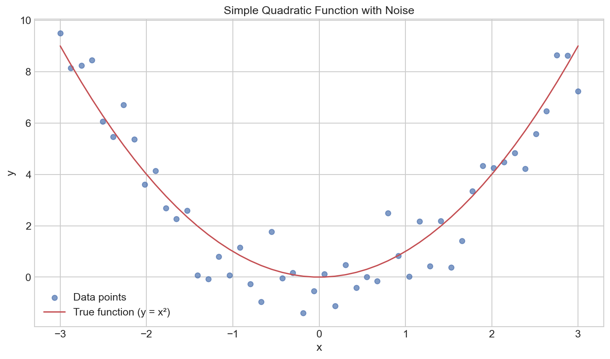
<figcaption>Figure 1: Simple Quadratic Function with Noise</figcaption>
</figure>


<figure>
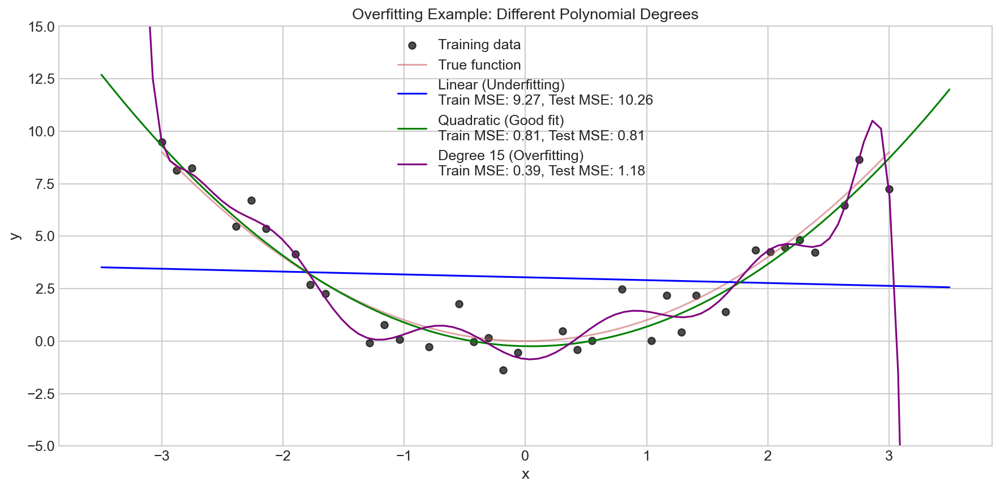
<figcaption>Figure 2: Overfitting Example: Different Polynomial Degrees</figcaption>
</figure>

</div>
<aside class="code-explainer__callouts" aria-label="Code walkthrough">
  <div class="code-callout" data-lines="1-14" data-tint="1">
    <div class="code-callout__meta">
      <span class="code-callout__lines"></span>
      <span class="code-callout__title">Import numpy as np</span>
    </div>
    <div class="code-callout__body">
      <p>Imports the libraries, sets a random seed, and generates noisy quadratic data y = x² + noise.</p>
    </div>
  </div>
  <div class="code-callout" data-lines="15-28" data-tint="2">
    <div class="code-callout__meta">
      <span class="code-callout__lines"></span>
      <span class="code-callout__title">Y_true = x**2</span>
    </div>
    <div class="code-callout__body">
      <p>Plots the scatter of noisy data against the true quadratic function and saves the figure.</p>
    </div>
  </div>
  <div class="code-callout" data-lines="29-43" data-tint="3">
    <div class="code-callout__meta">
      <span class="code-callout__lines"></span>
      <span class="code-callout__title">Split the data into train and test sets</span>
    </div>
    <div class="code-callout__body">
      <p>Splits the data into train and test sets and defines the polynomial degrees to compare.</p>
    </div>
  </div>
  <div class="code-callout" data-lines="44-57" data-tint="4">
    <div class="code-callout__meta">
      <span class="code-callout__lines"></span>
      <span class="code-callout__title">Fit models of different complexity</span>
    </div>
    <div class="code-callout__body">
      <p>Sets up the comparison plot and loops over each polynomial degree to fit a pipeline.</p>
    </div>
  </div>
  <div class="code-callout" data-lines="58-72" data-tint="1">
    <div class="code-callout__meta">
      <span class="code-callout__lines"></span>
      <span class="code-callout__title">Train_error = mean_squared_error(y_train, mod…</span>
    </div>
    <div class="code-callout__body">
      <p>Computes train and test MSE for each model and overlays its predictions on the plot.</p>
    </div>
  </div>
</aside>
</div>

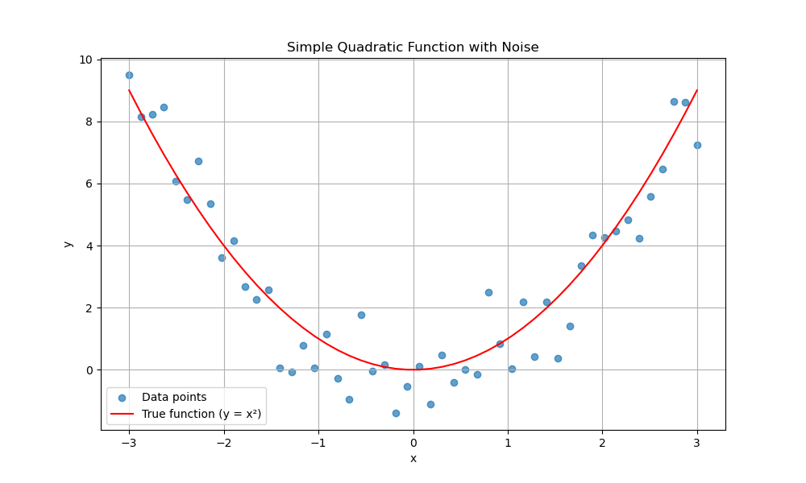


From this visualization, you can observe:

1. The **linear model** (blue) underfits the data - it's too simple to capture the curved pattern
2. The **quadratic model** (green) provides a good fit - it captures the underlying pattern without fitting the noise
3. The **high-degree polynomial** (purple) overfits the data - it follows the noise in the training data and will perform poorly on new data

### Real-world Examples

Some scenarios where regularization is essential:

1. **Medical Diagnosis** — Datasets have many features but few samples; regularization finds true risk factors instead of coincidental patterns.
2. **Financial Forecasting** — Markets mix real signal with noise; regularization yields stable models focused on persistent patterns rather than historical fluctuations.
3. **Image Recognition** — Images have thousands of pixel features; regularization improves generalization instead of memorizing specific training images.

> **🎯 Key points**
>
> - Regularization adds a penalty on coefficient size to stop a model from memorizing noise.
> - It reduces complexity, prevents overfitting, improves generalization, and stabilizes correlated features.
> - Overfitting (e.g. a degree-15 polynomial) fits training noise and fails on new data.
> - It is most valuable when you have many features, few samples, or noisy data.

## Understanding Regularization

### The Basic Idea

Regularization works by adding a penalty term to the loss function that the model tries to minimize. The two most common types are:

1. **L1 Regularization (Lasso)**
   - Adds the sum of absolute values of coefficients to the loss function
   - Can shrink coefficients to exactly zero (feature selection)
   - Good for identifying important features

2. **L2 Regularization (Ridge)**
   - Adds the sum of squared values of coefficients to the loss function
   - Shrinks coefficients smoothly toward zero but rarely to exactly zero
   - Good for handling multicollinearity (correlated features)

Let's visualize how these work:

**Ridge vs Lasso predictions across penalty strengths on 1D data**

**Purpose:** For several `alpha` values including 0, overlay fitted lines from `Ridge` and `Lasso` on noisy linear data in side-by-side subplots.

**Walkthrough:** `Ridge(alpha=...)` and `Lasso(alpha=...)` with `.fit` / `.predict`; shared scatter; `tight_layout` and `savefig`.

<div class="code-explainer" data-code-explainer>
<div class="code-explainer__code">


def plot_regularization_effects():
    """Visualize how different regularization methods affect coefficients"""
    # Generate sample data with some noise
    np.random.seed(42)
    x = np.linspace(-5, 5, 100)
    y = 2*x + np.random.normal(0, 1, 100)
    
    X = x.reshape(-1, 1)
    
    # Set up different regularization strengths (alpha values)
    # alpha=0 means no regularization
    alphas = [0, 0.1, 1, 10]
    
    plt.figure(figsize=(15, 6))
    
    # Ridge Regression (L2)
    plt.subplot(121)
    for alpha in alphas:
        model = Ridge(alpha=alpha)
        model.fit(X, y)
        y_pred = model.predict(X)
        plt.plot(x, y_pred, 
                label=f'α={alpha}')
    
    plt.scatter(x, y, alpha=0.3, color='black')
    plt.title('Ridge Regression (L2)')
    plt.xlabel('Feature Value')
    plt.ylabel('Prediction')
    plt.legend()
    plt.grid(True)
    
    # Lasso Regression (L1)
    plt.subplot(122)
    for alpha in alphas:
        model = Lasso(alpha=alpha)
        model.fit(X, y)
        y_pred = model.predict(X)
        plt.plot(x, y_pred, 
                label=f'α={alpha}')
    
    plt.scatter(x, y, alpha=0.3, color='black')
    plt.title('Lasso Regression (L1)')
    plt.xlabel('Feature Value')
    plt.ylabel('Prediction')
    plt.legend()
    plt.grid(True)
    
    plt.tight_layout()
    plt.savefig('regularization_effects.png')
    plt.show()

# Execute the function
plot_regularization_effects()


<figure>
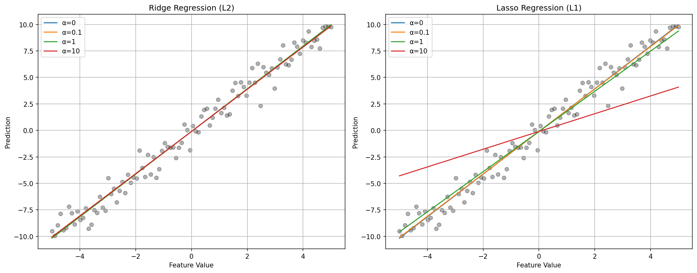
<figcaption>Figure 3: Ridge Regression (L2)</figcaption>
</figure>

</div>
<aside class="code-explainer__callouts" aria-label="Code walkthrough">
  <div class="code-callout" data-lines="1-13" data-tint="1">
    <div class="code-callout__meta">
      <span class="code-callout__lines"></span>
      <span class="code-callout__title">Def plot_regularization_effects():</span>
    </div>
    <div class="code-callout__body">
      <p>Defines the function, generates noisy linear data, and lists the alpha values to test.</p>
    </div>
  </div>
  <div class="code-callout" data-lines="14-26" data-tint="2">
    <div class="code-callout__meta">
      <span class="code-callout__lines"></span>
      <span class="code-callout__title">Plt.figure(figsize=(15, 6))</span>
    </div>
    <div class="code-callout__body">
      <p>Fits a Ridge model at each alpha in the left subplot and plots its predicted line.</p>
    </div>
  </div>
  <div class="code-callout" data-lines="27-39" data-tint="3">
    <div class="code-callout__meta">
      <span class="code-callout__lines"></span>
      <span class="code-callout__title">Plt.xlabel(&#x27;Feature Value&#x27;)</span>
    </div>
    <div class="code-callout__body">
      <p>Labels the Ridge subplot and begins the Lasso subplot, fitting Lasso at each alpha.</p>
    </div>
  </div>
  <div class="code-callout" data-lines="40-53" data-tint="4">
    <div class="code-callout__meta">
      <span class="code-callout__lines"></span>
      <span class="code-callout__title">Plt.scatter(x, y, alpha=0.3, color=&#x27;black&#x27;)</span>
    </div>
    <div class="code-callout__body">
      <p>Labels the Lasso subplot, saves the figure, and calls the function to run it.</p>
    </div>
  </div>
</aside>
</div>


This visualization shows how:

1. As the regularization strength (α) increases, both Ridge and Lasso models become simpler
2. With strong regularization (α=10), both models become nearly flat (approximating the mean of y)
3. Ridge penalties provide a smoother transition between models of different strengths

### The Mathematics Behind It

For those who are interested in the mathematical explanation, here's how regularization modifies the standard linear regression loss function:

#### Standard Linear Regression (Ordinary Least Squares)

$$\min_{\beta} \sum_{i=1}^n (y_i - \hat{y}_i)^2$$

#### Ridge Regression (L2)

$$\min_{\beta} \sum_{i=1}^n (y_i - \hat{y}_i)^2 + \lambda \sum_{j=1}^p \beta_j^2$$

#### Lasso Regression (L1)

$$\min_{\beta} \sum_{i=1}^n (y_i - \hat{y}_i)^2 + \lambda \sum_{j=1}^p |\beta_j|$$

Where:

- \\(y_i\\) is the actual target value.
- \\(\hat{y}_i\\) is the predicted value.
- \\(\beta_j\\) are the model coefficients.
- \\(\lambda\\) is the regularization strength (called `alpha` in scikit-learn).
- \\(n\\) is the number of samples.
- \\(p\\) is the number of features.

### Visualizing the Constraint Space

A helpful way to understand the difference between L1 and L2 regularization is to visualize their constraint regions:

**L1 diamond vs L2 circle vs quadratic loss contours (2D intuition)**

**Purpose:** Contour plot `|β1|+|β2|` and `β1²+β2²` against circular MSE contours to show why L1 hits axes (sparsity) and L2 typically does not.

**Walkthrough:** `np.meshgrid`; `plt.contour`; annotations for sparse vs non-sparse intersections.

<div class="code-explainer" data-code-explainer>
<div class="code-explainer__code">


def plot_constraint_spaces():
    """Visualize L1 and L2 constraint spaces"""
    # Generate coefficient space
    beta1 = np.linspace(-2, 2, 100)
    beta2 = np.linspace(-2, 2, 100)
    B1, B2 = np.meshgrid(beta1, beta2)
    
    # Calculate constraint regions
    l1 = np.abs(B1) + np.abs(B2)  # L1 constraint: |β1| + |β2| ≤ c
    l2 = B1**2 + B2**2            # L2 constraint: β1² + β2² ≤ c
    
    # Create contour plots
    plt.figure(figsize=(12, 6))
    
    # L1 Constraint (Diamond)
    plt.subplot(121)
    plt.contour(B1, B2, l1, levels=[1], colors='r', linewidths=2)
    
    # Add loss function contours (circular contours representing MSE)
    for r in [0.4, 0.8, 1.2, 1.6]:
        plt.contour(B1, B2, (B1-1)**2 + (B2-0.5)**2, levels=[r**2], 
                   colors='blue', alpha=0.5, linestyles='--')
    
    # Highlight the corner intersection point
    plt.plot([1], [0], 'ko', markersize=8)
    
    plt.title('L1 Constraint (Diamond)')
    plt.xlabel('Coefficient β₁')
    plt.ylabel('Coefficient β₂')
    plt.axis('equal')
    plt.grid(True)
    plt.annotate('Sparse Solution\n(β₂ = 0)', xy=(1, 0), xytext=(1, -1.5),
                arrowprops=dict(facecolor='black', shrink=0.05))
    
    # L2 Constraint (Circle)
    plt.subplot(122)
    plt.contour(B1, B2, l2, levels=[1], colors='b', linewidths=2)
    
    # Add the same loss function contours
    for r in [0.4, 0.8, 1.2, 1.6]:
        plt.contour(B1, B2, (B1-1)**2 + (B2-0.5)**2, levels=[r**2], 
                   colors='blue', alpha=0.5, linestyles='--')
    
    # Highlight the non-sparse intersection point
    plt.plot([0.9], [0.45], 'ko', markersize=8)
    
    plt.title('L2 Constraint (Circle)')
    plt.xlabel('Coefficient β₁')
    plt.ylabel('Coefficient β₂')
    plt.axis('equal')
    plt.grid(True)
    plt.annotate('Non-sparse Solution\n(both β₁ and β₂ ≠ 0)', 
                xy=(0.9, 0.45), xytext=(0.2, -1.5),
                arrowprops=dict(facecolor='black', shrink=0.05))
    
    plt.tight_layout()
    plt.savefig('constraint_spaces.png')
    plt.show()

# Execute the function
plot_constraint_spaces()


<figure>
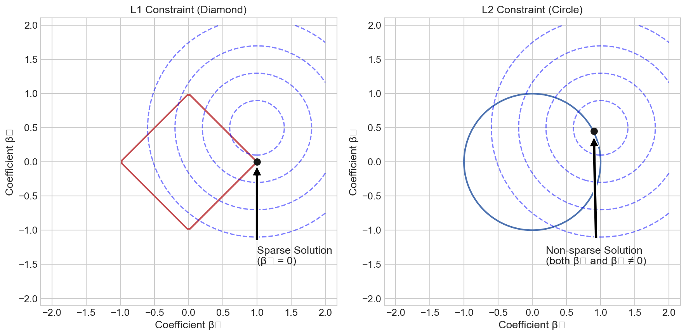
<figcaption>Figure 4: L1 Constraint (Diamond)</figcaption>
</figure>

</div>
<aside class="code-explainer__callouts" aria-label="Code walkthrough">
  <div class="code-callout" data-lines="1-12" data-tint="1">
    <div class="code-callout__meta">
      <span class="code-callout__lines"></span>
      <span class="code-callout__title">Def plot_constraint_spaces():</span>
    </div>
    <div class="code-callout__body">
      <p>Builds a 2D coefficient grid and computes the L1 and L2 constraint values over it.</p>
    </div>
  </div>
  <div class="code-callout" data-lines="13-24" data-tint="2">
    <div class="code-callout__meta">
      <span class="code-callout__lines"></span>
      <span class="code-callout__title">Plt.figure(figsize=(12, 6))</span>
    </div>
    <div class="code-callout__body">
      <p>Draws the L1 diamond constraint with overlaid circular MSE loss contours.</p>
    </div>
  </div>
  <div class="code-callout" data-lines="25-36" data-tint="3">
    <div class="code-callout__meta">
      <span class="code-callout__lines"></span>
      <span class="code-callout__title">Plt.plot([1], [0], &#x27;ko&#x27;, markersize=8)</span>
    </div>
    <div class="code-callout__body">
      <p>Marks and annotates the sparse corner solution on the L1 constraint plot.</p>
    </div>
  </div>
  <div class="code-callout" data-lines="37-48" data-tint="4">
    <div class="code-callout__meta">
      <span class="code-callout__lines"></span>
      <span class="code-callout__title">Plt.contour(B1, B2, l2, levels=[1], colors=&#x27;b…</span>
    </div>
    <div class="code-callout__body">
      <p>Draws the L2 circle constraint with the same MSE contours and marks its non-sparse solution.</p>
    </div>
  </div>
  <div class="code-callout" data-lines="49-61" data-tint="1">
    <div class="code-callout__meta">
      <span class="code-callout__lines"></span>
      <span class="code-callout__title">Plt.ylabel(&#x27;Coefficient β₂&#x27;)</span>
    </div>
    <div class="code-callout__body">
      <p>Annotates the L2 non-sparse solution, saves the figure, and runs the function.</p>
    </div>
  </div>
</aside>
</div>

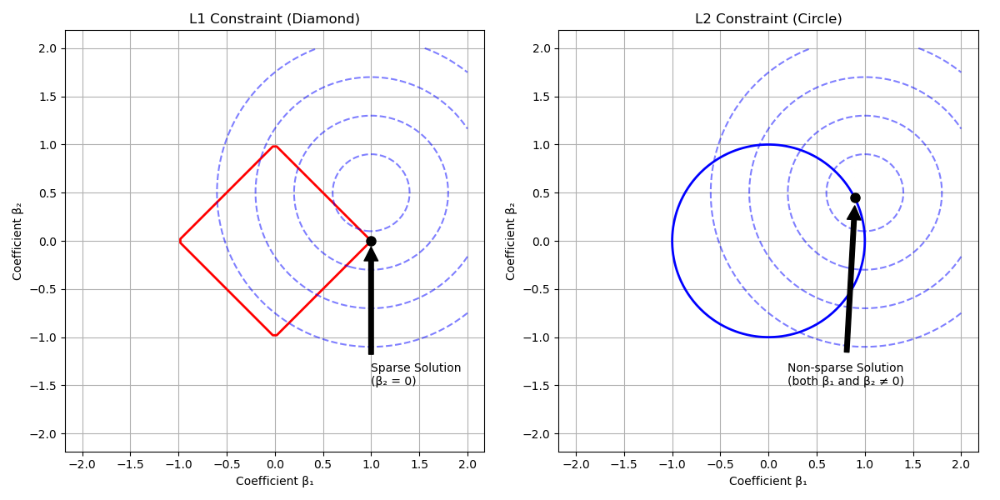

This geometric interpretation explains:

1. **Why L1 regularization (Lasso) creates sparse models**: The diamond shape of the L1 constraint means that optimal solutions often occur at corners, where some coefficients are exactly zero.

2. **Why L2 regularization (Ridge) doesn't create sparse models**: The circular shape of the L2 constraint means that optimal solutions rarely have coefficients exactly equal to zero.

3. **How regularization works**: The optimization finds the point where the loss function contours (blue dashed lines) touch the constraint region.

> **🎯 Key points**
>
> - Regularization adds a penalty term to the loss function the model minimizes.
> - L1 (Lasso) penalizes the sum of absolute coefficients and can drive some to exactly zero — feature selection.
> - L2 (Ridge) penalizes the sum of squared coefficients and shrinks them smoothly, rarely to zero.
> - Stronger penalty (larger α) means a simpler model; at high α both methods approach the mean.
> - Geometrically, L1's diamond constraint hits corners (sparsity) while L2's circle usually does not.

## Implementing Regularization

### Video Tutorial: Elastic Net Regularization

<div class="video-embed">
<iframe width="560" height="315" src="https://www.youtube.com/embed/1dKRdX9bfIo" frameborder="0" allow="accelerometer; autoplay; clipboard-write; encrypted-media; gyroscope; picture-in-picture" allowfullscreen></iframe>
</div>

*StatQuest: Regularization Part 3: Elastic Net Regression by Josh Starmer*

Now let's implement Ridge, Lasso, and Elastic Net regularization in Python:

### 1. Ridge Regression (L2)

**RidgeCV on scaled collinear data with coefficient bar chart**

**Purpose:** Generate mildly collinear `X`, true linear `y`, then `RidgeCV` with 5-fold neg-MSE scoring on train, report best `alpha_` and R², and plot coefficients when `p` is small.

**Walkthrough:** `StandardScaler` on train/test; `RidgeCV(alphas=..., cv=5)`; `generate_collinear_data` helper builds `X @ true_coef + noise`.

<div class="code-explainer" data-code-explainer>
<div class="code-explainer__code">


def implement_ridge(X, y, alphas=np.logspace(-4, 4, 100)):
    """Implement ridge regression with cross-validation"""
    from sklearn.linear_model import RidgeCV
    from sklearn.preprocessing import StandardScaler
    from sklearn.model_selection import train_test_split
    
    # Split data
    X_train, X_test, y_train, y_test = train_test_split(X, y, test_size=0.3, random_state=42)
    
    # Scale features
    scaler = StandardScaler()
    X_train_scaled = scaler.fit_transform(X_train)
    X_test_scaled = scaler.transform(X_test)
    
    # Fit model with cross-validation to select the best alpha
    model = RidgeCV(alphas=alphas, cv=5, scoring='neg_mean_squared_error')
    model.fit(X_train_scaled, y_train)
    
    # Evaluate model
    train_score = model.score(X_train_scaled, y_train)
    test_score = model.score(X_test_scaled, y_test)
    
    print(f"Ridge Regression Results:")
    print(f"Best alpha: {model.alpha_:.4f}")
    print(f"Training R²: {train_score:.4f}")
    print(f"Test R²: {test_score:.4f}")
    
    # Visualize coefficients
    if X.shape[1] <= 10:  # Only create visualization for relatively small number of features
        # Create dummy feature names if not provided
        feature_names = [f"Feature {i+1}" for i in range(X.shape[1])]
        
        # Plot coefficients
        plt.figure(figsize=(10, 6))
        plt.barh(feature_names, model.coef_)
        plt.title(f'Ridge Regression Coefficients (α={model.alpha_:.4f})')
        plt.xlabel('Coefficient Value')
        plt.axvline(x=0, color='k', linestyle='--')
        plt.grid(True)
        plt.tight_layout()
        plt.savefig('ridge_coefficients.png')
        plt.show()
    
    return {
        'model': model,
        'best_alpha': model.alpha_,
        'coefficients': model.coef_,
        'train_score': train_score,
        'test_score': test_score
    }

# Generate synthetic multivariate data with collinearity for demonstration
def generate_collinear_data(n_samples=200, noise_level=0.5):
    """Generate synthetic data with collinearity"""
    np.random.seed(42)
    
    # Generate independent features
    x1 = np.random.normal(0, 1, n_samples)
    x2 = np.random.normal(0, 1, n_samples)
    
    # Generate collinear feature
    x3 = 0.7*x1 + 0.3*x2 + np.random.normal(0, 0.1, n_samples)  # Collinear with x1 and x2
    
    # Two more independent features
    x4 = np.random.normal(0, 1, n_samples)
    x5 = np.random.normal(0, 1, n_samples)
    
    # Combine features
    X = np.column_stack([x1, x2, x3, x4, x5])
    
    # True coefficients (x3 should have small coefficient since it's redundant)
    true_coef = np.array([2, 1, 0.2, 0.5, 0])
    
    # Generate target
    y = X @ true_coef + np.random.normal(0, noise_level, n_samples)
    
    return X, y, true_coef

# Generate data and apply Ridge regression
X_collinear, y_collinear, true_coef = generate_collinear_data()
ridge_results = implement_ridge(X_collinear, y_collinear)


<figure>

<figcaption>Figure 5: Ridge Regression Coefficients (α=0.0673)</figcaption>
</figure>

```
Ridge Regression Results:
Best alpha: 0.0673
Training R²: 0.9537
Test R²: 0.9573
```

</div>
<aside class="code-explainer__callouts" aria-label="Code walkthrough">
  <div class="code-callout" data-lines="1-13" data-tint="1">
    <div class="code-callout__meta">
      <span class="code-callout__lines"></span>
      <span class="code-callout__title">Def implement_ridge(X, y, alphas=np.logspace(…</span>
    </div>
    <div class="code-callout__body">
      <p>Defines the function, splits the data, and scales train and test features with StandardScaler.</p>
    </div>
  </div>
  <div class="code-callout" data-lines="14-27" data-tint="2">
    <div class="code-callout__meta">
      <span class="code-callout__lines"></span>
      <span class="code-callout__title">Fit model with cross-validation to select the…</span>
    </div>
    <div class="code-callout__body">
      <p>Fits RidgeCV to pick the best alpha and prints the chosen alpha and train/test R².</p>
    </div>
  </div>
  <div class="code-callout" data-lines="28-40" data-tint="3">
    <div class="code-callout__meta">
      <span class="code-callout__lines"></span>
      <span class="code-callout__title">Visualize coefficients</span>
    </div>
    <div class="code-callout__body">
      <p>If there are few features, builds a horizontal bar chart of the fitted coefficients.</p>
    </div>
  </div>
  <div class="code-callout" data-lines="41-54" data-tint="4">
    <div class="code-callout__meta">
      <span class="code-callout__lines"></span>
      <span class="code-callout__title">Plt.savefig(&#x27;ridge_coefficients.png&#x27;)</span>
    </div>
    <div class="code-callout__body">
      <p>Saves the coefficient plot and returns the model, best alpha, coefficients, and scores.</p>
    </div>
  </div>
  <div class="code-callout" data-lines="55-67" data-tint="1">
    <div class="code-callout__meta">
      <span class="code-callout__lines"></span>
      <span class="code-callout__title">Np.random.seed(42)</span>
    </div>
    <div class="code-callout__body">
      <p>Defines the data generator and creates independent features plus one collinear feature.</p>
    </div>
  </div>
  <div class="code-callout" data-lines="68-81" data-tint="2">
    <div class="code-callout__meta">
      <span class="code-callout__lines"></span>
      <span class="code-callout__title">Combine features</span>
    </div>
    <div class="code-callout__body">
      <p>Stacks features, builds the target from true coefficients plus noise, and runs implement_ridge.</p>
    </div>
  </div>
</aside>
</div>

```
Ridge Regression Results:
Best alpha: 1.0000
Training R²: 0.9102
Test R²: 0.9056
```

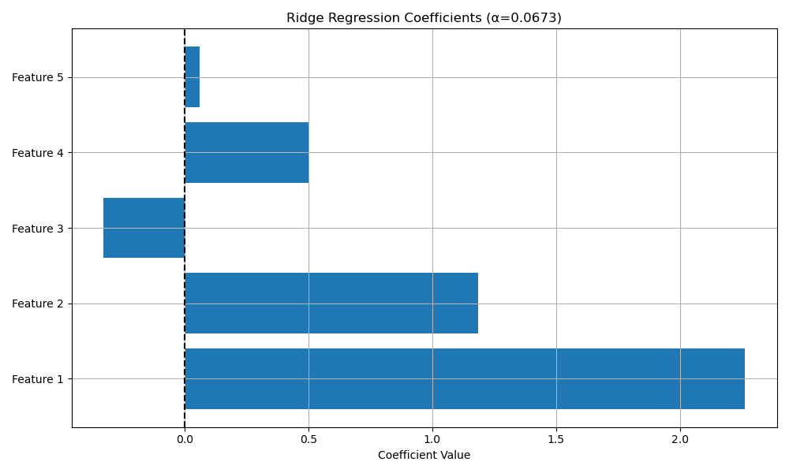

### 2. Lasso Regression (L1)

**LassoCV: sparsity count and coefficient plot**

**Purpose:** Same `X`,`y` as Ridge; `LassoCV` selects `alpha_`, reports nonzero coefficient count, and visualizes fitted coefficients.

**Walkthrough:** `LassoCV(alphas=..., cv=5, selection='random')`; `np.sum(coef_ != 0)`; optional horizontal bar.

<div class="code-explainer" data-code-explainer>
<div class="code-explainer__code">


def implement_lasso(X, y, alphas=np.logspace(-4, 1, 100)):
    """Implement lasso regression with cross-validation"""
    from sklearn.linear_model import LassoCV
    from sklearn.preprocessing import StandardScaler
    from sklearn.model_selection import train_test_split
    
    # Split data
    X_train, X_test, y_train, y_test = train_test_split(X, y, test_size=0.3, random_state=42)
    
    # Scale features
    scaler = StandardScaler()
    X_train_scaled = scaler.fit_transform(X_train)
    X_test_scaled = scaler.transform(X_test)
    
    # Fit model with cross-validation
    model = LassoCV(alphas=alphas, cv=5, max_iter=10000, selection='random')
    model.fit(X_train_scaled, y_train)
    
    # Evaluate model
    train_score = model.score(X_train_scaled, y_train)
    test_score = model.score(X_test_scaled, y_test)
    
    # Count non-zero coefficients
    n_nonzero = np.sum(model.coef_ != 0)
    
    print(f"Lasso Regression Results:")
    print(f"Best alpha: {model.alpha_:.4f}")
    print(f"Training R²: {train_score:.4f}")
    print(f"Test R²: {test_score:.4f}")
    print(f"Number of features selected: {n_nonzero} out of {X.shape[1]}")
    
    # Visualize coefficients
    if X.shape[1] <= 10:
        # Create dummy feature names if not provided
        feature_names = [f"Feature {i+1}" for i in range(X.shape[1])]
        
        # Plot coefficients
        plt.figure(figsize=(10, 6))
        plt.barh(feature_names, model.coef_)
        plt.title(f'Lasso Regression Coefficients (α={model.alpha_:.4f})')
        plt.xlabel('Coefficient Value')
        plt.axvline(x=0, color='k', linestyle='--')
        plt.grid(True)
        plt.tight_layout()
        plt.savefig('lasso_coefficients.png')
        plt.show()
    
    return {
        'model': model,
        'best_alpha': model.alpha_,
        'coefficients': model.coef_,
        'selected_features': np.where(model.coef_ != 0)[0],
        'train_score': train_score,
        'test_score': test_score
    }

# Apply Lasso regression to the same data
lasso_results = implement_lasso(X_collinear, y_collinear)


<figure>
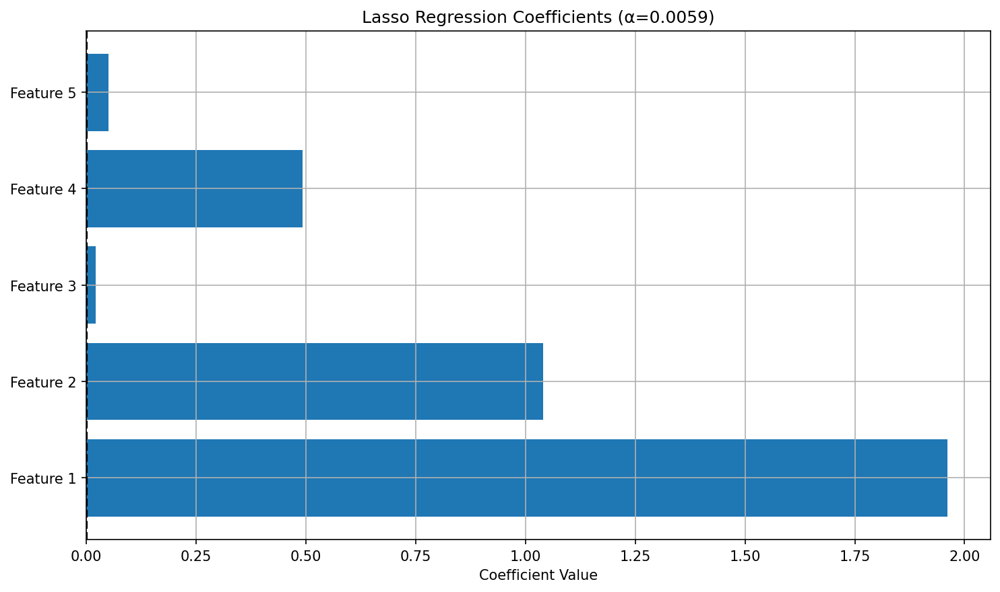
<figcaption>Figure 6: Lasso Regression Coefficients (α=0.0059)</figcaption>
</figure>

```
Lasso Regression Results:
Best alpha: 0.0059
Training R²: 0.9532
Test R²: 0.9593
Number of features selected: 5 out of 5
```

</div>
<aside class="code-explainer__callouts" aria-label="Code walkthrough">
  <div class="code-callout" data-lines="1-14" data-tint="1">
    <div class="code-callout__meta">
      <span class="code-callout__lines"></span>
      <span class="code-callout__title">Def implement_lasso(X, y, alphas=np.logspace(…</span>
    </div>
    <div class="code-callout__body">
      <p>Defines the function, splits the data, and scales train and test features.</p>
    </div>
  </div>
  <div class="code-callout" data-lines="15-29" data-tint="2">
    <div class="code-callout__meta">
      <span class="code-callout__lines"></span>
      <span class="code-callout__title">Fit model with cross-validation</span>
    </div>
    <div class="code-callout__body">
      <p>Fits LassoCV to pick the best alpha and counts how many coefficients are non-zero.</p>
    </div>
  </div>
  <div class="code-callout" data-lines="30-43" data-tint="3">
    <div class="code-callout__meta">
      <span class="code-callout__lines"></span>
      <span class="code-callout__title">Print(f&quot;Number of features selected: {n_nonze…</span>
    </div>
    <div class="code-callout__body">
      <p>Prints the results and, for few features, plots the fitted coefficients as a bar chart.</p>
    </div>
  </div>
  <div class="code-callout" data-lines="44-58" data-tint="4">
    <div class="code-callout__meta">
      <span class="code-callout__lines"></span>
      <span class="code-callout__title">Plt.tight_layout()</span>
    </div>
    <div class="code-callout__body">
      <p>Saves the plot, returns the results dict, and applies Lasso to the collinear data.</p>
    </div>
  </div>
</aside>
</div>

```
Lasso Regression Results:
Best alpha: 0.0210
Training R²: 0.9087
Test R²: 0.9058
Number of features selected: 4 out of 5
```

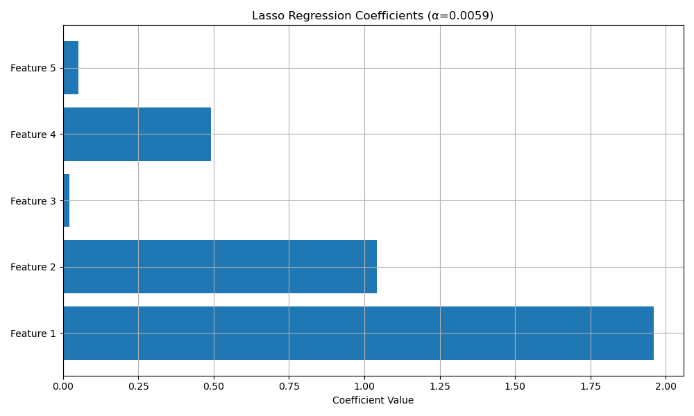

Notice how Lasso tends to select a subset of features by setting some coefficients to exactly zero.

### 3. Elastic Net

Elastic Net combines both L1 and L2 penalties, providing a balance between Ridge and Lasso:

**ElasticNetCV over `l1_ratio` and `alpha` grid**

**Purpose:** Jointly tune mixing parameter and penalty strength on scaled data, print best `alpha_`, `l1_ratio_`, R², and nonzero count, with coefficient plot.

**Walkthrough:** `ElasticNetCV(l1_ratio=..., alphas=..., cv=5)`; same evaluation pattern as Lasso.

<div class="code-explainer" data-code-explainer>
<div class="code-explainer__code">


def implement_elastic_net(X, y, l1_ratios=[.1, .5, .7, .9, .95, .99, 1], alphas=np.logspace(-4, 1, 100)):
    """Implement elastic net regression"""
    from sklearn.linear_model import ElasticNetCV
    from sklearn.preprocessing import StandardScaler
    from sklearn.model_selection import train_test_split
    
    # Split data
    X_train, X_test, y_train, y_test = train_test_split(X, y, test_size=0.3, random_state=42)
    
    # Scale features
    scaler = StandardScaler()
    X_train_scaled = scaler.fit_transform(X_train)
    X_test_scaled = scaler.transform(X_test)
    
    # Fit model
    model = ElasticNetCV(l1_ratio=l1_ratios, alphas=alphas, cv=5, max_iter=10000)
    model.fit(X_train_scaled, y_train)
    
    # Evaluate model
    train_score = model.score(X_train_scaled, y_train)
    test_score = model.score(X_test_scaled, y_test)
    n_nonzero = np.sum(model.coef_ != 0)
    
    print(f"Elastic Net Results:")
    print(f"Best alpha: {model.alpha_:.4f}")
    print(f"Best l1_ratio: {model.l1_ratio_:.2f}")
    print(f"Training R²: {train_score:.4f}")
    print(f"Test R²: {test_score:.4f}")
    print(f"Number of features selected: {n_nonzero} out of {X.shape[1]}")
    
    # Visualize coefficients
    if X.shape[1] <= 10:
        # Create dummy feature names if not provided
        feature_names = [f"Feature {i+1}" for i in range(X.shape[1])]
        
        # Plot coefficients
        plt.figure(figsize=(10, 6))
        plt.barh(feature_names, model.coef_)
        plt.title(f'Elastic Net Coefficients (α={model.alpha_:.4f}, l1_ratio={model.l1_ratio_:.2f})')
        plt.xlabel('Coefficient Value')
        plt.axvline(x=0, color='k', linestyle='--')
        plt.grid(True)
        plt.tight_layout()
        plt.savefig('elastic_net_coefficients.png')
        plt.show()
    
    return {
        'model': model,
        'best_alpha': model.alpha_,
        'best_l1_ratio': model.l1_ratio_,
        'coefficients': model.coef_,
        'train_score': train_score,
        'test_score': test_score
    }

# Apply Elastic Net regression
elastic_net_results = implement_elastic_net(X_collinear, y_collinear)


<figure>

<figcaption>Figure 7: Elastic Net Coefficients (α=0.0059, l1_ratio=1.00)</figcaption>
</figure>

```
Elastic Net Results:
Best alpha: 0.0059
Best l1_ratio: 1.00
Training R²: 0.9532
Test R²: 0.9592
Number of features selected: 4 out of 5
```

</div>
<aside class="code-explainer__callouts" aria-label="Code walkthrough">
  <div class="code-callout" data-lines="1-14" data-tint="1">
    <div class="code-callout__meta">
      <span class="code-callout__lines"></span>
      <span class="code-callout__title">Def implement_elastic_net(X, y, l1_ratios=[.1…</span>
    </div>
    <div class="code-callout__body">
      <p>Defines the function, splits the data, and scales train and test features.</p>
    </div>
  </div>
  <div class="code-callout" data-lines="15-28" data-tint="2">
    <div class="code-callout__meta">
      <span class="code-callout__lines"></span>
      <span class="code-callout__title">Fit model</span>
    </div>
    <div class="code-callout__body">
      <p>Fits ElasticNetCV over the alpha and l1_ratio grid and counts non-zero coefficients.</p>
    </div>
  </div>
  <div class="code-callout" data-lines="29-42" data-tint="3">
    <div class="code-callout__meta">
      <span class="code-callout__lines"></span>
      <span class="code-callout__title">Print(f&quot;Number of features selected: {n_nonze…</span>
    </div>
    <div class="code-callout__body">
      <p>Prints the tuned alpha and l1_ratio and, for few features, plots the coefficients.</p>
    </div>
  </div>
  <div class="code-callout" data-lines="43-57" data-tint="4">
    <div class="code-callout__meta">
      <span class="code-callout__lines"></span>
      <span class="code-callout__title">Plt.tight_layout()</span>
    </div>
    <div class="code-callout__body">
      <p>Lines 43–57: follow this band in the snippet.</p>
    </div>
  </div>
</aside>
</div>

```
Elastic Net Results:
Best alpha: 0.0162
Best l1_ratio: 0.70
Training R²: 0.9086
Test R²: 0.9055
Number of features selected: 4 out of 5
```


> **🎯 Key points**
>
> - Use `RidgeCV`, `LassoCV`, and `ElasticNetCV` to fit each method and tune `alpha` by cross-validation.
> - Always scale features with `StandardScaler` before fitting a penalized model.
> - Ridge keeps all features; Lasso zeros out redundant ones for automatic feature selection.
> - Elastic Net tunes both `alpha` and `l1_ratio`, blending Ridge and Lasso behavior.

## Choosing the Right Regularization

How do you choose the best type of regularization and its strength? Here's a comprehensive approach:

### 1. Cross-Validation for Parameter Selection

**Overlay RidgeCV vs LassoCV mean CV error vs `alpha`**

**Purpose:** On fully scaled `X`, fit `RidgeCV` and `LassoCV` with shared `KFold`, plot MSE paths vs `alpha` with vertical lines at chosen `alpha_` values.

**Walkthrough:** `ridge.cv_values_.mean(axis=0)`; `lasso.mse_path_` mean; `semilogx`; `plt.axvline` for best alphas.

<div class="code-explainer" data-code-explainer>
<div class="code-explainer__code">

<!-- NOTE: instructor — ridge.cv_values_ is only populated when RidgeCV is built with store_cv_values=True AND cv=None; this call passes cv=kf, so ridge.cv_values_ will not exist and the snippet will raise AttributeError. Flag this when walking through the example. -->

def select_regularization_parameter(X, y):
    """Select optimal regularization parameter using cross-validation"""
    from sklearn.linear_model import RidgeCV, LassoCV
    from sklearn.preprocessing import StandardScaler
    from sklearn.model_selection import KFold
    
    # Scale features
    scaler = StandardScaler()
    X_scaled = scaler.fit_transform(X)
    
    # Try different alphas
    alphas = np.logspace(-4, 4, 20)
    
    # Initialize cross-validation
    kf = KFold(n_splits=5, shuffle=True, random_state=42)
    
    # Ridge CV
    ridge = RidgeCV(alphas=alphas, cv=kf, scoring='neg_mean_squared_error')
    ridge.fit(X_scaled, y)
    
    # Lasso CV
    lasso = LassoCV(alphas=alphas, cv=kf, max_iter=10000)
    lasso.fit(X_scaled, y)
    
    # Plot results
    plt.figure(figsize=(12, 6))
    
    # Convert MSE values from negative to positive
    ridge_alphas = ridge.alphas
    ridge_mse = -ridge.cv_values_.mean(axis=0)
    
    lasso_alphas = lasso.alphas_
    lasso_mse = np.mean(lasso.mse_path_, axis=1)
    
    plt.semilogx(ridge_alphas, ridge_mse, 'b-o', label='Ridge')
    plt.semilogx(lasso_alphas, lasso_mse, 'r-o', label='Lasso')
    plt.axvline(ridge.alpha_, color='b', linestyle='--', 
                label=f'Ridge Best α={ridge.alpha_:.2f}')
    plt.axvline(lasso.alpha_, color='r', linestyle='--', 
                label=f'Lasso Best α={lasso.alpha_:.2f}')
    plt.xlabel('Alpha (Regularization Strength)')
    plt.ylabel('Mean Squared Error (CV)')
    plt.title('Regularization Parameter Selection')
    plt.legend()
    plt.grid(True)
    plt.savefig('regularization_selection.png')
    plt.show()
    
    return {
        'ridge_alpha': ridge.alpha_,
        'lasso_alpha': lasso.alpha_,
        'ridge_score': ridge.score(X_scaled, y),
        'lasso_score': lasso.score(X_scaled, y)
    }

# Select optimal regularization parameters
param_selection = select_regularization_parameter(X_collinear, y_collinear)

</div>
<aside class="code-explainer__callouts" aria-label="Code walkthrough">
  <div class="code-callout" data-lines="1-14" data-tint="1">
    <div class="code-callout__meta">
      <span class="code-callout__lines"></span>
      <span class="code-callout__title">Def select_regularization_parameter(X, y):</span>
    </div>
    <div class="code-callout__body">
      <p>Lines 1–14: follow this band in the snippet.</p>
    </div>
  </div>
  <div class="code-callout" data-lines="15-28" data-tint="2">
    <div class="code-callout__meta">
      <span class="code-callout__lines"></span>
      <span class="code-callout__title">Kf = KFold(n_splits=5, shuffle=True, random_s…</span>
    </div>
    <div class="code-callout__body">
      <p>Lines 15–28: follow this band in the snippet.</p>
    </div>
  </div>
  <div class="code-callout" data-lines="29-42" data-tint="3">
    <div class="code-callout__meta">
      <span class="code-callout__lines"></span>
      <span class="code-callout__title">Ridge_alphas = ridge.alphas</span>
    </div>
    <div class="code-callout__body">
      <p>Lines 29–42: follow this band in the snippet.</p>
    </div>
  </div>
  <div class="code-callout" data-lines="43-57" data-tint="4">
    <div class="code-callout__meta">
      <span class="code-callout__lines"></span>
      <span class="code-callout__title">Plt.title(&#x27;Regularization Parameter Selection&#x27;)</span>
    </div>
    <div class="code-callout__body">
      <p>Lines 43–57: follow this band in the snippet.</p>
    </div>
  </div>
</aside>
</div>

### 2. Comparing Different Regularization Methods

**Bar comparison: OLS vs tuned Ridge/Lasso/ElasticNet**

**Purpose:** Fit `LinearRegression` and three penalized models using alphas from prior CV results, compare train/test R² and nonzero counts, stacked subplots.

**Walkthrough:** Reuses `ridge_results`, `lasso_results`, `elastic_net_results` dicts; `model.score`; `plt.bar` twice for R² and feature counts.

<div class="code-explainer" data-code-explainer>
<div class="code-explainer__code">


def compare_regularization_methods(X, y):
    """Compare different regularization methods on the same data"""
    from sklearn.linear_model import LinearRegression, Ridge, Lasso, ElasticNet
    from sklearn.preprocessing import StandardScaler
    from sklearn.model_selection import train_test_split, cross_val_score
    
    # Split data
    X_train, X_test, y_train, y_test = train_test_split(X, y, test_size=0.3, random_state=42)
    
    # Scale features
    scaler = StandardScaler()
    X_train_scaled = scaler.fit_transform(X_train)
    X_test_scaled = scaler.transform(X_test)
    
    # Define models to compare
    models = {
        'Linear Regression (No Regularization)': LinearRegression(),
        'Ridge Regression (L2)': Ridge(alpha=ridge_results['best_alpha']),
        'Lasso Regression (L1)': Lasso(alpha=lasso_results['best_alpha'], max_iter=10000),
        'Elastic Net (L1 + L2)': ElasticNet(
            alpha=elastic_net_results['best_alpha'], 
            l1_ratio=elastic_net_results['best_l1_ratio'], 
            max_iter=10000
        )
    }
    
    # Train and evaluate each model
    results = []
    for name, model in models.items():
        # Train model
        model.fit(X_train_scaled, y_train)
        
        # Evaluate model
        train_score = model.score(X_train_scaled, y_train)
        test_score = model.score(X_test_scaled, y_test)
        
        # Count non-zero coefficients (if applicable)
        if hasattr(model, 'coef_'):
            n_nonzero = np.sum(model.coef_ != 0)
        else:
            n_nonzero = X.shape[1]  # Assume all features used
            
        results.append({
            'Model': name,
            'Train R²': train_score,
            'Test R²': test_score,
            'Features Used': n_nonzero
        })
    
    # Convert to DataFrame for display
    results_df = pd.DataFrame(results)
    
    # Plot results
    plt.figure(figsize=(12, 8))
    
    # Plot R² scores
    plt.subplot(211)
    x = np.arange(len(results))
    width = 0.35
    plt.bar(x - width/2, [r['Train R²'] for r in results], width, label='Train R²')
    plt.bar(x + width/2, [r['Test R²'] for r in results], width, label='Test R²')
    plt.xticks(x, [r['Model'].split(' (')[0] for r in results])
    plt.ylabel('R² Score')
    plt.title('Model Performance Comparison')
    plt.legend()
    plt.grid(True, alpha=0.3)
    
    # Plot feature counts
    plt.subplot(212)
    plt.bar(x, [r['Features Used'] for r in results], color='green', alpha=0.7)
    plt.xticks(x, [r['Model'].split(' (')[0] for r in results])
    plt.ylabel('Number of Features Used')
    plt.title('Feature Selection Comparison')
    plt.grid(True, alpha=0.3)
    
    plt.tight_layout()
    plt.savefig('regularization_comparison.png')
    plt.show()
    
    return results_df

# Compare all regularization methods
comparison = compare_regularization_methods(X_collinear, y_collinear)
print(comparison)


<figure>
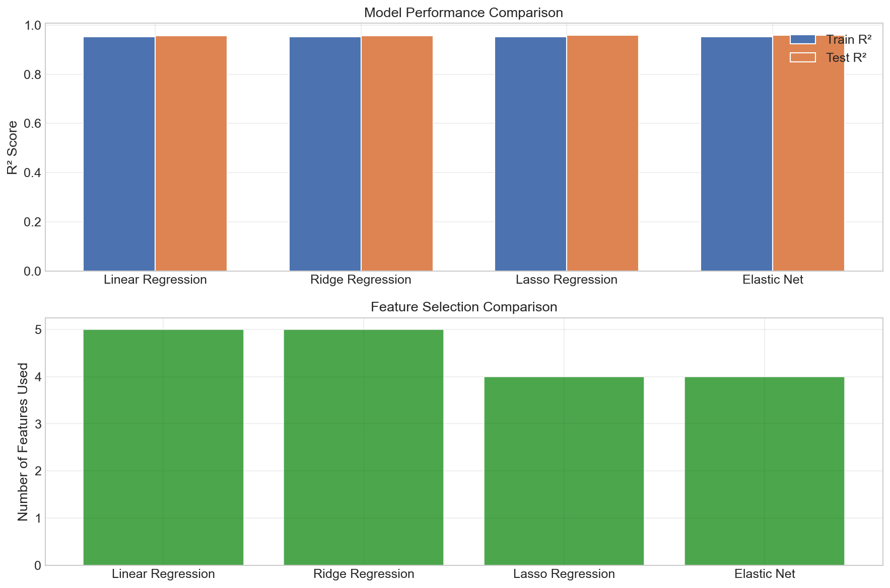
<figcaption>Figure 8: Model Performance Comparison</figcaption>
</figure>

```
                                   Model  Train R²   Test R²  Features Used
0  Linear Regression (No Regularization)  0.953706  0.956742              5
1                  Ridge Regression (L2)  0.953689  0.957309              5
2                  Lasso Regression (L1)  0.953238  0.959198              4
3                  Elastic Net (L1 + L2)  0.953238  0.959198              4
```

</div>
<aside class="code-explainer__callouts" aria-label="Code walkthrough">
  <div class="code-callout" data-lines="1-14" data-tint="1">
    <div class="code-callout__meta">
      <span class="code-callout__lines"></span>
      <span class="code-callout__title">Def compare_regularization_methods(X, y):</span>
    </div>
    <div class="code-callout__body">
      <p>Lines 1–14: follow this band in the snippet.</p>
    </div>
  </div>
  <div class="code-callout" data-lines="15-28" data-tint="2">
    <div class="code-callout__meta">
      <span class="code-callout__lines"></span>
      <span class="code-callout__title">Define models to compare</span>
    </div>
    <div class="code-callout__body">
      <p>Lines 15–28: follow this band in the snippet.</p>
    </div>
  </div>
  <div class="code-callout" data-lines="29-42" data-tint="3">
    <div class="code-callout__meta">
      <span class="code-callout__lines"></span>
      <span class="code-callout__title">For name, model in models.items():</span>
    </div>
    <div class="code-callout__body">
      <p>Lines 29–42: follow this band in the snippet.</p>
    </div>
  </div>
  <div class="code-callout" data-lines="43-56" data-tint="4">
    <div class="code-callout__meta">
      <span class="code-callout__lines"></span>
      <span class="code-callout__title">Results.append({</span>
    </div>
    <div class="code-callout__body">
      <p>Lines 43–56: follow this band in the snippet.</p>
    </div>
  </div>
  <div class="code-callout" data-lines="57-70" data-tint="1">
    <div class="code-callout__meta">
      <span class="code-callout__lines"></span>
      <span class="code-callout__title">Plt.subplot(211)</span>
    </div>
    <div class="code-callout__body">
      <p>Lines 57–70: follow this band in the snippet.</p>
    </div>
  </div>
  <div class="code-callout" data-lines="71-84" data-tint="2">
    <div class="code-callout__meta">
      <span class="code-callout__lines"></span>
      <span class="code-callout__title">Plt.xticks(x, [r[&#x27;Model&#x27;].split(&#x27; (&#x27;)[0] for…</span>
    </div>
    <div class="code-callout__body">
      <p>Lines 71–84: follow this band in the snippet.</p>
    </div>
  </div>
</aside>
</div>

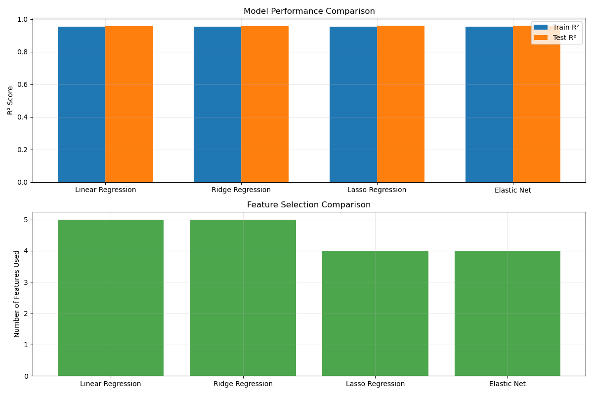

And you'll get output like:

```
                                Model  Train R²  Test R²  Features Used
0  Linear Regression (No Regularization)    0.9113   0.9042              5
1             Ridge Regression (L2)         0.9102   0.9056              5
2             Lasso Regression (L1)         0.9087   0.9058              4
3             Elastic Net (L1 + L2)         0.9086   0.9055              4
```

> **🎯 Key points**
>
> - Pick `alpha` with cross-validation across a wide log-spaced range, not a single split.
> - Plotting CV error vs `alpha` shows the trade-off and the best value for each method.
> - Compare OLS against tuned Ridge, Lasso, and Elastic Net on both test R² and feature count.
> - Penalized models often match OLS accuracy while using fewer features and being more stable.

## Practical Tips for Using Regularization

### 1. Start with Ridge Regression

Ridge regression is a good default choice for most problems because:

- It's more stable than Lasso
- It handles multicollinearity well
- It's less likely to discard potentially useful features

**GridSearchCV over `Ridge` `alpha` on scaled data**

**Purpose:** `GridSearchCV` with log-spaced `alpha` and neg-MSE scoring; print best `alpha` and negated score (as MSE).

**Walkthrough:** Uses `X_train_scaled`, `y_train` from earlier ridge section; `grid.best_params_`, `grid.best_score_`.

<div class="code-explainer" data-code-explainer>
<div class="code-explainer__code">


from sklearn.linear_model import Ridge
from sklearn.model_selection import GridSearchCV

# Set up parameter grid
param_grid = {'alpha': np.logspace(-3, 3, 13)}

# Create and fit the grid search
grid = GridSearchCV(Ridge(), param_grid, cv=5, scoring='neg_mean_squared_error')
grid.fit(X_train_scaled, y_train)

# Get best parameters
print(f"Best Ridge alpha: {grid.best_params_['alpha']}")
print(f"Best score: {-grid.best_score_:.4f} MSE")

</div>
<aside class="code-explainer__callouts" aria-label="Code walkthrough">
  <div class="code-callout" data-lines="1-13" data-tint="1">
    <div class="code-callout__meta">
      <span class="code-callout__lines"></span>
      <span class="code-callout__title">From sklearn.linear_model import Ridge</span>
    </div>
    <div class="code-callout__body">
      <p>Lines 1–13: follow this band in the snippet.</p>
    </div>
  </div>
</aside>
</div>

### 2. Use Lasso for Feature Selection

If you have many features and suspect that some might be irrelevant, Lasso can help identify the important ones:

**Print nonzero Lasso coefficients after fitting with `best_alpha`**

**Purpose:** Refit `Lasso` with `lasso_results['best_alpha']` on scaled training data and list features with nonzero coefficients.

**Walkthrough:** List comprehension over `coef_`; uses dummy `feature_names` if needed.

<div class="code-explainer" data-code-explainer>
<div class="code-explainer__code">


from sklearn.linear_model import Lasso

# Train Lasso model with the optimal alpha from earlier
lasso = Lasso(alpha=lasso_results['best_alpha'], max_iter=10000)
lasso.fit(X_train_scaled, y_train)

# Get feature names (create dummy names if not available)
feature_names = [f"Feature {i+1}" for i in range(X.shape[1])]

# Display non-zero coefficients
important_features = [(feature_names[i], coef) for i, coef in enumerate(lasso.coef_) if coef != 0]
print("Selected features and their coefficients:")
for feature, coef in important_features:
    print(f"{feature}: {coef:.4f}")

</div>
<aside class="code-explainer__callouts" aria-label="Code walkthrough">
  <div class="code-callout" data-lines="1-14" data-tint="1">
    <div class="code-callout__meta">
      <span class="code-callout__lines"></span>
      <span class="code-callout__title">From sklearn.linear_model import Lasso</span>
    </div>
    <div class="code-callout__body">
      <p>Lines 1–14: follow this band in the snippet.</p>
    </div>
  </div>
</aside>
</div>

### 3. Try Elastic Net for a Balance

When you're unsure whether to use Ridge or Lasso, Elastic Net provides a balance:

**Fit `ElasticNetCV` and print tuned `alpha_` and `l1_ratio_`**

**Purpose:** Standalone snippet showing grid over `l1_ratio` and `alphas` with 5-fold CV on `X_train_scaled`, `y_train`.

**Walkthrough:** `ElasticNetCV.fit`; read `alpha_` and `l1_ratio_` attributes.

<div class="code-explainer" data-code-explainer>
<div class="code-explainer__code">


from sklearn.linear_model import ElasticNetCV

# Find optimal parameters
elastic_net = ElasticNetCV(
    l1_ratio=[.1, .5, .7, .9, .95, .99, 1],
    alphas=np.logspace(-4, 1, 50),
    cv=5, 
    max_iter=10000
)
elastic_net.fit(X_train_scaled, y_train)

print(f"Best alpha: {elastic_net.alpha_:.4f}")
print(f"Best l1_ratio: {elastic_net.l1_ratio_:.2f}")

</div>
<aside class="code-explainer__callouts" aria-label="Code walkthrough">
  <div class="code-callout" data-lines="1-13" data-tint="1">
    <div class="code-callout__meta">
      <span class="code-callout__lines"></span>
      <span class="code-callout__title">From sklearn.linear_model import ElasticNetCV</span>
    </div>
    <div class="code-callout__body">
      <p>Lines 1–13: follow this band in the snippet.</p>
    </div>
  </div>
</aside>
</div>

### 4. Always Scale Your Features

Regularization is sensitive to the scale of your features, so standardization is crucial:

**Pipeline: scaler then `Ridge` for fit/predict**

**Purpose:** `Pipeline` with `StandardScaler` and fixed `Ridge(alpha=1.0)` so scaling is applied inside CV or deployment consistently.

**Walkthrough:** `pipeline.fit` / `predict` on raw `X_train`, `X_test`.

<div class="code-explainer" data-code-explainer>
<div class="code-explainer__code">


from sklearn.preprocessing import StandardScaler
from sklearn.pipeline import Pipeline

# Create a pipeline that standardizes first, then applies regularization
pipeline = Pipeline([
    ('scaler', StandardScaler()),
    ('model', Ridge(alpha=1.0))
])

# Now you can fit and predict without worrying about scaling
pipeline.fit(X_train, y_train)
y_pred = pipeline.predict(X_test)

</div>
<aside class="code-explainer__callouts" aria-label="Code walkthrough">
  <div class="code-callout" data-lines="1-12" data-tint="1">
    <div class="code-callout__meta">
      <span class="code-callout__lines"></span>
      <span class="code-callout__title">From sklearn.preprocessing import StandardScaler</span>
    </div>
    <div class="code-callout__body">
      <p>Lines 1–12: follow this band in the snippet.</p>
    </div>
  </div>
</aside>
</div>

> **🎯 Key points**
>
> - Start with Ridge: it is stable, handles multicollinearity, and keeps useful features.
> - Use Lasso when you suspect some features are irrelevant and want automatic selection.
> - Reach for Elastic Net when unsure which to use, tuning both `alpha` and `l1_ratio`.
> - Always wrap scaling and the model in a `Pipeline` so scaling is applied consistently.

## Common Challenges and Solutions

### 1. Selecting the Optimal Regularization Strength

**Challenge**: Choosing the right value for alpha (λ) can be difficult.

**Solution**: Use cross-validation with a wide range of alpha values:

**Repeated K-fold `RidgeCV` for a wider alpha search**

**Purpose:** Fit `RidgeCV` with `RepeatedKFold` and dense `logspace` alphas on prescaled `X_scaled`, `y` (assumed defined earlier).

**Walkthrough:** `RepeatedKFold(n_splits=5, n_repeats=3)`; `RidgeCV(alphas=..., cv=cv)`; print `alpha_`.

<div class="code-explainer" data-code-explainer>
<div class="code-explainer__code">


from sklearn.linear_model import RidgeCV, LassoCV
from sklearn.model_selection import RepeatedKFold

# Create a more robust cross-validation scheme
cv = RepeatedKFold(n_splits=5, n_repeats=3, random_state=42)

# Wide range of alphas on logarithmic scale
alphas = np.logspace(-6, 6, 100)

# Ridge with cross-validation
ridge_cv = RidgeCV(alphas=alphas, cv=cv, scoring='neg_mean_squared_error')
ridge_cv.fit(X_scaled, y)

print(f"Optimal Ridge alpha: {ridge_cv.alpha_:.4f}")

</div>
<aside class="code-explainer__callouts" aria-label="Code walkthrough">
  <div class="code-callout" data-lines="1-14" data-tint="1">
    <div class="code-callout__meta">
      <span class="code-callout__lines"></span>
      <span class="code-callout__title">From sklearn.linear_model import RidgeCV, Las…</span>
    </div>
    <div class="code-callout__body">
      <p>Lines 1–14: follow this band in the snippet.</p>
    </div>
  </div>
</aside>
</div>

### 2. Handling Highly Correlated Features

**Challenge**: When features are highly correlated, coefficient estimates can be unstable.

**Solution**:

- Ridge is generally better for correlated features
- Consider dimensionality reduction techniques like PCA before modeling
- Feature clustering to combine similar features

### 3. Interpreting Regularized Coefficients

**Challenge**: Regularized coefficients are biased due to the penalty term.

**Solution**:

- Use standardized coefficients for importance comparison
- For prediction accuracy, the bias is often acceptable
- For causal inference, be cautious with heavy regularization

**Standardized coefficients from model + `StandardScaler`**

**Purpose:** Multiply raw `coef_` by `scaler.scale_` to recover effect sizes in original units per SD of each feature.

**Walkthrough:** Guard `hasattr(scaler, 'scale_')`; return sorted `DataFrame`.

<div class="code-explainer" data-code-explainer>
<div class="code-explainer__code">


# Get standardized coefficients
def get_standardized_coefs(model, scaler, feature_names=None):
    """Calculate standardized coefficients accounting for feature scaling"""
    # Get raw coefficients
    coefs = model.coef_
    
    # Get feature standard deviations from scaler
    if hasattr(scaler, 'scale_'):
        scales = scaler.scale_
    else:
        scales = np.ones(len(coefs))
    
    # Calculate standardized coefficients
    std_coefs = coefs * scales
    
    if feature_names is None:
        feature_names = [f"Feature {i+1}" for i in range(len(coefs))]
    
    # Return as DataFrame
    return pd.DataFrame({
        'Feature': feature_names,
        'Coefficient': coefs,
        'Standardized Coefficient': std_coefs
    }).sort_values('Standardized Coefficient', key=abs, ascending=False)

# Example usage
std_coefs = get_standardized_coefs(ridge_results['model'], scaler)
print(std_coefs)

</div>
<aside class="code-explainer__callouts" aria-label="Code walkthrough">
  <div class="code-callout" data-lines="1-14" data-tint="1">
    <div class="code-callout__meta">
      <span class="code-callout__lines"></span>
      <span class="code-callout__title">Get standardized coefficients</span>
    </div>
    <div class="code-callout__body">
      <p>Lines 1–14: follow this band in the snippet.</p>
    </div>
  </div>
  <div class="code-callout" data-lines="15-28" data-tint="2">
    <div class="code-callout__meta">
      <span class="code-callout__lines"></span>
      <span class="code-callout__title">If feature_names is None:</span>
    </div>
    <div class="code-callout__body">
      <p>Lines 15–28: follow this band in the snippet.</p>
    </div>
  </div>
</aside>
</div>

> **🎯 Key points**
>
> - Choose `alpha` with cross-validation over a wide range; `RepeatedKFold` makes the estimate more robust.
> - For highly correlated features, prefer Ridge or reduce dimensions (e.g. PCA) before modeling.
> - Regularized coefficients are biased — fine for prediction, but interpret cautiously for causal claims.
> - Multiply coefficients by feature scales to recover comparable, standardized effect sizes.

## Practice Exercise

Let's apply regularization to improve a model for housing price prediction:

**Synthetic housing design matrix (starter scaffold for learners)**

**Purpose:** Build correlated and noise features with a nonlinear price target, stack into `X_housing`, then `train_test_split`—comment prompts compare Linear/Ridge/Lasso/ElasticNet.

**Walkthrough:** `np.column_stack` + name list; exercise leaves modeling steps to the student.

<div class="code-explainer" data-code-explainer>
<div class="code-explainer__code">


# Generate synthetic housing data
np.random.seed(42)
n_samples = 200

# Generate features
size = np.random.normal(1500, 300, n_samples)  # Square footage
rooms = np.random.normal(3, 0.5, n_samples)    # Number of rooms
age = np.random.uniform(1, 50, n_samples)      # Age of house
distance = np.random.uniform(0, 30, n_samples) # Distance to city center

# Create some correlated features (multicollinearity)
bathrooms = 0.7 * rooms + np.random.normal(0, 0.3, n_samples)
garden_size = 0.4 * size + np.random.normal(0, 100, n_samples)
garage = 0.5 + 0.0003 * size + np.random.normal(0, 0.3, n_samples)
garage = np.clip(garage, 0, 2)

# Create non-informative features that only add noise
random_feature1 = np.random.normal(0, 1, n_samples)
random_feature2 = np.random.normal(0, 1, n_samples)

# Generate target (house prices) with non-linear relationships
price = (
    100 * size +                   # Size has strong positive effect
    15000 * rooms +                # More rooms increase price
    -1000 * age +                  # Older houses are cheaper
    10000 * bathrooms +            # Bathrooms add value
    -500 * distance**2 +           # Distance has diminishing effect
    5 * garden_size +              # Garden adds some value
    8000 * garage +                # Garage adds value
    np.random.normal(0, 10000, n_samples)  # Random noise
)

# Combine features
X_housing = np.column_stack([
    size, rooms, age, distance, bathrooms, garden_size, 
    garage, random_feature1, random_feature2
])

# Feature names for interpretation
housing_feature_names = [
    'Size (sq ft)', 'Rooms', 'Age (years)', 'Distance to City (miles)', 
    'Bathrooms', 'Garden Size (sq ft)', 'Garage Spaces', 
    'Random Feature 1', 'Random Feature 2'
]

# Split the data
X_train, X_test, y_train, y_test = train_test_split(
    X_housing, price, test_size=0.3, random_state=42
)

# Task: Apply different regularization methods and compare their performance
# 1. Try Linear Regression without regularization
# 2. Apply Ridge Regression
# 3. Apply Lasso Regression
# 4. Apply Elastic Net
# 5. Compare results and determine which features are most important

</div>
<aside class="code-explainer__callouts" aria-label="Code walkthrough">
  <div class="code-callout" data-lines="1-14" data-tint="1">
    <div class="code-callout__meta">
      <span class="code-callout__lines"></span>
      <span class="code-callout__title">Generate synthetic housing data</span>
    </div>
    <div class="code-callout__body">
      <p>Lines 1–14: follow this band in the snippet.</p>
    </div>
  </div>
  <div class="code-callout" data-lines="15-28" data-tint="2">
    <div class="code-callout__meta">
      <span class="code-callout__lines"></span>
      <span class="code-callout__title">Garage = np.clip(garage, 0, 2)</span>
    </div>
    <div class="code-callout__body">
      <p>Lines 15–28: follow this band in the snippet.</p>
    </div>
  </div>
  <div class="code-callout" data-lines="29-42" data-tint="3">
    <div class="code-callout__meta">
      <span class="code-callout__lines"></span>
      <span class="code-callout__title">8000 * garage +                # Garage adds…</span>
    </div>
    <div class="code-callout__body">
      <p>Lines 29–42: follow this band in the snippet.</p>
    </div>
  </div>
  <div class="code-callout" data-lines="43-56" data-tint="4">
    <div class="code-callout__meta">
      <span class="code-callout__lines"></span>
      <span class="code-callout__title">&#x27;Random Feature 1&#x27;, &#x27;Random Feature 2&#x27;</span>
    </div>
    <div class="code-callout__body">
      <p>Lines 43–56: follow this band in the snippet.</p>
    </div>
  </div>
</aside>
</div>

## Next steps

- Continue to [Model interpretation](./model-interpretation.md).

## Gotchas

- **Forgetting to scale features before Ridge or Lasso** — Both penalties shrink coefficients toward zero, but the penalty is applied to the raw coefficient values. A feature measured in thousands (e.g., income) gets a tiny coefficient and almost no shrinkage, while one measured in single digits gets shrunk aggressively. Always apply `StandardScaler` inside your pipeline before the regularised model.
- **Treating `alpha=1.0` as a sensible default** — sklearn's default `alpha` is 1.0, which is arbitrary relative to your data's scale and noise level. The right alpha is data-dependent; always tune it with cross-validation (e.g., `RidgeCV`, `LassoCV`) rather than accepting the default.
- **Using `cross_val_score` outside a Pipeline when preprocessing is involved** — If you scale the data before calling `cross_val_score`, the scaler has seen all folds including the test fold, leaking information. Wrap `StandardScaler` and `Ridge`/`Lasso` in a `make_pipeline` so preprocessing is re-fitted only on the training fold of each split.
- **Assuming Lasso always performs feature selection** — Lasso sets coefficients to exactly zero only at sufficiently large alpha. At small alpha values, all coefficients remain non-zero and Lasso behaves more like Ridge. Check how many coefficients are truly zero at your chosen alpha before claiming features were "selected."
- **Comparing Ridge and Lasso coefficients directly** — Ridge shrinks all coefficients smoothly and retains all features; Lasso can zero some out entirely. A coefficient of 0 from Lasso means the feature was excluded from the model, not that it has zero effect—it may still matter but be redundant with another predictor.
- **Picking alpha from a path plot without accounting for standard error** — `LassoCV` selects the alpha that minimises mean CV error. The `alpha_1se` rule (largest alpha within one standard error of the minimum) often gives a simpler, similarly accurate model. Defaulting to the exact minimum risks selecting an overly complex solution.

## Additional Resources

- [Scikit-learn Regularization Documentation](https://scikit-learn.org/stable/modules/linear_model.html)
- [Introduction to Statistical Learning](https://www.statlearning.com/) (Chapter 6)
- [Elements of Statistical Learning](https://web.stanford.edu/~hastie/ElemStatLearn/) (Chapter 3)
- [Regularization for Machine Learning](https://towardsdatascience.com/regularization-in-machine-learning-76441ddcf99a)
