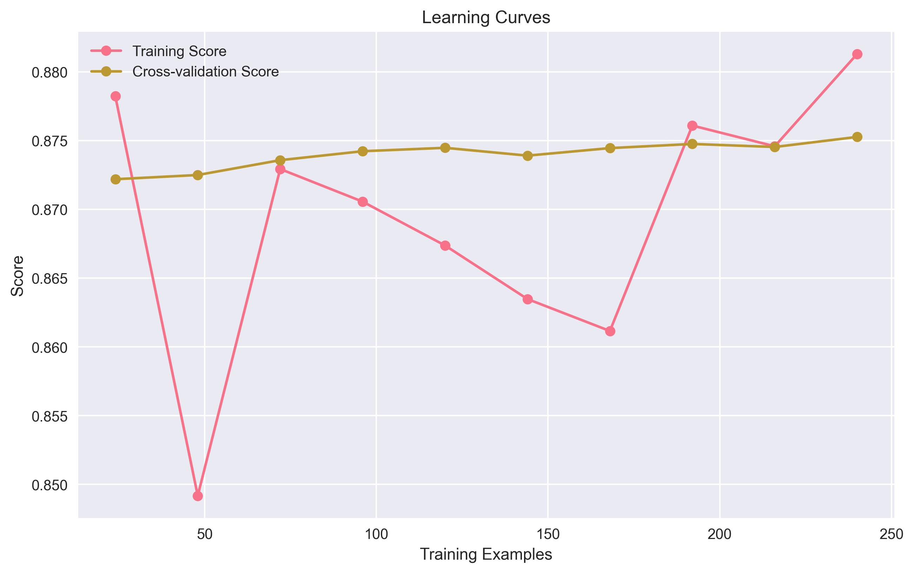

# Understanding Bias and Variance in Machine Learning

Welcome to the world of machine learning! If you're just starting out, you might have heard terms like "bias" and "variance" thrown around. Don't worry - we're going to break these concepts down in a way that makes sense, even if you're completely new to the field.

## Why Should You Care About Bias and Variance?

Imagine you're learning to play darts. There are two main ways you could be doing poorly:

1. You consistently miss the bullseye in the same direction (bias)
2. Your throws are all over the place (variance)

In machine learning, we face similar challenges. Understanding bias and variance helps us create models that make accurate predictions, just like understanding your dart throwing helps you hit the bullseye more often.

## What are Bias and Variance?


### Bias: The Consistent Mistake

Think of bias like a scale that's always off by 2 pounds. No matter what you weigh, it's always wrong by the same amount. In machine learning:

- **High Bias (Underfitting)**
  - Like trying to fit a straight line through a curvy pattern
  - The model is too simple to capture the real patterns
  - Makes similar mistakes across different datasets
  - Example: Using a linear model for non-linear data (like trying to predict house prices using only square footage)

- **Low Bias**
  - Like having a flexible measuring tape that can follow any shape
  - Captures the underlying patterns well
  - Makes predictions closer to the true values
  - Can handle complexity in the data

### Variance: The Inconsistent Performance

Think of variance like a weather forecast that changes dramatically with small changes in input data. In machine learning:

- **High Variance (Overfitting)**
  - Like memorizing answers instead of learning the pattern
  - The model is too complex and captures noise
  - Performs very differently on different datasets
  - Example: Using a very complex model with too few data points (like trying to predict stock prices with only a week of data)

- **Low Variance**
  - Like a reliable weather forecast that doesn't change much with small data changes
  - Model is stable
  - Predictions don't change much with different training data
  - Generalizes well to new data

## The Tradeoff Explained: Finding the Sweet Spot

### Why the Tradeoff Matters

Imagine you're teaching someone to recognize cats in photos:

- If you only show them one type of cat (high bias), they might miss other cat breeds
- If you show them every possible variation (high variance), they might start calling dogs cats too!

The goal is to find the perfect balance - just enough examples to recognize cats reliably, but not so many that they get confused.

### Visual Example

The image above shows three scenarios:

1. **Underfitting (High Bias)**
   - Like trying to draw a perfect circle with only 4 points
   - The model is too simple and misses the pattern
   - Example: Predicting house prices using only square footage, ignoring location and amenities

2. **Good Fit**
   - Like drawing a circle with just enough points to capture its shape
   - The model captures the true pattern well
   - Example: Predicting house prices using relevant features like size, location, and condition

3. **Overfitting (High Variance)**
   - Like trying to draw a circle by connecting every single pixel
   - The model is too complex and fits the noise
   - Example: Predicting house prices using every possible feature, including irrelevant ones like the color of the front door

### Learning Curves: Your Model's Report Card

Learning curves are like progress reports for your model. They show how well your model is learning and whether it's learning the right things.



- **Training Score**: How well the model performs on the data it's seen (like a student's performance on practice tests)
- **Cross-validation Score**: How well the model performs on new data (like a student's performance on the actual exam)

### Interpreting Learning Curves: What Your Model is Telling You

1. **High Bias (Underfitting)**
   - Both training and validation scores are low
   - Like a student who's not studying enough
   - Small gap between training and validation scores
   - Adding more data doesn't help much
   - Solution: Try a more complex model or add more features

2. **High Variance (Overfitting)**
   - High training score, low validation score
   - Like a student who memorizes answers but doesn't understand concepts
   - Large gap between training and validation scores
   - Adding more data helps
   - Solution: Simplify the model or get more training data

3. **Good Fit**
   - Both scores are reasonably high
   - Like a student who understands the material well
   - Small gap between training and validation scores
   - Scores converge as we add more data
   - Solution: You've found a good model! Keep it as is

## Practical Solutions: Fixing Common Problems

### Dealing with High Bias: When Your Model is Too Simple

Think of high bias like trying to predict the weather using only temperature. You're missing important factors like humidity and wind speed. Here's how to fix it:

1. **Increase Model Complexity**

   ```python
   # Let's say we're trying to predict house prices
   # First, let's see what our data looks like
   import pandas as pd
   import matplotlib.pyplot as plt
   
   # Load and visualize the data
   df = pd.read_csv('house_prices.csv')
   plt.scatter(df['sqft_living'], df['price'])
   plt.xlabel('Square Feet')
   plt.ylabel('Price')
   plt.show()
   
   # If the relationship looks curved, we need a more complex model
   from sklearn.preprocessing import PolynomialFeatures
   from sklearn.linear_model import LinearRegression
   
   # Create polynomial features (like x², x³, etc.)
   # This helps capture curved relationships
   poly = PolynomialFeatures(degree=2)  # Try different degrees
   X_poly = poly.fit_transform(X)
   
   # Fit the model
   model = LinearRegression()
   model.fit(X_poly, y)
   
   # Visualize the results
   plt.scatter(X, y)
   plt.plot(X, model.predict(X_poly), color='red')
   plt.show()
   ```

2. **Add More Features**

   ```python
   # Let's add some meaningful combinations of features
   def add_interactions(df):
       # Size per room might be important
       df['size_rooms'] = df['sqft_living'] / df['bedrooms']
       
       # Age and condition together might matter
       df['age_condition'] = df['age'] * df['condition']
       
       # Location might be important
       df['distance_to_city'] = calculate_distance(df['latitude'], df['longitude'])
       
       return df
   
   # Apply the transformations
   df = add_interactions(df)
   ```

3. **Reduce Regularization**

   ```python
   # Regularization is like putting training wheels on your model
   # Sometimes we need to take them off
   from sklearn.linear_model import Ridge
   
   # Try different levels of regularization
   alphas = [0.1, 1.0, 10.0]
   for alpha in alphas:
       model = Ridge(alpha=alpha)
       model.fit(X_train, y_train)
       print(f"Alpha={alpha}, Score={model.score(X_val, y_val)}")
   ```

### Dealing with High Variance: When Your Model is Too Complex

Think of high variance like a student who memorizes every detail of their notes but can't apply the concepts to new problems. Here's how to fix it:

1. **Collect More Data**

   - More training examples help the model learn the true pattern
   - Like showing more examples of cats to help someone learn what makes a cat a cat

2. **Reduce Model Complexity**

   ```python
   # Let's say we're using a random forest that's overfitting
   from sklearn.ensemble import RandomForestRegressor
   
   # Start with a simpler model
   model = RandomForestRegressor(
       n_estimators=100,    # Fewer trees
       max_depth=5,         # Shorter trees
       min_samples_leaf=5   # More samples per leaf
   )
   
   # Compare with the complex model
   complex_model = RandomForestRegressor(
       n_estimators=500,
       max_depth=None,
       min_samples_leaf=1
   )
   
   # Train both models
   model.fit(X_train, y_train)
   complex_model.fit(X_train, y_train)
   
   # Compare their performance
   print(f"Simple model score: {model.score(X_val, y_val)}")
   print(f"Complex model score: {complex_model.score(X_val, y_val)}")
   ```

3. **Add Regularization**

   ```python
   # Regularization helps prevent overfitting
   from sklearn.linear_model import Lasso
   
   # L1 regularization (Lasso) can help by setting some coefficients to zero
   model = Lasso(alpha=1.0)
   model.fit(X_train, y_train)
   
   # See which features were kept
   important_features = [col for col, coef in zip(X.columns, model.coef_) if coef != 0]
   print("Important features:", important_features)
   ```

4. **Feature Selection**

   ```python
   # Sometimes less is more
   from sklearn.feature_selection import SelectKBest
   
   # Select the top k most important features
   selector = SelectKBest(k=10)
   X_selected = selector.fit_transform(X, y)
   
   # See which features were selected
   selected_features = [X.columns[i] for i in selector.get_support(indices=True)]
   print("Selected features:", selected_features)
   ```

## Best Practices for Model Tuning: A Step-by-Step Guide

Think of model tuning like tuning a guitar - you need to adjust each string (parameter) carefully to get the perfect sound. Here's how to do it systematically:

### 1. Cross-Validation: Testing Your Model's True Performance

Cross-validation is like taking multiple practice tests before the real exam. It helps ensure your model's performance is reliable.

```python
from sklearn.model_selection import cross_val_score
import numpy as np

def evaluate_model(model, X, y, cv=5):
    """
    Evaluate a model using cross-validation
    This is like taking multiple practice tests to ensure consistent performance
    """
    # Get scores from cross-validation
    scores = cross_val_score(model, X, y, cv=cv)
    
    # Print the results in a readable format
    print(f"Mean Score: {scores.mean():.3f} (+/- {scores.std() * 2:.3f})")
    print(f"Individual scores: {scores}")
    
    # Visualize the scores
    plt.figure(figsize=(10, 4))
    plt.bar(range(1, cv+1), scores)
    plt.axhline(y=scores.mean(), color='r', linestyle='-')
    plt.title('Cross-Validation Scores')
    plt.xlabel('Fold')
    plt.ylabel('Score')
    plt.show()
    
    return scores

# Example usage
scores = evaluate_model(model, X, y)
```

### 2. Grid Search: Finding the Best Parameters

Grid search is like trying different combinations of ingredients to find the perfect recipe. It systematically tries different parameter combinations to find the best one.

```python
from sklearn.model_selection import GridSearchCV
from sklearn.ensemble import RandomForestRegressor

# Define the parameter grid
# Think of this as creating a recipe book of different combinations
param_grid = {
    'n_estimators': [100, 200, 300],  # Number of trees
    'max_depth': [5, 10, None],       # How deep each tree can grow
    'min_samples_split': [2, 5, 10]   # Minimum samples needed to split a node
}

# Create the grid search
# This is like having a chef try all the recipes
grid_search = GridSearchCV(
    RandomForestRegressor(),
    param_grid,
    cv=5,  # Use 5-fold cross-validation
    scoring='neg_mean_squared_error',  # We want to minimize error
    n_jobs=-1  # Use all available CPU cores
)

# Fit the grid search
print("Starting grid search...")
grid_search.fit(X_train, y_train)

# Print the results
print("\nBest parameters:", grid_search.best_params_)
print("Best score:", -grid_search.best_score_)  # Convert back to positive MSE

# Visualize the results
results = pd.DataFrame(grid_search.cv_results_)
plt.figure(figsize=(12, 6))
sns.heatmap(results.pivot_table(index='param_max_depth',
                              columns='param_n_estimators',
                              values='mean_test_score'),
           annot=True, fmt='.3f')
plt.title('Grid Search Results')
plt.show()
```

### 3. Validation Curves: Understanding Your Model's Behavior

Validation curves help you understand how your model behaves as you change a single parameter. It's like testing how a car performs at different speeds.

```python
from sklearn.model_selection import validation_curve
import matplotlib.pyplot as plt
import seaborn as sns

def plot_validation_curve(model, X, y, param_name, param_range):
    """
    Plot how model performance changes with a single parameter
    This helps you understand the bias-variance tradeoff for that parameter
    """
    # Get training and validation scores
    train_scores, val_scores = validation_curve(
        model, X, y,
        param_name=param_name,
        param_range=param_range,
        cv=5
    )
    
    # Calculate mean and standard deviation
    train_mean = np.mean(train_scores, axis=1)
    train_std = np.std(train_scores, axis=1)
    val_mean = np.mean(val_scores, axis=1)
    val_std = np.std(val_scores, axis=1)
    
    # Plot the results
    plt.figure(figsize=(10, 6))
    plt.plot(param_range, train_mean, 'o-', color='blue', label='Training score')
    plt.plot(param_range, val_mean, 'o-', color='red', label='Cross-validation score')
    
    # Add error bands
    plt.fill_between(param_range, train_mean - train_std, train_mean + train_std, alpha=0.1, color='blue')
    plt.fill_between(param_range, val_mean - val_std, val_mean + val_std, alpha=0.1, color='red')
    
    plt.xlabel(param_name)
    plt.ylabel('Score')
    plt.legend()
    plt.title(f'Validation Curve for {param_name}')
    plt.grid(True)
    plt.show()

# Example usage
plot_validation_curve(
    RandomForestRegressor(),
    X, y,
    param_name='max_depth',
    param_range=[1, 2, 3, 4, 5, 6, 7, 8, 9, 10]
)
```

## Common Pitfalls to Avoid

1. **Not Splitting Data Properly**
   - Always use separate training, validation, and test sets
   - Use stratification for imbalanced datasets
   - Example: If you're predicting rare events, make sure your validation set has a similar proportion of rare events

2. **Overfitting to the Validation Set**
   - Don't tune hyperparameters based on test set performance
   - Use cross-validation for model selection
   - Example: If you keep trying different models until you get a good score on the validation set, you're likely overfitting to that set

3. **Ignoring Domain Knowledge**
   - Balance statistical metrics with business requirements
   - Consider model interpretability needs
   - Example: A complex model might have slightly better accuracy, but if stakeholders can't understand it, they won't trust it

## Next Steps

1. **Practice with Real Data**
   - Try these techniques on a dataset you're familiar with
   - Start with simple models and gradually increase complexity
   - Example: Use the Boston Housing dataset to practice model tuning

2. **Experiment with Different Models**
   - Try different algorithms to see how they handle bias and variance
   - Compare linear models, tree-based models, and neural networks
   - Example: Compare a linear regression with a random forest on the same data

3. **Learn from Mistakes**
   - Keep track of what works and what doesn't
   - Document your experiments and results
   - Example: Create a notebook documenting your model tuning process

4. **Join the Community**
   - Participate in Kaggle competitions
   - Join machine learning forums and groups
   - Example: Try solving a Kaggle competition using these techniques

Remember: Finding the right balance between bias and variance is an iterative process. Don't be afraid to experiment and learn from the results!

## Additional Resources

1. **Books**
   - "Introduction to Statistical Learning" by Gareth James et al.
   - "Hands-On Machine Learning with Scikit-Learn and TensorFlow" by Aurélien Géron

2. **Online Courses**
   - Coursera's Machine Learning by Andrew Ng
   - Fast.ai's Practical Deep Learning for Coders

3. **Practice Datasets**
   - UCI Machine Learning Repository
   - Kaggle Datasets
   - scikit-learn's built-in datasets

4. **Tools and Libraries**
   - scikit-learn's model selection module
   - Yellowbrick for visualization
   - Optuna for hyperparameter optimization

Happy modeling! 🚀
