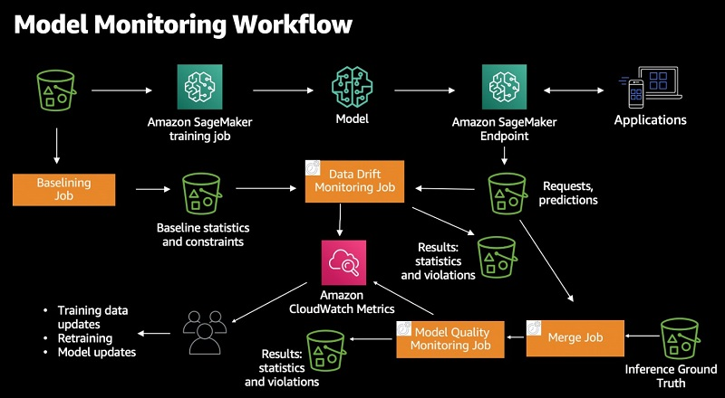

# Machine Learning in Production

**After this lesson:** you can sketch how a model gets from a notebook into a running system, name the pieces involved, and explain why each one exists — without needing to deploy anything yourself yet.

## Overview

So far every model has lived in a notebook: load data, `fit`, check a score. That is where ML *learning* happens, but it is not where ML *value* happens. A production system has to feed the model fresh data, return predictions to real users in time, and notice when the model quietly stops working. This lesson is the map of everything around the `fit()` call. The hands-on tooling (web services, Docker, cloud, serverless) comes later and is linked at the end — here we build the mental model. **Prerequisites:** [the ML workflow](ml-workflow.md), [feature engineering](feature-engineering.md), and [bias and variance](bias-variance.md).

## Why this matters

The single most useful thing to internalise early: **the model is the smallest box in the diagram.** In Google's much-cited paper *"Hidden Technical Debt in Machine Learning Systems"* (Sculley et al., 2015), the box labelled "ML code" is a tiny square dwarfed by boxes for data collection, feature extraction, serving infrastructure, monitoring, and configuration. Training `model.fit(X, y)` is maybe 5% of the work. The other 95% is the plumbing that gets data in, gets predictions out, and keeps the whole thing honest over time. If you understand that plumbing, you understand the job.

## The core mental model: two worlds, different clocks

Everything in production ML splits into two worlds that run at very different speeds.



- **Offline (the training world)** is slow and runs in batches — hours or days. Raw data is validated, turned into features, used to train a model, and the model is evaluated with the cross-validation and held-out test you already know. The output is not "a number"; it is a **versioned model artifact**.
- **Online (the serving world)** is fast and runs per request — often milliseconds. A request arrives, features are computed, the model returns a prediction.

The entire architecture exists to connect these two worlds *correctly*. Everything below is a piece of that connection.

## Walking the lifecycle

Use one concrete example throughout — the **house-price estimator** from earlier lessons (think of a property site that shows an instant valuation).

### Data pipeline (ingestion and validation)

New data lands continuously: fresh listings, recorded sales. Before any of it reaches a model, a practitioner adds a **validation** step — reject rows where `price` is negative or `sqft` is missing. Bad data does not announce itself; it silently poisons the model. You want it to fail loudly at the front door, not three weeks later in a dashboard.

### Feature store

The logic that builds a feature like `rooms_per_person` must run **identically** during training and during serving. A feature store is the shared library (and cache) that guarantees this. Without it you get **training–serving skew**: the model was trained on one definition of a feature and is served a slightly different one. This is the production face of the data-leakage problem from the bias–variance lesson — a mismatch between what the model learned on and what it actually sees.

### Training pipeline

This is where `fit()` lives, but automated: triggered on a schedule or when the data drifts, not run by hand. A trained model is just an object you can save and reload later — which is what makes "ship the model" a concrete, boring operation:

```python
# no-output
import joblib

# After training, persist the fitted model as an artifact
joblib.dump(model, "house_price_v2.joblib")

# Later, in a completely different process (the serving app), load and use it
model = joblib.load("house_price_v2.joblib")
prediction = model.predict(new_listing_features)
```

That saved file is the thing the rest of the system deploys, versions, and rolls back. (ML Zoomcamp Module 5.2 walks through this with `pickle`.)

### Model registry

Models are versioned like code: `house-price-v1`, `house-price-v2`. For each one you record the data, the features, and the metrics that produced it. This is what makes **rollback** possible — when `v2` looks great in evaluation but performs worse on live traffic, you can return to `v1` in one step.

### Serving — the architecture fork

How you serve is not a model choice; it is an architecture choice driven by **when you know the inputs** and **how fast you need the answer**.

| Pattern | Use when | Example |
| --- | --- | --- |
| **Batch** | Predictions can be computed ahead of time | Recompute every home's estimate nightly, store in a database, look it up instantly |
| **Online / real-time** | Inputs are only known at request time | A user types a *new* address → predict on the spot via an API (under ~100 ms) |
| **Streaming** | A continuous flow of events must be scored | Fraud scoring on each card transaction as it happens |
| **Edge** | Prediction must run on-device, offline, or privately | Face unlock on a phone |

### Monitoring — and why it ties back to bias and variance

A model that scored 0.95 at launch is **not guaranteed to stay there.** The world changes — interest rates move, neighbourhoods gentrify — and live data drifts away from the training distribution. This is **model drift**, and it is the production cousin of overfitting: the model did not change, *reality did*, so a model tuned to last year's data slowly underfits this year's. You watch three things:

- **Operational health** — latency, error rate, throughput. Is it even up?
- **Data drift** — do incoming features still look like the training data?
- **Prediction / accuracy drift** — once true outcomes arrive (the house actually sells), how wrong were we?

Here is what that looks like in a real production stack — Amazon SageMaker Model Monitor. Notice the shape: the endpoint serves predictions, monitoring jobs compare live data against a **baseline** captured from training data, results flow to **CloudWatch**, and the findings feed back into **retraining and model updates**. It is the same two-loop diagram above, made concrete.



<p style="font-size: 0.85em; opacity: 0.75;"><em>Source: <a href="https://aws.amazon.com/blogs/machine-learning/monitoring-in-production-ml-models-at-large-scale-using-amazon-sagemaker-model-monitor/">Monitoring in production ML models at large scale using Amazon SageMaker Model Monitor</a> (AWS Machine Learning Blog).</em></p>

### The loop never stops

True outcomes flow back, become new training data, and trigger retraining. This is the **iteration loop from the practitioner's view — automated and never-ending.** In software, automating build-and-release is *CI/CD*; in ML, teams add a third **C**, **CT (continuous training)**, because the model must keep relearning as the world moves. The discipline of doing this well is called **MLOps**.

## Everything you learned, put on a clock

This is the payoff. Every hard part of production ML is something you already understand from the bias–variance lesson — it has just been automated and put on a schedule.

| In the classroom | The same idea, in production |
| --- | --- |
| Train/test split | **Training–serving skew** — features must match across both worlds |
| Data leakage | Skew is just leakage you discover *after* you ship |
| Overfitting | **Model drift / staleness** — different cause, same symptom: yesterday's fit underperforms today |
| The iteration loop | **Continuous training (CT)** — the loop never stops; it is automated |
| "Look at what it got wrong" | **Monitoring and alerting** — error analysis on live traffic, 24/7 |
| Cross-validation for honest scores | **Shadow / canary deploys** — test a new model on real traffic before trusting it |

> Nothing you learned this module gets thrown away in production. It gets *automated and put on a clock.*

## Gotchas

- **Thinking the model is the product.** The model is one component. A model with no data pipeline, no serving path, and no monitoring delivers zero value — it is a trained object sitting on a disk.
- **Training–serving skew from duplicated feature code.** If the feature logic in your training notebook and your serving app are written twice, they *will* drift apart. Compute features through one shared path (this is the whole point of a feature store).
- **Assuming a deployed model stays accurate.** Without monitoring you will not notice drift until a user or a stakeholder does. "It worked at launch" is not evidence it works today.
- **Tuning toward the live metric by repeatedly redeploying.** Shipping model after model and keeping whichever looks best on this week's traffic is overfitting to the test set — at production scale. Decide your evaluation protocol up front.
- **Confusing batch and online because the model is the same.** The trained model can be identical; the *architecture* around it (precompute-and-store vs. predict-per-request) is a deliberate, separate decision.

## Additional Resources

For the hands-on side of everything above, the **[ML Zoomcamp](https://github.com/DataTalksClub/machine-learning-zoomcamp)** by DataTalks.Club is an excellent free, project-based course. The deployment track maps directly onto this lesson:

- **[Module 5 — Deploying Machine Learning Models](https://github.com/DataTalksClub/machine-learning-zoomcamp/tree/master/05-deployment)** — saving/loading a model with `pickle`, wrapping it in a web service (Flask), managing dependencies (Pipenv), containerising with Docker, and deploying to the cloud. This is the practical version of the *registry → serving* path above.
- **[Module 9 — Serverless Deep Learning](https://github.com/DataTalksClub/machine-learning-zoomcamp/tree/master/09-serverless)** — serving models without managing servers (AWS Lambda). The online-serving pattern, made cheap and elastic.
- **[Module 10 — Kubernetes and TensorFlow Serving](https://github.com/DataTalksClub/machine-learning-zoomcamp/tree/master/10-kubernetes)** — scaling serving to many requests with orchestration and load balancing.

Foundational references:

- Sculley et al., **["Hidden Technical Debt in Machine Learning Systems"](https://papers.nips.cc/paper/2015/hash/86df7dcfd896fcaf2674f757a2463eba-Abstract.html)** (NeurIPS 2015) — the paper behind "the model is the smallest box."
- Google Cloud, **["MLOps: Continuous delivery and automation pipelines in machine learning"](https://cloud.google.com/architecture/mlops-continuous-delivery-and-automation-pipelines-in-machine-learning)** — the standard maturity-level framing (manual → automated training → full CI/CD/CT).
- AWS, **["Monitoring in production ML models at large scale using Amazon SageMaker Model Monitor"](https://aws.amazon.com/blogs/machine-learning/monitoring-in-production-ml-models-at-large-scale-using-amazon-sagemaker-model-monitor/)** — the monitoring workflow pictured above.
