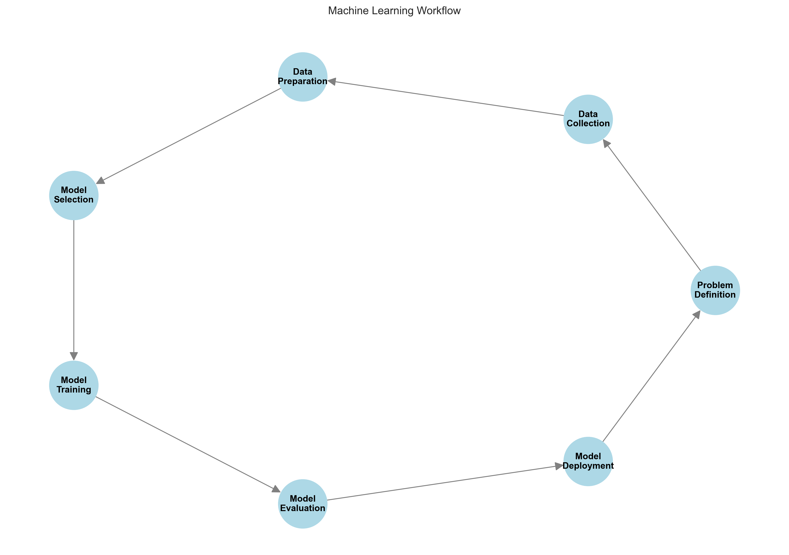

# Machine Learning Workflow: A Step-by-Step Guide

Welcome to our comprehensive guide on the machine learning workflow! This guide will walk you through each step of building a machine learning solution, with practical examples and clear explanations.

## What is a Machine Learning Workflow?

A machine learning workflow is a systematic process that helps us build effective ML solutions. Think of it as a recipe for creating machine learning models. Just like a recipe has specific steps to follow, the ML workflow has clear stages that help us build better models.



## Why is a Workflow Important?

Following a structured workflow helps us:

1. Stay organized and systematic
2. Avoid common mistakes
3. Build better models
4. Save time and resources
5. Make our work reproducible

## The Machine Learning Workflow Steps

The workflow consists of six main steps:

1. Problem Definition
2. Data Collection and Exploration
3. Data Preparation
4. Model Selection and Training
5. Model Evaluation
6. Model Deployment

Let's explore each step in detail.

## 1. Problem Definition

### Understanding the Problem

Before writing any code, we need to clearly understand what we're trying to solve. This is like planning a journey - we need to know our destination before we start.

Key questions to ask:

- What problem are we trying to solve?
- What are our success metrics?
- What data do we need?
- How will the solution be used?

### Types of Machine Learning Problems

There are three main types of ML problems:

1. **Regression**: Predicting continuous values
   - Example: House prices, temperature forecasting
   - Metrics: Mean Absolute Error (MAE), Root Mean Squared Error (RMSE), R²
   - Formula: $$y = \beta_0 + \beta_1x_1 + \beta_2x_2 + ... + \beta_nx_n + \epsilon$$

2. **Classification**: Predicting categories
   - Example: Spam detection, image recognition
   - Metrics: Accuracy, Precision, Recall, F1-score
   - Formula: $$P(y=1|x) = \frac{1}{1 + e^{-(\beta_0 + \beta_1x_1 + ... + \beta_nx_n)}}$$

3. **Clustering**: Finding natural groups
   - Example: Customer segmentation
   - Metrics: Silhouette Score, Davies-Bouldin Index
   - Formula: $$J = \sum_{i=1}^{k} \sum_{x \in C_i} ||x - \mu_i||^2$$

### Example Problem Statement

Let's look at a concrete example:

```python
"""
Problem Statement Example:
Goal: Predict house prices
Type: Regression problem
Success Metric: Predictions within $50,000 of actual price
Required Data: House features (size, location, etc.)
Business Impact: Help real estate agents price houses accurately
"""
```

## 2. Data Collection and Exploration

### Understanding Your Data

Before we can build a model, we need to understand our data. This is like getting to know the ingredients before cooking.

### Initial Data Assessment

Let's start by loading and examining our data:

```python
import pandas as pd
import numpy as np
import matplotlib.pyplot as plt
import seaborn as sns

# Load data
df = pd.read_csv('house_data.csv')

# Quick overview
print("Dataset Shape:", df.shape)
print("\nFeature Types:\n", df.dtypes)
print("\nMissing Values:\n", df.isnull().sum())

# Basic statistics
print("\nSummary Statistics:")
print(df.describe())
```

### Exploratory Data Analysis (EDA)

EDA helps us understand patterns and relationships in our data:

```python
# Distribution of house prices
plt.figure(figsize=(10, 6))
sns.histplot(data=df, x='price', bins=50)
plt.title('Distribution of House Prices')
plt.xlabel('Price ($)')
plt.ylabel('Count')
plt.show()

# Correlation heatmap
plt.figure(figsize=(12, 8))
sns.heatmap(df.corr(), annot=True, cmap='coolwarm')
plt.title('Feature Correlations')
plt.show()
```

## 3. Data Preparation

### Why Prepare Data?

Data preparation is like preparing ingredients for cooking. We need to clean and transform our data to make it suitable for modeling.

### Data Cleaning

Let's create a helper class to clean our data:

```python
class DataCleaner:
    """Helper class for data cleaning"""
    
    def __init__(self, df):
        self.df = df.copy()
    
    def handle_missing_values(self):
        """Fill missing values appropriately"""
        # Numerical: use median for skewed data
        numeric_cols = self.df.select_dtypes(include=[np.number]).columns
        for col in numeric_cols:
            if self.df[col].isnull().any():
                median = self.df[col].median()
                self.df[col] = self.df[col].fillna(median)
        
        # Categorical: use mode
        categorical_cols = self.df.select_dtypes(include=['object']).columns
        for col in categorical_cols:
            if self.df[col].isnull().any():
                mode = self.df[col].mode()[0]
                self.df[col] = self.df[col].fillna(mode)
    
    def remove_outliers(self, column, n_std=3):
        """Remove outliers using the z-score method"""
        mean = self.df[column].mean()
        std = self.df[column].std()
        self.df = self.df[
            (self.df[column] <= mean + (n_std * std)) & 
            (self.df[column] >= mean - (n_std * std))
        ]

# Example usage
cleaner = DataCleaner(df)
cleaner.handle_missing_values()
cleaner.remove_outliers('price')
```

### Feature Engineering

Feature engineering is about creating new features that might help our model:

```python
def create_features(df):
    """Create new features from existing ones"""
    # Example feature engineering
    df['price_per_sqft'] = df['price'] / df['sqft_living']
    df['total_rooms'] = df['bedrooms'] + df['bathrooms']
    df['is_renovated'] = (df['yr_renovated'] > 0).astype(int)
    
    # Handle categorical variables
    df = pd.get_dummies(df, columns=['view', 'condition'])
    
    return df

# Create new features
df = create_features(df)
```

## 4. Model Selection and Training

### Why Split Data?

We need to split our data to evaluate our model properly. Think of it as having a practice test and a real test.

### Splitting the Data

```python
from sklearn.model_selection import train_test_split

# Split features and target
X = df.drop('price', axis=1)
y = df['price']

# Create train, validation, and test sets
X_train, X_temp, y_train, y_temp = train_test_split(X, y, test_size=0.3, random_state=42)
X_val, X_test, y_val, y_test = train_test_split(X_temp, y_temp, test_size=0.5, random_state=42)
```

### Training Multiple Models

Let's try different models to find the best one:

```python
from sklearn.linear_model import LinearRegression, Ridge
from sklearn.ensemble import RandomForestRegressor
from sklearn.metrics import mean_absolute_error, r2_score

def train_evaluate_model(model, X_train, X_val, y_train, y_val):
    """Train and evaluate a model"""
    # Train the model
    model.fit(X_train, y_train)
    
    # Make predictions
    train_pred = model.predict(X_train)
    val_pred = model.predict(X_val)
    
    # Calculate metrics
    results = {
        'train_mae': mean_absolute_error(y_train, train_pred),
        'val_mae': mean_absolute_error(y_val, val_pred),
        'train_r2': r2_score(y_train, train_pred),
        'val_r2': r2_score(y_val, val_pred)
    }
    
    return results

# Try different models
models = {
    'Linear Regression': LinearRegression(),
    'Ridge Regression': Ridge(alpha=1.0),
    'Random Forest': RandomForestRegressor(n_estimators=100)
}

results = {}
for name, model in models.items():
    results[name] = train_evaluate_model(model, X_train, X_val, y_train, y_val)
```

## 5. Model Evaluation

### Why Evaluate Models?

Evaluation helps us understand how well our model performs and where it needs improvement.

### Comprehensive Evaluation

```python
def evaluate_model(model, X_test, y_test):
    """Evaluate model on test set"""
    predictions = model.predict(X_test)
    
    # Calculate metrics
    mae = mean_absolute_error(y_test, predictions)
    mse = mean_squared_error(y_test, predictions)
    rmse = np.sqrt(mse)
    r2 = r2_score(y_test, predictions)
    
    print("Model Performance Metrics:")
    print(f"MAE: ${mae:,.2f}")
    print(f"RMSE: ${rmse:,.2f}")
    print(f"R² Score: {r2:.3f}")
    
    # Plot actual vs predicted
    plt.figure(figsize=(10, 6))
    plt.scatter(y_test, predictions, alpha=0.5)
    plt.plot([y_test.min(), y_test.max()], [y_test.min(), y_test.max()], 'r--')
    plt.xlabel('Actual Price')
    plt.ylabel('Predicted Price')
    plt.title('Actual vs Predicted House Prices')
    plt.show()

# Evaluate best model
best_model = models['Random Forest']  # Example
evaluate_model(best_model, X_test, y_test)
```

### Learning Curves Analysis

Learning curves help us understand if our model is learning well:

```python
from sklearn.model_selection import learning_curve

def plot_learning_curves(model, X, y):
    """Plot learning curves to detect overfitting"""
    train_sizes, train_scores, val_scores = learning_curve(
        model, X, y, cv=5, n_jobs=-1, 
        train_sizes=np.linspace(0.1, 1.0, 10))
    
    plt.figure(figsize=(10, 6))
    plt.plot(train_sizes, np.mean(train_scores, axis=1), 'o-', label='Training Score')
    plt.plot(train_sizes, np.mean(val_scores, axis=1), 'o-', label='Cross-validation Score')
    plt.xlabel('Training Examples')
    plt.ylabel('Score')
    plt.title('Learning Curves')
    plt.legend(loc='best')
    plt.grid(True)
    plt.show()

# Plot learning curves
plot_learning_curves(best_model, X, y)
```

## 6. Model Deployment

### Why Deploy Models?

Deployment makes our model available for real-world use. It's like opening a restaurant after perfecting a recipe.

### Saving the Model

```python
import joblib

def save_model(model, scaler, feature_names, path='model/'):
    """Save model and associated objects"""
    import os
    os.makedirs(path, exist_ok=True)
    
    # Save model and preprocessing objects
    joblib.dump(model, f'{path}model.joblib')
    joblib.dump(scaler, f'{path}scaler.joblib')
    joblib.dump(feature_names, f'{path}features.joblib')

# Save the model
save_model(best_model, scaler, X.columns)
```

### Making Predictions

```python
def predict_house_price(features_df, model_path='model/'):
    """Load model and make predictions"""
    # Load model and preprocessing objects
    model = joblib.load(f'{model_path}model.joblib')
    scaler = joblib.load(f'{model_path}scaler.joblib')
    features = joblib.load(f'{model_path}features.joblib')
    
    # Ensure correct features
    features_df = features_df[features]
    
    # Scale features
    scaled_features = scaler.transform(features_df)
    
    # Predict
    prediction = model.predict(scaled_features)
    
    return prediction[0]

# Example prediction
new_house = pd.DataFrame({
    'sqft_living': [2000],
    'bedrooms': [3],
    'bathrooms': [2],
    'age': [15]
})

predicted_price = predict_house_price(new_house)
print(f"\nPredicted House Price: ${predicted_price:,.2f}")
```

## Best Practices and Tips

### 1. Version Control

- Keep track of your code changes
- Document model versions and performance
- Save model artifacts systematically

### 2. Documentation

- Document your assumptions
- Keep track of preprocessing steps
- Record model performance metrics

### 3. Monitoring

- Monitor model performance over time
- Watch for data drift
- Set up alerts for performance degradation

### 4. Error Analysis

- Analyze where your model makes mistakes
- Look for patterns in errors
- Use insights to improve the model

## Next Steps

Now that you understand the ML workflow:

1. Practice with different datasets
2. Try various algorithms
3. Experiment with feature engineering
4. Build end-to-end projects

Remember: The key to success in machine learning is iteration and experimentation. Don't expect perfect results on your first try!
