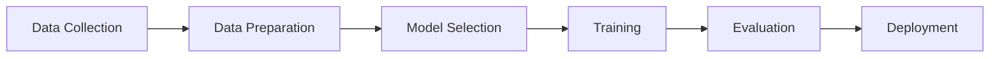

# What is Machine Learning? 🤖

Machine learning is a transformative field that enables computers to learn from experience without being explicitly programmed. Let's dive into this fascinating world!

## The Essence of Machine Learning 🎯

Traditional programming follows a rule-based approach:
```
Input → Rules (Program) → Output
```

Machine learning flips this paradigm:
```
Input + Output → ML Algorithm → Rules (Model)
```

This fundamental shift allows systems to discover patterns and make decisions with minimal human intervention.

## Understanding Through Examples 🌟

### 1. Email Spam Detection 📧
- **Traditional**: `if contains("win money") then mark_as_spam()`
- **ML Approach**: Learn patterns from millions of emails
- **Mathematical Representation**:

$$P(\text{spam}|\text{email}) = \frac{P(\text{email}|\text{spam})P(\text{spam})}{P(\text{email})}$$

### 2. Netflix Recommendations 🎬
- **Traditional**: `if user_likes(action) then recommend(action_movies)`
- **ML Approach**: Learn from viewing patterns
- **Mathematical Representation**:

$$\text{rating}_{u,i} \approx \mu + b_u + b_i + \sum_{f=1}^F p_{u,f} \cdot q_{i,f}$$

Where:
- $\mu$ is the overall average rating
- $b_u$ is user bias
- $b_i$ is item bias
- $p_{u,f}$ and $q_{i,f}$ are user and item latent factors

## Types of Machine Learning 🎓

### 1. Supervised Learning 👨‍🏫
Learning with labeled examples:

$$\text{Model}: f(X) \approx y$$

```python
# House price prediction example
import pandas as pd
from sklearn.linear_model import LinearRegression

houses = pd.DataFrame({
    'size_sqft': [1000, 1500, 1200, 1700],
    'bedrooms': [2, 3, 2, 3],
    'price': [200000, 300000, 250000, 350000]
})

model = LinearRegression()
X = houses[['size_sqft', 'bedrooms']]
y = houses['price']
model.fit(X, y)

# Prediction
new_house = [[1300, 2]]
predicted_price = model.predict(new_house)
print(f"Predicted price: ${predicted_price[0]:,.2f}")
```

### 2. Unsupervised Learning 🔍
Finding hidden patterns:

$$\text{Clusters} = \underset{C}{\arg\min} \sum_{i=1}^k \sum_{x \in C_i} ||x - \mu_i||^2$$

```python
# Customer segmentation example
from sklearn.cluster import KMeans
import numpy as np

customers = pd.DataFrame({
    'annual_spend': [100, 1000, 5000, 150, 4500],
    'visit_frequency': [2, 10, 50, 3, 45]
})

kmeans = KMeans(n_clusters=2)
segments = kmeans.fit_predict(customers)
```

### 3. Reinforcement Learning 🎮
Learning through trial and error:

$$Q(s,a) \leftarrow Q(s,a) + \alpha[r + \gamma \max_{a'}Q(s',a') - Q(s,a)]$$

Where:
- $Q(s,a)$ is the value of taking action $a$ in state $s$
- $\alpha$ is the learning rate
- $r$ is the reward
- $\gamma$ is the discount factor

## Core Concepts 🧠

### The Learning Process
1. **Data Collection**: Gathering relevant examples
2. **Feature Extraction**: Converting raw data into meaningful features
3. **Training**: Optimizing model parameters
4. **Evaluation**: Testing model performance
5. **Deployment**: Using the model in real-world applications

### Model Performance Metrics
- **Classification**: Accuracy, Precision, Recall, F1-Score
  $$\text{Accuracy} = \frac{\text{Correct Predictions}}{\text{Total Predictions}}$$
  
- **Regression**: MSE, RMSE, MAE
  $$\text{MSE} = \frac{1}{n}\sum_{i=1}^n (y_i - \hat{y}_i)^2$$

## Real-World Applications 🌍

### Healthcare 🏥
- Disease diagnosis
- Patient risk prediction
- Drug discovery
```python
# Simple disease prediction
from sklearn.ensemble import RandomForestClassifier

symptoms = ['fever', 'cough', 'fatigue']
diagnosis = ['flu', 'cold', 'covid']

model = RandomForestClassifier()
# Train with patient data
```

### Finance 💰
- Fraud detection
- Stock prediction
- Risk assessment

### Transportation 🚗
- Autonomous vehicles
- Traffic prediction
- Route optimization

## Getting Started 🚀

### Essential Tools
1. **Python**: Primary language for ML
2. **Key Libraries**:
   - scikit-learn: ML algorithms
   - pandas: Data manipulation
   - numpy: Numerical operations
   - matplotlib: Visualization

### Basic Workflow


## Interactive Exercise 💻

Create a simple pass/fail predictor:

```python
from sklearn.linear_model import LogisticRegression
import numpy as np

# Study hours and results
study_hours = np.array([[1], [2], [3], [4], [5]])
passed = np.array([0, 0, 1, 1, 1])

# Train model
model = LogisticRegression()
model.fit(study_hours, passed)

# Predict for new student
new_student = [[3.5]]
prediction = model.predict(new_student)
probability = model.predict_proba(new_student)

print(f"Will pass? {'Yes' if prediction[0] == 1 else 'No'}")
print(f"Probability: {probability[0][1]:.2%}")
```

## Next Steps 📚

Ready to dive deeper? Continue to the [Machine Learning Workflow](./ml-workflow.md) to learn how to build ML solutions systematically!
