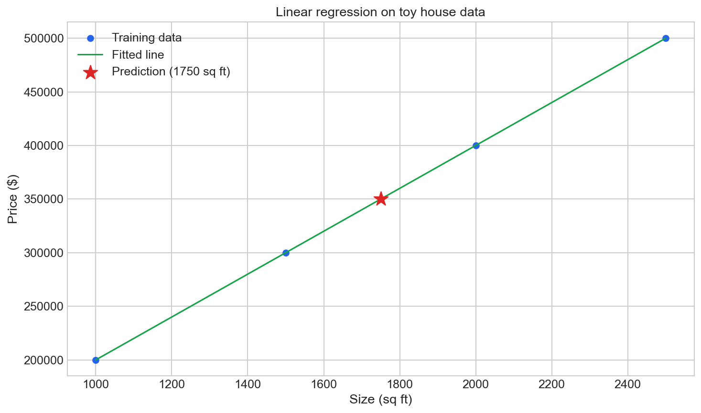

# Introduction to Machine Learning

**After this lesson:** you can explain the core ideas in “Introduction to Machine Learning” and reproduce the examples here in your own notebook or environment.

## Overview

This lesson sets vocabulary you will reuse everywhere in Module 5: **supervised**, **unsupervised**, and **reinforcement** learning, the high-level **workflow** from problem to deployment, and the intuition behind **bias–variance** and **learning curves**. **Prerequisites:** comfortable Python, basic plots, and descriptive stats from [Module 1](../../1-data-fundamentals/README.md) and [Module 2](../../2-data-wrangling/README.md); probability thinking from [Module 4](../../4-stat-analysis/README.md) helps when we talk about generalization.

## Why this matters

If you can name the problem type and the main workflow steps, you can follow tutorials in order, read model documentation with context, and ask better questions in projects and interviews.

Welcome to the exciting world of Machine Learning! This guide is designed to help you understand the fundamentals of machine learning in a clear and approachable way.

## Helpful video

Crash Course AI: how supervised learning fits into ML workflows.

<iframe width="560" height="315" src="https://www.youtube.com/embed/4qVRBYAdLAo" title="Supervised Learning: Crash Course AI" frameborder="0" allow="accelerometer; autoplay; clipboard-write; encrypted-media; gyroscope; picture-in-picture" allowfullscreen></iframe>

## What is Machine Learning?

Machine Learning (ML) is a way to teach computers to learn from experience without being explicitly programmed. Instead of writing detailed rules for every situation, we show the computer examples and let it figure out the patterns on its own.

### The Key Difference

- **Traditional Programming**: We write specific rules (program) to convert input into output
- **Machine Learning**: We provide examples of inputs and outputs, and the computer learns the rules

## Types of Machine Learning



There are three main types of machine learning:

### 1. Supervised Learning

In supervised learning, we provide the computer with labeled examples to learn from. It's like learning with a teacher who shows you the correct answers.

**Examples:**

- Predicting house prices based on features (size, location, etc.)
- Classifying emails as spam or not spam
- Identifying objects in images

### 2. Unsupervised Learning

In unsupervised learning, we let the computer find patterns in data without providing labels. It's like discovering groups or patterns naturally.

**Examples:**

- Customer segmentation
- Anomaly detection
- Topic modeling in text

### 3. Reinforcement Learning

In reinforcement learning, an agent learns by interacting with an environment and receiving feedback (rewards or penalties).

**Examples:**

- Game playing AI
- Robot navigation
- Resource management

## The Machine Learning Process

The process of building a machine learning solution follows a systematic workflow:

1. **Problem Definition**: Clearly define what you want to achieve
2. **Data Collection**: Gather relevant data
3. **Data Preparation**: Clean and prepare the data
4. **Model Selection**: Choose the appropriate algorithm
5. **Model Training**: Train the model on your data
6. **Model Evaluation**: Test how well the model performs
7. **Model Deployment**: Put the model into use

## Common Challenges in Machine Learning

### Bias-Variance Tradeoff

One of the fundamental challenges in machine learning is finding the right balance between bias and variance:

- **Underfitting (High Bias)**: Model is too simple and misses important patterns
- **Good Fit**: Model captures the underlying patterns well
- **Overfitting (High Variance)**: Model is too complex and captures noise in the data

### Learning Curves

Learning curves help us understand how well our model is learning:

- **Training Score**: How well the model performs on training data
- **Cross-validation Score**: How well the model performs on new, unseen data

## Getting Started with Machine Learning

### Prerequisites

To get started with machine learning, you should have:

1. Basic Python programming knowledge
2. Understanding of basic statistics and probability
3. Familiarity with linear algebra and calculus (for advanced topics)

### Essential Python Libraries

#### Core imports used across ML notebooks

```python
import numpy as np        # For numerical computations
import pandas as pd       # For data manipulation
import sklearn           # For machine learning algorithms
import matplotlib.pyplot as plt  # For visualization
```

### Simple Example: Predicting House Prices

#### Fit a linear model on toy house data

<div class="code-explainer" data-code-explainer>
<div class="code-explainer__code">


import matplotlib.pyplot as plt
from sklearn.linear_model import LinearRegression

# Sample data: house size (sq ft) and price ($)
sizes = [[1000], [1500], [2000], [2500]]  # Features
prices = [200000, 300000, 400000, 500000]  # Target

# Create and train the model
model = LinearRegression()
model.fit(sizes, prices)

# Make a prediction
new_size = [[1750]]
predicted_price = model.predict(new_size)
print(f"Predicted price for {new_size[0][0]} sq ft: ${predicted_price[0]:,.2f}")

# Plot the toy data, the fitted line, and the new prediction
xs = [s[0] for s in sizes]
plt.scatter(xs, prices, color="#2563eb", label="Training data")
plt.plot(xs, model.predict(sizes), color="#16a34a", label="Fitted line")
plt.scatter(new_size[0], predicted_price, color="#dc2626", marker="*",
            s=220, zorder=5, label="Prediction (1750 sq ft)")
plt.xlabel("Size (sq ft)")
plt.ylabel("Price ($)")
plt.title("Linear regression on toy house data")
plt.legend()
plt.show()


<figure>

<figcaption>Figure 1: The fitted line passes through the toy data; the star marks the predicted price for a 1750 sq ft house.</figcaption>
</figure>

```
Predicted price for 1750 sq ft: $350,000.00
```

</div>
<aside class="code-explainer__callouts" aria-label="Code walkthrough">
  <div class="code-callout" data-lines="1-6" data-tint="1">
    <div class="code-callout__meta">
      <span class="code-callout__lines"></span>
      <span class="code-callout__title">Data Preparation</span>
    </div>
    <div class="code-callout__body">
      <p>Four (size, price) pairs serve as toy training data; <code>sizes</code> is a list of lists because sklearn expects a 2D feature matrix even for a single feature.</p>
    </div>
  </div>
  <div class="code-callout" data-lines="8-15" data-tint="2">
    <div class="code-callout__meta">
      <span class="code-callout__lines"></span>
      <span class="code-callout__title">Fit and Predict</span>
    </div>
    <div class="code-callout__body">
      <p><code>model.fit</code> learns the slope and intercept; <code>predict</code> extrapolates to 1750 sq ft — this is the complete supervised learning loop in four lines.</p>
    </div>
  </div>
  <div class="code-callout" data-lines="17-27" data-tint="3">
    <div class="code-callout__meta">
      <span class="code-callout__lines"></span>
      <span class="code-callout__title">Visualize the Fit</span>
    </div>
    <div class="code-callout__body">
      <p>Plotting the data, the fitted line, and the prediction makes the linear relationship concrete — the star lands on the line at 1750 sq ft, exactly where the model interpolates.</p>
    </div>
  </div>
</aside>
</div>


<figure>

<figcaption>Figure 1: Linear regression on toy house data</figcaption>
</figure>

```
Predicted price for 1750 sq ft: $350,000.00
```

## Gotchas

- **Passing a 1D array to sklearn estimators** — `model.fit(sizes, prices)` requires `sizes` to be 2D (shape `(n, 1)`), which is why the example uses `[[1000], [1500], …]`; passing a plain list like `[1000, 1500, …]` raises a `ValueError` about a 1D feature array that confuses many beginners.
- **Treating "more data always helps" as universal** — collecting more data is the right fix for high-variance (overfitting) models, but it does not help a high-bias (underfitting) model; adding data to a linear model on non-linear data just confirms the same bad fit at larger scale.
- **Assuming supervised learning requires a "correct" answer for every case** — the labels in supervised learning represent a ground truth decided at the time of data collection; if those labels are noisy, biased, or stale, the model will learn those biases faithfully, and high accuracy on training data will not save you.
- **Conflating unsupervised clustering output with ground truth classes** — cluster labels from k-means or similar algorithms are arbitrary integers (cluster 0 and cluster 1 have no inherent meaning) and should not be compared to class labels without an explicit alignment step.
- **Skipping problem definition before writing code** — jumping straight to model selection without deciding what metric to optimise (and why) routinely leads to models that score well on a proxy metric but fail the actual business goal; the problem spec is not optional overhead.

## Next Steps

Now that you understand the basics of machine learning:

1. Continue to [Machine Learning Workflow](./ml-workflow.md) to learn the detailed process
2. Practice with simple datasets and basic algorithms
3. Join online communities and participate in discussions
4. Work on personal projects to apply what you've learned

Remember: Machine learning is a journey. Start with simple concepts and gradually build up to more complex topics. The key is to practice regularly and apply what you learn to real problems.
