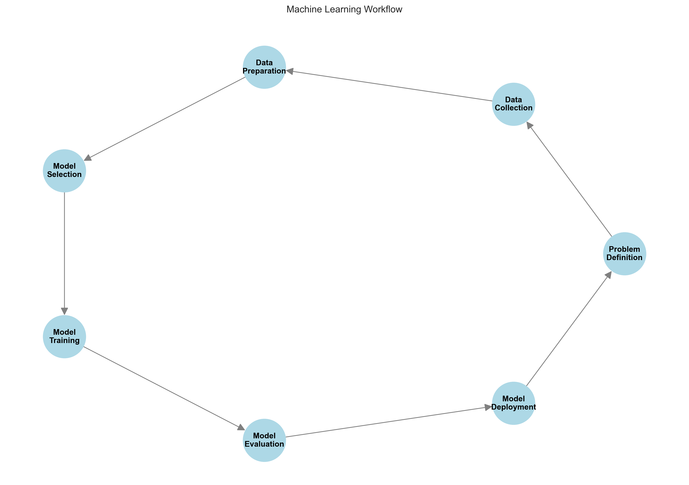

# Introduction to Machine Learning

Welcome to the exciting world of Machine Learning! This guide is designed to help you understand the fundamentals of machine learning in a clear and approachable way.

## What is Machine Learning?

Machine Learning (ML) is a way to teach computers to learn from experience without being explicitly programmed. Instead of writing detailed rules for every situation, we show the computer examples and let it figure out the patterns on its own.


### The Key Difference

- **Traditional Programming**: We write specific rules (program) to convert input into output
- **Machine Learning**: We provide examples of inputs and outputs, and the computer learns the rules

## Types of Machine Learning

There are three main types of machine learning:

### 1. Supervised Learning

In supervised learning, we provide the computer with labeled examples to learn from. It's like learning with a teacher who shows you the correct answers.


**Examples:**

- Predicting house prices based on features (size, location, etc.)
- Classifying emails as spam or not spam
- Identifying objects in images

### 2. Unsupervised Learning

In unsupervised learning, we let the computer find patterns in data without providing labels. It's like discovering groups or patterns naturally.


**Examples:**

- Customer segmentation
- Anomaly detection
- Topic modeling in text

### 3. Reinforcement Learning

In reinforcement learning, an agent learns by interacting with an environment and receiving feedback (rewards or penalties).

**Examples:**

- Game playing AI
- Robot navigation
- Resource management

## The Machine Learning Process

The process of building a machine learning solution follows a systematic workflow:



1. **Problem Definition**: Clearly define what you want to achieve
2. **Data Collection**: Gather relevant data
3. **Data Preparation**: Clean and prepare the data
4. **Model Selection**: Choose the appropriate algorithm
5. **Model Training**: Train the model on your data
6. **Model Evaluation**: Test how well the model performs
7. **Model Deployment**: Put the model into use

## Common Challenges in Machine Learning

### Bias-Variance Tradeoff

One of the fundamental challenges in machine learning is finding the right balance between bias and variance:


- **Underfitting (High Bias)**: Model is too simple and misses important patterns
- **Good Fit**: Model captures the underlying patterns well
- **Overfitting (High Variance)**: Model is too complex and captures noise in the data

### Learning Curves

Learning curves help us understand how well our model is learning:


- **Training Score**: How well the model performs on training data
- **Cross-validation Score**: How well the model performs on new, unseen data

## Getting Started with Machine Learning

### Prerequisites

To get started with machine learning, you should have:

1. Basic Python programming knowledge
2. Understanding of basic statistics and probability
3. Familiarity with linear algebra and calculus (for advanced topics)

### Essential Python Libraries

```python
import numpy as np        # For numerical computations
import pandas as pd       # For data manipulation
import sklearn           # For machine learning algorithms
import matplotlib.pyplot as plt  # For visualization
```

### Simple Example: Predicting House Prices

```python
from sklearn.linear_model import LinearRegression

# Sample data: house size (sq ft) and price ($)
sizes = [[1000], [1500], [2000], [2500]]  # Features
prices = [200000, 300000, 400000, 500000]  # Target

# Create and train the model
model = LinearRegression()
model.fit(sizes, prices)

# Make a prediction
new_size = [[1750]]
predicted_price = model.predict(new_size)
print(f"Predicted price for {new_size[0][0]} sq ft: ${predicted_price[0]:,.2f}")
```

## Next Steps

Now that you understand the basics of machine learning:

1. Continue to [Machine Learning Workflow](./ml-workflow.md) to learn the detailed process
2. Practice with simple datasets and basic algorithms
3. Join online communities and participate in discussions
4. Work on personal projects to apply what you've learned

Remember: Machine learning is a journey. Start with simple concepts and gradually build up to more complex topics. The key is to practice regularly and apply what you learn to real problems.
