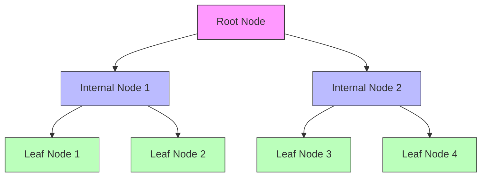
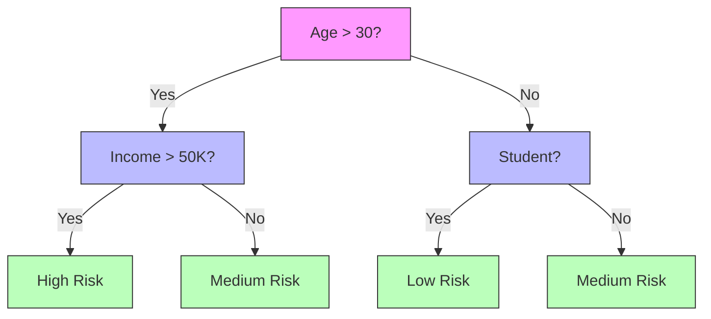

# Decision Trees: A Visual Guide 🌳

## 1. Understanding Tree Structure

### Basic Tree Components


### Decision Process Visualization


## 2. Splitting Criteria Explained

### Interactive Splitting Visualization
```python
import numpy as np
import matplotlib.pyplot as plt

def visualize_split_criteria():
    """Visualize different splitting criteria"""
    def calculate_gini(p):
        return 1 - (p**2 + (1-p)**2)
    
    def calculate_entropy(p):
        if p == 0 or p == 1:
            return 0
        return -(p * np.log2(p) + (1-p) * np.log2(1-p))
    
    # Generate probabilities
    p = np.linspace(0, 1, 100)
    gini = [calculate_gini(pi) for pi in p]
    entropy = [calculate_entropy(pi) for pi in p]
    
    # Plot comparison
    plt.figure(figsize=(12, 6))
    plt.plot(p, gini, label='Gini Impurity')
    plt.plot(p, entropy, label='Entropy')
    plt.xlabel('Probability of Class 1')
    plt.ylabel('Impurity Measure')
    plt.title('Comparison of Split Criteria')
    plt.legend()
    plt.grid(True)
```

### Information Gain Calculator
```python
def calculate_information_gain(parent_impurity, child_impurities, child_samples):
    """Calculate information gain from a split"""
    total_samples = sum(child_samples)
    weighted_child_impurity = sum(
        (n/total_samples) * impurity 
        for n, impurity in zip(child_samples, child_impurities)
    )
    return parent_impurity - weighted_child_impurity

class SplitVisualizer:
    def __init__(self):
        self.fig, self.axes = plt.subplots(1, 2, figsize=(15, 6))
        
    def visualize_split(self, X, y, feature_idx, threshold):
        """Visualize data split and resulting information gain"""
        # Split data
        left_mask = X[:, feature_idx] <= threshold
        right_mask = ~left_mask
        
        # Calculate impurities
        parent_impurity = self._calculate_gini(y)
        left_impurity = self._calculate_gini(y[left_mask])
        right_impurity = self._calculate_gini(y[right_mask])
        
        # Calculate information gain
        gain = calculate_information_gain(
            parent_impurity,
            [left_impurity, right_impurity],
            [sum(left_mask), sum(right_mask)]
        )
        
        # Plot original data
        self.axes[0].scatter(X[:, feature_idx], y, alpha=0.5)
        self.axes[0].axvline(threshold, color='r', linestyle='--')
        self.axes[0].set_title('Feature Split')
        
        # Plot impurity reduction
        self.axes[1].bar(['Parent', 'Left Child', 'Right Child'],
                        [parent_impurity, left_impurity, right_impurity])
        self.axes[1].set_title(f'Impurity (Information Gain = {gain:.3f})')
        
    def _calculate_gini(self, y):
        """Calculate Gini impurity"""
        _, counts = np.unique(y, return_counts=True)
        probabilities = counts / len(y)
        return 1 - sum(p**2 for p in probabilities)
```

## 3. Tree Growing Process

### Step-by-Step Tree Construction
```python
from sklearn.tree import DecisionTreeClassifier
import graphviz

class TreeGrowthVisualizer:
    def __init__(self, max_depth=3):
        self.max_depth = max_depth
        self.trees = []
        
    def visualize_growth(self, X, y, feature_names=None):
        """Visualize tree at each depth"""
        for depth in range(1, self.max_depth + 1):
            # Create and train tree
            tree = DecisionTreeClassifier(max_depth=depth)
            tree.fit(X, y)
            self.trees.append(tree)
            
            # Visualize tree
            dot_data = export_graphviz(
                tree,
                feature_names=feature_names,
                filled=True,
                rounded=True
            )
            graph = graphviz.Source(dot_data)
            display(graph)
            
            # Print metrics
            print(f"\nDepth {depth} Metrics:")
            print(f"Number of nodes: {tree.tree_.node_count}")
            print(f"Training accuracy: {tree.score(X, y):.3f}")
```

## 4. Advanced Tree Techniques

### Pruning Visualization
```python
class TreePruner:
    def __init__(self):
        self.alphas = []
        self.scores = []
        
    def visualize_pruning(self, X, y):
        """Visualize effect of cost-complexity pruning"""
        # Get pruning path
        tree = DecisionTreeClassifier()
        path = tree.cost_complexity_pruning_path(X, y)
        self.alphas = path.ccp_alphas
        
        # Train trees with different alphas
        for alpha in self.alphas:
            tree = DecisionTreeClassifier(ccp_alpha=alpha)
            tree.fit(X, y)
            self.scores.append(tree.score(X, y))
        
        # Plot complexity vs accuracy
        plt.figure(figsize=(10, 6))
        plt.plot(self.alphas, self.scores, marker='o')
        plt.xscale('log')
        plt.xlabel('Alpha (complexity parameter)')
        plt.ylabel('Accuracy')
        plt.title('Accuracy vs Tree Complexity')
        plt.grid(True)
```

### Feature Importance Analysis
```python
class FeatureAnalyzer:
    def __init__(self, tree_model):
        self.tree = tree_model
        
    def visualize_feature_importance(self, feature_names):
        """Create detailed feature importance visualization"""
        importances = self.tree.feature_importances_
        indices = np.argsort(importances)[::-1]
        
        # Plot importance bars
        plt.figure(figsize=(12, 6))
        plt.title('Feature Importance Analysis')
        plt.bar(range(len(importances)),
                importances[indices],
                align='center')
        plt.xticks(range(len(importances)),
                   [feature_names[i] for i in indices],
                   rotation=45)
        
        # Add cumulative importance line
        cumsum = np.cumsum(importances[indices])
        plt.plot(range(len(importances)), cumsum,
                'r--', label='Cumulative Importance')
        plt.ylabel('Feature Importance')
        plt.legend()
```

## 5. Real-world Applications

### Credit Risk Assessment
```python
class CreditRiskTree:
    def __init__(self):
        self.tree = DecisionTreeClassifier(
            max_depth=5,
            min_samples_leaf=100,
            class_weight='balanced'
        )
        self.feature_processor = None
        
    def create_features(self, data):
        """Create advanced credit risk features"""
        features = pd.DataFrame()
        
        # Payment behavior
        features['payment_ratio'] = data['payments'] / data['debt']
        features['utilization'] = data['balance'] / data['credit_limit']
        features['payment_history'] = data['on_time_payments'] / data['total_payments']
        
        # Risk indicators
        features['high_utilization'] = features['utilization'] > 0.7
        features['missed_payments'] = data['missed_payments'] > 0
        features['recent_inquiries'] = data['recent_inquiries'] > 3
        
        return features
        
    def visualize_decision_path(self, sample):
        """Visualize decision path for a single application"""
        node_indicator = self.tree.decision_path(sample)
        leaf_id = self.tree.apply(sample)
        
        feature = self.tree.tree_.feature
        threshold = self.tree.tree_.threshold
        
        # Plot decision path
        node_index = node_indicator.indices[
            node_indicator.indptr[0]:node_indicator.indptr[1]
        ]
        
        for node_id in node_index:
            if leaf_id[0] == node_id:
                continue
                
            if sample[0, feature[node_id]] <= threshold[node_id]:
                threshold_sign = "<="
            else:
                threshold_sign = ">"
                
            print(
                f"Decision {node_id}:"
                f"{feature_names[feature[node_id]]} "
                f"{threshold_sign} {threshold[node_id]}"
            )
```

### Medical Diagnosis System
```python
class DiagnosisTree:
    def __init__(self):
        self.tree = DecisionTreeClassifier(
            max_depth=4,
            min_samples_leaf=50,
            class_weight='balanced'
        )
        
    def process_symptoms(self, symptoms_data):
        """Process and encode symptoms"""
        # Create symptom vectors
        vectorizer = CountVectorizer(binary=True)
        symptom_matrix = vectorizer.fit_transform(symptoms_data)
        
        # Add severity scores
        severity_encoder = LabelEncoder()
        severity_scores = severity_encoder.fit_transform(
            symptoms_data['severity']
        )
        
        # Combine features
        return np.hstack([
            symptom_matrix.toarray(),
            severity_scores.reshape(-1, 1)
        ])
        
    def explain_diagnosis(self, patient_data):
        """Provide detailed diagnosis explanation"""
        # Get decision path
        path = self.tree.decision_path(patient_data)
        
        # Extract rules leading to diagnosis
        rules = []
        for node_id in path.indices:
            if node_id == self.tree.tree_.node_count - 1:
                continue
                
            feature = self.tree.tree_.feature[node_id]
            threshold = self.tree.tree_.threshold[node_id]
            
            if patient_data[0, feature] <= threshold:
                rules.append(f"{feature_names[feature]} ≤ {threshold:.2f}")
            else:
                rules.append(f"{feature_names[feature]} > {threshold:.2f}")
        
        return rules
```

## 6. Best Practices and Optimization

### Cross-validation Strategy
```python
def optimize_tree(X, y):
    """Find optimal tree parameters"""
    # Parameter grid
    param_grid = {
        'max_depth': [3, 4, 5, 6, 7],
        'min_samples_split': [2, 5, 10, 20],
        'min_samples_leaf': [1, 2, 4, 8],
        'max_features': ['sqrt', 'log2', None]
    }
    
    # Create base model
    tree = DecisionTreeClassifier(random_state=42)
    
    # Perform grid search with cross-validation
    grid_search = GridSearchCV(
        tree,
        param_grid,
        cv=5,
        scoring='accuracy',
        n_jobs=-1
    )
    
    # Fit and get results
    grid_search.fit(X, y)
    
    # Visualize results
    results = pd.DataFrame(grid_search.cv_results_)
    
    plt.figure(figsize=(15, 5))
    
    # Plot max_depth effect
    plt.subplot(131)
    depth_scores = results.groupby('param_max_depth').mean_test_score.mean()
    plt.plot(depth_scores.index, depth_scores.values, marker='o')
    plt.xlabel('Max Depth')
    plt.ylabel('CV Score')
    
    # Plot min_samples_split effect
    plt.subplot(132)
    split_scores = results.groupby('param_min_samples_split').mean_test_score.mean()
    plt.plot(split_scores.index, split_scores.values, marker='o')
    plt.xlabel('Min Samples Split')
    
    plt.tight_layout()
    
    return grid_search.best_estimator_
```

This enhanced explanation provides:
1. Visual representations of tree structure and decision process
2. Interactive examples of splitting criteria
3. Step-by-step tree construction visualization
4. Advanced techniques with visual analysis
5. Real-world applications with detailed implementations
6. Optimization strategies with visual feedback

The mermaid diagrams and code examples can be run to generate visual insights into how Decision Trees work in practice.
