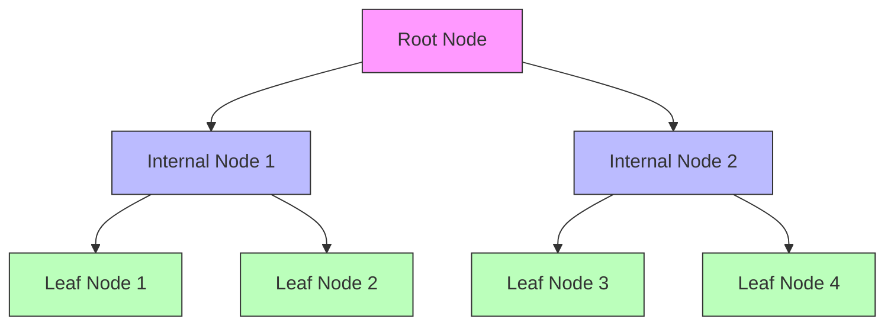

# Introduction to Decision Trees 🌳

After exploring Naive Bayes, KNN, and SVM, we now dive into Decision Trees, one of the most intuitive and interpretable machine learning algorithms.

## What is a Decision Tree?

> **Decision Tree** is a tree-like model that makes decisions by asking a series of questions about the data features.

Think of it like playing "20 Questions":
- Each question helps narrow down the possibilities
- Questions are asked in a strategic order
- The final answer is based on the path taken through the questions

### Real-World Analogy 🎮

Imagine a doctor diagnosing a patient:
1. First question: "Do you have a fever?"
2. If yes: "Is it above 101°F?"
3. If no: "Do you have a cough?"
And so on until reaching a diagnosis.

## Key Components

### 1. Nodes

> **Root Node** is the starting point of the tree, representing the first question or decision.

> **Internal Nodes** are intermediate decision points that split the data based on feature values.

> **Leaf Nodes** are the final nodes that provide the prediction or decision.

### 2. Splits

> **Split** is a decision rule that divides the data into subgroups based on a feature's value.

### 3. Branches

> **Branches** connect nodes and represent the possible outcomes of each decision.

## When to Use Decision Trees? 🤔

### Perfect For:
- When you need interpretable models
- When you have mixed data types
- When you want to discover rules in data
- When feature interactions are important

### Not Great For:
- Very small datasets
- When you need smooth decision boundaries
- When high precision is crucial
- When data has many irrelevant features

## How Does it Fit in the ML Workflow?

Recalling our machine learning workflow from previous lessons:

1. **Problem Definition** 🎯
   - Classification or regression
   - Rule discovery
   - Feature importance analysis

2. **Data Collection** 📊
   - Mixed data types are fine
   - Missing values can be handled
   - Categorical features welcome

3. **Data Preparation** 🧹
   - Less preprocessing needed
   - Can handle raw features
   - No scaling required

4. **Model Selection** 🤖
   - Choose tree depth
   - Set splitting criteria
   - Consider pruning options

5. **Model Evaluation** 📈
   - Check tree structure
   - Analyze feature importance
   - Validate predictions

## Advantages and Limitations

### Advantages ✅
- Easy to understand and interpret
- Requires little data preparation
- Can handle both numerical and categorical data
- Handles missing values well
- Automatically handles feature interactions

### Limitations ❌
- Can create overly complex trees
- May overfit the data
- Can be unstable
- May create biased trees if classes are imbalanced

## Key Decisions in Tree Building 🔑

1. **Splitting Criteria**
   > How to choose the best feature and value for splitting the data at each node.

2. **Stopping Criteria**
   > When to stop growing the tree (e.g., maximum depth, minimum samples).

3. **Pruning Strategy**
   > How to simplify the tree to prevent overfitting.

## Next Steps 📚

In the following sections, we'll dive deeper into:
1. [Tree Structure and Splitting](2-tree-structure.md)
2. [Implementation Basics](3-implementation.md)
3. [Advanced Techniques](4-advanced.md)
4. [Applications and Best Practices](5-applications.md)

Each section builds upon these fundamental concepts, helping you master Decision Trees step by step.
