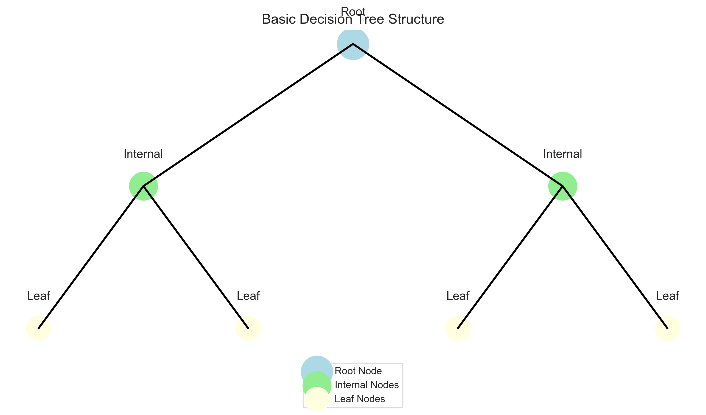

# Introduction to Decision Trees

## Why Learn Decision Trees?

Decision trees are one of the most intuitive and powerful machine learning algorithms. They're perfect for beginners because:

- They mimic how humans make decisions
- They're easy to visualize and understand
- They can handle both numbers and categories
- They provide clear explanations for predictions



## What is a Decision Tree?

Imagine you're trying to decide whether to go for a walk. You might ask yourself:

1. Is it raining? (No)
2. Is it too hot? (No)
3. Do I have time? (Yes)
4. Then I'll go for a walk!

This is exactly how a decision tree works! It's a series of yes/no questions that lead to a final decision.

### Real-World Examples

1. **Medical Diagnosis**
   - Doctor: "Do you have a fever?" (Yes)
   - Doctor: "Is it above 101°F?" (No)
   - Doctor: "Do you have a cough?" (Yes)
   - Diagnosis: "You might have a mild infection"

2. **Loan Approval**
   - Bank: "Is your income above $50,000?" (Yes)
   - Bank: "Is your credit score above 700?" (No)
   - Bank: "Do you have any existing loans?" (No)
   - Decision: "Loan approved with higher interest rate"

## Key Components of a Decision Tree

Let's break down the parts of a decision tree using a simple example:

```python
import numpy as np
import matplotlib.pyplot as plt
from sklearn.tree import DecisionTreeClassifier, plot_tree

# Create a simple dataset for the "go for a walk" decision
# Features: [is_raining, temperature, have_time]
# Values: 0 = No, 1 = Yes for is_raining and have_time
# Temperature is in Fahrenheit
X = np.array([
    [0, 72, 1],  # Not raining, 72°F, have time
    [1, 68, 1],  # Raining, 68°F, have time
    [0, 95, 1],  # Not raining, 95°F, have time
    [0, 75, 0],  # Not raining, 75°F, no time
    [1, 70, 0],  # Raining, 70°F, no time
    [0, 65, 1],  # Not raining, 65°F, have time
    [1, 78, 1],  # Raining, 78°F, have time
    [0, 82, 1]   # Not raining, 82°F, have time
])

# Decision: 1 = go for walk, 0 = don't go for walk
y = np.array([1, 0, 0, 0, 0, 1, 0, 1])

# Create and train the model
tree_model = DecisionTreeClassifier(max_depth=3)
tree_model.fit(X, y)

# Visualize the tree
plt.figure(figsize=(12, 8))
plot_tree(
    tree_model,
    feature_names=['Is Raining', 'Temperature', 'Have Time'],
    class_names=['Stay Home', 'Go for Walk'],
    filled=True,
    rounded=True,
    fontsize=10
)
plt.title('Decision Tree for Walking Decision')
plt.show()

# Make a prediction for a new scenario
new_scenario = np.array([[0, 70, 1]])  # Not raining, 70°F, have time
prediction = tree_model.predict(new_scenario)
print(f"Decision: {'Go for a walk' if prediction[0] == 1 else 'Stay home'}")

# Explain the prediction
feature_importance = tree_model.feature_importances_
features = ['Is Raining', 'Temperature', 'Have Time']
for i, importance in enumerate(feature_importance):
    print(f"{features[i]}: {importance:.2f}")
```

In this decision tree:

1. **Root Node**: The starting point at the top, representing the entire dataset.
2. **Decision Nodes**: Places where the tree splits based on a feature question.
3. **Leaf Nodes**: The end points where we make predictions.
4. **Branches**: Connections between nodes, representing answers to questions.

### Key Terms to Understand

1. **Features** (or attributes): The characteristics we use to make decisions.
   - In our walking example: weather, temperature, available time

2. **Splitting Criteria**: How we decide which feature to use for splitting.
   - Common metrics: Gini impurity, information gain, entropy

3. **Impurity**: How mixed the classes are in a node.
   - Pure node: All samples belong to one class
   - Impure node: Mix of different classes

4. **Pruning**: Removing unnecessary branches to prevent overfitting.
   - Like editing a story to remove unnecessary details

## How Decision Trees Learn

Decision trees learn by finding the best questions to ask that separate the data most effectively:

```python
# Let's see the splitting process visually
from sklearn.datasets import make_classification
import numpy as np
import matplotlib.pyplot as plt
from sklearn.tree import DecisionTreeClassifier

# Create a simple 2D dataset
X, y = make_classification(
    n_samples=100,
    n_features=2,
    n_redundant=0,
    n_informative=2,
    random_state=1,
    n_clusters_per_class=1
)

# Create and train the model
tree_clf = DecisionTreeClassifier(max_depth=3, random_state=42)
tree_clf.fit(X, y)

# Get the decision boundary
def plot_decision_boundary(model, X, y):
    # Set min and max values for plotting
    x_min, x_max = X[:, 0].min() - 1, X[:, 0].max() + 1
    y_min, y_max = X[:, 1].min() - 1, X[:, 1].max() + 1
    
    # Create meshgrid
    xx, yy = np.meshgrid(np.arange(x_min, x_max, 0.02),
                         np.arange(y_min, y_max, 0.02))
    
    # Predict for each point in the meshgrid
    Z = model.predict(np.c_[xx.ravel(), yy.ravel()])
    Z = Z.reshape(xx.shape)
    
    # Plot the contour
    plt.contourf(xx, yy, Z, alpha=0.3)
    plt.scatter(X[:, 0], X[:, 1], c=y, marker='o', edgecolor='k')
    plt.xlabel('Feature 1')
    plt.ylabel('Feature 2')
    plt.title('Decision Tree Boundary')
    plt.show()

# Plot the decision boundary
plot_decision_boundary(tree_clf, X, y)

# Plot the actual tree
plt.figure(figsize=(12, 8))
plot_tree(
    tree_clf,
    feature_names=['Feature 1', 'Feature 2'],
    class_names=['Class 0', 'Class 1'],
    filled=True,
    rounded=True
)
plt.title('Decision Tree Structure')
plt.show()
```

The tree learning process:

1. **Start** with all data in the root node
2. **Find** the best feature and threshold to split the data
3. **Create** child nodes based on the split
4. **Repeat** steps 2-3 for each child node
5. **Stop** when a stopping condition is met (e.g., maximum depth)

## Advantages of Decision Trees

1. **Easy to understand**: They mimic human decision-making
2. **No data preprocessing needed**: No scaling or normalization required
3. **Handle mixed data types**: Both categorical and numerical features
4. **Non-linear relationships**: Can capture complex patterns
5. **Feature importance**: Automatically identify important features

## Limitations of Decision Trees

1. **Overfitting**: Tend to create overly complex trees that don't generalize well
2. **Instability**: Small changes in data can result in very different trees
3. **Biased toward features with more levels**: Can favor features with many unique values
4. **Can't extrapolate**: Can only make predictions within the range of training data

## When to Use Decision Trees

Decision trees are ideal for:

1. **Classification problems** with categorical or numerical features
2. **Interpretable models** where understanding the decision process is important
3. **Feature selection** to identify important variables
4. **As components in more powerful ensemble methods** (Random Forests, Gradient Boosting)

## Practice Exercise

Try building a simple decision tree on your own:

```python
# Simple exercise: Predicting if a student will pass or fail
import numpy as np
from sklearn.tree import DecisionTreeClassifier

# Features: [hours_studied, previous_score, sleep_hours, attendance_percentage]
X_students = np.array([
    [8, 85, 7, 90],   # Student 1
    [3, 70, 5, 75],   # Student 2
    [5, 77, 6, 85],   # Student 3
    [2, 65, 4, 70],   # Student 4
    [7, 90, 8, 95],   # Student 5
    [4, 72, 6, 80],   # Student 6
    [6, 81, 7, 88],   # Student 7
    [3, 68, 5, 65]    # Student 8
])

# Result: 1 = pass, 0 = fail
y_results = np.array([1, 0, 1, 0, 1, 0, 1, 0])

# Create and train model
student_model = DecisionTreeClassifier()
student_model.fit(X_students, y_results)

# Make a prediction for a new student
new_student = np.array([[6, 75, 7, 82]])
result = student_model.predict(new_student)
print(f"Prediction: {'Pass' if result[0] == 1 else 'Fail'}")

# Get feature importance
features = ['Hours Studied', 'Previous Score', 'Sleep Hours', 'Attendance']
importances = student_model.feature_importances_

# Display the most important factor in passing
most_important = features[np.argmax(importances)]
print(f"Most important factor: {most_important}")
```

## Next Steps

Now that you understand the basics of decision trees, let's explore:

1. [How decision trees are structured](2-tree-structure.md)
2. [How to implement them in Python](3-implementation.md)
3. [Advanced techniques and optimizations](4-advanced.md)
4. [Real-world applications](5-applications.md)
