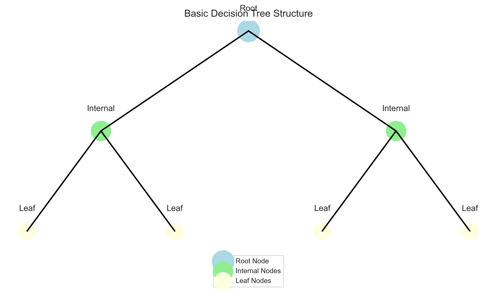
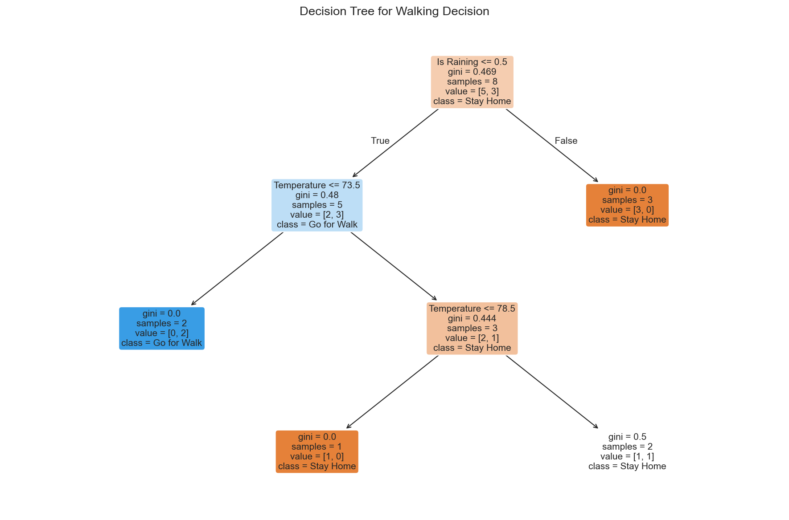
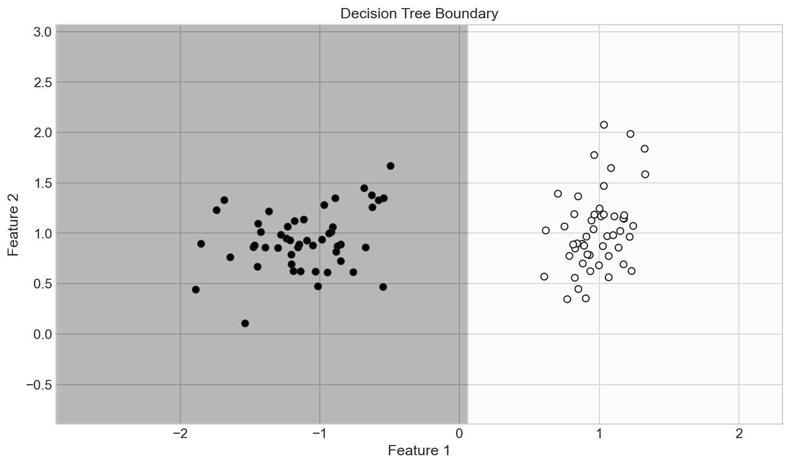
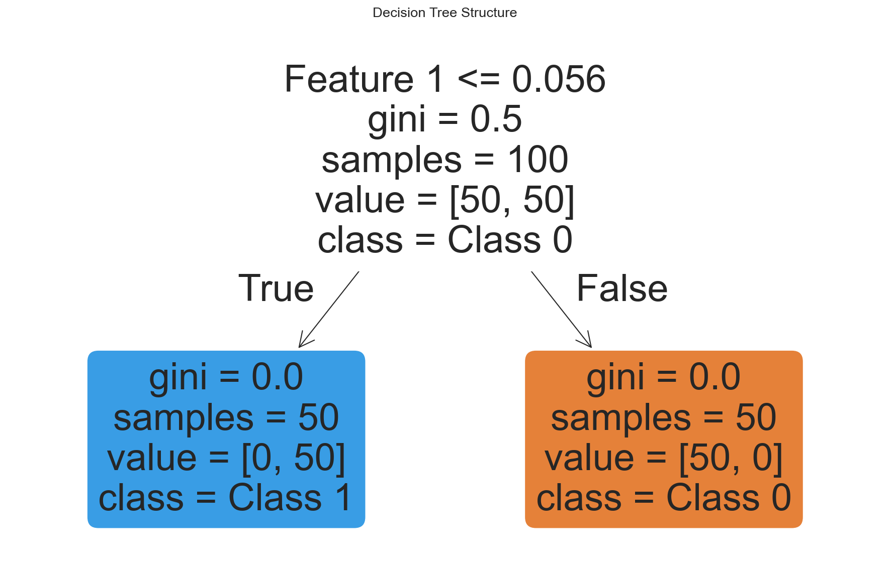

# Introduction to Decision Trees

**After this lesson:** you can explain Introduction to Decision Trees and try the examples in your own notebook.

## Overview

A **decision tree** splits the data with nested if/else rules on features until it reaches a prediction, easy to visualize and explain. This page uses a tiny "go for a walk" example; follow with [tree structure](2-tree-structure.md) and [implementation](3-implementation.md). **Prerequisites:** [Supervised learning 5.2](../); sklearn `fit` / `predict` from [5.1 workflow](../../5.1-intro-to-ml/ml-workflow.md).

## Why Learn Decision Trees?

Decision trees are one of the most intuitive and powerful machine learning algorithms. They're perfect for beginners because:

* They mimic how humans make decisions
* They're easy to visualize and understand
* They can handle both numbers and categories
* They provide clear explanations for predictions



## What is a Decision Tree?

Imagine you're trying to decide whether to go for a walk. You might ask yourself:

1. Is it raining? (No)
2. Is it too hot? (No)
3. Do I have time? (Yes)
4. Then I'll go for a walk!

This is exactly how a decision tree works! It's a series of yes/no questions that lead to a final decision.

### Real-World Examples

1. **Medical Diagnosis**
   * Doctor: "Do you have a fever?" (Yes)
   * Doctor: "Is it above 101°F?" (No)
   * Doctor: "Do you have a cough?" (Yes)
   * Diagnosis: "You might have a mild infection"
2. **Loan Approval**
   * Bank: "Is your income above $50,000?" (Yes)
   * Bank: "Is your credit score above 700?" (No)
   * Bank: "Do you have any existing loans?" (No)
   * Decision: "Loan approved with higher interest rate"

## Key Components of a Decision Tree

Break down the parts of a decision tree using a simple example:

#### Train a toy tree and inspect structure

Data and Tree Fit

Eight hand-crafted walking scenarios with three features (rain, temperature, time) are fitted by `DecisionTreeClassifier(max_depth=3)`; the binary label encodes the go/stay decision.

Visualize Tree

`plot_tree` with `filled=True` colors each node by majority class, making it easy to trace any path from root to leaf and understand the splitting logic.

Predict and Explain

Predict for a new scenario, then print `feature_importances_`, each value is the fraction of total impurity reduction attributed to that feature across all splits.

<figure><figcaption><p>Figure 1: Decision Tree for Walking Decision</p></figcaption></figure>

```
Decision: Go for a walk
Is Raining: 0.49
Temperature: 0.51
Have Time: 0.00
```

In this decision tree:

1. **Root Node**: The starting point at the top, representing the entire dataset.
2. **Decision Nodes**: Places where the tree splits based on a feature question.
3. **Leaf Nodes**: The end points where we make predictions.
4. **Branches**: Connections between nodes, representing answers to questions.

### Key Terms to Understand

1. **Features** (or attributes): The characteristics we use to make decisions.
   * In our walking example: weather, temperature, available time
2. **Splitting Criteria**: How we decide which feature to use for splitting.
   * Common metrics: Gini impurity, information gain, entropy
3. **Impurity**: How mixed the classes are in a node.
   * Pure node: All samples belong to one class
   * Impure node: Mix of different classes
4. **Pruning**: Removing unnecessary branches to prevent overfitting.
   * Like editing a story to remove unnecessary details

## How Decision Trees Learn

Decision trees learn by finding the best questions to ask that separate the data most effectively:

#### 2D synthetic data: decision surface + tree diagram

Generate and Fit

`make_classification` with `n_features=2` produces a 2D dataset ideal for visualizing decision boundaries; `max_depth=3` keeps the tree readable.

Decision Boundary Helper

The helper builds a fine meshgrid, predicts class labels at each point, and fills contour regions, this reveals the axis-aligned rectangular regions that decision trees always produce.

Boundary and Tree Plots

Plot the decision surface first, then `plot_tree` to see the exact splits that produced those rectangular regions side by side.

<figure><figcaption><p>Figure 2: Decision Tree Boundary</p></figcaption></figure>

<figure><figcaption><p>Figure 3: Decision Tree Structure</p></figcaption></figure>

The tree learning process:

1. **Start** with all data in the root node
2. **Find** the best feature and threshold to split the data
3. **Create** child nodes based on the split
4. **Repeat** steps 2-3 for each child node
5. **Stop** when a stopping condition is met (e.g., maximum depth)

## Advantages of Decision Trees

1. **Easy to understand**: They mimic human decision-making
2. **No data preprocessing needed**: No scaling or normalization required
3. **Handle mixed data types**: Both categorical and numerical features
4. **Non-linear relationships**: Can capture complex patterns
5. **Feature importance**: Automatically identify important features

## Limitations of Decision Trees

1. **Overfitting**: Tend to create overly complex trees that don't generalize well
2. **Instability**: Small changes in data can result in very different trees
3. **Biased toward features with more levels**: Can favor features with many unique values
4. **Can't extrapolate**: Can only make predictions within the range of training data

## When to Use Decision Trees

Decision trees are ideal for:

1. **Classification problems** with categorical or numerical features
2. **Interpretable models** where understanding the decision process is important
3. **Feature selection** to identify important variables
4. **As components in more powerful ensemble methods** (Random Forests, Gradient Boosting)

## Practice Exercise

Try building a simple decision tree on your own:

#### Exercise: student pass/fail (`5.2-dt-1-intro-exercise`)

Student Dataset

Eight students with four study-habit features and a binary pass/fail label; the data is intentionally small so the tree structure is easy to inspect manually.

Predict and Rank Features

After fitting, `predict` classifies a new student; `np.argmax(feature_importances_)` identifies the single most influential feature across all splits in the learned tree.

```
Prediction: Pass
Most important factor: Previous Score
```

## Gotchas

* **Fitting a `DecisionTreeClassifier` without `max_depth` on tiny toy data**: the unrestrained tree in the student exercise will memorise the 8 training rows perfectly (training accuracy 1.0) but will often fail on any new student; always set a depth limit or use cross-validation to see through the perfect training score.
* **Misreading `feature_importances_` as a global ranking**: importance values are specific to this fitted tree on this training set; a feature with zero importance was not useful given the _other_ features present, not necessarily unimportant in general; run the same data with a different split and the ranking can change.
* **Assuming the "Go for a Walk" labels are deterministic**: the training data has only 8 rows with mixed outcomes for similar conditions; the learned tree may predict confidently for a new scenario simply because it memorised an adjacent training row, not because it found a true pattern.
* **Calling `plot_tree` without naming features and classes**: the default output shows numeric feature indices and class integers, which are nearly unreadable; always pass `feature_names` and `class_names` before sharing or debugging a tree.
* **Treating `feature_importances_` totalling 1.0 as a percentage of predictive power**: importance measures impurity reduction, not correlation with the target; a single dominant feature (e.g., "Temperature: 0.51") does not mean the other features are useless, only that they contributed less to this tree's splits.

## Next Steps

Now that you understand the basics of decision trees, we will look at:

1. [How decision trees are structured](2-tree-structure.md)
2. [How to implement them in Python](3-implementation.md)
3. [Advanced techniques and optimizations](4-advanced.md)
4. [Real-world applications](5-applications.md)
