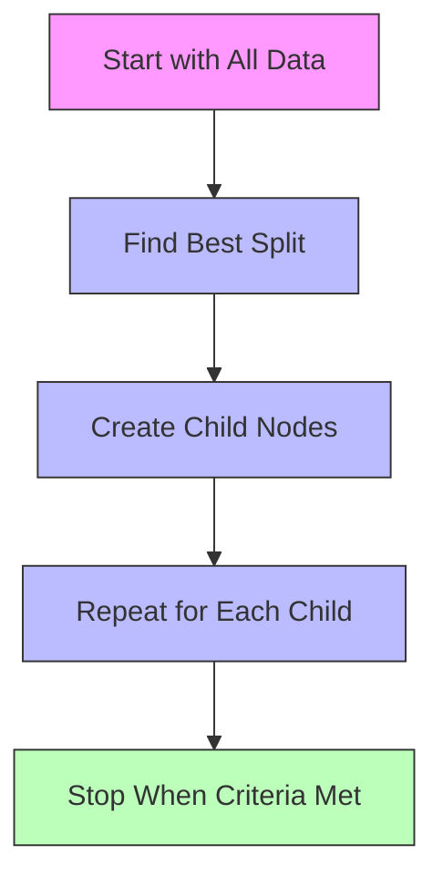
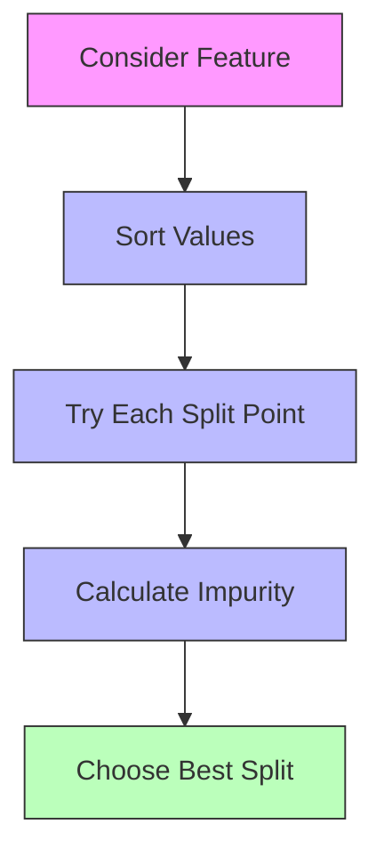

# Tree Structure and Splitting Criteria 🌲

Let's understand how decision trees are constructed and how they make decisions about splitting data.

## Tree Construction Process 🏗️



### How Trees Grow

> **Tree Growing** is the process of recursively splitting the data into smaller subsets until a stopping criterion is met.

1. Start with all data at root node
2. Find best feature and value for splitting
3. Create child nodes with split data
4. Repeat process for each child node
5. Stop when criteria met (e.g., max depth)

## Splitting Criteria 📊

### 1. Gini Impurity (Classification)

> **Gini Impurity** measures how often a randomly chosen element would be incorrectly labeled if labeled randomly according to the distribution of labels in the subset.

For a node with probability $p_i$ for class $i$:

$$\text{Gini} = 1 - \sum_{i=1}^c p_i^2$$

```python
def calculate_gini(y):
    """Calculate Gini impurity for a node"""
    # Get class probabilities
    _, counts = np.unique(y, return_counts=True)
    probabilities = counts / len(y)
    
    # Calculate Gini
    return 1 - np.sum(probabilities ** 2)
```

### 2. Entropy (Classification)

> **Entropy** measures the average level of "information" or "uncertainty" in the node.

Information gain based on entropy:

$$\text{Entropy} = -\sum_{i=1}^c p_i \log_2(p_i)$$

$$\text{Information Gain} = \text{Entropy}_{\text{parent}} - \sum_{j=1}^m \frac{N_j}{N} \text{Entropy}_{\text{child}_j}$$

```python
def calculate_entropy(y):
    """Calculate entropy for a node"""
    _, counts = np.unique(y, return_counts=True)
    probabilities = counts / len(y)
    
    # Calculate entropy
    return -np.sum(probabilities * np.log2(probabilities + 1e-10))
```

### 3. Mean Squared Error (Regression)

> **Mean Squared Error (MSE)** measures the average squared difference between the predicted and actual values.

For a node with values $y_i$ and mean $\bar{y}$:

$$\text{MSE} = \frac{1}{N}\sum_{i=1}^N (y_i - \bar{y})^2$$

```python
def calculate_mse(y):
    """Calculate MSE for a node"""
    return np.mean((y - np.mean(y)) ** 2)
```

## Comparing Splitting Criteria 📈

### Visual Comparison

```python
import numpy as np
import matplotlib.pyplot as plt

def visualize_split_criteria():
    """Compare different splitting criteria"""
    # Generate probabilities
    p = np.linspace(0, 1, 100)
    
    # Calculate metrics
    gini = p * (1 - p)
    entropy = -p * np.log2(p + 1e-10) - (1-p) * np.log2(1-p + 1e-10)
    
    # Plot
    plt.figure(figsize=(10, 6))
    plt.plot(p, gini, label='Gini')
    plt.plot(p, entropy, label='Entropy')
    plt.xlabel('Probability of Class 1')
    plt.ylabel('Impurity Measure')
    plt.title('Comparison of Split Criteria')
    plt.legend()
    plt.grid(True)
    plt.show()
```

## Finding the Best Split 🎯

### Binary Split Process



### Example Implementation

```python
def find_best_split(X, y, feature):
    """Find best split point for a feature"""
    best_gain = -float('inf')
    best_threshold = None
    
    # Sort values
    sorted_idx = np.argsort(X[:, feature])
    sorted_x = X[sorted_idx, feature]
    sorted_y = y[sorted_idx]
    
    # Try each split point
    for i in range(1, len(sorted_x)):
        if sorted_x[i] == sorted_x[i-1]:
            continue
            
        threshold = (sorted_x[i] + sorted_x[i-1]) / 2
        
        # Split data
        left_mask = X[:, feature] <= threshold
        right_mask = ~left_mask
        
        # Calculate information gain
        parent_impurity = calculate_entropy(y)
        left_impurity = calculate_entropy(y[left_mask])
        right_impurity = calculate_entropy(y[right_mask])
        
        # Weighted average of child impurities
        n_left = np.sum(left_mask)
        n_right = np.sum(right_mask)
        n_total = len(y)
        
        weighted_child_impurity = (
            (n_left/n_total) * left_impurity +
            (n_right/n_total) * right_impurity
        )
        
        # Calculate gain
        gain = parent_impurity - weighted_child_impurity
        
        if gain > best_gain:
            best_gain = gain
            best_threshold = threshold
            
    return best_threshold, best_gain
```

## Stopping Criteria ✋

### When to Stop Growing

1. **Maximum Depth**
   > The maximum number of levels allowed in the tree.

2. **Minimum Samples Split**
   > The minimum number of samples required to split a node.

3. **Minimum Samples Leaf**
   > The minimum number of samples required in a leaf node.

4. **Maximum Features**
   > The maximum number of features to consider for splitting.

```python
def should_stop_splitting(node_depth, n_samples, n_classes):
    """Check if splitting should stop"""
    if node_depth >= max_depth:
        return True
    if n_samples < min_samples_split:
        return True
    if n_classes == 1:
        return True
    return False
```

## Tree Properties 📊

### 1. Node Properties

```python
class Node:
    def __init__(self):
        self.feature = None      # Splitting feature
        self.threshold = None    # Split threshold
        self.left = None        # Left child
        self.right = None       # Right child
        self.value = None       # Node prediction
        self.n_samples = None   # Number of samples
        self.impurity = None    # Node impurity
```

### 2. Path Properties

> **Decision Path** is the sequence of decisions from root to leaf that leads to a prediction.

```python
def get_decision_path(tree, x):
    """Get decision path for a sample"""
    node = tree.root
    path = []
    
    while node.left is not None:  # Not a leaf
        if x[node.feature] <= node.threshold:
            path.append((node.feature, '<=', node.threshold))
            node = node.left
        else:
            path.append((node.feature, '>', node.threshold))
            node = node.right
            
    return path
```

## Next Steps 📚

Now that you understand tree structure and splitting:
1. Learn about [implementation basics](3-implementation.md)
2. Explore [advanced techniques](4-advanced.md)
3. See [real-world applications](5-applications.md)

Remember:
- Different splitting criteria suit different problems
- Consider computational efficiency
- Balance tree depth with performance
- Monitor node impurity
