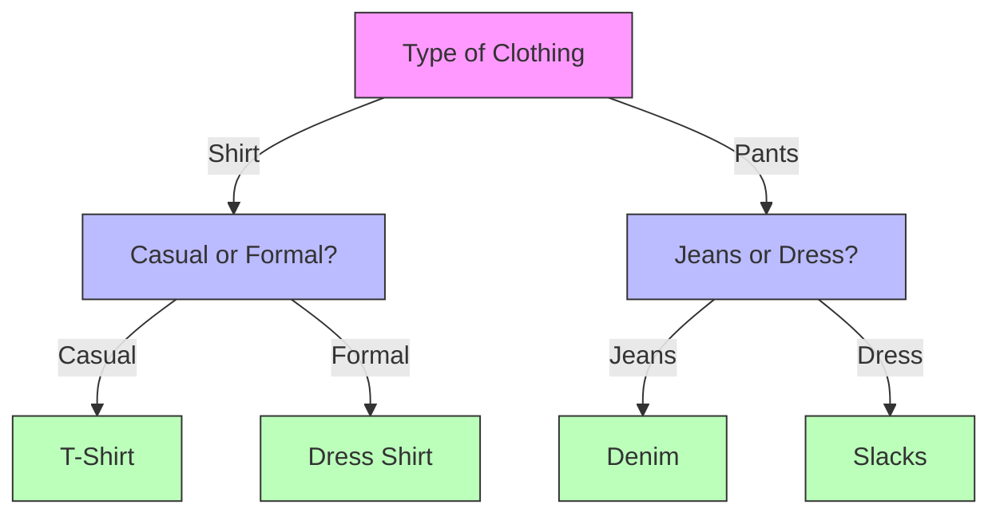

# Understanding How Decision Trees Work

## The Tree Building Process

Think of building a decision tree like organizing a messy room. You want to create a system that helps you find things quickly and efficiently.

### Step-by-Step Example: Organizing Your Clothes

Let's say you want to organize your clothes. You might ask:

1. "Is it a shirt or pants?" (First split)
2. If shirt: "Is it casual or formal?" (Second split)
3. If pants: "Is it jeans or dress pants?" (Second split)

This creates a clear organization system, just like a decision tree!



## How Trees Make Decisions

### The Splitting Process

Imagine you're a teacher trying to group students by their performance. You want to create groups where students in each group are as similar as possible.

1. **First Split**: "Did they complete homework?"
   - Group 1: Completed homework
   - Group 2: Didn't complete homework

2. **Second Split**: For those who completed homework
   - "Did they attend class regularly?"
   - This creates more similar groups

### Measuring Group Similarity

We use special measures to decide how to split the data:

#### 1. Gini Impurity 

Gini impurity measures how "mixed" a group is. A lower Gini value means the group is more "pure" (contains more of one class).

```python
import numpy as np

def calculate_gini(y):
    """Calculate how mixed our groups are using Gini impurity"""
    # If the array is empty, return 0
    if len(y) == 0:
        return 0
        
    # Count how many of each class we have
    _, counts = np.unique(y, return_counts=True)
    
    # Calculate the probability of each class
    probabilities = counts / len(y)
    
    # Calculate Gini (1 - sum of squared probabilities)
    gini = 1 - np.sum(probabilities ** 2)
    
    return gini

# Let's try some examples
perfect_group = np.array(['A', 'A', 'A', 'A', 'A'])  # All one class
mixed_group = np.array(['A', 'A', 'B', 'B', 'C'])    # Mixed classes
balanced_group = np.array(['A', 'A', 'B', 'B'])      # Perfectly balanced

print(f"Perfect group Gini: {calculate_gini(perfect_group):.4f}")
print(f"Mixed group Gini: {calculate_gini(mixed_group):.4f}")
print(f"Balanced group Gini: {calculate_gini(balanced_group):.4f}")
```

When we run this code, we'll see:
- Perfect group has Gini = 0 (completely pure)
- Balanced group has higher Gini (more mixed)
- Mixed group has even higher Gini (most mixed)

#### 2. Entropy

Entropy measures "uncertainty" or "disorder" in a group. Lower entropy means more certainty about the class.

```python
def calculate_entropy(y):
    """Calculate how uncertain we are about the group using entropy"""
    # If the array is empty, return 0
    if len(y) == 0:
        return 0
        
    # Count how many of each class we have
    _, counts = np.unique(y, return_counts=True)
    
    # Calculate the probability of each class
    probabilities = counts / len(y)
    
    # Calculate entropy (-sum of p * log2(p))
    # Add a small value to avoid log(0)
    entropy = -np.sum(probabilities * np.log2(probabilities + 1e-10))
    
    return entropy

# Let's try the same examples
print(f"Perfect group entropy: {calculate_entropy(perfect_group):.4f}")
print(f"Mixed group entropy: {calculate_entropy(mixed_group):.4f}")
print(f"Balanced group entropy: {calculate_entropy(balanced_group):.4f}")
```

When we run this code, we'll see:
- Perfect group has entropy = 0 (complete certainty)
- Balanced group has higher entropy (more uncertainty)
- Mixed group with 3 classes has even higher entropy (most uncertainty)

### Visual Comparison of Impurity Measures

Let's visualize how these measures behave for different class distributions:

```python
import matplotlib.pyplot as plt

# Create a range of probabilities for a binary classification problem
p = np.linspace(0, 1, 100)  # Probability of class 1
gini_values = 1 - (p**2 + (1-p)**2)  # Gini impurity formula for binary case
entropy_values = -p*np.log2(p+1e-10) - (1-p)*np.log2(1-p+1e-10)  # Entropy formula

# Plot both measures
plt.figure(figsize=(10, 6))
plt.plot(p, gini_values, 'b-', label='Gini Impurity')
plt.plot(p, entropy_values, 'r-', label='Entropy')
plt.xlabel('Probability of Class 1')
plt.ylabel('Impurity Value')
plt.title('Comparison of Impurity Measures')
plt.legend()
plt.grid(True)
plt.show()

# Explain what the plot shows
print("When the split is 50/50 (p=0.5), both measures show maximum impurity.")
print("When the split is pure (p=0 or p=1), both measures show zero impurity.")
print("Entropy penalizes highly imbalanced splits slightly more than Gini.")
```

This visualization helps us understand that both measures:
1. Reach their maximum when classes are evenly split (most impure/uncertain)
2. Reach zero when only one class is present (pure/certain)
3. Behave similarly but with slightly different curves

## Finding the Best Split

### The Search Process

How does a decision tree find the best question to ask? It tries all possible features and all possible values for each feature.

Let's implement a simple version of this search:

```python
import numpy as np

def find_best_split(X, y, feature_names):
    """Find the best way to split the data"""
    n_features = X.shape[1]
    best_gain = -float('inf')
    best_feature = None
    best_threshold = None
    parent_impurity = calculate_gini(y)
    
    # Try each feature
    for feature in range(n_features):
        # Get unique values for this feature
        values = np.unique(X[:, feature])
        
        # Try each value as a threshold
        for val in values:
            # Split the data
            left_mask = X[:, feature] <= val
            right_mask = ~left_mask
            
            # Skip if either group is empty
            if np.sum(left_mask) == 0 or np.sum(right_mask) == 0:
                continue
                
            # Calculate impurity for each group
            left_impurity = calculate_gini(y[left_mask])
            right_impurity = calculate_gini(y[right_mask])
            
            # Weight the impurities by group size
            n_left = np.sum(left_mask)
            n_right = np.sum(right_mask)
            n_total = len(y)
            
            weighted_impurity = (n_left/n_total) * left_impurity + (n_right/n_total) * right_impurity
            
            # Calculate information gain
            gain = parent_impurity - weighted_impurity
            
            # Update best split if this one is better
            if gain > best_gain:
                best_gain = gain
                best_feature = feature
                best_threshold = val
    
    if best_feature is not None:
        return best_feature, best_threshold, best_gain
    else:
        return None, None, 0.0

# Let's create a simple dataset
X = np.array([
    [3, 1],  # Sample 1: temp=3, humidity=1
    [2, 3],  # Sample 2: temp=2, humidity=3
    [1, 2],  # Sample 3: temp=1, humidity=2
    [4, 6],  # Sample 4: temp=4, humidity=6
    [5, 5]   # Sample 5: temp=5, humidity=5
])
y = np.array(['good', 'good', 'bad', 'bad', 'good'])
feature_names = ['temperature', 'humidity']

# Find the best split
best_feature, best_threshold, best_gain = find_best_split(X, y, feature_names)

if best_feature is not None:
    print(f"Best split: {feature_names[best_feature]} <= {best_threshold}")
    print(f"Information gain: {best_gain:.4f}")
    
    # Show the resulting split
    left_mask = X[:, best_feature] <= best_threshold
    right_mask = ~left_mask
    
    print("\nLeft group (≤ threshold):")
    for i in range(len(X)):
        if left_mask[i]:
            print(f"  Sample {i+1}: {feature_names[best_feature]}={X[i, best_feature]}, class={y[i]}")
    
    print("\nRight group (> threshold):")
    for i in range(len(X)):
        if right_mask[i]:
            print(f"  Sample {i+1}: {feature_names[best_feature]}={X[i, best_feature]}, class={y[i]}")
```

This example shows:
1. How to calculate information gain for different splits
2. How to find the best split across all features and thresholds
3. How the data gets divided based on the best split

### Visualizing the Split Process

Let's visualize the splitting process on a 2D dataset:

```python
import numpy as np
import matplotlib.pyplot as plt
from sklearn.datasets import make_classification
from sklearn.tree import DecisionTreeClassifier

# Create a simple 2D dataset
X, y = make_classification(
    n_samples=100,
    n_features=2,
    n_redundant=0,
    n_informative=2,
    random_state=42,
    n_clusters_per_class=1
)

# Create and train a decision tree with only one level (stump)
tree_stump = DecisionTreeClassifier(max_depth=1, random_state=42)
tree_stump.fit(X, y)

# Get the split information
feature = tree_stump.tree_.feature[0]  # The feature used for the split
threshold = tree_stump.tree_.threshold[0]  # The threshold used

# Create a meshgrid for plotting
x_min, x_max = X[:, 0].min() - 1, X[:, 0].max() + 1
y_min, y_max = X[:, 1].min() - 1, X[:, 1].max() + 1
xx, yy = np.meshgrid(np.arange(x_min, x_max, 0.1),
                    np.arange(y_min, y_max, 0.1))

# Plot the data points
plt.figure(figsize=(10, 6))
plt.scatter(X[:, 0], X[:, 1], c=y, cmap='viridis', edgecolor='k', s=50)

# Plot the decision boundary
if feature == 0:
    plt.axvline(x=threshold, color='red', linestyle='-', linewidth=2, 
               label=f'Split at feature 0 = {threshold:.2f}')
else:
    plt.axhline(y=threshold, color='red', linestyle='-', linewidth=2,
               label=f'Split at feature 1 = {threshold:.2f}')

plt.title('Decision Tree First Split Visualization')
plt.xlabel('Feature 0')
plt.ylabel('Feature 1')
plt.legend()
plt.grid(True)
plt.show()

# Print the split information
print(f"Best split: Feature {feature} <= {threshold:.4f}")
print(f"Gini impurity before split: {1 - np.sum((np.bincount(y) / len(y))**2):.4f}")

# Calculate the impurity of each child
left_mask = X[:, feature] <= threshold
right_mask = ~left_mask
left_gini = 1 - np.sum((np.bincount(y[left_mask]) / len(y[left_mask]))**2)
right_gini = 1 - np.sum((np.bincount(y[right_mask]) / len(y[right_mask]))**2)

print(f"Gini impurity of left child: {left_gini:.4f}")
print(f"Gini impurity of right child: {right_gini:.4f}")
```

This visualization helps us see:
1. Which feature the tree chose to split on first
2. Where the threshold is placed
3. How the split divides the data into two groups
4. How much each group's impurity is reduced compared to the parent

## When to Stop Growing the Tree

### Stopping Rules

Just like a tree in nature, we need to know when to stop growing our decision tree. Here are some common stopping rules:

```python
import numpy as np
from sklearn.datasets import load_iris
from sklearn.tree import DecisionTreeClassifier
import matplotlib.pyplot as plt

# Load the Iris dataset
iris = load_iris()
X = iris.data
y = iris.target

# Function to evaluate different max_depth settings
def evaluate_tree_depths(X, y, max_depths):
    train_scores = []
    test_scores = []
    node_counts = []
    leaf_counts = []
    
    # Split the data into training (70%) and testing (30%)
    np.random.seed(42)
    indices = np.random.permutation(len(X))
    train_size = int(len(X) * 0.7)
    train_indices = indices[:train_size]
    test_indices = indices[train_size:]
    
    X_train, X_test = X[train_indices], X[test_indices]
    y_train, y_test = y[train_indices], y[test_indices]
    
    for depth in max_depths:
        # Create and train tree with specific depth
        tree = DecisionTreeClassifier(max_depth=depth, random_state=42)
        tree.fit(X_train, y_train)
        
        # Evaluate performance
        train_score = tree.score(X_train, y_train)
        test_score = tree.score(X_test, y_test)
        
        # Count nodes and leaves
        node_count = tree.tree_.node_count
        leaf_count = tree.tree_.n_leaves
        
        # Store results
        train_scores.append(train_score)
        test_scores.append(test_score)
        node_counts.append(node_count)
        leaf_counts.append(leaf_count)
    
    return train_scores, test_scores, node_counts, leaf_counts

# Evaluate trees with different maximum depths
max_depths = range(1, 11)  # Try depths 1 through 10
train_scores, test_scores, node_counts, leaf_counts = evaluate_tree_depths(X, y, max_depths)

# Plot the results
fig, (ax1, ax2) = plt.subplots(1, 2, figsize=(14, 6))

# Plot accuracy vs depth
ax1.plot(max_depths, train_scores, 'o-', label='Training Accuracy')
ax1.plot(max_depths, test_scores, 'o-', label='Testing Accuracy')
ax1.set_xlabel('Maximum Depth')
ax1.set_ylabel('Accuracy')
ax1.set_title('Accuracy vs Tree Depth')
ax1.grid(True)
ax1.legend()

# Plot tree size vs depth
ax2.plot(max_depths, node_counts, 'o-', label='Total Nodes')
ax2.plot(max_depths, leaf_counts, 'o-', label='Leaf Nodes')
ax2.set_xlabel('Maximum Depth')
ax2.set_ylabel('Number of Nodes')
ax2.set_title('Tree Size vs Depth')
ax2.grid(True)
ax2.legend()

plt.tight_layout()
plt.show()

# Find the best depth based on test accuracy
best_depth = max_depths[np.argmax(test_scores)]
print(f"Best maximum depth: {best_depth}")
print(f"Training accuracy at best depth: {train_scores[best_depth-1]:.4f}")
print(f"Testing accuracy at best depth: {test_scores[best_depth-1]:.4f}")
print(f"Number of nodes at best depth: {node_counts[best_depth-1]}")
print(f"Number of leaves at best depth: {leaf_counts[best_depth-1]}")
```

This example demonstrates:

1. **Maximum Depth**: Limits how deep the tree can grow
   - Too shallow: Tree might underfit (not capture important patterns)
   - Too deep: Tree might overfit (memorize training data)

2. **The Overfitting Problem**:
   - Notice how training accuracy keeps increasing with depth
   - But test accuracy usually peaks and then declines
   - This happens because the tree starts memorizing noise in the training data

Let's also explore other stopping criteria:

```python
# Demonstrate other stopping criteria
def explore_stopping_criteria(X, y):
    results = {}
    
    # Split data
    np.random.seed(42)
    indices = np.random.permutation(len(X))
    train_size = int(len(X) * 0.7)
    train_indices = indices[:train_size]
    test_indices = indices[train_size:]
    
    X_train, X_test = X[train_indices], X[test_indices]
    y_train, y_test = y[train_indices], y[test_indices]
    
    # Base case - unrestricted tree
    base_tree = DecisionTreeClassifier(random_state=42)
    base_tree.fit(X_train, y_train)
    results['Unrestricted'] = {
        'train_score': base_tree.score(X_train, y_train),
        'test_score': base_tree.score(X_test, y_test),
        'nodes': base_tree.tree_.node_count,
        'leaves': base_tree.tree_.n_leaves
    }
    
    # Min samples split
    for min_samples in [2, 5, 10, 20]:
        tree = DecisionTreeClassifier(min_samples_split=min_samples, random_state=42)
        tree.fit(X_train, y_train)
        results[f'Min Samples Split={min_samples}'] = {
            'train_score': tree.score(X_train, y_train),
            'test_score': tree.score(X_test, y_test),
            'nodes': tree.tree_.node_count,
            'leaves': tree.tree_.n_leaves
        }
    
    # Min samples leaf
    for min_leaf in [1, 5, 10, 20]:
        tree = DecisionTreeClassifier(min_samples_leaf=min_leaf, random_state=42)
        tree.fit(X_train, y_train)
        results[f'Min Samples Leaf={min_leaf}'] = {
            'train_score': tree.score(X_train, y_train),
            'test_score': tree.score(X_test, y_test),
            'nodes': tree.tree_.node_count,
            'leaves': tree.tree_.n_leaves
        }
    
    return results

# Run the experiment
stopping_results = explore_stopping_criteria(X, y)

# Display the results
print("Stopping Criteria Comparison:\n")
print(f"{'Criterion':<25} {'Train Acc':<10} {'Test Acc':<10} {'Nodes':<10} {'Leaves':<10}")
print('-' * 65)
for name, stats in stopping_results.items():
    print(f"{name:<25} {stats['train_score']:.4f}     {stats['test_score']:.4f}     {stats['nodes']:<10} {stats['leaves']:<10}")
```

This demonstrates two additional stopping criteria:

1. **Minimum Samples Split**: The minimum number of samples required to split a node
   - Higher values prevent the tree from making splits with very few samples
   - This reduces overfitting by ensuring each split is statistically significant

2. **Minimum Samples Leaf**: The minimum number of samples required in a leaf node
   - Higher values ensure that leaf nodes aren't too small
   - This makes predictions more robust and less sensitive to noise

## Common Mistakes and How to Avoid Them

### 1. Overfitting

```python
import numpy as np
import matplotlib.pyplot as plt
from sklearn.datasets import make_moons
from sklearn.tree import DecisionTreeClassifier
from sklearn.model_selection import train_test_split

# Create a noisy dataset
X, y = make_moons(n_samples=200, noise=0.2, random_state=42)
X_train, X_test, y_train, y_test = train_test_split(X, y, test_size=0.3, random_state=42)

# Create meshgrid for plotting decision boundaries
def plot_decision_boundary(ax, model, X, y, title):
    h = 0.02  # Step size
    x_min, x_max = X[:, 0].min() - 0.1, X[:, 0].max() + 0.1
    y_min, y_max = X[:, 1].min() - 0.1, X[:, 1].max() + 0.1
    xx, yy = np.meshgrid(np.arange(x_min, x_max, h),
                         np.arange(y_min, y_max, h))
    
    # Make predictions on the meshgrid
    Z = model.predict(np.c_[xx.ravel(), yy.ravel()])
    Z = Z.reshape(xx.shape)
    
    # Plot the decision boundary
    ax.contourf(xx, yy, Z, alpha=0.3)
    ax.scatter(X[:, 0], X[:, 1], c=y, edgecolor='k', s=30)
    ax.set_title(title)
    ax.set_xlabel('Feature 1')
    ax.set_ylabel('Feature 2')
    
    # Print accuracy
    train_acc = model.score(X_train, y_train)
    test_acc = model.score(X_test, y_test)
    ax.text(0.05, 0.95, f'Train: {train_acc:.2f}, Test: {test_acc:.2f}', 
            transform=ax.transAxes, va='top')

# Create and plot three trees with different depths
fig, axes = plt.subplots(1, 3, figsize=(18, 6))

# Shallow tree (underfitting)
shallow_tree = DecisionTreeClassifier(max_depth=2, random_state=42)
shallow_tree.fit(X_train, y_train)
plot_decision_boundary(axes[0], shallow_tree, X, y, 'Underfitting (max_depth=2)')

# Good balance
balanced_tree = DecisionTreeClassifier(max_depth=4, random_state=42)
balanced_tree.fit(X_train, y_train)
plot_decision_boundary(axes[1], balanced_tree, X, y, 'Good Balance (max_depth=4)')

# Deep tree (overfitting)
deep_tree = DecisionTreeClassifier(max_depth=10, random_state=42)
deep_tree.fit(X_train, y_train)
plot_decision_boundary(axes[2], deep_tree, X, y, 'Overfitting (max_depth=10)')

plt.tight_layout()
plt.show()
```

This visualization clearly shows:

1. **Underfitting**: The shallow tree is too simple and misses important patterns
2. **Good balance**: The balanced tree captures the main structure without overfitting
3. **Overfitting**: The deep tree follows the noise in the training data too closely

### 2. Feature Selection

Decision trees can help us identify which features are most important:

```python
from sklearn.datasets import load_wine
from sklearn.tree import DecisionTreeClassifier
import numpy as np
import matplotlib.pyplot as plt

# Load the Wine dataset (has many features)
wine = load_wine()
X = wine.data
y = wine.target
feature_names = wine.feature_names

# Train a decision tree
tree = DecisionTreeClassifier(max_depth=5, random_state=42)
tree.fit(X, y)

# Get feature importances
importances = tree.feature_importances_
indices = np.argsort(importances)[::-1]  # Sort in descending order

# Plot feature importances
plt.figure(figsize=(12, 6))
plt.bar(range(X.shape[1]), importances[indices], align='center')
plt.xticks(range(X.shape[1]), [feature_names[i] for i in indices], rotation=90)
plt.xlabel('Features')
plt.ylabel('Importance')
plt.title('Feature Importance in Wine Classification')
plt.tight_layout()
plt.show()

# Print top 5 features
print("Top 5 most important features:")
for i in range(5):
    print(f"{i+1}. {feature_names[indices[i]]}: {importances[indices[i]]:.4f}")
```

This example demonstrates:
1. How decision trees naturally assign importance to features
2. How to identify which features are most useful for prediction
3. How this can help with feature selection and understanding your data

## Practice Exercise

Try building a simple decision tree by hand:

```python
# Example dataset: Iris flower features
# Let's simplify to just two features for easy visualization
from sklearn.datasets import load_iris
import numpy as np
import matplotlib.pyplot as plt

# Load data
iris = load_iris()
X = iris.data[:, [0, 2]]  # Sepal length and petal length
y = iris.target
feature_names = [iris.feature_names[0], iris.feature_names[2]]

# Plot the data
plt.figure(figsize=(10, 6))
for target, target_name in enumerate(iris.target_names):
    plt.scatter(X[y == target, 0], X[y == target, 1],
                label=target_name)
plt.xlabel(feature_names[0])
plt.ylabel(feature_names[1])
plt.title('Iris Dataset: Sepal Length vs Petal Length')
plt.legend()
plt.grid(True)
plt.show()

# Manual decision tree exercise
print("Exercise: Try building a decision tree by hand!")
print("1. What would be a good first split?")
print("2. Calculate the Gini impurity for each potential split")
print("3. Draw your decision tree on paper and test it")

# We can provide a hint by showing some possible splits
for feature_idx, feature_name in enumerate(feature_names):
    # Find a few potential thresholds
    values = sorted(set(X[:, feature_idx]))
    thresholds = [np.round((values[i] + values[i+1])/2, 1) for i in range(len(values)-1)][:5]
    
    print(f"\nPotential thresholds for {feature_name}:")
    for threshold in thresholds:
        left_mask = X[:, feature_idx] <= threshold
        left_counts = np.bincount(y[left_mask], minlength=3)
        right_counts = np.bincount(y[~left_mask], minlength=3)
        
        print(f"  Split at {threshold}:")
        print(f"    Left:  {left_counts} (total: {sum(left_counts)})")
        print(f"    Right: {right_counts} (total: {sum(right_counts)})")
```

This exercise lets you:
1. Visualize a real dataset
2. See potential splitting points
3. Practice calculating impurity
4. Build a tree by hand to understand the process

## Next Steps

Now that you understand how trees are built, let's learn how to [implement them in Python](3-implementation.md)!
