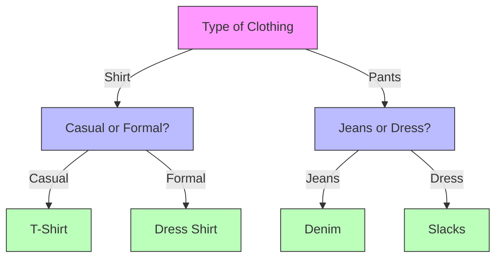
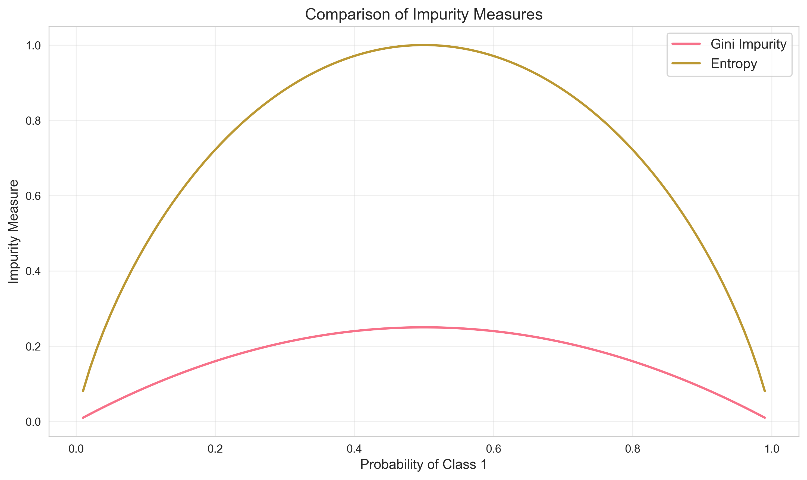

# Understanding How Decision Trees Work

## The Tree Building Process

Think of building a decision tree like organizing a messy room. You want to create a system that helps you find things quickly and efficiently.

### Step-by-Step Example: Organizing Your Clothes

Let's say you want to organize your clothes. You might ask:

1. "Is it a shirt or pants?" (First split)
2. If shirt: "Is it casual or formal?" (Second split)
3. If pants: "Is it jeans or dress pants?" (Second split)

This creates a clear organization system, just like a decision tree!



## How Trees Make Decisions

### The Splitting Process

Imagine you're a teacher trying to group students by their performance. You want to create groups where students in each group are as similar as possible.

1. **First Split**: "Did they complete homework?"
   - Group 1: Completed homework
   - Group 2: Didn't complete homework

2. **Second Split**: For those who completed homework
   - "Did they attend class regularly?"
   - This creates more similar groups

### Measuring Group Similarity

We use special measures to decide how to split the data:

1. **Gini Impurity** (Like measuring how mixed a bag of marbles is)

   ```python
   def calculate_gini(y):
       """Calculate how mixed our groups are"""
       # Count how many of each type we have
       _, counts = np.unique(y, return_counts=True)
       # Calculate the probability of each type
       probabilities = counts / len(y)
       # Calculate Gini (1 - sum of squared probabilities)
       return 1 - np.sum(probabilities ** 2)
   ```

2. **Entropy** (Like measuring how uncertain we are)

   ```python
   def calculate_entropy(y):
       """Calculate how uncertain we are about the group"""
       # Count how many of each type we have
       _, counts = np.unique(y, return_counts=True)
       # Calculate the probability of each type
       probabilities = counts / len(y)
       # Calculate entropy (-sum of p * log2(p))
       return -np.sum(probabilities * np.log2(probabilities + 1e-10))
   ```

### Visualizing the Splitting Process

Let's see how these measures work with a simple example:



## Finding the Best Split

### The Search Process

Imagine you're trying to find the best way to split a group of students into two teams for a game. You want the teams to be as balanced as possible.

1. **Try Different Features**
   - Height
   - Weight
   - Experience
   - Skill level

2. **For Each Feature**
   - Sort the values
   - Try different split points
   - Calculate how balanced the teams are
   - Choose the best split

```python
def find_best_split(X, y, feature):
    """Find the best way to split the data"""
    best_gain = -float('inf')
    best_threshold = None
    
    # Sort the data
    sorted_idx = np.argsort(X[:, feature])
    sorted_x = X[sorted_idx, feature]
    sorted_y = y[sorted_idx]
    
    # Try different split points
    for i in range(1, len(sorted_x)):
        if sorted_x[i] == sorted_x[i-1]:
            continue
            
        # Calculate the threshold
        threshold = (sorted_x[i] + sorted_x[i-1]) / 2
        
        # Split the data
        left_mask = X[:, feature] <= threshold
        right_mask = ~left_mask
        
        # Calculate how good this split is
        parent_impurity = calculate_entropy(y)
        left_impurity = calculate_entropy(y[left_mask])
        right_impurity = calculate_entropy(y[right_mask])
        
        # Weight the impurities
        n_left = np.sum(left_mask)
        n_right = np.sum(right_mask)
        n_total = len(y)
        
        weighted_child_impurity = (
            (n_left/n_total) * left_impurity +
            (n_right/n_total) * right_impurity
        )
        
        # Calculate the improvement
        gain = parent_impurity - weighted_child_impurity
        
        # Keep track of the best split
        if gain > best_gain:
            best_gain = gain
            best_threshold = threshold
            
    return best_threshold, best_gain
```

## When to Stop Growing the Tree

### Stopping Rules

Just like a tree in nature, we need to know when to stop growing our decision tree. Here are some common stopping rules:

1. **Maximum Depth**
   - Like saying "the tree can only be 3 levels deep"
   - Prevents the tree from getting too complex

2. **Minimum Samples Split**
   - Like saying "we need at least 5 students to make a new group"
   - Prevents creating groups that are too small

3. **Minimum Samples Leaf**
   - Like saying "each final group must have at least 2 students"
   - Ensures we have enough data to make good predictions

```python
def should_stop_splitting(node_depth, n_samples, n_classes):
    """Check if we should stop growing the tree"""
    # Stop if we've reached maximum depth
    if node_depth >= max_depth:
        return True
    
    # Stop if we don't have enough samples to split
    if n_samples < min_samples_split:
        return True
    
    # Stop if all samples are the same class
    if n_classes == 1:
        return True
        
    return False
```

## Common Mistakes and How to Avoid Them

1. **Overfitting**
   - Problem: Tree is too complex and memorizes the training data
   - Solution: Limit tree depth, use minimum samples per leaf

2. **Underfitting**
   - Problem: Tree is too simple and misses important patterns
   - Solution: Allow more splits, consider more features

3. **Unstable Trees**
   - Problem: Small changes in data create very different trees
   - Solution: Use ensemble methods (we'll learn about these later)

## Practice Exercise

Try building a simple decision tree by hand:

1. Take a small dataset (like the Iris dataset)
2. Choose a feature to split on
3. Calculate the impurity measures
4. Find the best split point
5. Repeat for the child nodes

## Next Steps

Now that you understand how trees are built, let's learn how to [implement them in Python](3-implementation.md)!
