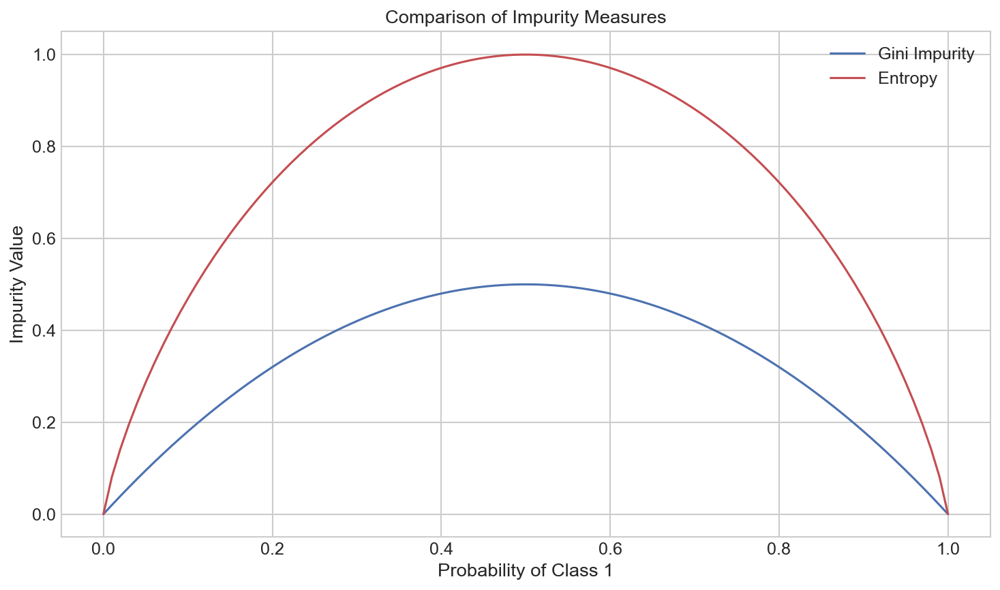
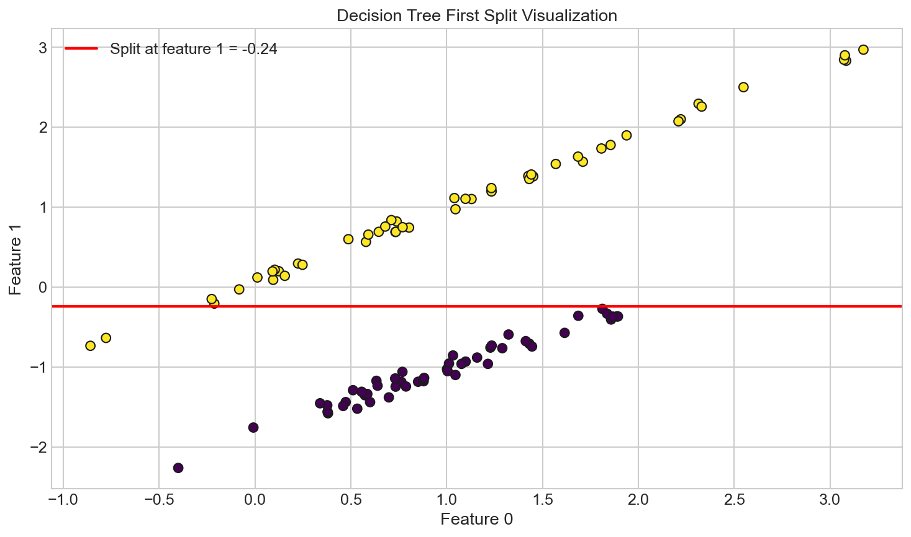
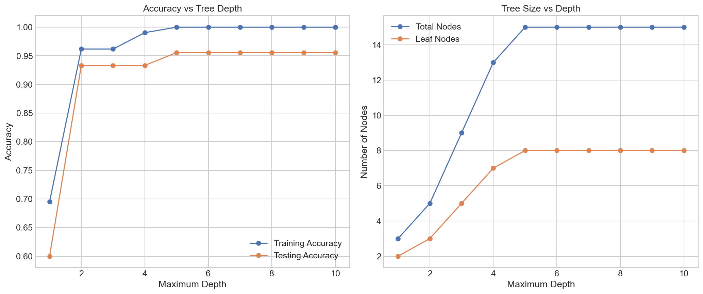
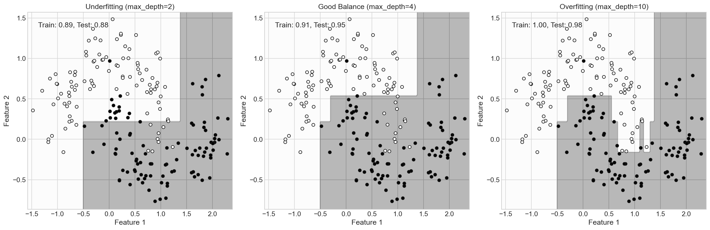
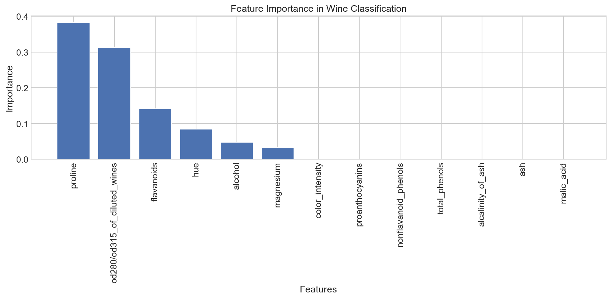
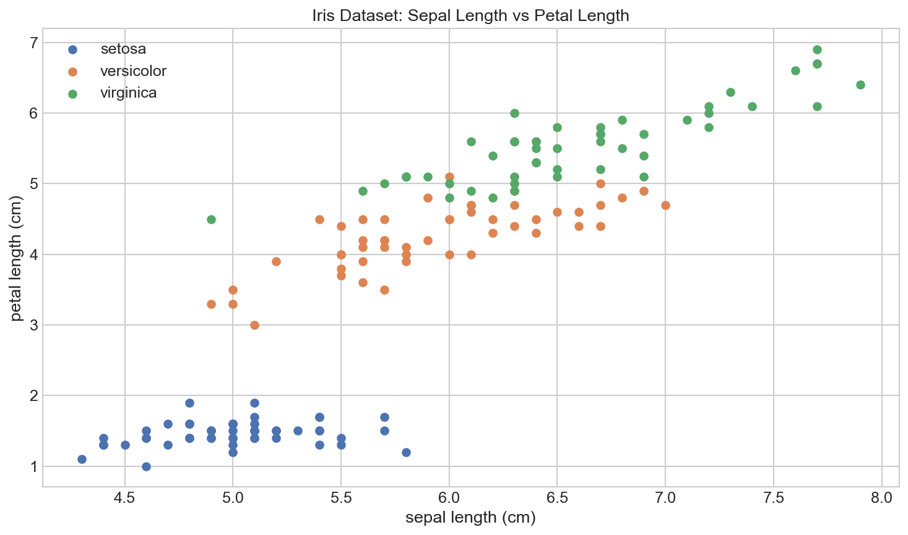

# Understanding How Decision Trees Work

**After this lesson:** you can explain Understanding How Decision Trees Work and try the examples in your own notebook.

## Overview

Here we go deeper on **how** a tree chooses splits: impurity measures (e.g. Gini, entropy), information gain, and how depth and leaf size control the decision surface.

Start from [Introduction](1-introduction.md) if the basic picture is still fuzzy; the submodule hub is [here](../).

## The Tree Building Process

Think of building a decision tree like organizing a messy room. You want to create a system that helps you find things quickly and efficiently.

### Step-by-Step Example: Organizing Your Clothes

Suppose you want to organize your clothes. You might ask:

1. "Is it a shirt or pants?" (First split)
2. If shirt: "Is it casual or formal?" (Second split)
3. If pants: "Is it jeans or dress pants?" (Second split)

This creates a clear organization system, just like a decision tree!

## How Trees Make Decisions

### The Splitting Process

Imagine you're a teacher trying to group students by their performance. You want to create groups where students in each group are as similar as possible.

1. **First Split**: "Did they complete homework?"
   * Group 1: Completed homework
   * Group 2: Didn't complete homework
2. **Second Split**: For those who completed homework
   * "Did they attend class regularly?"
   * This creates more similar groups

### Measuring Group Similarity

We use special measures to decide how to split the data:

#### 1. Gini Impurity

Gini impurity measures how "mixed" a group is. A lower Gini value means the group is more "pure" (contains more of one class).

**Implement Gini from class counts**

Gini Function

`np.unique` counts each class; dividing by length gives class probabilities; the formula `1 − Σp²` equals zero for a pure node and peaks at balanced classes.

Demo Groups

Three arrays test the extremes: a pure group (Gini=0), a balanced binary group (Gini=0.5), and a three-class mix (highest impurity).

```
Perfect group Gini: 0.0000
Mixed group Gini: 0.6400
Balanced group Gini: 0.5000
```

When we run this code, we'll see:

* Perfect group has Gini = 0 (completely pure)
* Balanced group has higher Gini (more mixed)
* Mixed group has even higher Gini (most mixed)

#### 2. Entropy

Entropy measures "uncertainty" or "disorder" in a group. Lower entropy means more certainty about the class.

**Shannon entropy for a label vector**

Entropy Function

Shannon entropy `−Σ p log₂p`; adding `1e-10` prevents `log(0)` when a class is absent without meaningfully affecting the result.

Same Group Comparison

Reusing the three groups from the Gini demo lets you directly compare how the two measures score identical distributions.

```
Perfect group entropy: -0.0000
Mixed group entropy: 1.5219
Balanced group entropy: 1.0000
```

When we run this code, we'll see:

* Perfect group has entropy = 0 (complete certainty)
* Balanced group has higher entropy (more uncertainty)
* Mixed group with 3 classes has even higher entropy (most uncertainty)

### Visual Comparison of Impurity Measures

Visualize how these measures behave for different class distributions:

**Plot Gini vs entropy for binary class probability $p$**

Closed-Form Values

Both curves are computed analytically over 100 probability values using the two-class formulas, no training required.

Overlay Plot

Plotting both on the same axes shows that entropy has a slightly higher peak and penalizes near-balanced splits more than Gini does.

Key Takeaways

Both measures peak at `p=0.5` and hit zero at pure nodes; entropy uses a logarithm so its scale differs from Gini's quadratic curve.

<figure><figcaption><p>Figure 1: Comparison of Impurity Measures</p></figcaption></figure>

```
When the split is 50/50 (p=0.5), both measures show maximum impurity.
When the split is pure (p=0 or p=1), both measures show zero impurity.
Entropy penalizes highly imbalanced splits slightly more than Gini.
```

This visualization helps us understand that both measures:

1. Reach their maximum when classes are evenly split (most impure/uncertain)
2. Reach zero when only one class is present (pure/certain)
3. Behave similarly but with slightly different curves

## Finding the Best Split

### The Search Process

How does a decision tree find the best question to ask? It tries all possible features and all possible values for each feature.

Implement a simple version of this search:

**Greedy search for one split (maximize information gain)**

Greedy Split Search

Nested loops test every unique threshold for every feature; information gain = parent Gini minus weighted average child Gini; the best is tracked and returned.

Toy Dataset

Five samples with temperature and humidity features give a small matrix where you can verify the winning split by hand.

Print Result

Shows which feature and threshold won, the information gain, and the membership of the left and right child groups after the split.

```
Best split: temperature <= 1
Information gain: 0.1800

Left group (≤ threshold):
  Sample 3: temperature=1, class=bad

Right group (> threshold):
  Sample 1: temperature=3, class=good
  Sample 2: temperature=2, class=good
  Sample 4: temperature=4, class=bad
  Sample 5: temperature=5, class=good
```

This example shows:

1. How to calculate information gain for different splits
2. How to find the best split across all features and thresholds
3. How the data gets divided based on the best split

### Visualizing the Split Process

Visualize the splitting process on a 2D dataset:

**First split of a tree (`max_depth=1` stump)**

Generate and Fit

`make_classification` creates 100 two-feature samples; `max_depth=1` forces the tree to learn exactly one split (a "stump").

Read Split from Tree

`tree_.feature[0]` and `tree_.threshold[0]` expose the root node's chosen feature index and threshold value.

Visualize Boundary

A vertical line for feature 0 or horizontal line for feature 1 overlays the data scatter, making the axis-aligned nature of tree boundaries clear.

Verify Gini Drop

Parent Gini and left/right child Gini values are printed; the difference (information gain) should be positive and confirms why this split was chosen.

<figure><figcaption><p>Figure 2: Decision Tree First Split Visualization</p></figcaption></figure>

```
Best split: Feature 1 <= -0.2393
Gini impurity before split: 0.5000
Gini impurity of left child: 0.0740
Gini impurity of right child: 0.0000
```

This visualization helps us see:

1. Which feature the tree chose to split on first
2. Where the threshold is placed
3. How the split divides the data into two groups
4. How much each group's impurity is reduced compared to the parent

## When to Stop Growing the Tree

### Stopping Rules

Just like a tree in nature, we need to know when to stop growing our decision tree. Here are some common stopping rules:

**Iris: train/test accuracy and tree size vs `max_depth`**

Depth Evaluation Helper

Fits a new tree at each depth on the same 70/30 split, recording accuracy and node/leaf counts so you can directly compare complexity vs generalization.

Run Sweep

Depths 1-10 are evaluated in a single call, returning four parallel lists aligned by depth index.

Dual Plot

Left panel shows train vs test accuracy (reveals overfitting at high depth); right panel shows how node and leaf count grow as the tree deepens.

Best Depth Summary

`argmax(test_scores)` picks the depth that maximized held-out accuracy; in practice use cross-validation rather than a single hold-out for stability.

<figure><figcaption><p>Figure 3: Accuracy vs Tree Depth</p></figcaption></figure>

```
Best maximum depth: 5
Training accuracy at best depth: 1.0000
Testing accuracy at best depth: 0.9556
Number of nodes at best depth: 15
Number of leaves at best depth: 8
```

This example demonstrates:

1. **Maximum Depth**: Limits how deep the tree can grow
   * Too shallow: Tree might underfit (not capture important patterns)
   * Too deep: Tree might overfit (memorize training data)
2. **The Overfitting Problem**:
   * Notice how training accuracy keeps increasing with depth
   * But test accuracy usually peaks and then declines
   * This happens because the tree starts memorizing noise in the training data

Explore other stopping criteria:

**`min_samples_split` and `min_samples_leaf` vs unrestricted tree**

Baseline Tree

An unrestricted tree fits until all leaves are pure; its node count and accuracy serve as the upper bound for complexity comparisons.

Sweep Two Hyperparameters

Four values each of `min_samples_split` and `min_samples_leaf` are tested; higher values force larger splits and limit leaf size, reducing tree complexity.

Tabular Summary

A formatted table prints all configurations side by side so you can see the accuracy-complexity trade-off at a glance.

```
Stopping Criteria Comparison:

Criterion                 Train Acc  Test Acc   Nodes      Leaves
-----------------------------------------------------------------
Unrestricted              1.0000     0.9556     15         8
Min Samples Split=2       1.0000     0.9556     15         8
Min Samples Split=5       0.9810     0.9111     11         6
Min Samples Split=10      0.9619     0.9333     9          5
Min Samples Split=20      0.9619     0.9333     9          5
Min Samples Leaf=1        1.0000     0.9556     15         8
Min Samples Leaf=5        0.9619     0.9333     9          5
Min Samples Leaf=10       0.9619     0.9333     9          5
Min Samples Leaf=20       0.9619     0.9333     5          3
```

This demonstrates two additional stopping criteria:

1. **Minimum Samples Split**: The minimum number of samples required to split a node
   * Higher values prevent the tree from making splits with very few samples
   * This reduces overfitting by ensuring each split is statistically significant
2. **Minimum Samples Leaf**: The minimum number of samples required in a leaf node
   * Higher values ensure that leaf nodes aren't too small
   * This makes predictions more reliable and less sensitive to noise

## Common Mistakes and How to Avoid Them

### 1. Overfitting

**`make_moons`: shallow vs deep decision boundaries**

Noisy Moons Data

`make_moons` with `noise=0.2` creates a two-class dataset with non-linear boundaries and overlapping points, ideal for showing overfitting.

Boundary Plot Helper

A meshgrid is predicted and rendered with `contourf`; train and test accuracy are embedded as text in the upper-left corner of each panel.

Three Depth Comparisons

Depths 2, 4, and 10 show under-, balanced, and overfitted boundaries side by side; the jagged regions at depth 10 are the hallmark of overfitting.

<figure><figcaption><p>Figure 4: Underfitting (max_depth=2)</p></figcaption></figure>

This visualization clearly shows:

1. **Underfitting**: The shallow tree is too simple and misses important patterns
2. **Good balance**: The balanced tree captures the main structure without overfitting
3. **Overfitting**: The deep tree follows the noise in the training data too closely

### 2. Feature Selection

Decision trees can help us identify which features are most important:

**Wine dataset: `feature_importances_` bar chart**

Load and Train

Wine has 13 physicochemical features; a depth-5 tree is fit on all 178 samples to produce importances that reflect impurity reduction per feature.

Sort Importances

`argsort` with `[::-1]` gives descending rank; the indices array reorders both the bars and x-tick labels in the same pass.

Bar Chart and Top 5

The bar chart shows all features ranked; the loop below prints the top five with exact importance scores for quick reference.

<figure><figcaption><p>Figure 5: Feature Importance in Wine Classification</p></figcaption></figure>

```
Top 5 most important features:
1. proline: 0.3825
2. od280/od315_of_diluted_wines: 0.3120
3. flavanoids: 0.1414
4. hue: 0.0838
5. alcohol: 0.0473
```

This example demonstrates:

1. How decision trees naturally assign importance to features
2. How to identify which features are most useful for prediction
3. How this can help with feature selection and understanding your data

## Practice Exercise

Try building a simple decision tree by hand:

#### Exercise: Iris 2D scatter + candidate split counts (`5.2-dt-2-structure-exercise`)

Two-Feature Scatter

Only sepal length and petal length are kept so the split space is 2D and easy to reason about by eye before writing any splitting code.

Exercise Prompt

Three guiding questions direct the learner to manually inspect the scatter, compute Gini, and sketch the tree before running any code.

Threshold Hints

For each feature, five midpoint thresholds are printed with left/right class counts so the learner can compute Gini for each candidate by hand.

<figure><figcaption><p>Figure 6: Iris Dataset: Sepal Length vs Petal Length</p></figcaption></figure>

```
Exercise: Try building a decision tree by hand!
1. What would be a good first split?
2. Calculate the Gini impurity for each potential split
3. Draw your decision tree on paper and test it

Potential thresholds for sepal length (cm):
  Split at 4.4:
    Left:  [4 0 0] (total: 4)
    Right: [46 50 50] (total: 146)
  Split at 4.4:
    Left:  [4 0 0] (total: 4)
    Right: [46 50 50] (total: 146)
  Split at 4.6:
    Left:  [9 0 0] (total: 9)
    Right: [41 50 50] (total: 141)
  Split at 4.6:
    Left:  [9 0 0] (total: 9)
    Right: [41 50 50] (total: 141)
  Split at 4.8:
    Left:  [16  0  0] (total: 16)
    Right: [34 50 50] (total: 134)

Potential thresholds for petal length (cm):
  Split at 1.0:
    Left:  [1 0 0] (total: 1)
    Right: [49 50 50] (total: 149)
  Split at 1.2:
    Left:  [4 0 0] (total: 4)
    Right: [46 50 50] (total: 146)
  Split at 1.2:
    Left:  [4 0 0] (total: 4)
    Right: [46 50 50] (total: 146)
  Split at 1.4:
    Left:  [24  0  0] (total: 24)
    Right: [26 50 50] (total: 126)
  Split at 1.4:
    Left:  [24  0  0] (total: 24)
    Right: [26 50 50] (total: 126)
```

This exercise lets you:

1. Visualize a real dataset
2. See potential splitting points
3. Practice calculating impurity
4. Build a tree by hand to understand the process

## Gotchas

* **Selecting `max_depth` based on the training accuracy curve alone**: the depth sweep shows training accuracy monotonically increasing with depth; you must look at the _test_ accuracy curve (which peaks then drops) and use that peak as your depth guide, not the training curve.
* **Confusing information gain of zero with a useless feature**: `find_best_split` will return zero gain if no feature can improve purity at all (e.g., the node is already pure); this is a valid stopping condition, not a bug in the implementation.
* **Assuming Gini and entropy always produce the same tree structure**: the custom-impurity comparison shows Gini produces 127 nodes and entropy produces 117 on the same dataset; the split chosen at each node can differ, leading to structurally different trees even when final accuracy is similar.
* **Picking `best_depth` via `np.argmax(test_scores)` on a single held-out split**: this optimises for one random 70/30 split and will overfit to that particular test partition; use cross-validation to select depth in practice rather than picking the single best score from one split.
* **Misinterpreting impurity-based feature importance for correlated features**: if `proline` and `alcohol` are correlated in the Wine dataset, the tree may assign all importance to one and zero to the other depending on which it splits on first; this is a known limitation of single-tree importance (random forests with permutation importance are more reliable).
* **Treating the threshold printed in `find_best_split` as a universal threshold**: the greedy algorithm finds the best split threshold for the _current node's subset_ of data; a threshold of `temperature <= 3` at the root does not mean that threshold is meaningful deeper in the tree where the data distribution has already changed.

## Next Steps

Now that you understand how trees are built, learn how to [implement them in Python](3-implementation.md)!
