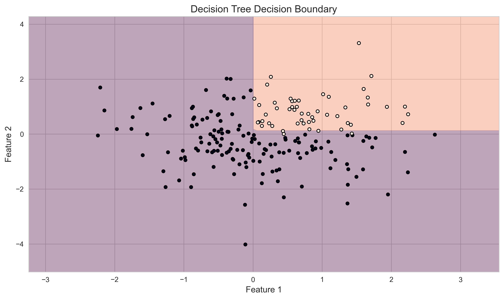
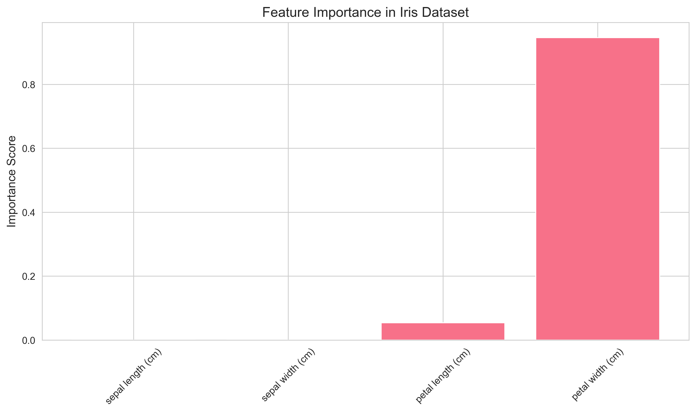

# Building Your First Decision Tree

## Getting Started with Scikit-learn

Scikit-learn is like a toolbox for machine learning. It provides ready-to-use implementations of many algorithms, including decision trees. Let's learn how to use it!

### Installation

First, make sure you have scikit-learn installed:

```bash
pip install scikit-learn
```

## Your First Decision Tree: Disease Diagnosis

Let's build a simple system that helps diagnose whether someone might be sick based on their symptoms.

### Step 1: Prepare the Data

```python
import numpy as np
from sklearn.tree import DecisionTreeClassifier, plot_tree
import matplotlib.pyplot as plt

# Create sample data
# Each row represents a patient
# Columns: [temperature, cough, fatigue]
# Values: 0 = No, 1 = Yes
X = np.array([
    [101, 1, 1],  # Patient 1: High temp, cough, fatigue
    [99, 0, 0],   # Patient 2: Normal temp, no cough, no fatigue
    [102, 1, 1],  # Patient 3: High temp, cough, fatigue
    [98, 0, 1],   # Patient 4: Normal temp, no cough, fatigue
    [100, 1, 0]   # Patient 5: Slightly high temp, cough, no fatigue
])

# Labels: 'sick' or 'healthy'
y = ['sick', 'healthy', 'sick', 'healthy', 'healthy']
```

### Step 2: Create and Train the Model

```python
def train_disease_classifier():
    """Train a simple disease classifier"""
    # Create the model
    # Think of these parameters as settings for the tree
    clf = DecisionTreeClassifier(
        max_depth=3,          # Don't let the tree get too deep
        min_samples_split=2,  # Need at least 2 samples to split
        min_samples_leaf=1    # Each leaf needs at least 1 sample
    )
    
    # Train the model
    # This is where the tree learns from the data
    clf.fit(X, y)
    
    # Visualize the tree
    plt.figure(figsize=(15, 10))
    plot_tree(
        clf,
        feature_names=['temperature', 'cough', 'fatigue'],
        class_names=['healthy', 'sick'],
        filled=True,    # Color the nodes
        rounded=True    # Make it look nice
    )
    plt.title('Disease Diagnosis Decision Tree')
    plt.show()
    
    return clf

# Train the model
model = train_disease_classifier()
```

### Step 3: Make Predictions

```python
# New patient data
new_patient = np.array([[100, 1, 1]])  # Temperature: 100, Cough: Yes, Fatigue: Yes

# Make prediction
prediction = model.predict(new_patient)
print(f"Diagnosis: {prediction[0]}")
```

## Understanding the Tree Visualization

The tree visualization shows:

1. **Questions** at each node (e.g., "temperature <= 100.5")
2. **Gini impurity** (how mixed the groups are)
3. **Samples** in each node
4. **Class distribution** (how many healthy vs sick)

## House Price Prediction Example

Let's build a more complex example: predicting house prices based on features.

### Step 1: Prepare the Data

```python
from sklearn.model_selection import train_test_split

# Sample house data
# Each row: [size, bedrooms, age]
X = np.array([
    [1400, 3, 10],  # House 1
    [1600, 3, 8],   # House 2
    [1700, 4, 15],  # House 3
    [1875, 4, 5],   # House 4
    [1100, 2, 20]   # House 5
])

# Prices in dollars
y = np.array([250000, 280000, 300000, 350000, 200000])
```

### Step 2: Create the Model

```python
class HousePricePredictor:
    def __init__(self, max_depth=3):
        """Initialize the predictor"""
        self.model = DecisionTreeRegressor(
            max_depth=max_depth,
            min_samples_split=5,
            min_samples_leaf=2
        )
        
    def train(self, X, y):
        """Train the model and evaluate it"""
        # Split data into training and testing sets
        X_train, X_test, y_train, y_test = train_test_split(
            X, y, 
            test_size=0.2,      # Use 20% for testing
            random_state=42     # For reproducibility
        )
        
        # Train the model
        self.model.fit(X_train, y_train)
        
        # Evaluate performance
        train_score = self.model.score(X_train, y_train)
        test_score = self.model.score(X_test, y_test)
        
        print(f"Training R² Score: {train_score:.3f}")
        print(f"Testing R² Score: {test_score:.3f}")
        
    def predict(self, features):
        """Predict house price"""
        return self.model.predict(features)
```

### Step 3: Use the Model

```python
# Create and train the predictor
predictor = HousePricePredictor()
predictor.train(X, y)

# Predict price for a new house
new_house = np.array([[1500, 3, 12]])
predicted_price = predictor.predict(new_house)
print(f"Predicted price: ${predicted_price[0]:,.2f}")
```

## Visualizing Decision Boundaries

Decision trees create boundaries in the feature space to separate different classes:



## Understanding Feature Importance

Not all features are equally important in making predictions. Let's see which features matter most:



## Common Mistakes to Avoid

1. **Overfitting**

   ```python
   # Bad: Tree too deep
   clf = DecisionTreeClassifier(max_depth=20)
   
   # Good: Reasonable depth
   clf = DecisionTreeClassifier(max_depth=3)
   ```

2. **Data Leakage**

   ```python
   # Bad: Using test data in training
   clf.fit(X_test, y_test)
   
   # Good: Proper train/test split
   X_train, X_test, y_train, y_test = train_test_split(X, y, test_size=0.2)
   clf.fit(X_train, y_train)
   ```

3. **Ignoring Feature Scaling**

   ```python
   # Bad: Not scaling features
   clf.fit(X, y)
   
   # Good: Scale features first
   from sklearn.preprocessing import StandardScaler
   scaler = StandardScaler()
   X_scaled = scaler.fit_transform(X)
   clf.fit(X_scaled, y)
   ```

## Practice Exercise

Try building your own decision tree:

1. Choose a dataset (Iris or Titanic are good starters)
2. Split the data into training and testing sets
3. Create and train a decision tree
4. Make predictions and evaluate the model
5. Visualize the tree and feature importance

## Next Steps

Ready to learn more? Check out:

1. [Advanced techniques](4-advanced.md) for improving your trees
2. [Real-world applications](5-applications.md) of decision trees
3. How to combine multiple trees into powerful ensembles
