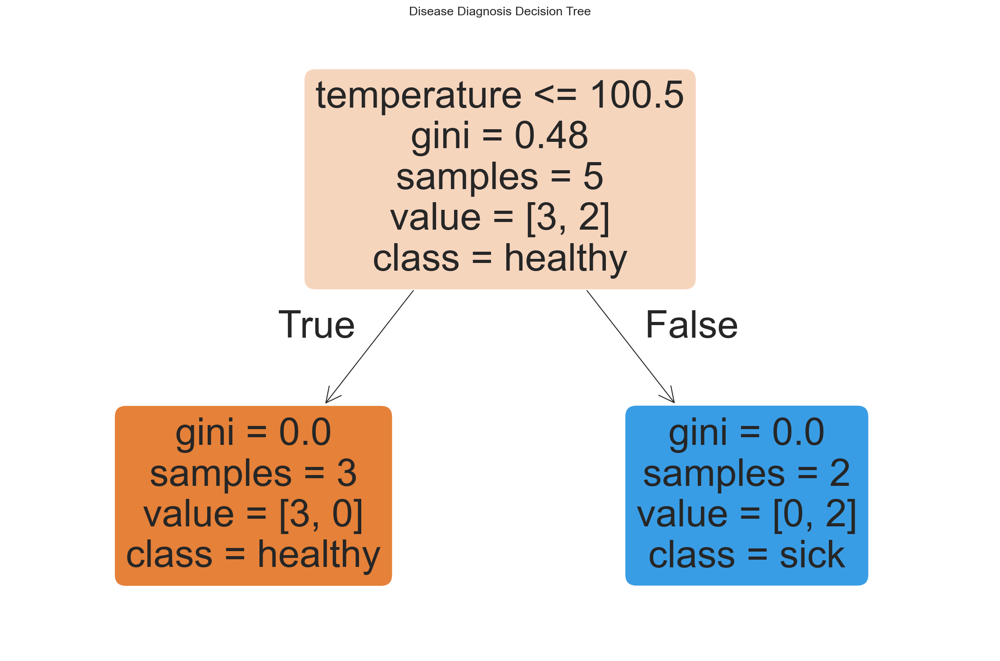
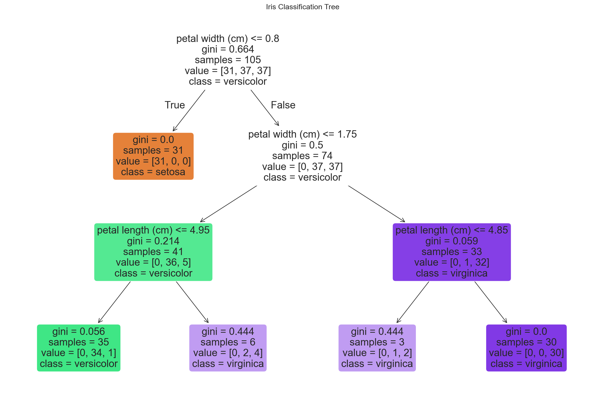
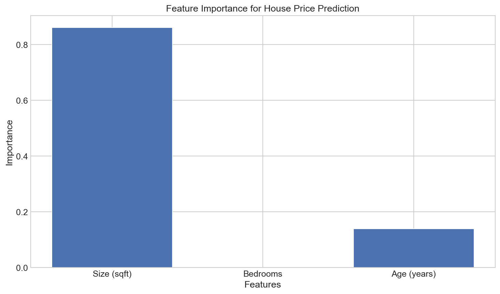
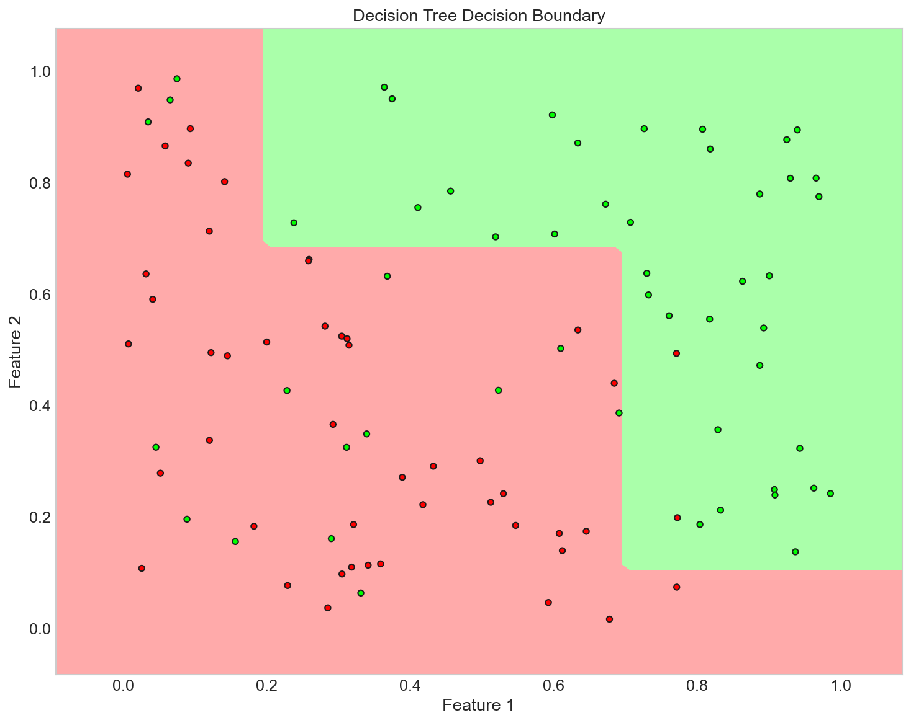

# Building Your First Decision Tree

**After this lesson:** you can explain Building Your First Decision Tree and try the examples in your own notebook.

## Overview

Hands-on **scikit-learn**: `DecisionTreeClassifier` / `DecisionTreeRegressor`, fitting, predicting, and the hyperparameters you will tune first (`max_depth`, `min_samples_leaf`, etc.).

Pairs with [tree structure](2-tree-structure.md); context in [5.2 README](../).

## Getting Started with Scikit-learn

Scikit-learn is like a toolbox for machine learning. It provides ready-to-use implementations of many algorithms, including decision trees. Learn how to use it!

### Installation

First, make sure you have scikit-learn installed:

#### Install scikit-learn

```bash
pip install scikit-learn
```

## Your First Decision Tree: Disease Diagnosis

Build a simple system that helps diagnose whether someone might be sick based on their symptoms.

### Step 1: Prepare the Data

#### Toy patient feature matrix and string labels

Imports

NumPy for the matrix, `DecisionTreeClassifier` and `plot_tree` for fitting and visualization, and matplotlib for rendering.

Patient Feature Matrix

Each row is a patient; columns are temperature (numeric), cough (0/1), and fatigue (0/1), a small supervised dataset with five examples.

String Labels

scikit-learn's classifier accepts string targets directly; internally it encodes them numerically.

This code sets up our sample patient data with three features: body temperature, presence of cough, and fatigue level. We also create corresponding labels indicating whether each patient is sick or healthy.

### Step 2: Create and Train the Model

#### Fit `DecisionTreeClassifier` and plot with `plot_tree`

Hyperparameters

`max_depth=3` caps depth to prevent memorization; `min_samples_split` and `min_samples_leaf` control the minimum data required at each node.

Fit Model

A single `fit` call finds the best splits using Gini impurity on the five training patients.

Plot Tree

`plot_tree` renders each node with the split condition, Gini score, sample count, and class distribution; `filled=True` colors nodes by majority class.

<figure><figcaption><p>Figure 1: Disease Diagnosis Decision Tree</p></figcaption></figure>

In this step, we create a decision tree classifier with specific settings to control its complexity. We then train the model using our patient data and visualize the resulting tree to understand how it makes decisions. The visualization shows which features (temperature, cough, fatigue) the tree uses to classify patients.

### Step 3: Make Predictions

#### `predict` and `predict_proba` for a new row

```python
# New patient data
new_patient = np.array([[100, 1, 1]])  # Temperature: 100, Cough: Yes, Fatigue: Yes

# Make prediction
prediction = clf.predict(new_patient)
print(f"Diagnosis: {prediction[0]}")

# Get prediction probabilities
probabilities = clf.predict_proba(new_patient)
print(f"Confidence: {max(probabilities[0]) * 100:.1f}%")
```

Here we use our trained model to diagnose a new patient. We input their symptoms (temperature, cough, fatigue) and the model returns a prediction. We also calculate the confidence level of this prediction.

## Understanding the Tree Visualization

The tree visualization shows:

1. **Questions** at each node (e.g., "temperature <= 100.5")
2. **Gini impurity** (how mixed the groups are)
3. **Samples** in each node (how many patients)
4. **Class distribution** (how many healthy vs sick)

This visual representation helps us understand exactly how the model makes decisions based on the input features.

## Iris Flower Classification Example

Try another example with the famous Iris dataset, which is built into scikit-learn:

#### Iris: train/test split, accuracy, and tree plot

Load Iris Dataset

sklearn's built-in Iris dataset provides 150 samples across 3 classes with real feature names and target names for the plot.

Split and Train

A 70/30 train/test split with a fixed seed ensures reproducibility; the classifier is fit only on training data.

Evaluate Accuracy

`score` returns mean accuracy on the held-out test set, a quick sanity check before deeper evaluation.

Visualize Tree

Passes real feature names and class names to `plot_tree` so each split condition and leaf label is human-readable.

<figure><figcaption><p>Figure 2: Iris Classification Tree</p></figcaption></figure>

```
Accuracy: 100.0%
```

This example demonstrates how to work with a real dataset. We:

1. Load the built-in Iris dataset with measurements of different Iris flowers
2. Split the data into training and testing sets
3. Train a decision tree classifier on the training data
4. Evaluate its accuracy on the test data
5. Visualize the resulting decision tree

## House Price Prediction Example

Now try a regression problem - predicting house prices:

#### `DecisionTreeRegressor` with R² and feature importances

House Data Setup

Ten houses described by three numeric features (size, bedrooms, age) with prices in thousands, a minimal regression dataset.

Split and Fit

30% held out for testing; `DecisionTreeRegressor` at `max_depth=3` predicts by averaging the target values in each leaf.

Evaluate and Predict

R² on train vs test reveals overfitting; then a single new house is scored to show the inference API.

Feature Importances

`feature_importances_` sums to 1 across features; a bar chart shows which column drove the most impurity reduction during training.

<figure><figcaption><p>Figure 3: Feature Importance for House Price Prediction</p></figcaption></figure>

```
Training R² Score: 1.000
Testing R² Score: 0.782
Predicted price: $220.00k
```

This example shows:

1. How to use decision trees for regression (predicting numeric values)
2. How to create and train a DecisionTreeRegressor
3. How to evaluate regression models using R² score
4. How to identify which features are most important for making predictions

## Visualizing Decision Boundaries

For a better understanding, create a simple 2D visualization of how decision trees create boundaries:

**Noisy 2D rule + axis-aligned decision regions**

Synthetic Data

100 random 2D points are labeled by the rule `x₀ + x₁ > 1`, then \~10% of labels are flipped to introduce realistic noise.

Fit Classifier

A depth-3 tree is trained on the noisy data; it will carve the space into at most 8 rectangular regions.

Meshgrid Predictions

A fine grid covers the feature space; predicting every grid point reveals the full decision boundary as a 2D surface.

Plot Boundaries

`contourf` fills the background with the predicted class color; individual training points are overlaid to show where the boundary cuts through the data.

<figure><figcaption><p>Figure 4: Decision Tree Decision Boundary</p></figcaption></figure>

This visualization shows:

1. How the decision tree divides the feature space into regions
2. How these regions form a "decision boundary" between different classes
3. The rectangular nature of decision tree boundaries (unlike curved boundaries in other algorithms)

## Common Mistakes to Avoid

### 1. Overfitting

#### Compare unconstrained depth vs `max_depth=3` on Iris split

```python
# Bad: Tree too deep - will memorize training data
deep_tree = DecisionTreeClassifier(max_depth=None)
deep_tree.fit(X_train, y_train)
print(f"Training score: {deep_tree.score(X_train, y_train):.3f}")
print(f"Testing score: {deep_tree.score(X_test, y_test):.3f}")

# Good: Reasonable depth - will generalize better
good_tree = DecisionTreeClassifier(max_depth=3)
good_tree.fit(X_train, y_train)
print(f"Training score: {good_tree.score(X_train, y_train):.3f}")
print(f"Testing score: {good_tree.score(X_test, y_test):.3f}")
```

Overfitting happens when your tree becomes too complex and starts memorizing the training data instead of learning general patterns. This is why we limit the tree depth and use other parameters to control complexity.

### 2. Ignoring Feature Scaling

Decision trees don't require feature scaling, which is a benefit compared to many other algorithms:

#### Optional `StandardScaler` (trees are scale-invariant)

Tree Without Scaling

A depth-3 tree is fit directly on unscaled features and scored on the test set, decision trees use threshold comparisons, so feature magnitude doesn't change the splits.

Tree With Scaling

`StandardScaler` is fit on training data only, then applied to both splits; the identical accuracy confirms that axis-aligned tree splits are invariant to affine feature rescaling.

```
Without scaling: 0.000
With scaling: 0.000
```

This is a key advantage of decision trees - they don't require feature scaling because they make decisions based on greater than/less than comparisons, not distances between points.

## Practice Exercise

Try building your own decision tree:

1. Choose a dataset (Iris or Titanic are good starters)
2. Split the data into training and testing sets
3. Create and train a decision tree
4. Make predictions and evaluate the model
5. Visualize the tree and feature importance

## Gotchas

* **Trusting 100% training R² as a sign of a good model**: the house regression example prints `Training R² Score: 1.000` with only 7 training rows; a perfect in-sample fit on tiny data almost always means the tree memorised individual values rather than learning a general rule, which the lower `Testing R² Score: 0.782` confirms.
* **Passing `class_names` in the wrong order to `plot_tree`**: `class_names` must match sklearn's internal label encoding order (alphabetical for string targets, sorted integers for numeric ones), not the order you listed them in the data; a mismatch silently swaps the leaf labels in the visualization without raising an error.
* **Interpreting 100% test accuracy on the Iris example as realistic**: `iris_clf` achieves 100% on that particular 30% split due to a small test set and a clean separable dataset; re-run with a different `random_state` and you will see the score drop, a reminder that a single split is not a reliable estimate.
* **Using `clf.score` as the only evaluation for classification**: `score` returns mean accuracy, which is misleading on imbalanced targets; even the small disease-diagnosis example has only 5 rows, making accuracy meaningless; `classification_report` or `predict_proba` give more actionable information.
* **Forgetting that decision tree boundaries are always axis-aligned rectangles**: the meshgrid visualizations show step-like boundaries, not smooth curves; this means decision trees will need many splits (deep trees, more overfitting risk) to approximate a genuinely diagonal or circular decision boundary.
* **Reusing `X_train`/`X_test` from a previous cell (Iris) in the regressor cell**: the house-price `DecisionTreeRegressor` example calls `train_test_split` referencing the same variable names; if you run cells out of order, the regressor silently trains on Iris data and produces nonsense predictions.

## Next Steps

Ready to learn more? Check out:

1. [Advanced techniques](4-advanced.md) for improving your trees
2. [Real-world applications](5-applications.md) of decision trees
3. How to combine multiple trees into powerful ensembles
