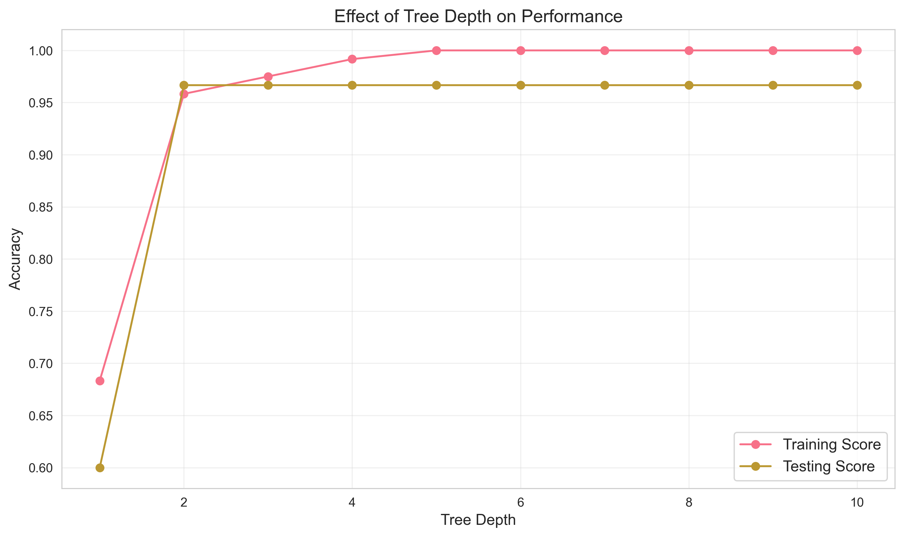
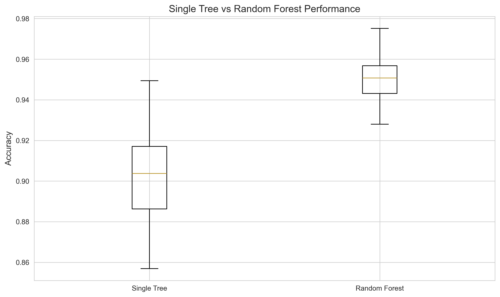

# Advanced Decision Tree Techniques

## Understanding Tree Pruning

Think of pruning like trimming a tree in your garden. You remove unnecessary branches to keep the tree healthy and manageable.

### Why Prune Trees?

1. **Prevent Overfitting**
   - Like removing unnecessary details from a story
   - Keeps the model from memorizing the training data
   - Makes the model more generalizable

2. **Improve Performance**
   - Faster predictions
   - Less memory usage
   - Clearer decision rules

### Types of Pruning

#### 1. Pre-pruning (Early Stopping)

This is like setting rules before the tree starts growing:

```python
from sklearn.tree import DecisionTreeClassifier

class PrePrunedTree:
    def __init__(self):
        """Create a tree with strict growth rules"""
        self.model = DecisionTreeClassifier(
            max_depth=3,              # Don't grow too deep
            min_samples_split=20,     # Need enough samples to split
            min_samples_leaf=5,       # Each leaf needs enough samples
            max_features='sqrt',      # Consider subset of features
            min_impurity_decrease=0.01  # Only split if it helps enough
        )
        
    def analyze_parameters(self, X, y):
        """See how different settings affect the tree"""
        # Try different parameter combinations
        params = {
            'max_depth': [3, 5, 7, 10],
            'min_samples_split': [10, 20, 50],
            'min_samples_leaf': [5, 10, 20]
        }
        
        # Test each combination
        results = {}
        for param, values in params.items():
            scores = []
            for value in values:
                # Update parameter
                setattr(self.model, param, value)
                # Evaluate performance
                score = cross_val_score(
                    self.model, X, y, cv=5
                ).mean()
                scores.append(score)
            results[param] = scores
            
        # Visualize results
        self._plot_parameter_impact(results)
        
    def _plot_parameter_impact(self, results):
        """Show how parameters affect performance"""
        fig, axes = plt.subplots(1, 3, figsize=(15, 5))
        for ax, (param, scores) in zip(axes, results.items()):
            ax.plot(scores, marker='o')
            ax.set_title(f'Impact of {param}')
            ax.grid(True)
        plt.tight_layout()
        plt.show()
```

#### 2. Post-pruning (Cost-Complexity Pruning)

This is like trimming the tree after it's grown:

```python
def optimize_tree_complexity(X, y):
    """Find the best balance between tree size and accuracy"""
    # Create initial tree
    tree = DecisionTreeClassifier()
    
    # Get pruning path
    path = tree.cost_complexity_pruning_path(X, y)
    ccp_alphas = path.ccp_alphas
    
    # Try different pruning levels
    trees = []
    for ccp_alpha in ccp_alphas:
        tree = DecisionTreeClassifier(ccp_alpha=ccp_alpha)
        tree.fit(X, y)
        trees.append(tree)
    
    # Plot tree size vs alpha
    node_counts = [tree.tree_.node_count for tree in trees]
    plt.figure(figsize=(10, 6))
    plt.plot(ccp_alphas, node_counts, marker='o')
    plt.xlabel('Pruning Strength (alpha)')
    plt.ylabel('Number of Nodes')
    plt.title('Tree Size vs Pruning Strength')
    plt.show()
    
    return trees, ccp_alphas
```

## Understanding Pruning Effects

The depth of a tree significantly affects its performance. Let's see how:



## Advanced Tree Growing Techniques

### 1. Custom Splitting Criteria

Sometimes the standard ways of splitting aren't enough. You might want to create your own rules:

```python
from sklearn.tree._criterion import Criterion
import numpy as np

class CustomSplitCriterion:
    """Example of custom splitting rule"""
    def node_impurity(self, y):
        """Calculate how mixed a node is"""
        # Count how many of each class
        _, counts = np.unique(y, return_counts=True)
        probabilities = counts / len(y)
        
        # Custom impurity measure (cubic instead of quadratic)
        return 1 - np.sum(probabilities ** 3)
        
    def children_impurity(self, y_left, y_right):
        """Calculate impurity after split"""
        n_left = len(y_left)
        n_right = len(y_right)
        n_total = n_left + n_right
        
        # Weighted average of child impurities
        return (
            (n_left/n_total) * self.node_impurity(y_left) +
            (n_right/n_total) * self.node_impurity(y_right)
        )
```

### 2. Dynamic Feature Selection

Choose different features at different levels of the tree:

```python
class SmartFeatureSelector:
    def __init__(self, n_features=10):
        """Initialize feature selector"""
        self.n_features = n_features
        
    def select_features(self, X, y, depth):
        """Choose features based on tree depth"""
        if depth < 3:
            # Use all features at top levels
            return list(range(X.shape[1]))
        else:
            # Use most important features for deeper levels
            importances = self._get_feature_importance(X, y)
            return np.argsort(importances)[-self.n_features:]
            
    def _get_feature_importance(self, X, y):
        """Calculate feature importance"""
        tree = DecisionTreeClassifier(max_depth=1)
        tree.fit(X, y)
        return tree.feature_importances_
```

## Introduction to Tree Ensembles

Think of ensembles like a team of experts working together. Each expert (tree) might make mistakes, but together they're more accurate.

### 1. Random Forest Preview

```python
from sklearn.ensemble import RandomForestClassifier

def compare_single_vs_forest(X, y):
    """Compare single tree vs forest of trees"""
    # Single tree
    tree = DecisionTreeClassifier(max_depth=3)
    tree_scores = cross_val_score(tree, X, y, cv=5)
    
    # Random forest
    forest = RandomForestClassifier(
        n_estimators=100,  # Number of trees
        max_depth=3        # Depth of each tree
    )
    forest_scores = cross_val_score(forest, X, y, cv=5)
    
    # Plot comparison
    plt.figure(figsize=(8, 6))
    plt.boxplot([tree_scores, forest_scores], 
                labels=['Single Tree', 'Random Forest'])
    plt.title('Which is Better: One Expert or Many?')
    plt.ylabel('Accuracy')
    plt.show()
```

### 2. Gradient Boosting Preview

This is like learning from your mistakes. Each new tree tries to fix the errors of the previous ones:

```python
from sklearn.ensemble import GradientBoostingClassifier

def learn_from_mistakes(X, y):
    """Show how boosting improves over time"""
    boosting = GradientBoostingClassifier(
        n_estimators=100,      # Number of trees
        learning_rate=0.1,     # How much to learn from each mistake
        max_depth=3            # Depth of each tree
    )
    
    # Track performance as we add more trees
    train_scores = []
    test_scores = []
    
    # Split data
    X_train, X_test, y_train, y_test = train_test_split(
        X, y, test_size=0.2
    )
    
    # Train and track performance
    for i in range(1, 101):
        boosting.n_estimators = i
        boosting.fit(X_train, y_train)
        train_scores.append(boosting.score(X_train, y_train))
        test_scores.append(boosting.score(X_test, y_test))
    
    # Plot learning progress
    plt.figure(figsize=(10, 6))
    plt.plot(train_scores, label='Training')
    plt.plot(test_scores, label='Testing')
    plt.xlabel('Number of Trees')
    plt.ylabel('Accuracy')
    plt.title('Learning from Mistakes Over Time')
    plt.legend()
    plt.show()
```

## Comparing Single Trees vs Ensembles

Let's see how ensembles compare to single trees:



## Advanced Visualization Techniques

### 1. Interactive Tree Explorer

```python
def explore_tree_interactively(model, feature_names):
    """Create interactive tree visualization"""
    from dtreeviz.trees import dtreeviz
    
    viz = dtreeviz(
        model,
        X_train,
        y_train,
        target_name='target',
        feature_names=feature_names,
        class_names=list(model.classes_)
    )
    
    return viz
```

### 2. Decision Path Highlighter

```python
def highlight_decision_path(model, X, feature_names):
    """Show how a specific prediction was made"""
    # Get decision path
    path = model.decision_path(X)
    
    # Create visualization
    plt.figure(figsize=(20, 10))
    plot_tree(
        model,
        feature_names=feature_names,
        filled=True,
        rounded=True
    )
    
    # Highlight the path
    for node_id in path.indices:
        plt.gca().get_xticklabels()[node_id].set_color('red')
    
    plt.show()
```

## Common Advanced Techniques

1. **Handling Imbalanced Data**

   ```python
   # Use class weights
   clf = DecisionTreeClassifier(
       class_weight='balanced'  # Give more weight to minority class
   )
   ```

2. **Feature Engineering**

   ```python
   # Create interaction features
   X['feature1_x_feature2'] = X['feature1'] * X['feature2']
   ```

3. **Cross-Validation**

   ```python
   # Use stratified k-fold for imbalanced data
   from sklearn.model_selection import StratifiedKFold
   cv = StratifiedKFold(n_splits=5)
   ```

## Practice Exercise

Try these advanced techniques:

1. Implement pre-pruning and post-pruning
2. Compare their effects on model performance
3. Try different ensemble methods
4. Visualize the results

## Next Steps

Ready to apply these techniques? Check out:

1. [Real-world applications](5-applications.md)
2. How to deploy decision trees in production
3. Advanced ensemble methods
4. Hyperparameter tuning techniques
