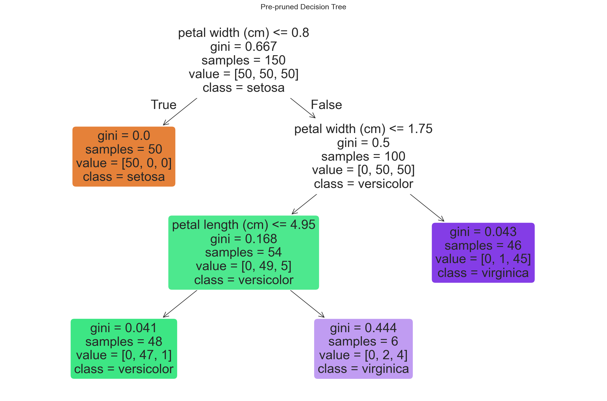
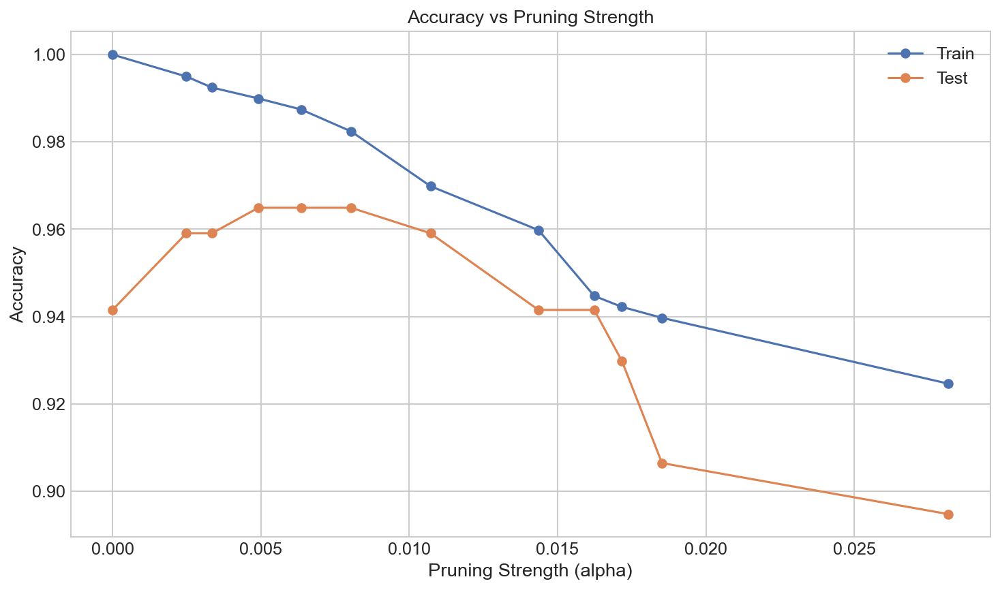
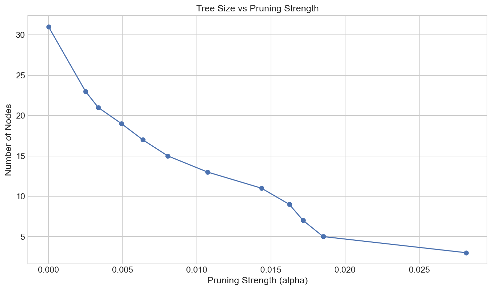
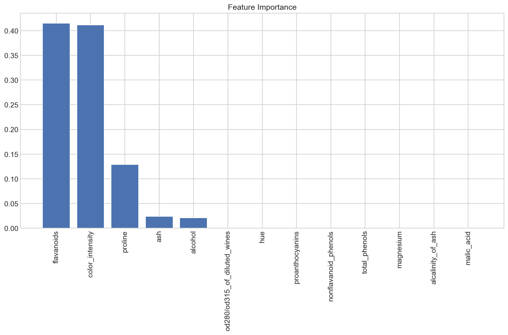
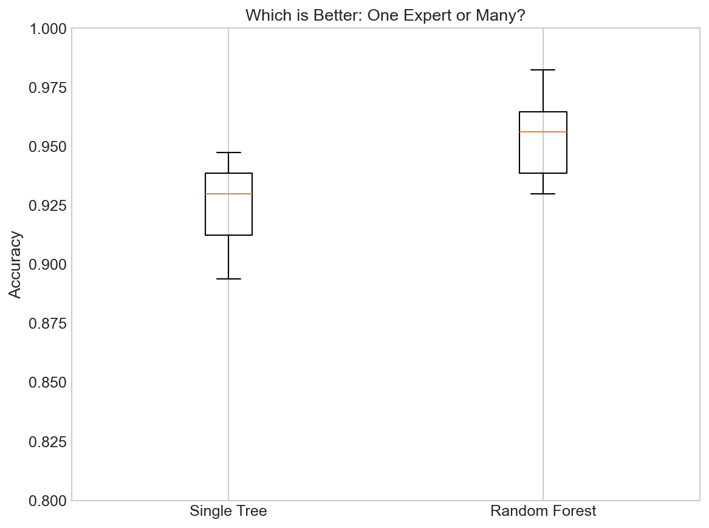
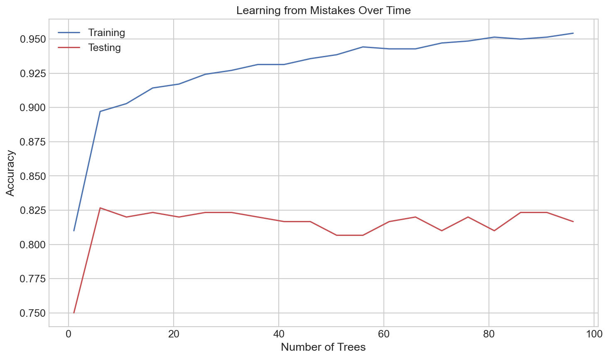
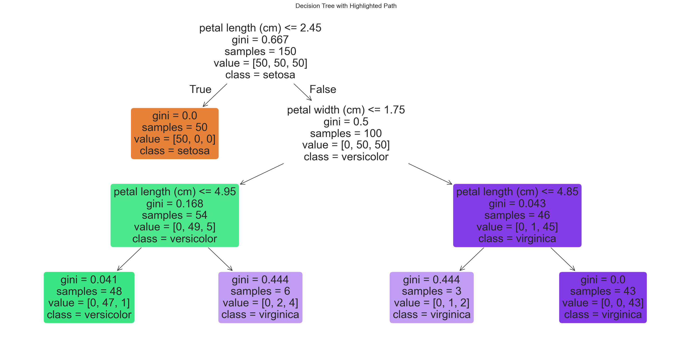

# Advanced Decision Tree Techniques

**After this lesson:** you can explain Advanced Decision Tree Techniques and try the examples in your own notebook.

## Overview

**Pruning**, cost-complexity ideas, and ways to curb overfitting when a single tree is still the right interpretable model.

See [implementation](3-implementation.md) for baseline code paths.

## Understanding Tree Pruning

Think of pruning like trimming a tree in your garden. You remove unnecessary branches to keep the tree healthy and manageable.

### Why Prune Trees?

1. **Prevent Overfitting**
   * Like removing unnecessary details from a story
   * Keeps the model from memorizing the training data
   * Makes the model more generalizable
2. **Improve Performance**
   * Faster predictions
   * Less memory usage
   * Clearer decision rules

### Types of Pruning

#### 1. Pre-pruning (Early Stopping)

This is like setting rules before the tree starts growing:

**Pre-pruning hyperparameters on Iris**

Imports and Data

Iris is a clean 150-sample dataset; it gives reproducible results to demonstrate the effect of each pre-pruning hyperparameter.

Five Pruning Controls

All five constraints fire together: depth cap, minimum split size, minimum leaf size, feature subsampling, and minimum impurity gain per split.

Fit and Evaluate

5-fold CV on the full dataset gives an honest accuracy estimate without a separate test split for this small demo.

Visualize Tree

`plot_tree` renders the pruned result so you can visually confirm the tree is compact compared to an unconstrained version.

<figure><figcaption><p>Figure 1: Pre-pruned Decision Tree</p></figcaption></figure>

```
Average accuracy: 0.940
```

Pre-pruning is a preventative approach where we set limits before training the tree. This prevents the tree from growing too complex in the first place. The parameters used above control different aspects of tree complexity:

* `max_depth`: Limits how deep the tree can grow
* `min_samples_split`: Requires a minimum number of samples to split a node
* `min_samples_leaf`: Ensures each leaf node has enough samples
* `max_features`: Limits how many features to consider at each split
* `min_impurity_decrease`: Only allows splits that improve purity by a certain amount

#### 2. Post-pruning (Cost-Complexity Pruning)

This is like trimming the tree after it's grown:

**Cost-complexity pruning path (`ccp_alpha`)**

Get Pruning Path

`cost_complexity_pruning_path` returns the sequence of `ccp_alphas` at which subtrees are removed; removing the last avoids a trivially pruned root.

Sweep Alpha Values

A new tree is refit at each alpha; higher alpha prunes more aggressively, trading training accuracy for smaller tree size and (usually) better generalization.

Dual Plots

Accuracy vs alpha shows the sweet spot; node count vs alpha shows how aggressively the tree shrinks as pruning increases.

Best Alpha Summary

`argmax(test_scores)` picks the pruning level with best held-out accuracy; the resulting node count shows how compact the optimal tree is.

<figure><figcaption><p>Figure 2: Accuracy vs Pruning Strength</p></figcaption></figure>

<figure><figcaption><p>Figure 3: Tree Size vs Pruning Strength</p></figcaption></figure>

```
Best pruning parameter: 0.004915
Training accuracy: 0.990
Testing accuracy: 0.965
Tree size: 19 nodes
```

Post-pruning is a corrective approach where we first grow a full tree and then trim it back. The `ccp_alpha` parameter controls the strength of pruning:

* Higher values lead to more pruning (smaller trees)
* Lower values lead to less pruning (larger trees)

The optimal pruning strength balances underfitting and overfitting, maximizing performance on unseen data.

## Advanced Tree Growing Techniques

### Custom Impurity Measures

This example shows how to implement and use a custom impurity function:

**Toy "cubic" impurity vs `gini` / `entropy` trees**

Synthetic Dataset

1,000 samples with 10 features (5 informative, 2 redundant) give a realistic classification task to compare criterion choices.

Cubic Impurity

Replaces the squared probabilities of Gini with cubed ones; this de-emphasizes moderate imbalance and focuses on near-pure vs very mixed nodes.

Criterion Comparison

Gini and entropy trees are fit identically and compared on in-sample accuracy and node count to show how the criterion affects tree structure.

```
Sample 1 impurity: 0.480
Sample 2 impurity: 0.720
Sample 3 impurity: 0.720
Gini criterion - Accuracy: 1.000, Nodes: 127
Entropy criterion - Accuracy: 1.000, Nodes: 117
```

While scikit-learn doesn't allow us to directly use custom impurity functions in its implementation, we can understand how different impurity measures affect tree performance. The built-in options are:

* `gini`: Measures how "mixed" the classes are (based on squared probabilities)
* `entropy`: Measures how "uncertain" the classes are (based on logarithms)

Different impurity measures can lead to different tree structures and decisions.

## Feature Selection with Decision Trees

Decision trees can help us identify which features are most important:

**Wine: importances and a reduced feature subset**

Train Full Tree

A depth-4 tree is fit on all 13 Wine features to generate importances from impurity-reduction accumulated across all splits.

Rank and Plot

Features are sorted descending by importance; the bar chart shows the relative contribution of each column at a glance.

Reduced Feature Retrain

The top-5 feature subset is used to refit the same tree; comparing accuracy before and after reveals whether the 8 dropped features added value.

<figure><figcaption><p>Figure 4: Feature Importance</p></figcaption></figure>

```
Accuracy with all features: 0.963
Accuracy with top 5 features: 0.963
Top 5 features: flavanoids, color_intensity, proline, ash, alcohol
```

This technique shows how we can:

1. Identify which features are most important in our decision tree
2. Use this information to create simpler models with fewer features
3. Often maintain similar performance with a much simpler model

Feature importance in decision trees is calculated based on how much each feature improves the purity at each split across the entire tree.

## Introduction to Tree Ensembles

Think of ensembles like a team of experts working together. Each expert (tree) might make mistakes, but together they're more accurate.

### 1. Random Forest Preview

**Single tree vs `RandomForestClassifier` (CV boxplot)**

Load Breast Cancer

569 samples with 30 features; binary classification makes the accuracy gap between tree and forest easy to see.

Single Tree vs Forest

Both models use `max_depth=3` per tree so the only difference is bagging and feature subsampling inside the forest.

Boxplot Comparison

A boxplot of 5-fold scores shows median accuracy and variance for each model; the forest typically has a higher median and narrower spread.

<figure><figcaption><p>Figure 5: Which is Better: One Expert or Many?</p></figcaption></figure>

```
Single Tree Average: 0.924
Random Forest Average: 0.954
```

Random Forest creates many diverse decision trees by:

1. Training each tree on a random subset of the data (bootstrapping)
2. Considering only a random subset of features at each split
3. Combining their predictions through voting (for classification) or averaging (for regression)

This diversity helps the ensemble overcome individual tree weaknesses and produce more reliable predictions.

### 2. Gradient Boosting Preview

**`make_circles`: sequential boosting with refits per `n_estimators`**

Circles Dataset

`make_circles` creates a non-linear two-class problem; boosting handles it by stacking many shallow trees that each correct residual errors.

GBM Setup

`learning_rate=0.1` shrinks each tree's contribution; lower values require more trees but generalize better.

Stage-wise Scoring

Resetting `n_estimators` and refitting at each step tracks how accuracy evolves as more trees are added to the ensemble.

Learning Curve and Optimum

The plot shows test accuracy stabilizing or declining after the optimal stage; `argmax` identifies the best tree count from the sweep.

<figure><figcaption><p>Figure 6: Learning from Mistakes Over Time</p></figcaption></figure>

```
Optimal number of trees: 6
Best accuracy: 0.827
```

Gradient Boosting works by:

1. Starting with a simple model
2. Identifying where this model makes mistakes
3. Adding a new tree specifically focused on correcting those mistakes
4. Repeating this process, with each new tree focusing on the remaining errors

This sequential learning process allows the model to focus on the difficult cases and gradually improve its predictions.

## Advanced Visualization Techniques

### Decision Path Highlighter

**`decision_path` and printing split rules for one sample**

Setup and Select Sample

A depth-3 Iris tree is fit; sample index 42 is sliced as a single-row matrix (required by `decision_path`) and its true class is stored for comparison.

Get and Print Path

`decision_path` returns a sparse matrix of node visits; `.indices` gives the ordered list of node IDs from root to leaf.

Visualize Full Tree

`plot_tree` shows the complete structure; in practice you would color the path nodes, here the printed trace explains each split rule verbally.

Trace Split Rules

For each visited node (excluding the leaf), the feature name, threshold, and direction are printed so you can follow the logic step by step.

<figure><figcaption><p>Figure 7: Decision Tree with Highlighted Path</p></figcaption></figure>

```
Sample features: [4.4 3.2 1.3 0.2]
True class: setosa
Predicted class: setosa

Decision path:
Step 1: Is petal length (cm) <= 2.45? Yes
Step 2: Is petal length (cm) > -2.00? No
```

This visualization helps us understand exactly how a decision tree makes a specific prediction by:

1. Tracing the path from the root to the leaf for a specific sample
2. Showing each decision point along the way
3. Revealing the decision rules that led to the final prediction

This transparency is one of the major advantages of decision trees over black-box models.

## Common Advanced Techniques

### 1. Handling Imbalanced Data

**`class_weight='balanced'` vs default on synthetic imbalance**

Imbalanced Dataset

The 90/10 class split simulates a realistic imbalance scenario (fraud, rare disease); `stratify=y` preserves this ratio in the test split.

Two Trees

The regular tree ignores class frequency; `class_weight='balanced'` upweights minority samples so the tree doesn't just predict the majority class.

Compare Reports

The confusion matrix and classification report expose precision, recall, and F1 per class so you can see how weighting shifts the minority-class trade-off.

```
Regular Tree:
[[256  13]
 [ 13  18]]
              precision    recall  f1-score   support

           0       0.95      0.95      0.95       269
           1       0.58      0.58      0.58        31

    accuracy                           0.91       300
   macro avg       0.77      0.77      0.77       300
weighted avg       0.91      0.91      0.91       300


Weighted Tree:
[[260   9]
 [ 14  17]]
              precision    recall  f1-score   support

           0       0.95      0.97      0.96       269
           1       0.65      0.55      0.60        31

    accuracy                           0.92       300
   macro avg       0.80      0.76      0.78       300
weighted avg       0.92      0.92      0.92       300
```

When dealing with imbalanced data (where some classes are much more common than others), we can:

1. Use `class_weight='balanced'` to automatically adjust weights inversely proportional to class frequencies
2. Manually specify weights for each class using a dictionary, e.g., `class_weight={0: 1, 1: 9}`
3. Evaluate models using metrics beyond accuracy, such as precision, recall, and F1-score

These techniques help ensure the model pays attention to minority classes instead of just predicting the majority class.

### 2. Cross-Validation

**`KFold` vs `StratifiedKFold` on breast cancer**

Load and Setup

Breast cancer is a binary dataset with \~63/37 class split, a realistic scenario where stratification matters for consistent fold class ratios.

Two CV Strategies

`KFold` shuffles randomly; `StratifiedKFold` ensures each fold mirrors the overall class distribution, reducing variance in fold-to-fold scores.

Mean and Std

Printing per-fold scores plus mean and std lets you compare stability; stratified CV often shows a tighter std on imbalanced data.

```
Regular K-Fold CV scores: [0.94736842 0.95614035 0.9122807  0.92105263 0.9380531 ]
Average: 0.935, Std Dev: 0.016

Stratified K-Fold CV scores: [0.92105263 0.88596491 0.94736842 0.92982456 0.9380531 ]
Average: 0.924, Std Dev: 0.021
```

Cross-validation helps us get a more reliable estimate of model performance by:

1. Splitting the data into multiple folds
2. Training and evaluating the model multiple times on different splits
3. Averaging the results to get a more stable performance metric

Stratified cross-validation specifically ensures that each fold maintains the same class distribution as the original dataset, which is especially important for imbalanced data.

## Gotchas

* **Choosing `ccp_alpha` from the pruning path without cross-validation**: the post-pruning example prints the optimal alpha based on a single 70/30 split; with small datasets, the "best" alpha can vary substantially across splits; use `cross_val_score` at several candidate alpha values before committing.
* **Assuming `class_weight='balanced'` always improves results**: balanced weighting forces the model to pay equal attention to all classes regardless of their true prevalence; if the majority class is genuinely the correct answer most of the time, balanced weights can hurt both precision and overall accuracy by over-correcting.
* **Comparing accuracy of Gini vs entropy trees on training data only**: both built-in criteria produce perfect 1.000 in-sample accuracy on the synthetic 1,000-sample dataset; the meaningful comparison is cross-validated test accuracy and tree compactness (node count), not in-sample score.
* **Mutating `boosting.n_estimators` in a loop and calling `fit` each iteration**: this works but refits the full model from scratch each time, which is O(n × T) instead of O(T); the correct approach is to fit once with the maximum `n_estimators` and use `staged_predict` to extract scores at intermediate stages without re-fitting.
* **Using the decision path trace as a full explanation of confidence**: `decision_path` shows which nodes fired for a sample, but a leaf with 1 sample from training has 100% confidence for the majority class even though no generalisation evidence supports that certainty; high `predict_proba` at a small-sample leaf is unreliable.
* **Selecting features by tree importance and then using cross-validation on the reduced feature set without re-running the selection inside each fold**: fitting the feature selector on all data and then cross-validating inflates performance because the CV folds have already "seen" the importance ranking; the feature selection step must be inside the CV pipeline to avoid leakage.

## Practice Exercise

Try these advanced techniques on your own:

1. Compare pre-pruning and post-pruning on a dataset of your choice
2. Implement a custom impurity measure and compare it to Gini and entropy
3. Visualize feature importances and decision paths for a specific prediction
4. Apply class weights to handle an imbalanced dataset

## Next Steps

Ready to apply these techniques? Check out:

1. [Real-world applications](5-applications.md) of decision trees
2. How to deploy decision trees in production
3. Advanced ensemble methods (Random Forests, Gradient Boosting)
4. Hyperparameter tuning techniques
