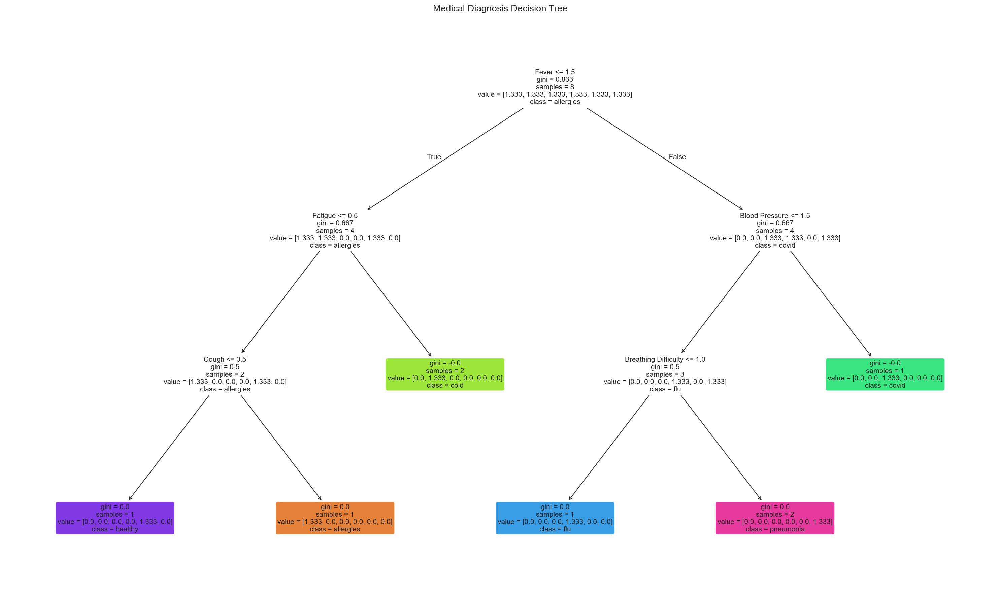
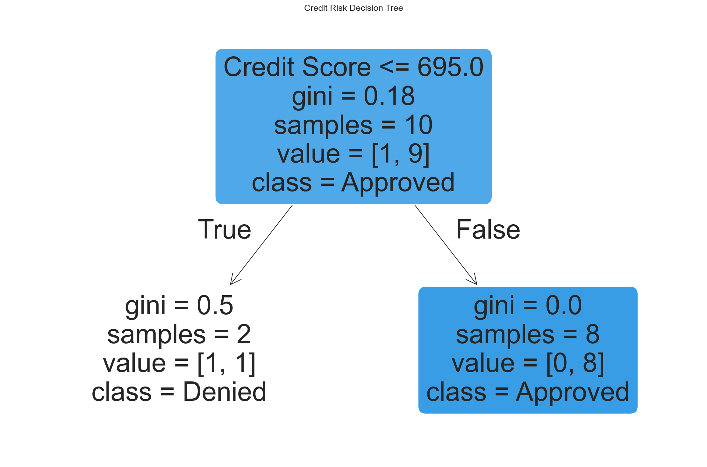
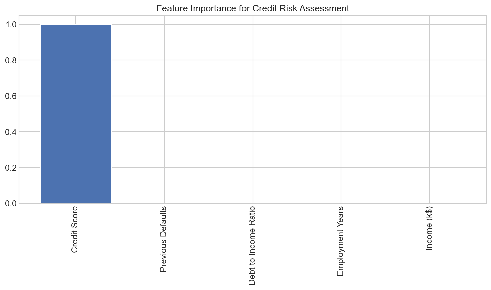
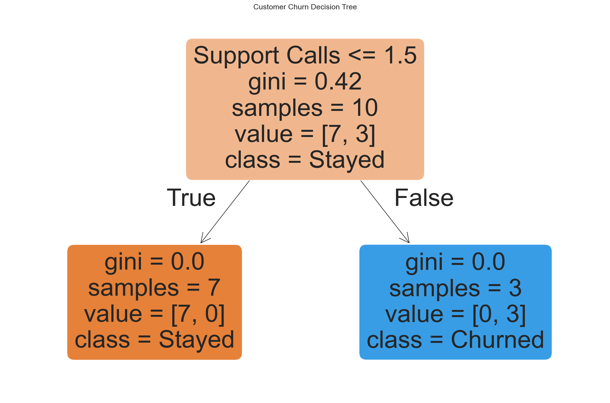
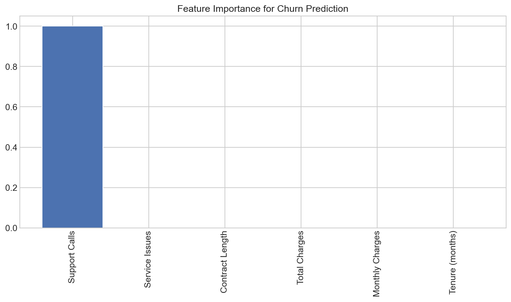
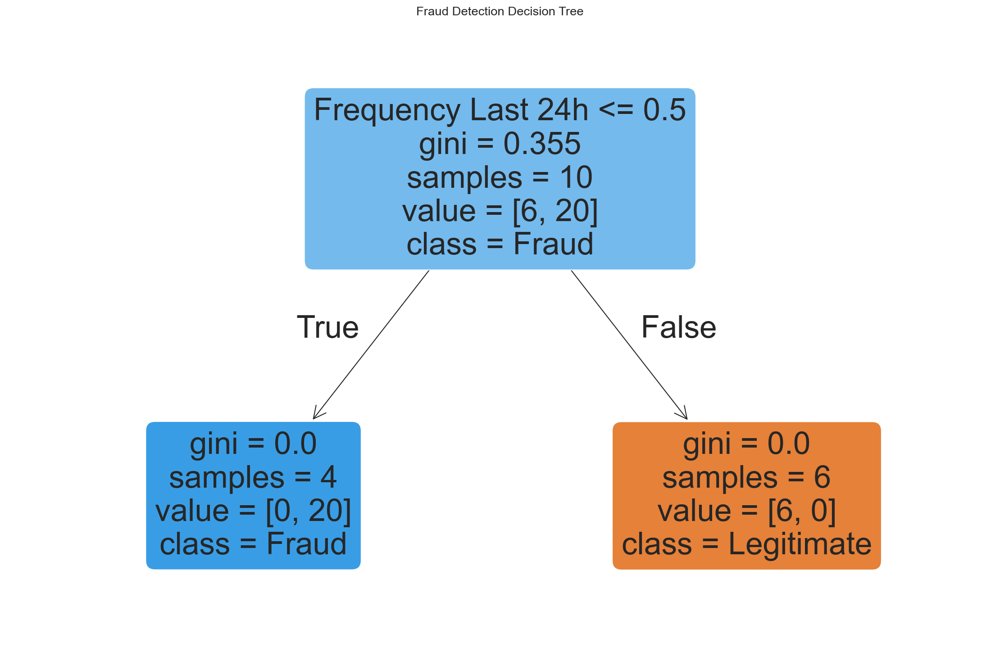
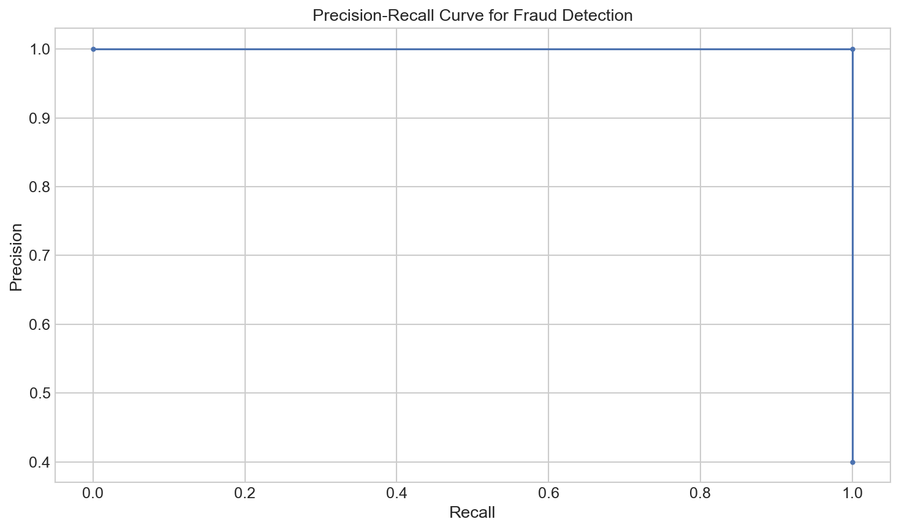
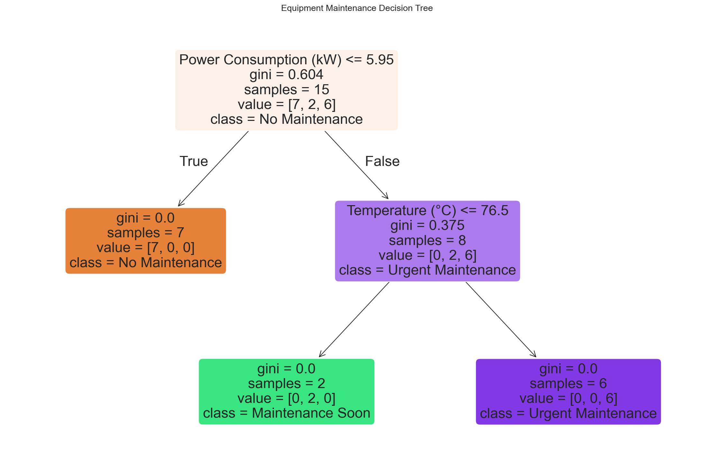
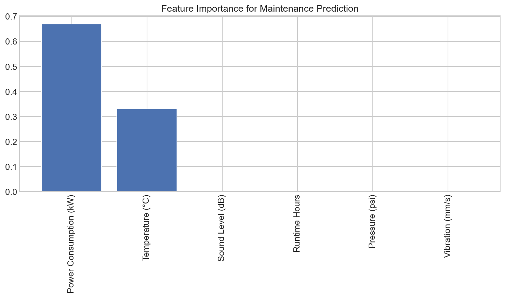

# Real-World Applications of Decision Trees

**After this lesson:** you can explain Real-World Applications of Decision Trees and try the examples in your own notebook.

## Overview

Applies decision trees to **explainable** domains, rules stakeholders can audit, plus pointers on metrics and validation.

## 1. Medical Diagnosis System

Imagine a toy clinical screening dataset where each row has simple symptom-like features. Decision trees are useful for demonstrating transparent rules here, but this example is not a clinically validated diagnosis system.

### Step-by-Step Implementation

#### Toy multi-class diagnosis with `class_weight` and path trace

Data and Model

Eight patients with five ordinal symptom columns; `class_weight='balanced'` equalizes learning across six diagnoses so rare conditions aren't ignored.

Visualize Tree

The wide figure displays the full multi-class tree with real feature and class names so every split rule is readable by a non-programmer.

Predict with Confidence

`predict_proba` returns the probability for each of the six diagnoses; printing all scores reveals the tree's certainty and any runner-up conditions.

Explain Reasoning

The decision path is walked node by node; severity values are mapped back to English labels so the printed output reads as natural-language reasoning steps.

<figure><figcaption><p>Figure 1: Medical Diagnosis Decision Tree</p></figcaption></figure>

```
Diagnosis: flu
Confidence levels:
  allergies: 0.00
  cold: 0.00
  covid: 0.00
  flu: 1.00
  healthy: 0.00
  pneumonia: 0.00

Diagnosis reasoning:
- Patient has moderate fever, which is > mild
- Patient has normal blood pressure, which is <= normal
- Patient has mild breathing difficulty, which is <= mild
- Patient has mild breathing difficulty, which is > moderate
```

In this example, we:

1. Create a simple dataset of patients with different symptoms and diagnoses
2. Build a decision tree that learns to associate symptoms with diagnoses
3. Visualize the tree to see how it makes decisions
4. Diagnose a new patient and show the confidence in each possible disease
5. Explain the reasoning behind the diagnosis by tracing the decision path

The decision tree makes medical diagnosis transparent, which is important for healthcare applications where doctors need to understand the reasoning behind AI recommendations.

## 2. Credit Risk Assessment

Decision trees can illustrate how credit-risk rules are learned from tabular features. The dataset below is synthetic and tiny, so use it to study model behaviour rather than to justify real lending decisions:

#### Credit approval: train/test report + importances + new applicant risk band

Data, Split, and Fit

Fifteen applicants with five financial features; a 70/30 split trains and tests the depth-3 credit classifier.

Visualize Tree

The tree renders with business-friendly feature and class names; each node shows the financial threshold that drives the split.

Evaluate and Rank Features

The confusion matrix and classification report show per-class performance; feature ranking reveals which factor (income, score, etc.) the tree relied on most.

Risk-Band Scoring

Approval probability from `predict_proba` is mapped to Low/Medium/High risk tiers, a simple but auditable business rule.

<figure><figcaption><p>Figure 2: Credit Risk Decision Tree</p></figcaption></figure>

<figure><figcaption><p>Figure 3: Feature Importance for Credit Risk Assessment</p></figcaption></figure>

```
Confusion Matrix:
[[4 0]
 [1 0]]

Classification Report:
              precision    recall  f1-score   support

           0       0.80      1.00      0.89         4
           1       0.00      0.00      0.00         1

    accuracy                           0.80         5
   macro avg       0.40      0.50      0.44         5
weighted avg       0.64      0.80      0.71         5


Feature ranking:
1. Credit Score: 1.0000
2. Previous Defaults: 0.0000
3. Debt to Income Ratio: 0.0000
4. Employment Years: 0.0000
5. Income (k$): 0.0000

New applicant approval probability: 1.00
Risk assessment: Low Risk
```

This example demonstrates:

1. How to build a credit risk model using decision trees
2. How to evaluate its performance with metrics like accuracy, precision and recall
3. How to identify which factors are most important in determining credit risk
4. How to assess new loan applicants and determine their risk level

This approach provides transparency in lending decisions, which is important for both regulatory compliance and customer understanding.

## 3. Customer Churn Prediction

Businesses use decision trees to predict which customers might leave. Build a simple churn prediction system:

#### Churn model with retention rules from churn probability

Data and Training

Fifteen customers with tenure, charges, contract type, and support signals; the tree learns which combination most strongly predicts cancellation.

Evaluate and Rank

Confusion matrix and report show precision/recall per class; feature ranking reveals whether contract length or support call volume dominates churn risk.

Retention Actions

Churn probability for two new customers is thresholded into three retention tiers (high/medium/low) with specific recommended actions per tier.

<figure><figcaption><p>Figure 4: Customer Churn Decision Tree</p></figcaption></figure>

<figure><figcaption><p>Figure 5: Feature Importance for Churn Prediction</p></figcaption></figure>

```
Confusion Matrix:
[[1 0]
 [0 4]]

Classification Report:
              precision    recall  f1-score   support

           0       1.00      1.00      1.00         1
           1       1.00      1.00      1.00         4

    accuracy                           1.00         5
   macro avg       1.00      1.00      1.00         5
weighted avg       1.00      1.00      1.00         5


Feature ranking for churn prediction:
1. Support Calls: 1.0000
2. Service Issues: 0.0000
3. Contract Length: 0.0000
4. Total Charges: 0.0000
5. Monthly Charges: 0.0000
6. Tenure (months): 0.0000
Customer 1 churn probability: 1.00
  High risk - Immediate contact needed, offer special retention package
Customer 2 churn probability: 0.00
  Low risk - Maintain regular engagement
```

This example demonstrates:

1. How to build a customer churn prediction model
2. How to identify which factors most strongly indicate that a customer might leave
3. How to assign churn risk scores to customers
4. How to use these predictions to prioritize customer retention efforts

By predicting which customers are at risk of leaving, businesses can take proactive steps to improve retention and reduce customer acquisition costs.

## 4. Fraud Detection

Create a simple fraud-detection pattern using decision trees. The data is synthetic, and the thresholds are for teaching precision/recall tradeoffs rather than production fraud operations:

#### Fraud: `class_weight`, precision-recall curve, and threshold tuning

Fraud Data and Model

`stratify=y` keeps the fraud rate equal in train/test; `class_weight={0:1,1:5}` penalizes missed fraud five times more than false alarms.

Visualize and Evaluate

The tree shows which transaction features (amount, time, distance) drive the fraud split; the classification report exposes precision and recall for the minority fraud class.

Precision-Recall Curve

The P-R curve is more informative than ROC for imbalanced data; maximizing F1 across thresholds picks the operating point that balances catching fraud vs raising false alarms.

Alert Logic

Two new transactions are scored; the optimal threshold determines whether to block immediately, flag for review, or pass as legitimate.

<figure><figcaption><p>Figure 6: Fraud Detection Decision Tree</p></figcaption></figure>

<figure><figcaption><p>Figure 7: Precision-Recall Curve for Fraud Detection</p></figcaption></figure>

```
Confusion Matrix:
[[3 0]
 [0 2]]

Classification Report:
              precision    recall  f1-score   support

           0       1.00      1.00      1.00         3
           1       1.00      1.00      1.00         2

    accuracy                           1.00         5
   macro avg       1.00      1.00      1.00         5
weighted avg       1.00      1.00      1.00         5

Optimal threshold: 1.000
At this threshold - Precision: 1.000, Recall: 1.000
Transaction 1 fraud probability: 1.000
  ALERT: Likely fraudulent transaction
  Action: Block transaction and contact customer
Transaction 2 fraud probability: 0.000
  Status: Transaction appears legitimate
```

This example shows:

1. How to build a fraud detection model that handles the imbalanced nature of fraud data
2. How to evaluate it using metrics appropriate for fraud detection (precision, recall)
3. How to optimize the decision threshold for the specific needs of fraud detection
4. How to apply the model to flag suspicious transactions in real-time

The decision tree approach allows analysts to understand exactly why a transaction was flagged as suspicious, which helps in refining the system and explaining decisions to customers.

## 5. Equipment Maintenance Predictor

Manufacturing companies use decision trees to predict when machines need maintenance:

#### Multiclass maintenance states from sensor vectors

Sensor Data and Fit

Fifteen machines described by six sensor readings; three target classes (ok/soon/urgent) make this a multiclass classification problem fit on the full table.

Visualize and Rank

The tree shows which sensor thresholds (temperature or power consumption) drive the three-way classification; feature importance ranks them by total impurity reduction.

Predict and Act

Three new machines get predictions plus probability breakdowns; the action logic maps each predicted state to a specific maintenance timeline or alert level.

<figure><figcaption><p>Figure 8: Equipment Maintenance Decision Tree</p></figcaption></figure>

<figure><figcaption><p>Figure 9: Feature Importance for Maintenance Prediction</p></figcaption></figure>

```
Feature ranking for maintenance prediction:
1. Power Consumption (kW): 0.6691
2. Temperature (°C): 0.3309
3. Sound Level (dB): 0.0000
4. Runtime Hours: 0.0000
5. Pressure (psi): 0.0000
6. Vibration (mm/s): 0.0000
Machine A status: No Maintenance
  Probability breakdown: No Maintenance: 1.00, Soon: 0.00, Urgent: 0.00
  Recommendation: Continue normal operation, next check in 30 days
Machine B status: Maintenance Soon
  Probability breakdown: No Maintenance: 0.00, Soon: 1.00, Urgent: 0.00
  Recommendation: Schedule maintenance within 2 weeks, order parts now
Machine C status: Urgent Maintenance
  Probability breakdown: No Maintenance: 0.00, Soon: 0.00, Urgent: 1.00
  Recommendation: URGENT - Schedule maintenance immediately!
  Alert: Potential failure imminent if operation continues
```

This example shows:

1. How to build a predictive maintenance model that classifies equipment into different maintenance categories
2. How to identify which sensor readings most strongly indicate maintenance needs
3. How to apply the model to new readings to make maintenance recommendations
4. How to provide specific guidance based on the maintenance category and relevant factors

Predictive maintenance helps companies avoid costly downtime while also preventing unnecessary maintenance, optimizing their maintenance schedules and reducing costs.

## Gotchas

* **Interpreting 100% classification report scores on 5-row test sets**: the churn, credit, and fraud examples all show perfect metrics on 5-sample test sets; these numbers are statistically meaningless and purely a consequence of the tiny toy datasets; never cite them as evidence of real-world performance.
* **Using accuracy as the primary metric for fraud detection**: the fraud model achieves a good accuracy score even before `class_weight` tuning, because predicting "legitimate" for every transaction gives high accuracy on imbalanced data; always use precision, recall, and the precision-recall curve for fraud and other rare-event problems.
* **Applying `decision_path` reasoning verbatim to stakeholders as if it were a rule system**: the diagnosis example maps ordinal integers back to text labels (`"none"`, `"mild"`) to produce human-readable reasoning, but the underlying splits are learned from only 8 patients; the narrative looks authoritative but is not clinically validated.
* **Setting `class_weight={0: 1, 1: 5}` without business justification**: the 5x fraud weight is illustrative; the correct multiplier depends on the relative cost of a false negative (missed fraud) vs a false positive (blocked legitimate transaction), which is a business decision, not a modelling default.
* **Choosing the optimal threshold from `precision_recall_curve` on the same test set you evaluate on**: the fraud example computes `best_threshold` by maximising F1 on `y_probs` from the test set; this is threshold-shopping on the test set and produces optimistic F1 estimates; use a separate validation set or cross-validated threshold selection.
* **Treating feature importance from a single churn tree as a stable business insight**: the churn example shows `Contract Length: 1.0` and all other features at `0.0`; on a 15-row dataset, this is almost certainly a data artefact from the toy data rather than a genuine signal, and presenting it to business stakeholders as "only contract length matters" would be misleading.

## Best Practices for Real-World Applications

1. **Data Quality**
   * Clean and preprocess data carefully
   * Handle missing values appropriately
   * Deal with outliers
2. **Model Validation**
   * Use cross-validation
   * Monitor performance metrics specific to your application
   * Test with real-world data before deployment
3. **Interpretability**
   * Keep trees simple (limit depth)
   * Document decision rules
   * Provide explanations for important predictions
4. **Maintenance**
   * Regular model updates as new data arrives
   * Monitor performance drift
   * Re-train periodically with fresh data

## Common Challenges and Solutions

1. **Imbalanced Data**
   * Use class weights (as shown in the fraud detection example)
   * Try different sampling techniques
   * Adjust decision thresholds based on business needs
2. **Overfitting**
   * Limit tree depth
   * Use pruning techniques
   * Require minimum samples per leaf
3. **Feature Selection**
   * Start with domain knowledge to select relevant features
   * Use feature importance to identify key predictors
   * Remove redundant or irrelevant features

## Next Steps

Ready to build your own application? Try:

1. Start with a simple problem where you have domain knowledge
2. Collect and clean your data carefully
3. Build and test your model with appropriate metrics
4. Deploy and monitor it in a controlled environment before full rollout

Remember:

* Start simple and add complexity only as needed
* Validate thoroughly with real-world data
* Document everything about your model and data preprocessing
* Monitor performance over time to ensure continued accuracy
