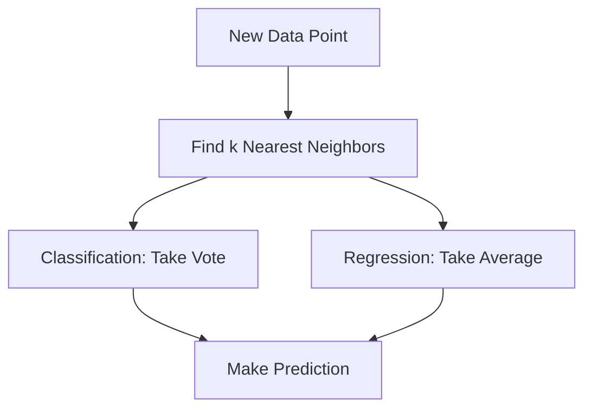

# Introduction to k-Nearest Neighbors (KNN) 🎯

In our journey through supervised learning algorithms, we now explore k-Nearest Neighbors (KNN), one of the most intuitive machine learning algorithms.

## What is KNN?

> **k-Nearest Neighbors** is a simple but powerful algorithm that makes predictions based on the most similar examples in your data.

Think of it like asking your neighbors for movie recommendations:
- If 5 people near you liked a movie, you might like it too
- The closer the neighbor, the more you trust their opinion
- The "k" in KNN is just how many neighbors you ask

### Real-World Analogy 🌎

Imagine you're in a new city looking for a restaurant:
1. You ask the 3 closest people for recommendations
2. 2 recommend Italian, 1 recommends Chinese
3. You choose Italian because it got more "votes"

This is exactly how KNN works! It looks at the k nearest examples and takes a vote.

## How Does KNN Work?

### Key Concepts

1. **Neighbors**
   > A "neighbor" is a data point that is close to your input based on some measure of distance.

2. **Distance**
   > "Distance" can be measured in various ways, like straight-line distance (Euclidean) or city-block distance (Manhattan).

3. **Voting**
   > For classification, neighbors "vote" on the outcome. For regression, we take their average.

## When to Use KNN? 🤔

### Perfect For:
- Small to medium datasets
- Low-dimensional data
- When you need interpretable results
- When relationships in data are local

### Not Great For:
- Very large datasets (slow predictions)
- High-dimensional data
- When features are on different scales
- When memory is limited

## How Does it Fit in the ML Workflow?

Recalling our machine learning workflow from previous lessons:

1. **Problem Definition** 🎯
   - KNN works for both classification and regression
   - Needs clear definition of "similarity"
   - Requires feature selection consideration

2. **Data Collection** 📊
   - Quality of data is crucial
   - Need enough examples of each class
   - Features should be meaningful for distance calculation

3. **Data Preparation** 🧹
   - Feature scaling is essential
   - Missing value handling important
   - May need dimensionality reduction

4. **Model Selection** 🤖
   - Choose value of k
   - Select distance metric
   - Consider weighted voting

5. **Model Evaluation** 📈
   - Cross-validation important
   - Need to balance k value
   - Consider computational cost

## Advantages and Limitations

### Advantages ✅
- Simple to understand and implement
- No training phase needed
- Naturally handles multi-class cases
- Can be updated easily
- Makes no assumptions about data

### Limitations ❌
- Computationally expensive for large datasets
- Sensitive to irrelevant features
- Requires feature scaling
- Memory-intensive
- Curse of dimensionality

## Key Decisions in KNN 🔑

1. **Choosing k**
   > The number of neighbors (k) is crucial: too small can lead to noise, too large can blur class boundaries.

2. **Distance Metric**
   > How we measure "closeness" between points can significantly impact results.

3. **Weighting**
   > Should closer neighbors have more influence than farther ones?

## Next Steps 📚

In the following sections, we'll dive deeper into:
1. [Distance Metrics and Math](2-distance-metrics.md)
2. [Implementation Basics](3-implementation.md)
3. [Advanced Techniques](4-advanced.md)
4. [Applications and Best Practices](5-applications.md)

Each section builds upon these fundamental concepts, helping you master KNN step by step.
