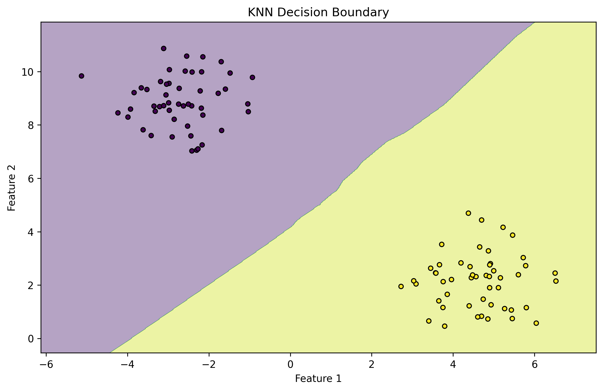

# Introduction to k-Nearest Neighbors (KNN)

Welcome to your journey into k-Nearest Neighbors (KNN)! This algorithm is one of the most intuitive ways to start learning about machine learning. Think of it as your friendly neighborhood algorithm that makes decisions based on what's closest to it.


*Figure: KNN Decision Boundary showing how the algorithm classifies different regions*

## What is KNN?

> **k-Nearest Neighbors** is like having a group of friends who help you make decisions. The algorithm looks at the "k" closest examples in your data and makes predictions based on their characteristics.

### Real-World Analogies

1. **Movie Recommendations**
   - Imagine you're trying to decide what movie to watch
   - You ask your 5 closest friends (k=5) for recommendations
   - If 3 friends recommend action movies and 2 recommend comedies
   - You'll likely choose an action movie because it got more "votes"

2. **Restaurant Selection**
   - You're in a new city looking for dinner
   - You ask the 3 nearest people (k=3) for recommendations
   - 2 suggest Italian, 1 suggests Chinese
   - You choose Italian because it's the majority vote

3. **House Price Prediction**
   - You want to estimate your house's value
   - You look at the sale prices of the 5 most similar houses in your neighborhood
   - The average of these prices gives you a good estimate

## Why KNN Matters

KNN is important because:

- It's easy to understand and implement
- It works well for both classification and regression problems
- It doesn't make assumptions about your data
- It's great for exploring patterns in your data
- It's perfect for beginners to understand how machine learning works

## How Does KNN Work?

Let's break it down into simple steps:

1. **Find Neighbors**
   - When you have a new data point
   - KNN looks for the "k" most similar points in your dataset
   - Similarity is measured using distance metrics (like how far apart two points are)

2. **Make a Decision**
   - For classification: Take a vote among the neighbors
   - For regression: Take the average of the neighbors' values

```python
# Simple KNN Example
from sklearn.neighbors import KNeighborsClassifier

# Create a KNN classifier with 3 neighbors
knn = KNeighborsClassifier(n_neighbors=3)

# Train the model (KNN just stores the data)
knn.fit(X_train, y_train)

# Make predictions
predictions = knn.predict(X_test)
```

## Common Mistakes to Avoid

1. **Choosing the Wrong k Value**
   - Too small (k=1): Too sensitive to noise
   - Too large: May include points from other classes
   - Solution: Try different values and use cross-validation

2. **Forgetting to Scale Features**
   - Features on different scales can distort distances
   - Solution: Always scale your features before using KNN

3. **Using KNN with Large Datasets**
   - KNN can be slow with big datasets
   - Solution: Consider using approximate nearest neighbors or other algorithms

## When to Use KNN?

### Perfect For

- Small to medium datasets
- Problems where local patterns matter
- When you need interpretable results
- When you want to understand your data better

### Not Great For

- Very large datasets (slow predictions)
- High-dimensional data (curse of dimensionality)
- When features are on different scales
- When memory is limited

## Key Decisions in KNN

1. **Choosing k**
   - Start with k=5 and experiment
   - Use cross-validation to find the best k
   - Consider using odd numbers for classification to avoid ties

2. **Distance Metric**
   - Euclidean: Good for continuous features
   - Manhattan: Better for categorical features
   - Cosine: Great for text data

3. **Weighting**
   - Uniform: All neighbors have equal weight
   - Distance-based: Closer neighbors have more influence

## Next Steps

In the following sections, we'll explore:

1. [Distance Metrics](2-distance-metrics.md) - How to measure similarity
2. [Implementation](3-implementation.md) - How to code KNN
3. [Advanced Techniques](4-advanced.md) - Making KNN work better
4. [Applications](5-applications.md) - Real-world uses of KNN

## Additional Resources

For further learning:

- [Scikit-learn KNN Documentation](https://scikit-learn.org/stable/modules/neighbors.html)
- [KNN Visualization Tool](https://www.cs.waikato.ac.nz/ml/weka/)
- [Interactive KNN Demo](https://www.cs.cornell.edu/courses/cs4780/2018fa/lectures/lecturenote16.html)

Remember: KNN is like having a group of friends who help you make decisions. The more you understand about your data, the better your "friends" can help you!
