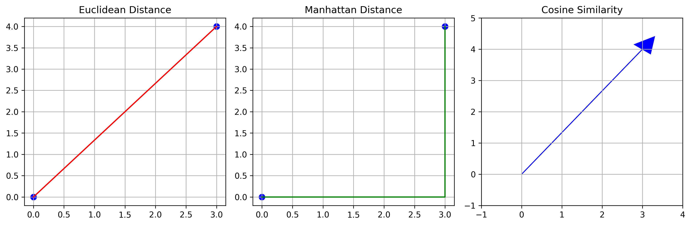

# Understanding Distance Metrics in KNN

Distance metrics are like different ways of measuring how far apart two things are. Just like you might measure distance differently when walking through a city versus flying in a plane, KNN uses different ways to measure "closeness" between data points.


*Figure: Visual comparison of Euclidean, Manhattan, and Cosine distance metrics*

## Why Distance Metrics Matter

Imagine you're trying to find similar houses to yours:

- If you only look at price, you might miss houses that are similar in size
- If you only look at size, you might miss houses in similar locations
- You need a way to combine all these factors to find truly similar houses

This is exactly what distance metrics do in KNN - they help us measure similarity in a way that makes sense for our data.

## Common Distance Metrics Explained

### 1. Euclidean Distance (Straight Line Distance)

Think of this as measuring distance "as the crow flies" - the shortest possible path between two points.

**Real-World Example:**

- Measuring the straight-line distance between two cities on a map
- Finding the shortest path for a drone to fly between two points

```python
# Simple Example: Distance between two points on a map
import numpy as np

def euclidean_distance(point1, point2):
    """Calculate straight-line distance between two points"""
    return np.sqrt(np.sum((point1 - point2) ** 2))

# Example: Distance between New York (40.7, -74.0) and Boston (42.3, -71.0)
ny = np.array([40.7, -74.0])
boston = np.array([42.3, -71.0])
distance = euclidean_distance(ny, boston)
print(f"Distance between NY and Boston: {distance:.2f} units")
```

**When to Use:**

- When you want the shortest possible distance
- For continuous numerical data
- When all features are on the same scale

### 2. Manhattan Distance (City Block Distance)

This is like walking through a city grid - you can only move along the streets, not through buildings.

**Real-World Example:**

- Calculating taxi fare in Manhattan (hence the name)
- Measuring walking distance in a city with a grid layout

```python
def manhattan_distance(point1, point2):
    """Calculate distance moving only along grid lines"""
    return np.sum(np.abs(point1 - point2))

# Example: Walking distance in a city grid
start = np.array([0, 0])  # Starting at intersection
end = np.array([3, 4])    # Destination
distance = manhattan_distance(start, end)
print(f"Walking distance: {distance} blocks")
```

**When to Use:**

- When movement is restricted to grid-like paths
- For data where diagonal movement doesn't make sense
- When features have different scales

### 3. Cosine Similarity (Angle-Based Similarity)

This measures how similar two things are based on the angle between them, ignoring their size.

**Real-World Example:**

- Comparing two documents regardless of their length
- Finding similar products based on their features

```python
def cosine_similarity(point1, point2):
    """Calculate similarity based on angle between vectors"""
    dot_product = np.dot(point1, point2)
    norm1 = np.linalg.norm(point1)
    norm2 = np.linalg.norm(point2)
    return dot_product / (norm1 * norm2)

# Example: Comparing two product descriptions
product1 = np.array([1, 0, 1, 1])  # Features: [price, quality, popularity, reviews]
product2 = np.array([2, 0, 2, 2])  # Same pattern, just larger numbers
similarity = cosine_similarity(product1, product2)
print(f"Similarity between products: {similarity:.2f}")
```

**When to Use:**

- For text data
- When magnitude doesn't matter
- For high-dimensional data

## Common Mistakes to Avoid

1. **Using Euclidean Distance with Unscaled Features**
   - Problem: Features on different scales (e.g., age vs. salary) can dominate the distance
   - Solution: Always scale your features before using Euclidean distance

2. **Choosing the Wrong Metric for Your Data**
   - Problem: Using Euclidean for categorical data
   - Solution: Match the metric to your data type:
     - Continuous: Euclidean or Manhattan
     - Categorical: Hamming distance
     - Text: Cosine similarity

3. **Ignoring Feature Importance**
   - Problem: Treating all features equally when some matter more
   - Solution: Use weighted distance metrics or feature selection

## How to Choose the Right Metric

Here's a simple decision tree to help you choose:

1. **What type of data do you have?**
   - Continuous numbers → Euclidean or Manhattan
   - Categories → Hamming distance
   - Text → Cosine similarity

2. **Are your features on the same scale?**
   - Yes → Euclidean distance
   - No → Manhattan distance or scale your features

3. **Does the size of your data matter?**
   - Yes → Euclidean distance
   - No → Cosine similarity

## Practical Example: House Price Prediction

Let's say you're predicting house prices using these features:

- Number of bedrooms
- Square footage
- Distance from city center
- Year built

```python
from sklearn.preprocessing import StandardScaler
from sklearn.neighbors import KNeighborsRegressor

# Scale the features
scaler = StandardScaler()
X_scaled = scaler.fit_transform(X)

# Try different distance metrics
metrics = ['euclidean', 'manhattan']
results = {}

for metric in metrics:
    knn = KNeighborsRegressor(n_neighbors=5, metric=metric)
    knn.fit(X_scaled, y)
    score = knn.score(X_test_scaled, y_test)
    results[metric] = score

print("Model performance with different metrics:")
for metric, score in results.items():
    print(f"{metric}: {score:.3f}")
```

## Additional Resources

For more learning:

- [Scikit-learn Distance Metrics](https://scikit-learn.org/stable/modules/generated/sklearn.neighbors.DistanceMetric.html)
- [Interactive Distance Metric Visualizer](https://www.cs.cornell.edu/courses/cs4780/2018fa/lectures/lecturenote16.html)
- [Distance Metric Cheat Sheet](https://www.kdnuggets.com/2020/08/most-popular-distance-metrics-knn.html)

Remember: The right distance metric is like choosing the right tool for the job. Just as you wouldn't use a ruler to measure the weight of an object, you shouldn't use Euclidean distance for all types of data!
