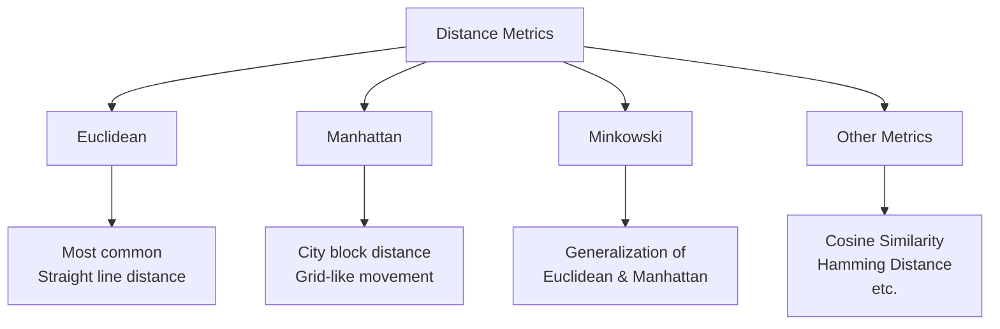
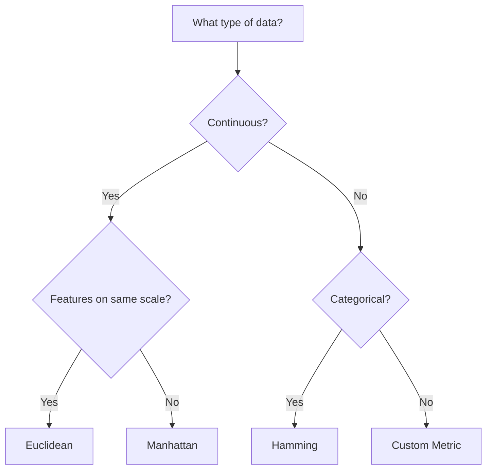

# Understanding Distance Metrics in KNN 📏

One of the most crucial aspects of KNN is how we measure the distance between points. Let's explore different ways to calculate distance and understand when to use each one.

## Types of Distance Metrics



## 1. Euclidean Distance 📐

> **Euclidean Distance** is the straight-line distance between two points, like measuring with a ruler.

### Mathematical Formula
For two points p and q in n-dimensional space:

$d(p,q) = \sqrt{\sum_{i=1}^n (p_i - q_i)^2}$

### Python Implementation
```python
import numpy as np

def euclidean_distance(point1, point2):
    """Calculate Euclidean distance between two points"""
    return np.sqrt(np.sum((point1 - point2) ** 2))

# Example
p1 = np.array([1, 2])  # Point at (1,2)
p2 = np.array([4, 6])  # Point at (4,6)
distance = euclidean_distance(p1, p2)
print(f"Euclidean distance: {distance:.2f}")
```

### When to Use
- Default choice for continuous variables
- When features are on similar scales
- When direct path matters
- For 2D or 3D spatial data

## 2. Manhattan Distance 🏙️

> **Manhattan Distance** (also called City Block or L1 distance) measures distance along axes at right angles, like navigating city blocks.

### Mathematical Formula
$d(p,q) = \sum_{i=1}^n |p_i - q_i|$

### Python Implementation
```python
def manhattan_distance(point1, point2):
    """Calculate Manhattan distance between two points"""
    return np.sum(np.abs(point1 - point2))

# Example
p1 = np.array([1, 2])
p2 = np.array([4, 6])
distance = manhattan_distance(p1, p2)
print(f"Manhattan distance: {distance}")
```

### When to Use
- Grid-like features
- When diagonal movement isn't possible
- In urban navigation problems
- When features are on different scales

## 3. Minkowski Distance 🔄

> **Minkowski Distance** is a generalization of Euclidean and Manhattan distances, controlled by a parameter p.

### Mathematical Formula
$d(p,q) = \left(\sum_{i=1}^n |p_i - q_i|^p\right)^{\frac{1}{p}}$

Where:
- p = 1: Manhattan Distance
- p = 2: Euclidean Distance
- p = ∞: Chebyshev Distance

### Python Implementation
```python
def minkowski_distance(point1, point2, p):
    """Calculate Minkowski distance between two points"""
    return np.power(np.sum(np.power(np.abs(point1 - point2), p)), 1/p)

# Example
p1 = np.array([1, 2])
p2 = np.array([4, 6])
for p in [1, 2, 3]:
    distance = minkowski_distance(p1, p2, p)
    print(f"Minkowski distance (p={p}): {distance:.2f}")
```

## 4. Other Distance Metrics

### Cosine Similarity

> **Cosine Similarity** measures the angle between two vectors, useful when magnitude doesn't matter.

```python
def cosine_similarity(point1, point2):
    """Calculate cosine similarity between two points"""
    dot_product = np.dot(point1, point2)
    norm1 = np.linalg.norm(point1)
    norm2 = np.linalg.norm(point2)
    return dot_product / (norm1 * norm2)
```

### Hamming Distance

> **Hamming Distance** counts the positions at which two sequences differ, useful for categorical data.

```python
def hamming_distance(point1, point2):
    """Calculate Hamming distance between two points"""
    return np.sum(point1 != point2)
```

## Choosing the Right Distance Metric 🎯

### Decision Flowchart



### Guidelines for Selection

1. **Continuous Numerical Data**
   - Same scale → Euclidean
   - Different scales → Manhattan or Scaled Euclidean
   - Need flexibility → Minkowski

2. **Categorical Data**
   - Binary features → Hamming
   - Multi-category → Custom metric

3. **Text Data**
   - Document similarity → Cosine
   - Edit distance → Levenshtein

4. **Mixed Data Types**
   - Combine multiple metrics
   - Use custom distance function

## Impact on Model Performance 📈

### Example: Comparing Metrics
```python
from sklearn.neighbors import KNeighborsClassifier
from sklearn.metrics import accuracy_score

def compare_metrics(X_train, X_test, y_train, y_test):
    """Compare different distance metrics"""
    metrics = ['euclidean', 'manhattan', 'minkowski']
    results = {}
    
    for metric in metrics:
        knn = KNeighborsClassifier(n_neighbors=5, metric=metric)
        knn.fit(X_train, y_train)
        y_pred = knn.predict(X_test)
        results[metric] = accuracy_score(y_test, y_pred)
        
    return results
```

## Best Practices 📚

1. **Data Preprocessing**
   - Scale features for Euclidean distance
   - Encode categorical variables appropriately
   - Handle missing values

2. **Metric Selection**
   - Consider data type and structure
   - Test multiple metrics
   - Validate with cross-validation

3. **Performance Optimization**
   - Use KD-trees for Euclidean distance
   - Ball trees for other metrics
   - Consider approximate methods for large datasets

## Next Steps 📚

Now that you understand distance metrics:
1. Learn about [basic implementation](3-implementation.md)
2. Explore [advanced techniques](4-advanced.md)
3. See [real-world applications](5-applications.md)

Remember: The choice of distance metric can significantly impact your model's performance, so choose wisely based on your data and problem context!
