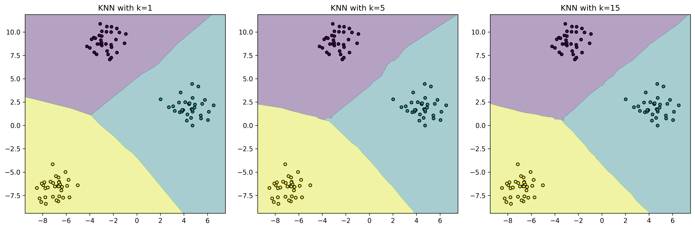

# Implementing KNN: A Step-by-Step Guide

Welcome to the practical side of KNN! In this section, we'll learn how to implement KNN both from scratch (to understand how it works) and using scikit-learn (for real-world applications).


*Figure: How different values of k affect the decision boundary in KNN*

## Why Implementation Matters

Understanding how to implement KNN is crucial because:

- It helps you understand how the algorithm works under the hood
- You can customize it for your specific needs
- You'll be better at debugging when things go wrong
- You can optimize it for your particular use case

## Implementation from Scratch

Let's build a simple KNN classifier step by step. Think of it like building a recommendation system that asks your closest friends for advice.

### Step 1: Create the Basic Structure

```python
import numpy as np
from collections import Counter

class SimpleKNN:
    def __init__(self, k=3):
        """Initialize with k neighbors (default: 3)"""
        self.k = k
        
    def fit(self, X, y):
        """Store the training data - KNN doesn't actually train!"""
        self.X_train = X
        self.y_train = y
```

**What's happening here:**

- We create a class called `SimpleKNN`
- The `__init__` method sets up how many neighbors (k) we want to consider
- The `fit` method just stores our training data (unlike other algorithms, KNN doesn't need training!)

### Step 2: Add Prediction Logic

```python
    def predict(self, X):
        """Make predictions for new data points"""
        return np.array([self._predict_single(x) for x in X])
    
    def _predict_single(self, x):
        """Predict class for a single point"""
        # Calculate distances to all training points
        distances = [np.sqrt(np.sum((x - x_train)**2)) 
                    for x_train in self.X_train]
        
        # Get k nearest neighbors
        k_indices = np.argsort(distances)[:self.k]
        k_nearest_labels = [self.y_train[i] for i in k_indices]
        
        # Return most common class
        most_common = Counter(k_nearest_labels).most_common(1)
        return most_common[0][0]
```

**Breaking it down:**

1. `predict` handles multiple points at once
2. `_predict_single` works on one point at a time:
   - Calculates distances to all training points
   - Finds the k closest points
   - Returns the most common class among them

### Step 3: Try it Out

```python
# Example: Movie Genre Classification
# Features: [Action Score, Romance Score]
X_train = np.array([
    [8, 2],  # Action movie
    [7, 3],  # Action movie
    [2, 8],  # Romance movie
    [3, 7],  # Romance movie
    [1, 9],  # Romance movie
    [9, 1]   # Action movie
])
y_train = np.array(['Action', 'Action', 'Romance', 'Romance', 'Romance', 'Action'])

# Create and train model
knn = SimpleKNN(k=3)
knn.fit(X_train, y_train)

# Predict a new movie
new_movie = np.array([4, 6])  # Mix of action and romance
prediction = knn.predict([new_movie])
print(f"Predicted genre: {prediction[0]}")
```

## Using Scikit-learn

While implementing from scratch is educational, scikit-learn provides a robust, optimized version of KNN. Let's see how to use it for a real-world problem.

### Example: Iris Flower Classification

```python
from sklearn.neighbors import KNeighborsClassifier
from sklearn.preprocessing import StandardScaler
from sklearn.model_selection import train_test_split
from sklearn.metrics import accuracy_score, classification_report
from sklearn.datasets import load_iris

def classify_iris_flowers():
    """Complete example of classifying iris flowers"""
    # Load the famous Iris dataset
    iris = load_iris()
    X, y = iris.data, iris.target
    
    # Split into training and test sets
    X_train, X_test, y_train, y_test = train_test_split(
        X, y, test_size=0.2, random_state=42
    )
    
    # Scale the features (important for KNN!)
    scaler = StandardScaler()
    X_train_scaled = scaler.fit_transform(X_train)
    X_test_scaled = scaler.transform(X_test)
    
    # Create and train the model
    knn = KNeighborsClassifier(
        n_neighbors=5,          # Number of neighbors to consider
        weights='uniform',      # All neighbors have equal weight
        metric='euclidean'      # Distance metric to use
    )
    knn.fit(X_train_scaled, y_train)
    
    # Make predictions
    y_pred = knn.predict(X_test_scaled)
    
    # Evaluate the model
    print("Accuracy:", accuracy_score(y_test, y_pred))
    print("\nDetailed Report:")
    print(classification_report(y_test, y_pred,
                              target_names=iris.target_names))
    
    return knn, scaler

# Run the example
model, scaler = classify_iris_flowers()
```

## Common Mistakes to Avoid

1. **Forgetting to Scale Features**

   ```python
   # ❌ Wrong way
   knn = KNeighborsClassifier()
   knn.fit(X_train, y_train)  # Features not scaled
   
   # ✅ Right way
   scaler = StandardScaler()
   X_train_scaled = scaler.fit_transform(X_train)
   knn.fit(X_train_scaled, y_train)
   ```

2. **Choosing the Wrong k Value**

   ```python
   # ❌ Using k=1 (too sensitive to noise)
   knn = KNeighborsClassifier(n_neighbors=1)
   
   # ✅ Try different values and use cross-validation
   from sklearn.model_selection import GridSearchCV
   param_grid = {'n_neighbors': [3, 5, 7, 9, 11]}
   grid_search = GridSearchCV(knn, param_grid, cv=5)
   grid_search.fit(X_train_scaled, y_train)
   ```

3. **Not Handling Categorical Features**

   ```python
   # ❌ Using categorical features directly
   knn.fit(X_with_categories, y)
   
   # ✅ Encode categorical features first
   from sklearn.preprocessing import OneHotEncoder
   encoder = OneHotEncoder()
   X_encoded = encoder.fit_transform(X_with_categories)
   knn.fit(X_encoded, y)
   ```

## Best Practices

1. **Always Scale Your Features**

   ```python
   from sklearn.preprocessing import StandardScaler
   scaler = StandardScaler()
   X_scaled = scaler.fit_transform(X)
   ```

2. **Use Cross-Validation**

   ```python
   from sklearn.model_selection import cross_val_score
   scores = cross_val_score(knn, X_scaled, y, cv=5)
   print(f"Average accuracy: {scores.mean():.3f}")
   ```

3. **Optimize Hyperparameters**

   ```python
   from sklearn.model_selection import GridSearchCV
   
   param_grid = {
       'n_neighbors': [3, 5, 7, 9, 11],
       'weights': ['uniform', 'distance'],
       'metric': ['euclidean', 'manhattan']
   }
   
   grid_search = GridSearchCV(knn, param_grid, cv=5)
   grid_search.fit(X_scaled, y)
   print(f"Best parameters: {grid_search.best_params_}")
   ```

## Additional Resources

For more learning:

- [Scikit-learn KNN Documentation](https://scikit-learn.org/stable/modules/generated/sklearn.neighbors.KNeighborsClassifier.html)
- [KNN Visualization Tool](https://www.cs.waikato.ac.nz/ml/weka/)
- [Interactive KNN Demo](https://www.cs.cornell.edu/courses/cs4780/2018fa/lectures/lecturenote16.html)

Remember: The key to successful KNN implementation is understanding your data and choosing the right parameters. Don't be afraid to experiment and try different approaches!
