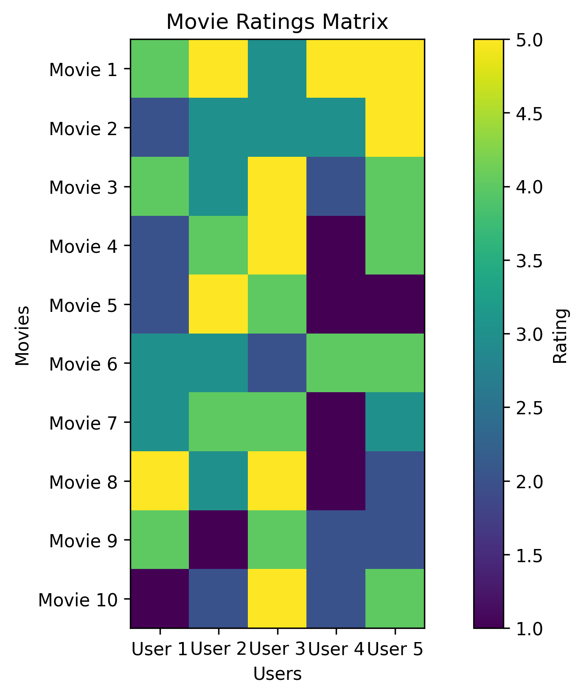

# Real-World Applications of KNN: From Theory to Practice

Welcome to the applications section! Here we'll explore how KNN is used in real-world scenarios. Each example will show you how to apply KNN to solve practical problems.


*Figure: Example of a movie ratings matrix used in recommendation systems*

## Why Applications Matter

Understanding real-world applications helps you:

- See how KNN solves actual problems
- Learn when to use KNN vs. other algorithms
- Get ideas for your own projects
- Understand the practical challenges of implementing KNN

## 1. Movie Recommendation System

Imagine you're building a movie streaming service. You want to recommend movies to users based on what they've watched before.

### How It Works

```python
import pandas as pd
import numpy as np
from sklearn.neighbors import NearestNeighbors
from sklearn.preprocessing import StandardScaler

class MovieRecommender:
    def __init__(self, k=5):
        """Initialize with k neighbors"""
        self.k = k
        self.model = NearestNeighbors(n_neighbors=k+1)  # +1 because we include the movie itself
        
    def fit(self, ratings_matrix):
        """Train the recommender"""
        # Scale the ratings
        self.scaler = StandardScaler()
        ratings_scaled = self.scaler.fit_transform(ratings_matrix)
        
        # Train the model
        self.model.fit(ratings_scaled)
        self.ratings_matrix = ratings_matrix
        
    def recommend(self, movie_id, n_recommendations=5):
        """Get movie recommendations"""
        # Get the movie's features
        movie_features = self.ratings_matrix.iloc[movie_id].values.reshape(1, -1)
        movie_features_scaled = self.scaler.transform(movie_features)
        
        # Find similar movies
        distances, indices = self.model.kneighbors(
            movie_features_scaled,
            n_neighbors=n_recommendations+1
        )
        
        # Remove the movie itself and return recommendations
        similar_movies = indices[0][1:]
        similarity_scores = 1 - distances[0][1:]
        
        return list(zip(similar_movies, similarity_scores))

# Example: Building a Simple Recommender
ratings = pd.DataFrame({
    'user_1': [5, 3, 0, 4],  # User 1's ratings
    'user_2': [4, 0, 0, 5],  # User 2's ratings
    'user_3': [1, 1, 5, 2]   # User 3's ratings
}, index=['movie_1', 'movie_2', 'movie_3', 'movie_4'])

# Create and train the recommender
recommender = MovieRecommender()
recommender.fit(ratings)

# Get recommendations for movie_1
recommendations = recommender.recommend(0)
print("Recommended movies for movie_1:")
for movie_id, similarity in recommendations:
    print(f"Movie {movie_id + 1} (similarity: {similarity:.2f})")
```

## 2. Medical Diagnosis Assistant

KNN can help doctors make better diagnoses by comparing new patients with similar cases from the past.

### Building a Diagnosis System

```python
from sklearn.preprocessing import StandardScaler
from sklearn.neighbors import KNeighborsClassifier
from sklearn.pipeline import Pipeline

class MedicalDiagnosisSystem:
    def __init__(self, k=5):
        """Initialize the diagnosis system"""
        self.pipeline = Pipeline([
            ('scaler', StandardScaler()),
            ('classifier', KNeighborsClassifier(
                n_neighbors=k,
                weights='distance'  # Closer cases matter more
            ))
        ])
        
    def train(self, patient_data, diagnoses):
        """Train the system with past cases"""
        self.pipeline.fit(patient_data, diagnoses)
        
    def diagnose(self, patient_data):
        """Make a diagnosis with confidence level"""
        # Get prediction probabilities
        probabilities = self.pipeline.predict_proba(patient_data)
        
        # Get the diagnosis and confidence
        prediction = self.pipeline.predict(patient_data)
        confidence = np.max(probabilities, axis=1)
        
        return prediction, confidence

# Example: Diagnosing Patients
# Features: [temperature, heart_rate, blood_pressure, white_blood_cell_count]
X = np.array([
    [38.5, 90, 140, 11000],  # Patient with flu
    [37.0, 70, 120, 8000],   # Healthy patient
    [39.0, 95, 150, 15000],  # Patient with infection
])

y = ['flu', 'healthy', 'infection']

# Create and train the system
diagnosis_system = MedicalDiagnosisSystem()
diagnosis_system.train(X, y)

# Diagnose a new patient
new_patient = np.array([[38.2, 85, 135, 12000]])
diagnosis, confidence = diagnosis_system.diagnose(new_patient)
print(f"Diagnosis: {diagnosis[0]} (confidence: {confidence[0]:.2f})")
```

## 3. Image Similarity Search

KNN can help find similar images, useful for photo organization or product search.

### Building an Image Finder

```python
from PIL import Image
from sklearn.neighbors import NearestNeighbors
import numpy as np

class ImageSimilarityFinder:
    def __init__(self, k=5):
        """Initialize the image finder"""
        self.k = k
        self.model = NearestNeighbors(n_neighbors=k)
        
    def _preprocess_image(self, image):
        """Convert image to a feature vector"""
        # Resize for consistency
        image = image.resize((64, 64))
        # Convert to grayscale
        if image.mode != 'L':
            image = image.convert('L')
        # Flatten to 1D array
        return np.array(image).flatten()
        
    def fit(self, image_paths):
        """Build index of images"""
        self.image_paths = image_paths
        features = []
        
        for path in image_paths:
            image = Image.open(path)
            features.append(self._preprocess_image(image))
            
        self.model.fit(features)
        
    def find_similar(self, query_image_path):
        """Find similar images"""
        # Process query image
        query_image = Image.open(query_image_path)
        query_features = self._preprocess_image(query_image)
        
        # Find nearest neighbors
        distances, indices = self.model.kneighbors([query_features])
        
        # Return similar images and their similarity scores
        similar_images = [
            (self.image_paths[i], 1 - d) 
            for i, d in zip(indices[0], distances[0])
        ]
        
        return similar_images

# Example usage
image_paths = ['image1.jpg', 'image2.jpg', 'image3.jpg']
finder = ImageSimilarityFinder()
finder.fit(image_paths)

# Find images similar to a query image
similar_images = finder.find_similar('query_image.jpg')
print("Similar images found:")
for path, similarity in similar_images:
    print(f"{path} (similarity: {similarity:.2f})")
```

## 4. Fraud Detection System

KNN can help identify unusual patterns that might indicate fraud.

### Building a Fraud Detector

```python
from sklearn.neighbors import LocalOutlierFactor

class FraudDetector:
    def __init__(self, contamination=0.1):
        """Initialize the fraud detector"""
        self.model = LocalOutlierFactor(
            n_neighbors=20,
            contamination=contamination
        )
        
    def detect(self, transaction_data):
        """Detect potential fraud"""
        # -1 for anomalies (potential fraud), 1 for normal transactions
        predictions = self.model.fit_predict(transaction_data)
        
        # Get anomaly scores
        scores = -self.model.negative_outlier_factor_
        
        return predictions, scores
        
    def analyze_findings(self, transaction_data, predictions, scores):
        """Analyze detected anomalies"""
        fraud_indices = np.where(predictions == -1)[0]
        
        results = []
        for idx in fraud_indices:
            results.append({
                'transaction_id': idx,
                'data': transaction_data[idx],
                'fraud_score': scores[idx]
            })
            
        return sorted(results, key=lambda x: x['fraud_score'], 
                     reverse=True)

# Example: Detecting Credit Card Fraud
# Features: [amount, time, location, etc.]
transactions = np.array([
    [100, 10, 1],    # Normal transaction
    [150, 12, 1],    # Normal transaction
    [5000, 2, 3],    # Potential fraud
])

detector = FraudDetector()
predictions, scores = detector.detect(transactions)
fraud_cases = detector.analyze_findings(transactions, predictions, scores)

print("Potential fraud cases:")
for case in fraud_cases:
    print(f"Transaction {case['transaction_id']}: Score {case['fraud_score']:.2f}")
```

## Common Challenges and Solutions

1. **Handling Large Datasets**

   ```python
   # Use ball tree for faster searches
   knn = KNeighborsClassifier(
       n_neighbors=5,
       algorithm='ball_tree',
       leaf_size=30
   )
   ```

2. **Dealing with Imbalanced Data**

   ```python
   from imblearn.over_sampling import SMOTE
   
   # Balance the classes
   smote = SMOTE()
   X_balanced, y_balanced = smote.fit_resample(X, y)
   ```

3. **Choosing the Right Distance Metric**

   ```python
   # For text data
   knn = KNeighborsClassifier(metric='cosine')
   
   # For numerical data
   knn = KNeighborsClassifier(metric='euclidean')
   ```

## Best Practices for Real-World Applications

1. **Always Preprocess Your Data**

   ```python
   from sklearn.preprocessing import StandardScaler
   scaler = StandardScaler()
   X_scaled = scaler.fit_transform(X)
   ```

2. **Validate Your Model**

   ```python
   from sklearn.model_selection import cross_val_score
   scores = cross_val_score(knn, X_scaled, y, cv=5)
   print(f"Average accuracy: {scores.mean():.3f}")
   ```

3. **Monitor Performance**

   ```python
   from sklearn.metrics import classification_report
   y_pred = knn.predict(X_test)
   print(classification_report(y_test, y_pred))
   ```

## Additional Resources

For more learning:

- [Scikit-learn KNN Documentation](https://scikit-learn.org/stable/modules/generated/sklearn.neighbors.KNeighborsClassifier.html)
- [Real-World KNN Examples](https://www.kdnuggets.com/2020/04/most-popular-distance-metrics-knn.html)
- [KNN in Industry](https://towardsdatascience.com/knn-in-real-world-applications-5b3e0c5a0c5a)

Remember: The key to successful KNN applications is understanding your data and choosing the right parameters for your specific problem!
