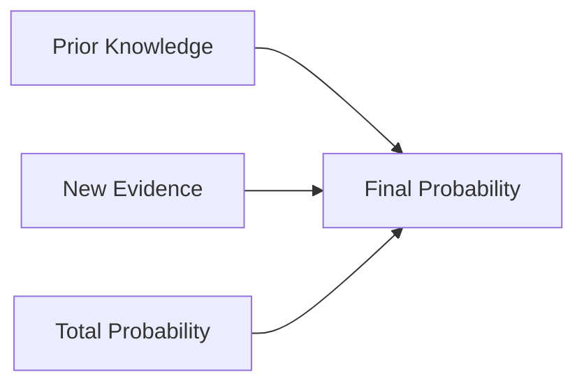

# Understanding Naive Bayes: A Beginner's Guide 🧮

## What is Naive Bayes?

Naive Bayes is a probabilistic machine learning algorithm based on Bayes' Theorem. Think of it like a doctor diagnosing a patient:
- The doctor has seen many patients before (training data)
- Each symptom contributes to the diagnosis (features)
- The doctor uses past experience to make predictions (probability)

### Why "Naive"?
The algorithm is called "naive" because it makes a simplifying assumption: it assumes all features are independent of each other. In reality, this isn't always true. For example, in text classification:
- The words "machine" and "learning" often appear together
- But Naive Bayes treats them as independent
- Despite this simplification, it works surprisingly well!

## Understanding Bayes' Theorem

Let's break down Bayes' Theorem with a real-world example:



### Email Spam Classification Example
Imagine you're building a spam filter:
- Prior Knowledge (P(spam)): 30% of all emails are spam
- Evidence (P(contains "free" | spam)): 80% of spam emails contain the word "free"
- Total Probability (P(contains "free")): 40% of all emails contain "free"

Using Bayes' Theorem:
```python
# Simple probability calculation
prior_spam = 0.30        # P(spam)
likelihood = 0.80        # P(contains "free" | spam)
total_prob = 0.40       # P(contains "free")

# Bayes' Theorem
spam_probability = (likelihood * prior_spam) / total_prob
print(f"Probability this is spam: {spam_probability:.1%}")  # 60%
```

This means: If an email contains the word "free", there's a 60% chance it's spam.

## Types of Naive Bayes

### 1. Gaussian Naive Bayes
Best for continuous data that follows a normal distribution (bell curve).

#### When to use it?
- Height/weight predictions
- Sensor measurements
- Financial data

```python
# Example: Student Performance Prediction
from sklearn.naive_bayes import GaussianNB
import numpy as np

# Features: [study_hours, sleep_hours, previous_score]
X = np.array([
    [5, 8, 75],  # Student 1
    [4, 7, 65],  # Student 2
    [3, 6, 55],  # Student 3
    [8, 9, 85]   # Student 4
])
y = np.array([1, 1, 0, 1])  # 1=pass, 0=fail

# Create and train model
model = GaussianNB()
model.fit(X, y)

# Predict for a new student
new_student = np.array([[6, 8, 70]])
prediction = model.predict(new_student)
probability = model.predict_proba(new_student)

print(f"Will student pass? {'Yes' if prediction[0] == 1 else 'No'}")
print(f"Confidence: {probability[0][1]:.1%}")
```

### 2. Multinomial Naive Bayes
Perfect for text classification where we count word frequencies.

#### When to use it?
- Document classification
- Spam detection
- Sentiment analysis

Here's a simple example:
```python
from sklearn.naive_bayes import MultinomialNB
from sklearn.feature_extraction.text import CountVectorizer

# Example emails
emails = [
    'win money lottery prize',     # Spam
    'meeting schedule tomorrow',   # Not spam
    'claim free gift now',        # Spam
    'project deadline update'      # Not spam
]
labels = [1, 0, 1, 0]  # 1=spam, 0=not spam

# Convert text to numbers
vectorizer = CountVectorizer()
X = vectorizer.fit_transform(emails)

# Train model
model = MultinomialNB()
model.fit(X, labels)

# Test new email
new_email = ['urgent claim your prize money now']
X_new = vectorizer.transform(new_email)
prediction = model.predict(X_new)

print(f"Is spam? {'Yes' if prediction[0] == 1 else 'No'}")
```

### 3. Bernoulli Naive Bayes
Used when features are binary (yes/no, true/false).

#### When to use it?
- Feature presence/absence
- Binary text features
- Simple yes/no characteristics

Example:
```python
from sklearn.naive_bayes import BernoulliNB

# Movie features: [action, romance, comedy, special_effects, dialogue]
X = np.array([
    [1, 0, 0, 1, 0],  # Action movie
    [0, 1, 0, 0, 1],  # Romance movie
    [0, 0, 1, 0, 1]   # Comedy movie
])
y = ['Action', 'Romance', 'Comedy']

model = BernoulliNB()
model.fit(X, y)

# Predict new movie
new_movie = np.array([[1, 0, 0, 1, 1]])
print(f"Predicted genre: {model.predict(new_movie)[0]}")
```

## Common Pitfalls and Solutions

### 1. Zero Probability Problem
**Problem**: If a feature value never appears in training for a class, it gets zero probability.

**Solution**: Use Laplace smoothing (add-one smoothing)
```python
# Use alpha parameter for smoothing
model = MultinomialNB(alpha=1.0)  # Default smoothing
```

### 2. Feature Independence Assumption
**Problem**: Features might be related in reality.

**Solution**: Feature selection or engineering
```python
# Example: Select top features using mutual information
from sklearn.feature_selection import mutual_info_classif

def select_features(X, y, k=10):
    """Select top k independent features"""
    scores = mutual_info_classif(X, y)
    top_features = np.argsort(scores)[-k:]
    return X[:, top_features]
```

### 3. Imbalanced Classes
**Problem**: One class has many more examples than others.

**Solution**: Use class weights or balanced dataset
```python
# Compute balanced class weights
from sklearn.utils.class_weight import compute_class_weight

weights = compute_class_weight('balanced', 
                             classes=np.unique(y),
                             y=y)
```

## Best Practices

1. **Data Preprocessing**:
   - Handle missing values
   - Scale numerical features (for Gaussian NB)
   - Remove irrelevant features

2. **Model Selection**:
   - Gaussian NB for continuous data
   - Multinomial NB for count data
   - Bernoulli NB for binary features

3. **Evaluation**:
   - Use cross-validation
   - Check confusion matrix
   - Look at feature importance

## Real-World Example: Text Classification

Let's build a complete text classifier:
```python
from sklearn.pipeline import Pipeline
from sklearn.feature_extraction.text import TfidfVectorizer

class TextClassifier:
    def __init__(self):
        self.pipeline = Pipeline([
            ('vectorizer', TfidfVectorizer(
                max_features=1000,
                stop_words='english'
            )),
            ('classifier', MultinomialNB(alpha=0.1))
        ])
        
    def train(self, texts, labels):
        """Train the classifier"""
        self.pipeline.fit(texts, labels)
        
    def predict(self, text):
        """Predict with confidence score"""
        # Get prediction and probability
        pred = self.pipeline.predict([text])[0]
        prob = self.pipeline.predict_proba([text])[0].max()
        
        return {
            'prediction': pred,
            'confidence': f"{prob:.1%}"
        }

# Example usage
classifier = TextClassifier()

# Training data
texts = [
    "great product highly recommend",
    "terrible waste of money",
    "amazing service will buy again",
    "poor quality disappointed"
]
labels = [1, 0, 1, 0]  # 1=positive, 0=negative

# Train classifier
classifier.train(texts, labels)

# Test new review
result = classifier.predict("really happy with my purchase")
print(f"Sentiment: {'Positive' if result['prediction'] == 1 else 'Negative'}")
print(f"Confidence: {result['confidence']}")
```

## Summary

Naive Bayes is a simple yet powerful algorithm that:
- Uses probability to make predictions
- Is particularly good for text classification
- Works well with small datasets
- Is computationally efficient

Despite its "naive" assumption, it often performs surprisingly well in practice, especially for:
- Text classification
- Spam detection
- Sentiment analysis
- Simple diagnostic systems

Remember to:
1. Choose the right type of Naive Bayes for your data
2. Handle the zero probability problem with smoothing
3. Preprocess your data appropriately
4. Consider feature selection if independence assumption is violated

Next steps:
- Try implementing the examples
- Experiment with different parameters
- Test on your own datasets
- Compare with other algorithms
