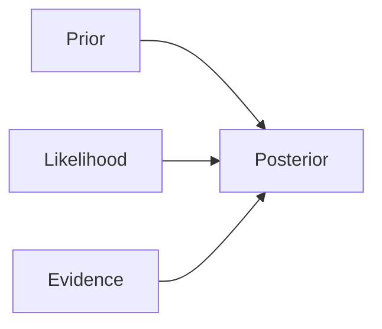

# Mathematical Foundation of Naive Bayes 📐

## Understanding Bayes' Theorem

Bayes' Theorem is the heart of Naive Bayes classification. Let's break it down step by step:

### The Basic Formula



$P(y|X) = \frac{P(X|y)P(y)}{P(X)}$

Let's understand what each term means:

> **Posterior P(y|X)**: The probability of a class (y) given the features (X). This is what we want to predict!

> **Likelihood P(X|y)**: The probability of observing these features given the class.

> **Prior P(y)**: The probability of the class before seeing any features.

> **Evidence P(X)**: The probability of observing these features in general.

### Real-World Example: Email Spam Detection 📧

Let's say we want to classify an email as spam or not spam:

```python
# Example probabilities
total_emails = 1000
spam_emails = 300
emails_with_word_free = 400
spam_with_word_free = 240

# Prior: P(spam)
prior = spam_emails / total_emails  # 0.3 or 30%

# Likelihood: P("free"|spam)
likelihood = spam_with_word_free / spam_emails  # 0.8 or 80%

# Evidence: P("free")
evidence = emails_with_word_free / total_emails  # 0.4 or 40%

# Posterior: P(spam|"free")
posterior = (likelihood * prior) / evidence  # 0.6 or 60%
```

This means:
- 30% of all emails are spam (Prior)
- 80% of spam emails contain "free" (Likelihood)
- 40% of all emails contain "free" (Evidence)
- Therefore, if an email contains "free", there's a 60% chance it's spam (Posterior)

## The "Naive" Assumption Explained

### Feature Independence

> **Feature Independence** means that knowing the value of one feature doesn't tell you anything about another feature.

```mermaid
graph TD
    A[Class Label: Spam/Not Spam] --> B[Word: "Free"]
    A --> C[Word: "Money"]
    A --> D[Word: "Win"]
    B -.x.- C[No direct connection]
    C -.x.- D[No direct connection]
    B -.x.- D[No direct connection]
    
    style A fill:#f9f,stroke:#333
    style B fill:#bbf,stroke:#333
    style C fill:#bbf,stroke:#333
    style D fill:#bbf,stroke:#333
```

This assumption leads to a simplified multiplication:

$P(X|y) = P(x_1|y) \times P(x_2|y) \times ... \times P(x_n|y)$

### Why This Works

Even though features might be related in reality:
1. The simplification makes calculations faster
2. It often works well in practice
3. We care more about classification than exact probabilities

## The Classification Rule

### Making Predictions

To classify a new instance:

1. Calculate posterior probability for each class
2. Choose the class with highest probability

Mathematically:

$\hat{y} = \arg\max_y P(y) \prod_{i=1}^n P(x_i|y)$

> **argmax** means "the argument that maximizes" - in other words, which class gives us the highest probability?

### Example: Document Classification 📄

Let's classify a document as either tech or sports:

```python
# Example document: "computer program code"
words = ["computer", "program", "code"]

# Prior probabilities
P_tech = 0.5    # 50% of documents are tech
P_sports = 0.5  # 50% of documents are sports

# Word probabilities in tech documents
P_computer_tech = 0.3
P_program_tech = 0.25
P_code_tech = 0.2

# Word probabilities in sports documents
P_computer_sports = 0.01
P_program_sports = 0.02
P_code_sports = 0.01

# Calculate for tech
tech_score = P_tech * P_computer_tech * P_program_tech * P_code_tech
# = 0.5 * 0.3 * 0.25 * 0.2 = 0.0075

# Calculate for sports
sports_score = P_sports * P_computer_sports * P_program_sports * P_code_sports
# = 0.5 * 0.01 * 0.02 * 0.01 = 0.0000001

# tech_score > sports_score, so classify as tech
```

## Handling Numerical Features 🔢

For continuous features, we typically use Gaussian (Normal) distribution:

> **Gaussian Distribution** is a bell-shaped curve that describes how likely different values are to occur.

$P(x_i|y) = \frac{1}{\sqrt{2\pi\sigma_y^2}} \exp\left(-\frac{(x_i - \mu_y)^2}{2\sigma_y^2}\right)$

Where:
- $\mu_y$ is the mean of feature $i$ for class $y$
- $\sigma_y^2$ is the variance of feature $i$ for class $y$

### Example: Height Classification

```python
# Example: Classifying gender based on height
# Parameters calculated from training data
male_height_mean = 175    # cm
male_height_std = 10      # cm
female_height_mean = 162  # cm
female_height_std = 8     # cm

# Prior probabilities
P_male = 0.5
P_female = 0.5

# For a new person with height 168 cm:
from math import pi, exp

def gaussian_probability(x, mean, std):
    return (1 / (std * (2 * pi)**0.5)) * exp(-((x - mean)**2) / (2 * std**2))

# Calculate probabilities
male_prob = P_male * gaussian_probability(168, male_height_mean, male_height_std)
female_prob = P_female * gaussian_probability(168, female_height_mean, female_height_std)

# Compare probabilities to make prediction
prediction = "male" if male_prob > female_prob else "female"
```

## Next Steps 📚

Now that you understand the mathematical foundation:
1. Learn about [different types of Naive Bayes](3-types.md) for different kinds of data
2. See how to [implement Naive Bayes](4-implementation.md) in practice
3. Explore [advanced topics](5-advanced-topics.md) like handling missing data and feature selection
