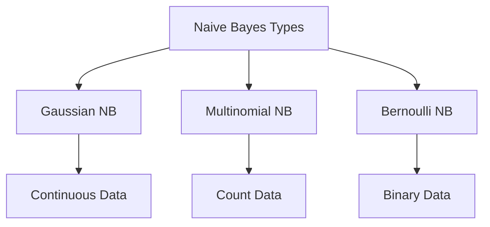
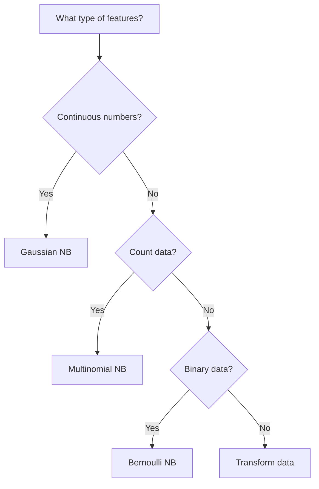

# Types of Naive Bayes Classifiers 🔍

Different types of Naive Bayes are designed to handle different kinds of data. Let's explore each type and understand when to use them.

## Overview of Naive Bayes Types



## 1. Gaussian Naive Bayes 📊

> **Gaussian Naive Bayes** assumes that continuous features follow a normal (bell-shaped) distribution for each class.

### When to Use
- Continuous numerical data
- Features that follow a bell curve
- When features have different scales

### Examples
- Height/weight predictions
- Sensor measurements
- Financial metrics
- Age-based classification

### Mathematical Form
For each feature $x_i$ in class $y$:

$P(x_i|y) = \frac{1}{\sqrt{2\pi\sigma_y^2}} \exp\left(-\frac{(x_i - \mu_y)^2}{2\sigma_y^2}\right)$

```python
from sklearn.naive_bayes import GaussianNB

# Example: Student Grade Prediction
X = [
    [175, 70],  # [height_cm, weight_kg]
    [160, 55],
    [180, 80],
]
y = ['M', 'F', 'M']  # Gender labels

model = GaussianNB()
model.fit(X, y)

# Predict for new student: height=170cm, weight=65kg
prediction = model.predict([[170, 65]])
```

## 2. Multinomial Naive Bayes 📝

> **Multinomial Naive Bayes** is designed for data that can be expressed as frequency counts or rates.

### When to Use
- Text classification
- Document categorization
- Any data where features represent counts
- Features that are discrete numbers

### Examples
1. Text Classification:
   - Word frequencies in documents
   - Character n-gram frequencies
   - Term frequency-inverse document frequency (TF-IDF)

2. Rating-based Systems:
   - Movie ratings (1-5 stars)
   - Product reviews
   - Survey responses

### Mathematical Form
For a feature vector $X$:

$P(X|y) = \frac{(\sum_i x_i)!}{\prod_i x_i!} \prod_i P(i|y)^{x_i}$

```python
from sklearn.naive_bayes import MultinomialNB
from sklearn.feature_extraction.text import CountVectorizer

# Example: Document Classification
documents = [
    'this movie is great',
    'horrible waste of time',
    'awesome movie loved it'
]
y = ['positive', 'negative', 'positive']

# Convert text to word counts
vectorizer = CountVectorizer()
X = vectorizer.fit_transform(documents)

# Train model
model = MultinomialNB()
model.fit(X, y)

# Predict new document
new_doc = ['this is awesome']
X_new = vectorizer.transform(new_doc)
prediction = model.predict(X_new)
```

## 3. Bernoulli Naive Bayes 🎯

> **Bernoulli Naive Bayes** works with binary features - features that can only be true/false or 1/0.

### When to Use
- Binary features
- Presence/absence data
- When you care about non-occurrence
- Text classification with word presence

### Examples
1. Email Spam Detection:
   - Word presence (not frequency)
   - Contains links? (yes/no)
   - Has attachments? (yes/no)

2. Medical Diagnosis:
   - Symptom present/absent
   - Test positive/negative
   - Risk factor exists/doesn't exist

### Mathematical Form
For a feature vector $X$:

$P(X|y) = \prod_i P(i|y)^{x_i}(1-P(i|y))^{1-x_i}$

```python
from sklearn.naive_bayes import BernoulliNB

# Example: Email Spam Detection
X = [
    [1, 1, 0, 1],  # [has_money, has_free, has_meeting, has_exclamation]
    [0, 0, 1, 0],
    [1, 1, 0, 1]
]
y = ['spam', 'not_spam', 'spam']

model = BernoulliNB()
model.fit(X, y)

# Predict new email
new_email = [[1, 0, 0, 1]]  # has_money=True, has_exclamation=True
prediction = model.predict(new_email)
```

## Choosing the Right Type 🤔

### Decision Flowchart



### Quick Reference Table

| Type | Best For | Example Features | Typical Applications |
|------|----------|------------------|---------------------|
| Gaussian | Continuous data | Height, Weight, Age | Medical diagnosis, Sensor data |
| Multinomial | Count data | Word frequencies, Ratings | Text classification, Document categorization |
| Bernoulli | Binary data | Present/Absent, Yes/No | Spam detection, Medical screening |

## Performance Considerations 🚀

1. **Data Size**
   - All types work well with small datasets
   - Multinomial and Bernoulli are particularly efficient
   - Gaussian might need more data for accurate distribution estimation

2. **Feature Engineering**
   - Gaussian: May need feature scaling
   - Multinomial: Often needs normalization
   - Bernoulli: Requires binary conversion

3. **Computational Efficiency**
   - Training: All types are very fast
   - Prediction: Extremely efficient
   - Memory: Light footprint

## Next Steps 📚

Now that you understand the different types of Naive Bayes:
1. Learn how to [implement them in practice](4-implementation.md)
2. Explore [advanced topics](5-advanced-topics.md) like handling missing data
3. Try combining different types for hybrid solutions
