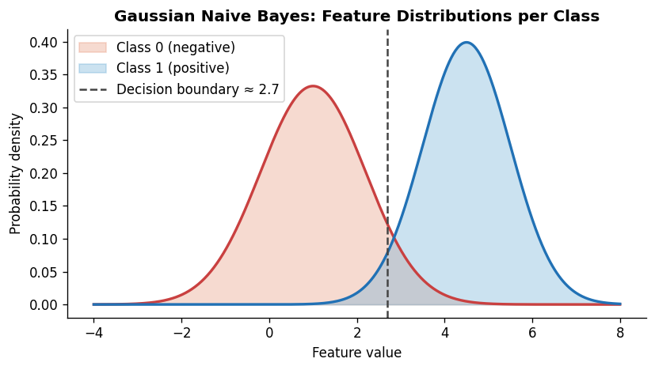
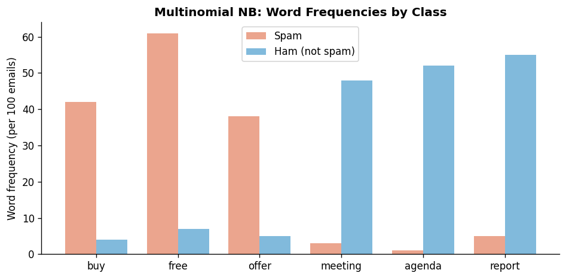

# Types of Naive Bayes Classifiers

**After this lesson:** you can explain Types of Naive Bayes Classifiers and try the examples in your own notebook.

## Overview

Naive Bayes comes in three variants: Gaussian for continuous features, multinomial for counts, and Bernoulli for binary indicators. The right pick is dictated by the **shape of your features**, not the domain. **Prerequisites:** [1-introduction.md](1-introduction.md) and the math from [2-math-foundation.md](2-math-foundation.md).

### Choosing the Right Type

Think of choosing a Naive Bayes type like choosing the right tool for a job:

* Need to measure something? Use a ruler (Gaussian NB)
* Counting things? Use a tally counter (Multinomial NB)
* Checking if something is present? Use a checklist (Bernoulli NB)

## 1. Gaussian Naive Bayes: For Numbers

### What is it?

Gaussian Naive Bayes is like a smart ruler that understands how numbers are distributed. It's perfect for:

* Height and weight measurements
* Temperature readings
* Age data
* Any continuous numbers

### Real-World Example: Medical Diagnosis

Imagine you're a doctor trying to predict if a patient has a certain disease based on their:

* Body temperature
* Heart rate
* Blood pressure
* Age

These are all numbers, so Gaussian NB is perfect!

#### Gaussian NB on scaled vitals

Data and Scaling

Three patient records with four vitals are labelled sick/healthy; StandardScaler normalises the features so that temperature (38°C) and blood pressure (140 mmHg) live on comparable scales before Gaussian NB estimates the per-class distributions.

Fit and Predict

GaussianNB learns mean and variance for each feature per class; the new patient is transformed with the same scaler fitted on training data before calling `predict`.

### Why This Matters

Gaussian NB is great because:

* It understands how numbers are distributed
* Works well with measurements
* Can handle different scales (like temperature and age)
* Fast and efficient

## 2. Multinomial Naive Bayes: For Counting

### What is it?

Multinomial Naive Bayes is like a word counter that helps classify text. It's perfect for:

* Document classification
* Spam detection
* Sentiment analysis
* Any data where you're counting things

### Real-World Example: News Article Classification

Imagine you're building a system to automatically categorize news articles into:

* Sports
* Politics
* Technology
* Entertainment

Multinomial NB counts how often words appear in each category to make its predictions.

#### Multinomial NB on word counts

Corpus and Vectorise

Three one-sentence training articles cover sports, tech, and politics; `CountVectorizer().fit_transform` builds a sparse document-term matrix of raw word counts used as features.

Train and Classify

MultinomialNB models word counts as multinomial distributions per class; the new article is transformed with the same vocabulary before predict, words like "smartphone" and "technology" should push it toward "tech".

### Why This Matters

Multinomial NB is great because:

* Perfect for text data
* Handles word frequencies well
* Works with any kind of count data
* Very efficient with large datasets

## 3. Bernoulli Naive Bayes: For Yes/No Questions

### What is it?

Bernoulli Naive Bayes is like a checklist that only cares if something is present or not. It's perfect for:

* Binary features (yes/no)
* Presence/absence data
* Features that are either true or false

### Real-World Example: Email Spam Detection

Imagine you're building a spam filter that checks for:

* Contains the word "free"? (yes/no)
* Has attachments? (yes/no)
* Contains links? (yes/no)
* Has exclamation marks? (yes/no)

Bernoulli NB is perfect for these yes/no features!

#### Bernoulli NB on binary feature vectors

Binary Features

Each email is encoded as four binary flags (has\_free, has\_attachment, has\_link, has\_exclamation); BernoulliNB models each feature as a Bernoulli trial (present/absent) rather than a word count.

Fit and Predict

The model learns P(feature=1 | class) for each binary flag; a new email with has\_free and has\_exclamation both true maps to the spam-like pattern seen in training.

### Why This Matters

Bernoulli NB is great because:

* Simple and fast
* Perfect for binary features
* Works well with presence/absence data
* Less sensitive to word frequency than Multinomial NB

## Choosing the Right Type: A Quick Guide

### Decision Tree

### Quick Reference Table

| Type        | Best For | Example             | When to Use                    |
| ----------- | -------- | ------------------- | ------------------------------ |
| Gaussian    | Numbers  | Height, Temperature | When dealing with measurements |
| Multinomial | Counts   | Word frequencies    | When counting occurrences      |
| Bernoulli   | Yes/No   | Feature presence    | When only presence matters     |

## Common Mistakes to Avoid

1. **Using the Wrong Type**
   * Don't use Gaussian for text data
   * Don't use Multinomial for binary features
   * Don't use Bernoulli for continuous numbers
2. **Forgetting to Preprocess**
   * Scale numbers for Gaussian NB
   * Convert text to counts for Multinomial NB
   * Ensure binary features for Bernoulli NB
3. **Ignoring Data Characteristics**
   * Check if your data matches the type's assumptions
   * Transform data if needed
   * Consider mixing types for different features

## Practice Time

Try these exercises:

1. Build a spam detector using Bernoulli NB
2. Create a document classifier with Multinomial NB
3. Predict medical conditions using Gaussian NB
4. Compare the performance of different types

## Gotchas

* **Passing negative values to `MultinomialNB`**: `MultinomialNB` assumes features are non-negative counts. If you pass TF-IDF scores (which are floats, not integers) or any negative values, scikit-learn will raise a `ValueError`. Use `BernoulliNB` for binary features, `GaussianNB` for real-valued features, and `MultinomialNB` only when your features are genuine non-negative integers or TF-IDF with `min_df` safely applied.
* **Using `GaussianNB` without scaling and then wondering why accuracy is low**: Unlike many parametric models, `GaussianNB` estimates per-class Gaussian distributions. Unscaled features (e.g., blood pressure in the 100s vs age in the 30s) don't cause the model to fail outright, but the variance estimates become dominated by the high-magnitude feature, skewing the decision boundary. Always scale continuous inputs.
* **Applying `BernoulliNB` to word-count features instead of binary presence**: `BernoulliNB` models each feature as present-or-absent (0 or 1). If you feed raw word counts (e.g., "free" appears 3 times), it treats anything non-zero as 1, silently discarding frequency information. Use `MultinomialNB` when word frequency matters, and `BernoulliNB` only when you want pure presence/absence.
* **Calling `scaler.fit_transform` on the new patient at prediction time**: The `GaussianNB` example calls `scaler.transform(new_patient)` (correct). A common mistake is to call `scaler.fit_transform(new_patient)`, which fits a new scaler on a single row of data, producing useless z-scores and a silently wrong prediction.
* **Expecting `MultinomialNB` to handle out-of-vocabulary words gracefully without smoothing**: The `CountVectorizer` ignores words in test documents that didn't appear in training. This is handled automatically by sklearn's pipeline, but if you build your own vocabulary manually and forget to handle OOV tokens, the model will either error or produce zero-probability predictions for those documents.

## Next Steps

Ready to put these types into action? Move on to [Implementation](4-implementation.md) to see how to use these different types in real projects.

Remember: The right tool for the right job! Choose your Naive Bayes type wisely based on your data.
