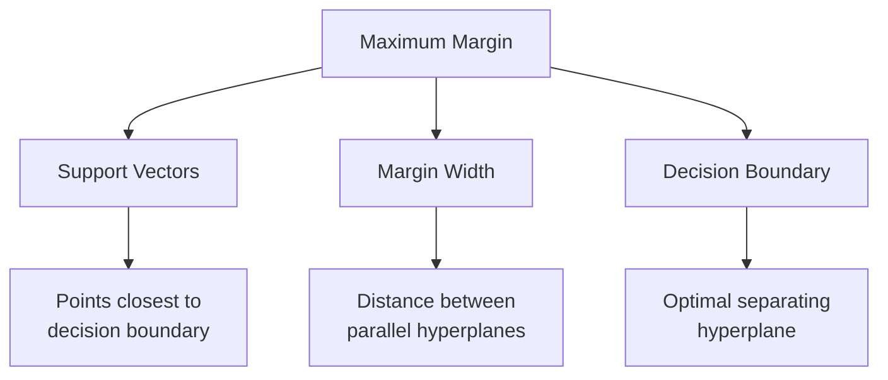
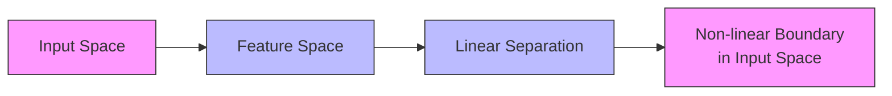

# Support Vector Machines (SVM): A Visual Guide ⚔️

## 1. Understanding the Maximum Margin Concept

### The Optimal Hyperplane


### Mathematical Visualization
```python
import numpy as np
import matplotlib.pyplot as plt
from sklearn.svm import SVC

def visualize_margin():
    """Visualize SVM margin and support vectors"""
    # Generate linearly separable data
    np.random.seed(42)
    X = np.r_[np.random.randn(20, 2) - [2, 2],
              np.random.randn(20, 2) + [2, 2]]
    y = np.array([0] * 20 + [1] * 20)
    
    # Fit SVM
    svm = SVC(kernel='linear', C=1000)
    svm.fit(X, y)
    
    # Create mesh grid
    x_min, x_max = X[:, 0].min() - 1, X[:, 0].max() + 1
    y_min, y_max = X[:, 1].min() - 1, X[:, 1].max() + 1
    xx, yy = np.meshgrid(np.linspace(x_min, x_max, 100),
                        np.linspace(y_min, y_max, 100))
    
    # Get decision function
    Z = svm.decision_function(np.c_[xx.ravel(), yy.ravel()])
    Z = Z.reshape(xx.shape)
    
    # Plot decision boundary and margins
    plt.figure(figsize=(12, 8))
    plt.contour(xx, yy, Z, colors='k', levels=[-1, 0, 1], alpha=0.5,
                linestyles=['--', '-', '--'])
    plt.scatter(X[:, 0], X[:, 1], c=y, cmap=plt.cm.Paired,
                edcolors='black')
    plt.scatter(svm.support_vectors_[:, 0], svm.support_vectors_[:, 1],
                s=300, linewidth=1, facecolors='none', edgecolors='k',
                label='Support Vectors')
    plt.title('SVM Decision Boundary with Margin')
    plt.legend()
```

## 2. The Kernel Trick Explained

### Kernel Transformation Process


### Different Kernel Types
```python
def compare_kernels(X, y):
    """Compare different SVM kernels"""
    kernels = ['linear', 'poly', 'rbf', 'sigmoid']
    fig, axes = plt.subplots(2, 2, figsize=(15, 15))
    
    for idx, kernel in enumerate(kernels):
        ax = axes[idx//2, idx%2]
        
        # Train SVM
        svm = SVC(kernel=kernel)
        svm.fit(X, y)
        
        # Create mesh grid
        x_min, x_max = X[:, 0].min() - 1, X[:, 0].max() + 1
        y_min, y_max = X[:, 1].min() - 1, X[:, 1].max() + 1
        xx, yy = np.meshgrid(np.linspace(x_min, x_max, 100),
                            np.linspace(y_min, y_max, 100))
        
        # Plot decision boundary
        Z = svm.predict(np.c_[xx.ravel(), yy.ravel()])
        Z = Z.reshape(xx.shape)
        ax.contourf(xx, yy, Z, alpha=0.4)
        ax.scatter(X[:, 0], X[:, 1], c=y, alpha=0.8)
        ax.set_title(f'{kernel.upper()} Kernel')
```

## 3. Soft Margin SVM

### Understanding C Parameter
```python
def visualize_C_effect():
    """Visualize effect of C parameter"""
    C_values = [0.1, 1, 10, 100]
    fig, axes = plt.subplots(2, 2, figsize=(15, 15))
    
    for idx, C in enumerate(C_values):
        ax = axes[idx//2, idx%2]
        
        # Train SVM with different C
        svm = SVC(C=C, kernel='linear')
        svm.fit(X, y)
        
        # Plot decision boundary
        x_min, x_max = X[:, 0].min() - 1, X[:, 0].max() + 1
        y_min, y_max = X[:, 1].min() - 1, X[:, 1].max() + 1
        xx, yy = np.meshgrid(np.linspace(x_min, x_max, 100),
                            np.linspace(y_min, y_max, 100))
        
        Z = svm.predict(np.c_[xx.ravel(), yy.ravel()])
        Z = Z.reshape(xx.shape)
        
        ax.contourf(xx, yy, Z, alpha=0.4)
        ax.scatter(X[:, 0], X[:, 1], c=y, alpha=0.8)
        ax.scatter(svm.support_vectors_[:, 0], svm.support_vectors_[:, 1],
                  s=100, linewidth=1, facecolors='none', edgecolors='k')
        ax.set_title(f'C = {C}')
```

## 4. Advanced SVM Techniques

### Multi-class Classification
```python
from sklearn.multiclass import OneVsRestClassifier

class MultiClassSVM:
    def __init__(self):
        self.classifier = OneVsRestClassifier(SVC(kernel='rbf'))
        
    def visualize_multiclass(self, X, y):
        """Visualize multi-class SVM decision boundaries"""
        self.classifier.fit(X, y)
        
        # Create mesh grid
        x_min, x_max = X[:, 0].min() - 1, X[:, 0].max() + 1
        y_min, y_max = X[:, 1].min() - 1, X[:, 1].max() + 1
        xx, yy = np.meshgrid(np.linspace(x_min, x_max, 100),
                            np.linspace(y_min, y_max, 100))
        
        # Plot decision boundary
        Z = self.classifier.predict(np.c_[xx.ravel(), yy.ravel()])
        Z = Z.reshape(xx.shape)
        
        plt.figure(figsize=(10, 8))
        plt.contourf(xx, yy, Z, alpha=0.4)
        plt.scatter(X[:, 0], X[:, 1], c=y, alpha=0.8)
        plt.title('Multi-class SVM Classification')
```

### Feature Selection with SVM
```python
from sklearn.feature_selection import SelectFromModel

def select_features_svm(X, y):
    """Select important features using SVM weights"""
    # Linear SVM for feature selection
    svm = LinearSVC(C=0.01, penalty='l1', dual=False)
    selector = SelectFromModel(svm, prefit=False)
    
    # Fit and transform
    X_new = selector.fit_transform(X, y)
    
    # Get selected feature indices
    selected_features = selector.get_support()
    
    # Visualize feature importance
    plt.figure(figsize=(10, 6))
    plt.bar(range(X.shape[1]), np.abs(svm.coef_[0]))
    plt.xlabel('Feature Index')
    plt.ylabel('Absolute Coefficient Value')
    plt.title('Feature Importance in SVM')
    
    return X_new, selected_features
```

## 5. Real-world Applications

### Text Classification Pipeline
```python
from sklearn.feature_extraction.text import TfidfVectorizer
from sklearn.pipeline import Pipeline

class SVMTextClassifier:
    def __init__(self):
        self.pipeline = Pipeline([
            ('tfidf', TfidfVectorizer(
                max_features=5000,
                ngram_range=(1, 2),
                stop_words='english'
            )),
            ('svm', SVC(kernel='linear', probability=True))
        ])
        
    def train_and_visualize(self, texts, labels):
        """Train classifier and visualize results"""
        # Train pipeline
        self.pipeline.fit(texts, labels)
        
        # Get feature importance
        tfidf = self.pipeline.named_steps['tfidf']
        svm = self.pipeline.named_steps['svm']
        
        # Get feature names and coefficients
        feature_names = tfidf.get_feature_names_out()
        coefficients = svm.coef_[0]
        
        # Plot top features
        plt.figure(figsize=(12, 6))
        top_features = np.argsort(np.abs(coefficients))[-10:]
        plt.barh(range(10), coefficients[top_features])
        plt.yticks(range(10), [feature_names[i] for i in top_features])
        plt.xlabel('Coefficient Value')
        plt.title('Top Features in Text Classification')
```

### Image Classification with SVM
```python
class SVMImageClassifier:
    def __init__(self):
        self.pipeline = Pipeline([
            ('scaler', StandardScaler()),
            ('pca', PCA(n_components=0.95)),
            ('svm', SVC(kernel='rbf'))
        ])
        
    def preprocess_image(self, image):
        """Preprocess image for SVM"""
        # Resize and flatten
        image_resized = cv2.resize(image, (64, 64))
        image_gray = cv2.cvtColor(image_resized, cv2.COLOR_BGR2GRAY)
        return image_gray.flatten()
        
    def visualize_classification(self, images, labels):
        """Visualize classification results"""
        # Process images
        X = np.array([self.preprocess_image(img) for img in images])
        
        # Train and predict
        self.pipeline.fit(X, labels)
        predictions = self.pipeline.predict(X)
        
        # Plot results
        fig, axes = plt.subplots(4, 4, figsize=(12, 12))
        for idx, ax in enumerate(axes.ravel()):
            if idx < len(images):
                ax.imshow(images[idx])
                ax.set_title(f'Pred: {predictions[idx]}')
                ax.axis('off')
```

## 6. Optimization and Best Practices

### Hyperparameter Optimization
```python
from sklearn.model_selection import RandomizedSearchCV
from scipy.stats import uniform, randint

def optimize_svm_params(X, y):
    """Optimize SVM hyperparameters"""
    # Parameter distributions
    param_dist = {
        'C': uniform(0.1, 100),
        'gamma': uniform(0.0001, 0.1),
        'kernel': ['rbf', 'poly', 'sigmoid'],
        'degree': randint(2, 5)
    }
    
    # Random search
    random_search = RandomizedSearchCV(
        SVC(),
        param_distributions=param_dist,
        n_iter=100,
        cv=5,
        n_jobs=-1,
        verbose=1
    )
    
    # Fit and plot results
    random_search.fit(X, y)
    
    # Visualize parameter importance
    results = pd.DataFrame(random_search.cv_results_)
    param_scores = results.groupby('param_kernel').mean_test_score.mean()
    
    plt.figure(figsize=(10, 6))
    param_scores.plot(kind='bar')
    plt.title('Average Score by Kernel Type')
    plt.ylabel('Mean CV Score')
    
    return random_search.best_estimator_
```

### Memory Optimization
```python
def optimize_memory_usage(X, y, chunk_size=1000):
    """Handle large datasets efficiently"""
    from sklearn.linear_model import SGDClassifier
    
    # Use SGD for online learning
    sgd_svm = SGDClassifier(
        loss='hinge',  # hinge loss = linear SVM
        learning_rate='optimal',
        max_iter=1000
    )
    
    # Train in chunks
    for i in range(0, len(X), chunk_size):
        X_chunk = X[i:i + chunk_size]
        y_chunk = y[i:i + chunk_size]
        sgd_svm.partial_fit(X_chunk, y_chunk,
                           classes=np.unique(y))
    
    return sgd_svm
```

This enhanced explanation provides:
1. Visual representations of SVM concepts
2. Interactive examples of kernel effects
3. Detailed implementation of advanced techniques
4. Real-world applications with visualization
5. Optimization strategies and best practices
6. Memory-efficient implementations for large datasets

The mermaid diagrams and code examples can be run to generate visual insights into how Support Vector Machines work in practice.
