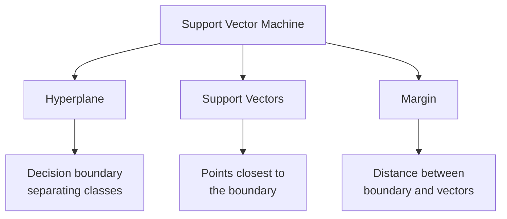

# Introduction to Support Vector Machines (SVM) ⚔️

After exploring Naive Bayes and KNN, we now dive into Support Vector Machines (SVM), a powerful algorithm that finds optimal boundaries between classes.

## What is SVM?

> **Support Vector Machines (SVM)** is a supervised learning algorithm that finds the best boundary (hyperplane) to separate different classes of data points.

Think of it like creating the widest possible street between two neighborhoods:
- The street is our decision boundary
- We want the street to be as wide as possible
- Houses closest to the street help define its position
- These closest houses are our "support vectors"

### Real-World Analogy 🏘️

Imagine organizing books on a shelf:
1. You want to separate fiction from non-fiction
2. You leave a clear gap between them
3. The books at the edges of each section help define the boundary
4. These edge books are like support vectors!

## Key Concepts

### 1. Hyperplane

> **Hyperplane** is a decision boundary that separates different classes. In 2D, it's a line; in 3D, it's a plane; in higher dimensions, it's a hyperplane.

### 2. Support Vectors

> **Support Vectors** are the data points closest to the hyperplane that "support" or define its position. They are the most important points in our dataset!

### 3. Margin

> **Margin** is the distance between the hyperplane and the nearest data points (support vectors). SVM tries to maximize this margin.

## When to Use SVM? 🤔

### Perfect For:
- High-dimensional data
- Text classification
- Image recognition
- When clear separation is needed
- When you have up to medium-sized datasets

### Not Great For:
- Very large datasets (slow training)
- Noisy datasets with overlapping classes
- When probabilistic outputs are needed
- When interpretability is crucial

## How Does it Fit in the ML Workflow?

Recalling our machine learning workflow from previous lessons:

1. **Problem Definition** 🎯
   - Binary or multiclass classification
   - Regression (yes, SVM can do regression too!)
   - Feature space understanding

2. **Data Collection** 📊
   - Quality over quantity
   - Representative samples
   - Clear class separation if possible

3. **Data Preparation** 🧹
   - Feature scaling is crucial!
   - Handling missing values
   - Feature selection/engineering

4. **Model Selection** 🤖
   - Choose kernel type
   - Set hyperparameters
   - Consider data size and dimensionality

5. **Model Evaluation** 📈
   - Cross-validation
   - Margin analysis
   - Support vector examination

## Advantages and Limitations

### Advantages ✅
- Effective in high dimensions
- Memory efficient (uses support vectors)
- Versatile (different kernel functions)
- Works well with clear margin of separation
- Robust against overfitting

### Limitations ❌
- Sensitive to feature scaling
- Long training time for large datasets
- Difficult to interpret
- Sensitive to noise
- Not directly probabilistic

## Key Decisions in SVM 🔑

1. **Kernel Selection**
   > **Kernel** is a function that transforms our data to make it linearly separable. Think of it as looking at data from a different angle.

2. **Margin Type**
   > **Hard Margin** enforces perfect separation, while **Soft Margin** allows some errors for better generalization.

3. **Hyperparameters**
   > Parameters like **C** (error penalty) and **gamma** (kernel coefficient) control the model's behavior.

## Next Steps 📚

In the following sections, we'll dive deeper into:
1. [Mathematical Foundation and Kernels](2-math-kernels.md)
2. [Implementation Basics](3-implementation.md)
3. [Advanced Techniques](4-advanced.md)
4. [Applications and Best Practices](5-applications.md)

Each section builds upon these fundamental concepts, helping you master SVM step by step.
