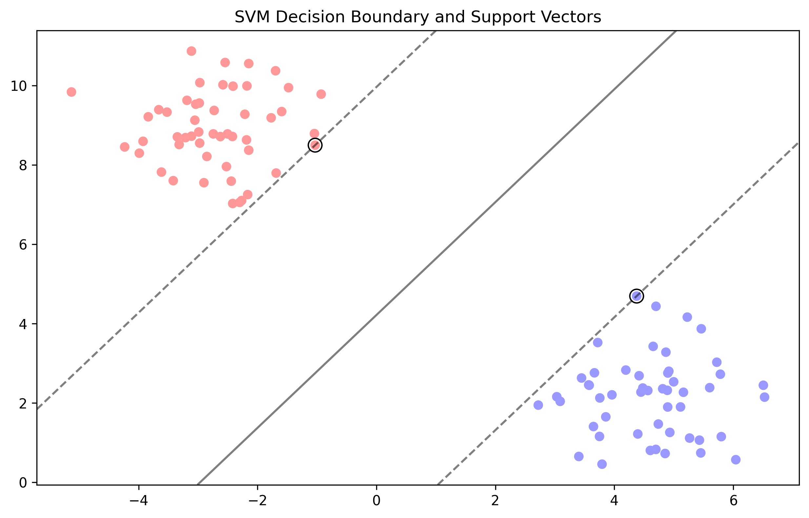

# Introduction to Support Vector Machines (SVM)

**After this lesson:** you can explain the core ideas in “Introduction to Support Vector Machines (SVM)” and reproduce the examples here in your own notebook or environment.

## Overview

**SVMs** fit a **maximum-margin** boundary between classes (or regress with an $\varepsilon$-insensitive tube); **kernels** lift features so nonlinear boundaries are possible. **Prerequisites:** [5.2 README](../README.md); comfort with vectors from Module 1 helps for [2-math-kernels.md](2-math-kernels.md).

## Helpful video

Crash Course AI: supervised learning for classical algorithms.

<iframe width="560" height="315" src="https://www.youtube.com/embed/4qVRBYAdLAo" title="Supervised Learning: Crash Course AI" frameborder="0" allow="accelerometer; autoplay; clipboard-write; encrypted-media; gyroscope; picture-in-picture" allowfullscreen></iframe>

## What is SVM?

> **Support Vector Machines (SVM)** is like a smart boundary creator that finds the best way to separate different groups of data points.

*Figure: SVM decision boundary (solid line) with margins (dashed lines) and support vectors (points with black edges)*

### Real-World Analogy: The Perfect Fence

Imagine you're building a fence to separate two types of plants in your garden:

1. You want the fence to be as far as possible from both types of plants
2. The plants closest to the fence help determine its position
3. These "border plants" are like support vectors
4. The space between the fence and the nearest plants is called the margin

### Why This Matters

- SVM helps computers make decisions by finding clear boundaries
- It's great for problems where you need to separate things into distinct categories
- The algorithm is smart enough to handle complex patterns in data

## Key Concepts Explained Simply

### 1. Hyperplane: The Decision Boundary
>
> Think of a hyperplane as a line (in 2D) or a flat surface (in 3D) that separates different groups.

**Real-World Example:**

- In 2D: A line separating apples from oranges on a table
- In 3D: A flat surface separating different types of fruits in space
- In higher dimensions: A mathematical surface separating complex data

### 2. Support Vectors: The Important Points
>
> These are the data points closest to the hyperplane that "support" or define its position.

**Why They Matter:**

- They're like the key witnesses in a court case
- Only these points affect where the boundary is placed
- Makes SVM memory efficient (only stores important points)

### 3. Margin: The Safety Zone
>
> The margin is the distance between the hyperplane and the nearest data points.

**Real-World Analogy:**

- Like having a safety buffer zone between two opposing teams
- A wider margin means better separation and more confidence in predictions

## When Should You Use SVM?

### Perfect For These Situations

1. **Text Classification**
   - Spam detection
   - Sentiment analysis
   - Topic categorization

2. **Image Recognition**
   - Face detection
   - Handwriting recognition
   - Object classification

3. **Medical Diagnosis**
   - Disease prediction
   - Patient classification
   - Treatment effectiveness

### Not Ideal For

1. **Very Large Datasets**
   - Training can be slow
   - Memory intensive

2. **Noisy Data**
   - When classes overlap significantly
   - When there are many outliers

3. **Probabilistic Predictions**
   - When you need probability scores
   - When uncertainty estimates are crucial

## Advantages and Limitations

### Advantages

1. **Effective in High Dimensions**
   - Works well even with many features
   - Great for text and image data

2. **Memory Efficient**
   - Only stores support vectors
   - Doesn't need the entire dataset after training

3. **Versatile**
   - Can handle linear and non-linear problems
   - Different kernel options for different needs

### Limitations

1. **Sensitive to Feature Scaling**
   - Need to normalize/scale features
   - Can affect performance if not done properly

2. **Training Time**
   - Can be slow for large datasets
   - More complex than some other algorithms

3. **Parameter Tuning**
   - Need to choose right kernel
   - Need to set regularization parameter (C)

## Common Mistakes to Avoid

1. **Forgetting to Scale Features**
   - Always scale your features before using SVM
   - Use StandardScaler or MinMaxScaler

2. **Choosing Wrong Kernel**
   - Start with linear kernel for high-dimensional data
   - Use RBF kernel for non-linear problems
   - Try polynomial kernel for known polynomial relationships

3. **Ignoring Class Imbalance**
   - Use class_weight parameter for imbalanced data
   - Consider SMOTE for severe imbalance

## Gotchas

- **Expecting SVM to output probabilities by default** — Unlike logistic regression, `SVC` does not output calibrated probabilities unless you pass `probability=True` at construction time. Even then, the probabilities are estimated via Platt scaling (an internal cross-validation) which significantly increases training time and can still be poorly calibrated for small datasets.
- **Forgetting to scale features before training** — SVM is one of the most scaling-sensitive algorithms. A single feature with values in the thousands will dominate the margin calculation, causing the hyperplane to nearly ignore all other features. Always apply `StandardScaler` (or `MinMaxScaler`) before fitting any SVM model.
- **Assuming SVM handles class imbalance automatically** — By default, `SVC` gives equal weight to all training samples. With imbalanced classes (e.g., 95% negative, 5% positive), the model may learn to always predict the majority class and still achieve high accuracy. Use `class_weight='balanced'` to account for imbalance.
- **Treating the number of support vectors as fixed** — The number of support vectors increases with a higher `C` (more points near or inside the margin are included) and decreases with lower `C`. A model with very many support vectors relative to training size is likely overfitting, even though the training accuracy looks high.
- **Interpreting the SVM boundary as a global rule** — The SVM boundary is defined entirely by the support vectors. Adding or removing a non-support-vector training point has no effect on the decision boundary, but adding a single point near the boundary can shift it dramatically. This is a feature (memory efficiency) but also a fragility in adversarial or noisy settings.

## Next Steps

In the following sections, we'll explore:

1. [Mathematical Foundation and Kernels](2-math-kernels.md) - The math behind SVM
2. [Implementation Basics](3-implementation.md) - How to code SVM
3. [Advanced Techniques](4-advanced.md) - Optimizing SVM
4. [Applications and Best Practices](5-applications.md) - Real-world examples

Remember: Start simple, understand the basics, and gradually build up to more complex concepts!
