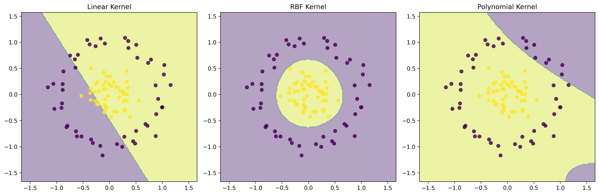
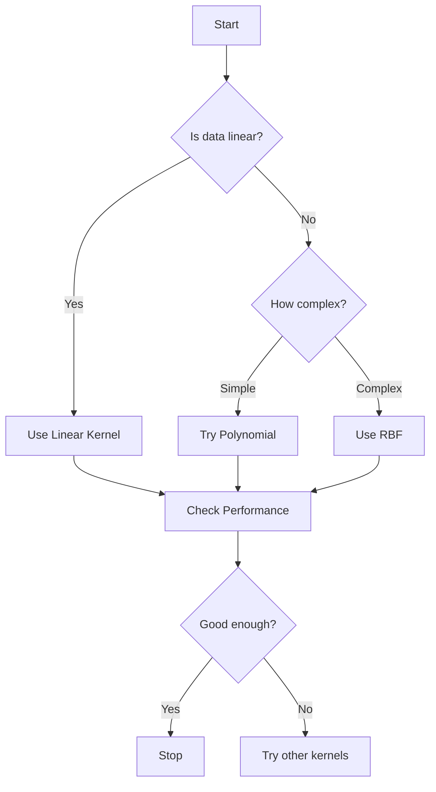

# Mathematical Foundation and Kernels in SVM

## Learning Objectives 🎯

By the end of this section, you will be able to:

- Understand the basic math behind SVM
- Explain how kernels work and why they're important
- Choose the right kernel for different problems
- Implement and tune kernel parameters

## The Maximum Margin Concept

### Understanding the Optimal Hyperplane

Think of the optimal hyperplane as finding the best possible dividing line between two groups. Here's why it matters:

1. **Better Generalization**
   - A wider margin means the model is more confident
   - Less likely to make mistakes on new data
   - Like having a wider safety buffer between decisions

2. **Robustness**
   - Less sensitive to small changes in data
   - More stable predictions
   - Better handling of noise

### Mathematical Formulation Made Simple

Let's break down the math step by step:

1. **The Basic Equation**

   ```
   w^Tx + b = 0
   ```

   Where:
   - `w` is like the direction of the dividing line
   - `x` is your data point
   - `b` is how far the line is from the center

2. **Classification Rules**

   ```
   Class 1: w^Tx + b ≥ 1
   Class 2: w^Tx + b ≤ -1
   ```

   Think of these as "safety zones" on either side of the line

3. **Margin Calculation**

   ```
   Margin = 2/||w||
   ```

   - `||w||` is the length of w
   - We want to maximize this margin
   - Like making the safety buffer as wide as possible

## The Kernel Trick Explained

### Why Do We Need Kernels?

Sometimes data isn't linearly separable, and we need to transform it into a higher dimension where it becomes separable. This is where kernels come in:



*Figure: Comparison of different kernel functions on non-linearly separable data. Notice how RBF and Polynomial kernels can create non-linear decision boundaries.*

### Common Kernel Functions

1. **Linear Kernel**

   ```python
   def linear_kernel(x1, x2):
       return np.dot(x1, x2)
   ```

   - Simplest kernel
   - Good for linearly separable data
   - Fast to compute

2. **RBF (Radial Basis Function) Kernel**

   ```python
   def rbf_kernel(x1, x2, gamma=0.1):
       return np.exp(-gamma * np.linalg.norm(x1 - x2)**2)
   ```

   - Creates circular decision boundaries
   - Flexible and powerful
   - Good default choice

3. **Polynomial Kernel**

   ```python
   def polynomial_kernel(x1, x2, degree=2, coef0=1):
       return (np.dot(x1, x2) + coef0) ** degree
   ```

   - Creates polynomial decision boundaries
   - Good for known polynomial relationships
   - Can be more complex

### Visualizing Kernel Effects

```python
def plot_kernel_effects(X, y):
    """Show how different kernels transform data"""
    kernels = ['linear', 'rbf', 'poly']
    fig, axes = plt.subplots(1, 3, figsize=(15, 5))
    
    for ax, kernel in zip(axes, kernels):
        # Create and fit SVM
        svm = SVC(kernel=kernel)
        svm.fit(X, y)
        
        # Create mesh grid
        x_min, x_max = X[:, 0].min() - 1, X[:, 0].max() + 1
        y_min, y_max = X[:, 1].min() - 1, X[:, 1].max() + 1
        xx, yy = np.meshgrid(np.arange(x_min, x_max, 0.02),
                            np.arange(y_min, y_max, 0.02))
        
        # Get predictions
        Z = svm.predict(np.c_[xx.ravel(), yy.ravel()])
        Z = Z.reshape(xx.shape)
        
        # Plot
        ax.contourf(xx, yy, Z, alpha=0.4)
        ax.scatter(X[:, 0], X[:, 1], c=y, alpha=0.8)
        ax.set_title(f'{kernel.upper()} Kernel Decision Boundary')
    
    plt.tight_layout()
    plt.show()
```

## Soft Margin SVM

### Why Soft Margin?

Sometimes data isn't perfectly separable. That's where soft margin comes in:

1. **Handling Noise**
   - Allows some misclassifications
   - More realistic for real-world data
   - Better generalization

2. **The C Parameter**

   ```python
   # Example of different C values
   C_values = [0.1, 1, 10]
   for C in C_values:
       svm = SVC(C=C)
       svm.fit(X, y)
       # Plot and compare results
   ```

   - Small C: More tolerant of errors
   - Large C: Stricter separation

## Kernel Parameters and Tuning

### RBF Kernel Parameters

1. **Gamma (γ)**

   ```python
   def visualize_gamma_effect(X, y):
       gammas = [0.1, 1, 10]
       fig, axes = plt.subplots(1, 3, figsize=(15, 5))
       
       for ax, gamma in zip(axes, gammas):
           svm = SVC(kernel='rbf', gamma=gamma)
           svm.fit(X, y)
           # Plot decision boundary
           # ... (plotting code)
           ax.set_title(f'Gamma = {gamma}')
   ```

   - Small gamma: Smooth decision boundary
   - Large gamma: Complex, wiggly boundary

### Polynomial Kernel Parameters

1. **Degree**

   ```python
   def visualize_degree_effect(X, y):
       degrees = [2, 3, 4]
       fig, axes = plt.subplots(1, 3, figsize=(15, 5))
       
       for ax, degree in zip(axes, degrees):
           svm = SVC(kernel='poly', degree=degree)
           svm.fit(X, y)
           # Plot decision boundary
           # ... (plotting code)
           ax.set_title(f'Degree = {degree}')
   ```

   - Higher degree: More complex boundaries
   - Lower degree: Simpler boundaries

## Choosing the Right Kernel

### Decision Guide



### Practical Tips

1. **Start Simple**
   - Try linear kernel first
   - Move to more complex kernels if needed
   - Use cross-validation to compare

2. **Parameter Tuning**

   ```python
   from sklearn.model_selection import GridSearchCV
   
   def tune_parameters(X, y):
       param_grid = {
           'C': [0.1, 1, 10],
           'gamma': ['scale', 'auto', 0.1, 1],
           'kernel': ['rbf', 'linear', 'poly']
       }
       
       grid_search = GridSearchCV(
           SVC(),
           param_grid,
           cv=5,
           scoring='accuracy'
       )
       grid_search.fit(X, y)
       return grid_search.best_params_
   ```

## Common Mistakes to Avoid

1. **Wrong Kernel Choice**
   - Don't use complex kernels for simple problems
   - Don't use linear kernel for non-linear data
   - Always validate with cross-validation

2. **Parameter Tuning**
   - Don't forget to scale features
   - Don't use default parameters without testing
   - Don't ignore the C parameter

3. **Performance Issues**
   - Watch out for overfitting with high gamma
   - Be careful with polynomial degree
   - Consider computational cost

## Next Steps

1. [Implementation Basics](3-implementation.md) - Learn how to code SVM
2. [Advanced Techniques](4-advanced.md) - Optimize your SVM
3. [Applications](5-applications.md) - See SVM in action

Remember: Practice with different kernels and parameters to build intuition!
