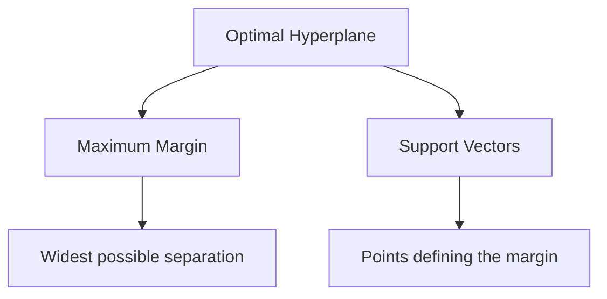
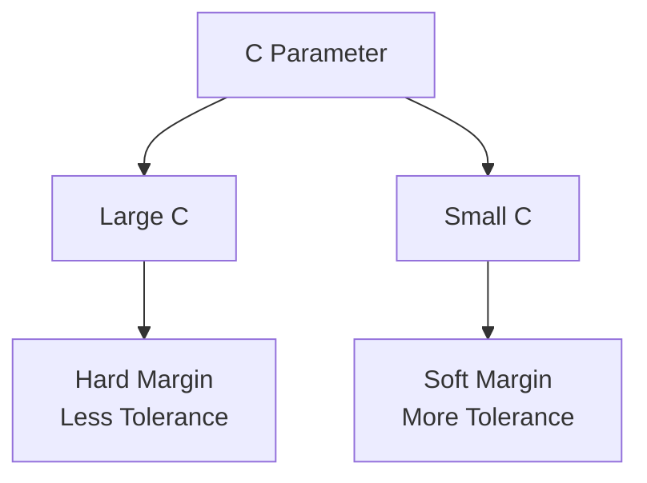
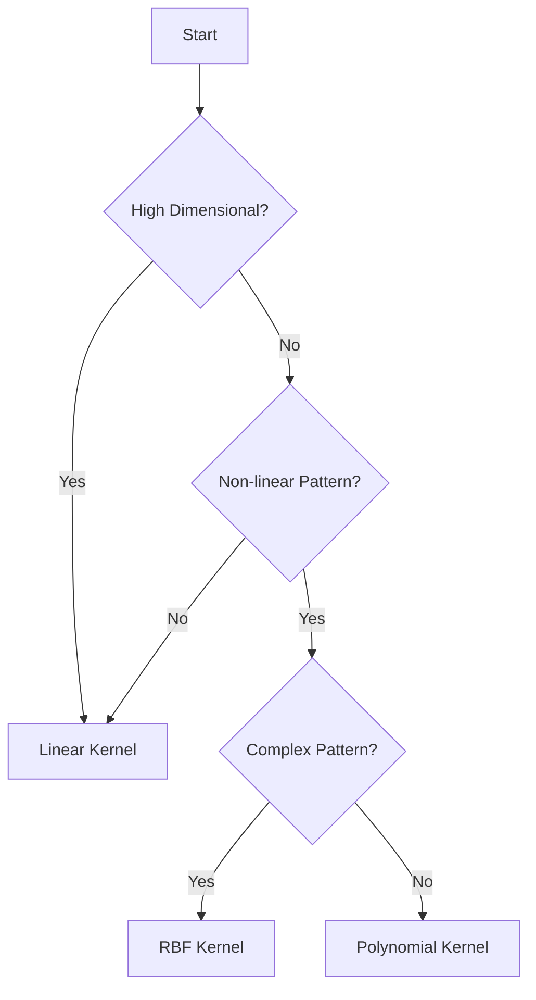

# Mathematical Foundation and Kernels in SVM 📐

Let's understand the math behind SVM and the magic of kernel functions, with clear explanations and intuitive examples.

## The Maximum Margin Concept 📏

### Understanding the Optimal Hyperplane



> **Optimal Hyperplane** is the decision boundary that maximizes the margin between different classes.

### Mathematical Formulation

For binary classification, we want to find a hyperplane:
$w^Tx + b = 0$

Where:
- $w$ is the normal vector to the hyperplane
- $x$ is the input vector
- $b$ is the bias term

The classification rule becomes:
- Class 1: $w^Tx + b \geq 1$
- Class 2: $w^Tx + b \leq -1$

### Optimization Problem

> **Optimization Problem** is the mathematical task of finding the best hyperplane by maximizing the margin.

$$\min_{w,b} \frac{1}{2}||w||^2$$
subject to:
$$y_i(w^Tx_i + b) \geq 1, \forall i$$

In simple terms:
- Find the smallest $w$ (which gives the largest margin)
- While ensuring all points are correctly classified
- The margin width is $\frac{2}{||w||}$

## The Kernel Trick 🎩

### Why Kernels?

> **Kernel Functions** transform data into a higher-dimensional space where linear separation becomes possible.


### Common Kernel Functions

1. **Linear Kernel**
   > Simplest kernel that computes dot product in original space.
   
   $$K(x_i, x_j) = x_i^T x_j$$
   
   Best for:
   - Linearly separable data
   - High-dimensional data
   - Text classification

2. **Radial Basis Function (RBF) Kernel**
   > Creates circular/spherical decision boundaries.
   
   $$K(x_i, x_j) = \exp\left(-\gamma ||x_i - x_j||^2\right)$$
   
   Best for:
   - Non-linear data
   - When relationship between features is unknown
   - Image classification

3. **Polynomial Kernel**
   > Creates polynomial decision boundaries.
   
   $$K(x_i, x_j) = (x_i^T x_j + r)^d$$
   
   Best for:
   - Data with polynomial relationships
   - Image processing
   - Natural language processing

### Visual Comparison of Kernels

```python
import numpy as np
import matplotlib.pyplot as plt
from sklearn.svm import SVC

def plot_kernel_comparison(X, y):
    """Visualize different kernel decisions"""
    kernels = ['linear', 'rbf', 'poly']
    fig, axes = plt.subplots(1, 3, figsize=(15, 5))
    
    for ax, kernel in zip(axes, kernels):
        svm = SVC(kernel=kernel)
        svm.fit(X, y)
        
        # Plot decision boundary
        x_min, x_max = X[:, 0].min() - 1, X[:, 0].max() + 1
        y_min, y_max = X[:, 1].min() - 1, X[:, 1].max() + 1
        xx, yy = np.meshgrid(np.arange(x_min, x_max, 0.02),
                            np.arange(y_min, y_max, 0.02))
        
        Z = svm.predict(np.c_[xx.ravel(), yy.ravel()])
        Z = Z.reshape(xx.shape)
        
        ax.contourf(xx, yy, Z, alpha=0.4)
        ax.scatter(X[:, 0], X[:, 1], c=y, alpha=0.8)
        ax.set_title(f'{kernel.upper()} Kernel')
```

## Soft Margin SVM 🔄

### Handling Non-Separable Data

> **Soft Margin** allows some misclassifications to achieve better generalization.

The modified optimization problem:

$$\min_{w,b,\xi} \frac{1}{2}||w||^2 + C\sum_{i=1}^n \xi_i$$

subject to:
$$y_i(w^Tx_i + b) \geq 1 - \xi_i, \xi_i \geq 0, \forall i$$

Where:
- $\xi_i$ are slack variables allowing misclassification
- $C$ is the regularization parameter
  - Large $C$: Fewer misclassifications (might overfit)
  - Small $C$: More misclassifications (might underfit)

### The C Parameter Effect



## Kernel Parameters 🎛️

### RBF Kernel Parameters

1. **Gamma (γ)**
   > Controls the "reach" of a single training example.
   
   - Large γ: Short reach, can lead to overfitting
   - Small γ: Long reach, can lead to underfitting

```python
def visualize_gamma_effect(X, y):
    """Show effect of gamma parameter"""
    gammas = [0.1, 1, 10]
    fig, axes = plt.subplots(1, 3, figsize=(15, 5))
    
    for ax, gamma in zip(axes, gammas):
        svm = SVC(kernel='rbf', gamma=gamma)
        svm.fit(X, y)
        # Plot decision boundary
        # ... (similar to previous plotting code)
        ax.set_title(f'Gamma = {gamma}')
```

### Polynomial Kernel Parameters

1. **Degree (d)**
   > Controls the flexibility of the decision boundary.
   
   - Higher d: More flexible, but more complex
   - Lower d: Less flexible, but simpler

2. **Coefficient (r)**
   > Influences the impact of higher-order terms.
   
   - Larger r: More influence of higher-order terms
   - Smaller r: Less influence of higher-order terms

## Choosing the Right Kernel 🎯

### Decision Flowchart



### Guidelines for Selection

1. **Linear Kernel**
   - High-dimensional data (like text)
   - Many features compared to samples
   - When speed is important

2. **RBF Kernel**
   - Default choice for unknown data
   - Non-linear relationships
   - Moderate dataset size

3. **Polynomial Kernel**
   - Known polynomial relationship
   - Feature interactions important
   - When degree of relationship is known

## Next Steps 📚

Now that you understand the mathematics and kernels:
1. Learn about [implementation basics](3-implementation.md)
2. Explore [advanced techniques](4-advanced.md)
3. See [real-world applications](5-applications.md)

Remember:
- Start with simpler kernels
- Use cross-validation for parameter selection
- Consider computational cost
- Monitor for overfitting
