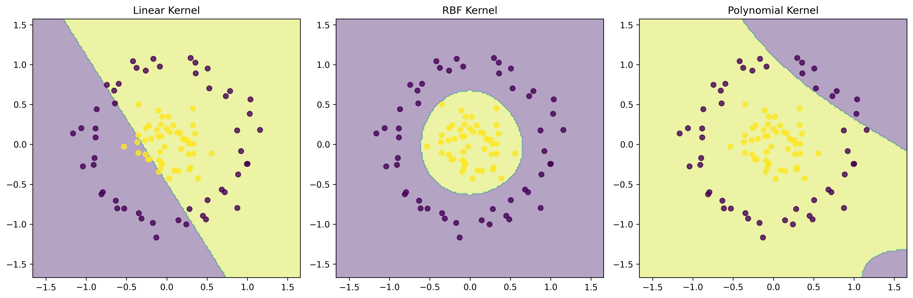

# Mathematical Foundation and Kernels in SVM

**After this lesson:** you can explain the core ideas in “Mathematical Foundation and Kernels in SVM” and reproduce the examples here in your own notebook or environment.

## Overview

Develops the **margin**, slack variables, and **kernels** (linear, polynomial, RBF) so you know what `kernel` and `gamma` are doing in `SVC`.

[Introduction](1-introduction.md) first; linear algebra from Module 1 helps.


## The Maximum Margin Concept

### Understanding the Optimal Hyperplane

Think of the optimal hyperplane as finding the best possible dividing line between two groups. Here's why it matters:

1. **Better Generalization**
   - A wider margin means the model is more confident
   - Less likely to make mistakes on new data
   - Like having a wider safety buffer between decisions

2. **Robustness**
   - Less sensitive to small changes in data
   - More stable predictions
   - Better handling of noise

### Mathematical Formulation Made Simple

Let's break down the math step by step:

1. **The Basic Equation**

   ```
   w^Tx + b = 0
   ```

   Where:
   - <code>w</code> is like the direction of the dividing line
   - <code>x</code> is your data point
   - <code>b</code> is how far the line is from the center

2. **Classification Rules**

   ```
   Class 1: w^Tx + b ≥ 1
   Class 2: w^Tx + b ≤ -1
   ```

   Think of these as "safety zones" on either side of the line

3. **Margin Calculation**

   ```
   Margin = 2/||w||
   ```

   - <code>||w||</code> is the length of w
   - We want to maximize this margin
   - Like making the safety buffer as wide as possible

## The Kernel Trick Explained

### Why Do We Need Kernels?

Sometimes data isn't linearly separable, and we need to transform it into a higher dimension where it becomes separable. This is where kernels come in:



*Figure: Comparison of different kernel functions on non-linearly separable data. Notice how RBF and Polynomial kernels can create non-linear decision boundaries.*

### Common Kernel Functions

1. **Linear Kernel**

   #### Linear kernel (dot product)

   ```python
   import numpy as np

   def linear_kernel(x1, x2):
       return np.dot(x1, x2)
   ```

   - Simplest kernel
   - Good for linearly separable data
   - Fast to compute

2. **RBF (Radial Basis Function) Kernel**

   #### RBF kernel

   ```python
   import numpy as np

   def rbf_kernel(x1, x2, gamma=0.1):
       return np.exp(-gamma * np.linalg.norm(x1 - x2)**2)
   ```

   - Creates circular decision boundaries
   - Flexible and powerful
   - Good default choice

3. **Polynomial Kernel**

   #### Polynomial kernel

   ```python
   import numpy as np

   def polynomial_kernel(x1, x2, degree=2, coef0=1):
       return (np.dot(x1, x2) + coef0) ** degree
   ```

   - Creates polynomial decision boundaries
   - Good for known polynomial relationships
   - Can be more complex

### Visualizing Kernel Effects

#### Compare kernel decision regions

<div class="code-explainer" data-code-explainer>
<div class="code-explainer__code">


import numpy as np
import matplotlib.pyplot as plt
from sklearn.svm import SVC

def plot_kernel_effects(X, y):
    """Show how different kernels transform data"""
    kernels = ['linear', 'rbf', 'poly']
    fig, axes = plt.subplots(1, 3, figsize=(15, 5))

    for ax, kernel in zip(axes, kernels):
        # Create and fit SVM
        svm = SVC(kernel=kernel)
        svm.fit(X, y)

        # Create mesh grid
        x_min, x_max = X[:, 0].min() - 1, X[:, 0].max() + 1
        y_min, y_max = X[:, 1].min() - 1, X[:, 1].max() + 1
        xx, yy = np.meshgrid(np.arange(x_min, x_max, 0.02),
                            np.arange(y_min, y_max, 0.02))

        # Get predictions
        Z = svm.predict(np.c_[xx.ravel(), yy.ravel()])
        Z = Z.reshape(xx.shape)

        # Plot
        ax.contourf(xx, yy, Z, alpha=0.4)
        ax.scatter(X[:, 0], X[:, 1], c=y, alpha=0.8)
        ax.set_title(f'{kernel.upper()} Kernel Decision Boundary')

    plt.tight_layout()
    plt.show()


</div>
<aside class="code-explainer__callouts" aria-label="Code walkthrough">
  <div class="code-callout" data-lines="1-9" data-tint="1">
    <div class="code-callout__meta">
      <span class="code-callout__lines"></span>
      <span class="code-callout__title">Setup and Kernels List</span>
    </div>
    <div class="code-callout__body">
      <p>Define three kernel strings (linear, RBF, polynomial) and create a 1×3 subplot grid — one panel per kernel for direct visual comparison.</p>
    </div>
  </div>
  <div class="code-callout" data-lines="11-32" data-tint="2">
    <div class="code-callout__meta">
      <span class="code-callout__lines"></span>
      <span class="code-callout__title">Mesh Grid and Plot</span>
    </div>
    <div class="code-callout__body">
      <p>For each kernel, fit an SVC, build a fine meshgrid over the feature space, predict class at every point, then fill contour regions — axis-aligned regions for linear vs curved regions for RBF/poly.</p>
    </div>
  </div>
</aside>
</div>

## Soft Margin SVM

### Why Soft Margin?

Sometimes data isn't perfectly separable. That's where soft margin comes in:

1. **Handling Noise**
   - Allows some misclassifications
   - More realistic for real-world data
   - Better generalization

2. **The C Parameter**

   #### Sweep the soft-margin parameter C

   ```python
   from sklearn.svm import SVC

   # Example of different C values
   C_values = [0.1, 1, 10]
   for C in C_values:
       svm = SVC(C=C)
       svm.fit(X, y)
       # Plot and compare results
   ```

   - Small C: More tolerant of errors
   - Large C: Stricter separation

## Kernel Parameters and Tuning

### RBF Kernel Parameters

1. **Gamma (γ)**

   #### RBF gamma and the decision boundary (sketch)

   ```python
   from sklearn.svm import SVC
   import matplotlib.pyplot as plt

   def visualize_gamma_effect(X, y):
       gammas = [0.1, 1, 10]
       fig, axes = plt.subplots(1, 3, figsize=(15, 5))
       
       for ax, gamma in zip(axes, gammas):
           svm = SVC(kernel='rbf', gamma=gamma)
           svm.fit(X, y)
           # Plot decision boundary
           # ... (plotting code)
           ax.set_title(f'Gamma = {gamma}')
   ```

   - Small gamma: Smooth decision boundary
   - Large gamma: Complex, wiggly boundary

### Polynomial Kernel Parameters

1. **Degree**

   #### Polynomial degree and the decision boundary (sketch)

   ```python
   from sklearn.svm import SVC
   import matplotlib.pyplot as plt

   def visualize_degree_effect(X, y):
       degrees = [2, 3, 4]
       fig, axes = plt.subplots(1, 3, figsize=(15, 5))
       
       for ax, degree in zip(axes, degrees):
           svm = SVC(kernel='poly', degree=degree)
           svm.fit(X, y)
           # Plot decision boundary
           # ... (plotting code)
           ax.set_title(f'Degree = {degree}')
   ```

   - Higher degree: More complex boundaries
   - Lower degree: Simpler boundaries

## Choosing the Right Kernel

### Decision Guide



### Practical Tips

1. **Start Simple**
   - Try linear kernel first
   - Move to more complex kernels if needed
   - Use cross-validation to compare

2. **Parameter Tuning**

   #### Grid search over C, gamma, and kernel

   ```python
   from sklearn.model_selection import GridSearchCV
   from sklearn.svm import SVC

   def tune_parameters(X, y):
       param_grid = {
           'C': [0.1, 1, 10],
           'gamma': ['scale', 'auto', 0.1, 1],
           'kernel': ['rbf', 'linear', 'poly']
       }
       
       grid_search = GridSearchCV(
           SVC(),
           param_grid,
           cv=5,
           scoring='accuracy'
       )
       grid_search.fit(X, y)
       return grid_search.best_params_
   ```

## Common Mistakes to Avoid

1. **Wrong Kernel Choice**
   - Don't use complex kernels for simple problems
   - Don't use linear kernel for non-linear data
   - Always validate with cross-validation

2. **Parameter Tuning**
   - Don't forget to scale features
   - Don't use default parameters without testing
   - Don't ignore the C parameter

3. **Performance Issues**
   - Watch out for overfitting with high gamma
   - Be careful with polynomial degree
   - Consider computational cost

## Gotchas

- **Using `gamma='auto'` (deprecated default) instead of `gamma='scale'`** — In scikit-learn ≥ 0.22, `gamma='scale'` is the default (uses `1 / (n_features * X.var())`), replacing the old `'auto'` (`1 / n_features`). Code written before this change will produce a `FutureWarning` or silently use a different gamma, making results non-reproducible across versions. Always specify `gamma` explicitly or verify which default your version uses.
- **Setting a high polynomial degree without checking for numerical overflow** — The polynomial kernel computes `(x1·x2 + r)^d`. For degree ≥ 4 with unscaled features, intermediate values can overflow 64-bit floats, producing `NaN` in the kernel matrix and causing training to fail silently or with confusing convergence warnings. Scale features and keep degree ≤ 3 unless you have a strong reason.
- **Tuning `C` and `gamma` independently instead of together** — `C` and `gamma` interact strongly for the RBF kernel: high `C` + high `gamma` = extreme overfitting; low `C` + low `gamma` = extreme underfitting. Tuning them in separate 1D sweeps misses the optimal combination. Always use a 2D grid search (`GridSearchCV` over both simultaneously).
- **Assuming the linear kernel is always fastest** — For very high-dimensional sparse data (e.g., text with TF-IDF), `SVC(kernel='linear')` builds an O(n²) kernel matrix and is slower than `LinearSVC`, which directly solves the primal. When you have more features than samples and a linear decision boundary is appropriate, use `LinearSVC` instead.
- **Confusing `SVC` `decision_function` scores with probabilities** — `decision_function` returns signed distances from the hyperplane, not probabilities. Positive values indicate one class, negative the other, but the magnitude is not calibrated. Students sometimes interpret a distance of 2.5 as "2.5 times more likely to be class 1," which is incorrect.
- **Forgetting to scale the mesh grid points before calling `svm.predict`** — The `plot_kernel_effects` function fits the SVM on raw `X` and predicts on raw mesh points, which is consistent. But if you fit on `X_scaled` and then forget to apply `scaler.transform` to the mesh grid points, the decision boundary plot will appear in the wrong location, creating a misleading visualization.

## Next Steps

1. [Implementation Basics](3-implementation.md) - Learn how to code SVM
2. [Advanced Techniques](4-advanced.md) - Optimize your SVM
3. [Applications](5-applications.md) - See SVM in action

Remember: Practice with different kernels and parameters to build intuition!
