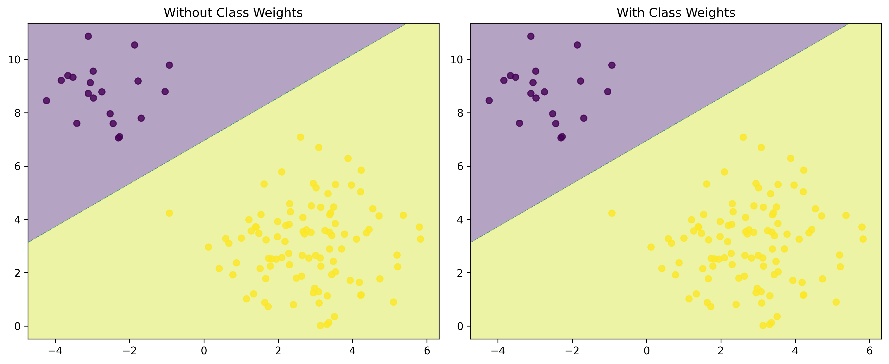

# Implementing SVM with Scikit-learn

## Learning Objectives

By the end of this section, you will be able to:

- Implement SVM for classification and regression
- Preprocess data for SVM
- Tune SVM parameters
- Handle common challenges in SVM implementation

## Getting Started with SVM

### Basic Setup

First, let's import the necessary libraries:

```python
# Essential imports
from sklearn.svm import SVC, SVR  # For classification and regression
from sklearn.preprocessing import StandardScaler
from sklearn.model_selection import train_test_split
from sklearn.pipeline import Pipeline
import numpy as np
import matplotlib.pyplot as plt
```

### Why These Libraries?

- `sklearn.svm`: Provides SVM implementations
- `sklearn.preprocessing`: For data scaling
- `sklearn.model_selection`: For data splitting and validation
- `sklearn.pipeline`: For creating processing pipelines

## Basic Classification Example

### Step 1: Create a Simple Pipeline

```python
def create_svm_classifier(kernel='rbf', C=1.0):
    """
    Creates an SVM classification pipeline with scaling.
    
    Parameters:
    - kernel: Type of kernel to use ('linear', 'rbf', 'poly')
    - C: Regularization parameter
    
    Returns:
    - A scikit-learn pipeline with scaling and SVM
    """
    return Pipeline([
        ('scaler', StandardScaler()),  # Scale features
        ('svm', SVC(
            kernel=kernel,
            C=C,
            random_state=42  # For reproducibility
        ))
    ])
```

### Step 2: Prepare Your Data

```python
# Example: Binary classification data
X = np.array([
    [1, 2], [2, 3], [3, 4], [2, 1],  # Class 0
    [5, 6], [6, 7], [7, 8], [6, 5]   # Class 1
])
y = np.array([0, 0, 0, 0, 1, 1, 1, 1])

# Split data into training and testing sets
X_train, X_test, y_train, y_test = train_test_split(
    X, y, 
    test_size=0.2,  # 20% for testing
    random_state=42  # For reproducibility
)
```

### Step 3: Train and Evaluate the Model

```python
# Create and train the model
model = create_svm_classifier()
model.fit(X_train, y_train)

# Make predictions
predictions = model.predict(X_test)

# Evaluate accuracy
accuracy = model.score(X_test, y_test)
print(f"Model accuracy: {accuracy:.2f}")
```

## Multiclass Classification

### Handling Multiple Classes

```python
def create_multiclass_classifier():
    """
    Creates an SVM classifier for multiple classes.
    
    Returns:
    - A pipeline with scaling and multiclass SVM
    """
    return Pipeline([
        ('scaler', StandardScaler()),
        ('svm', SVC(
            kernel='rbf',
            decision_function_shape='ovo',  # One-vs-one strategy
            probability=True  # Enable probability estimates
        ))
    ])
```

### Example: Iris Classification

```python
from sklearn.datasets import load_iris
from sklearn.metrics import classification_report

def iris_classification_example():
    """Complete example using the Iris dataset"""
    # Load data
    iris = load_iris()
    X = iris.data
    y = iris.target
    
    # Split data
    X_train, X_test, y_train, y_test = train_test_split(
        X, y, 
        test_size=0.2,
        random_state=42
    )
    
    # Create and train model
    model = create_multiclass_classifier()
    model.fit(X_train, y_train)
    
    # Evaluate
    print("Classification Report:")
    print(classification_report(
        y_test,
        model.predict(X_test),
        target_names=iris.target_names
    ))
    
    return model
```

## Regression with SVM

### Support Vector Regression (SVR)

```python
def create_svm_regressor(kernel='rbf'):
    """
    Creates an SVM regressor pipeline.
    
    Parameters:
    - kernel: Type of kernel to use
    
    Returns:
    - A pipeline with scaling and SVR
    """
    return Pipeline([
        ('scaler', StandardScaler()),
        ('svr', SVR(
            kernel=kernel,
            C=1.0,
            epsilon=0.1  # Controls the width of the epsilon-tube
        ))
    ])
```

### Example: Housing Price Prediction

```python
def housing_price_example():
    """Predict housing prices using SVR"""
    # Sample data: [size, bedrooms, age]
    X = np.array([
        [1400, 3, 10],
        [1600, 3, 8],
        [1700, 4, 15],
        [1875, 4, 5],
        [1100, 2, 20]
    ])
    
    # Prices (in thousands)
    y = np.array([250, 280, 300, 350, 200])
    
    # Create and train model
    model = create_svm_regressor()
    model.fit(X, y)
    
    # Example prediction
    new_house = np.array([[1500, 3, 12]])
    prediction = model.predict(new_house)
    print(f"Predicted price: ${prediction[0]:.2f}k")
    
    return model
```

## Parameter Tuning

### Grid Search for Optimal Parameters

```python
from sklearn.model_selection import GridSearchCV

def optimize_svm_parameters(X, y, cv=5):
    """
    Find optimal SVM parameters using grid search.
    
    Parameters:
    - X: Features
    - y: Target
    - cv: Number of cross-validation folds
    
    Returns:
    - Best performing model
    """
    # Parameter grid to search
    param_grid = {
        'svm__C': [0.1, 1, 10, 100],
        'svm__gamma': ['scale', 'auto', 0.1, 1],
        'svm__kernel': ['rbf', 'linear', 'poly']
    }
    
    # Create base model
    model = create_svm_classifier()
    
    # Grid search
    grid_search = GridSearchCV(
        model,
        param_grid,
        cv=cv,
        scoring='accuracy',
        n_jobs=-1  # Use all available cores
    )
    
    # Fit and print results
    grid_search.fit(X, y)
    print("Best parameters:", grid_search.best_params_)
    print("Best score:", grid_search.best_score_)
    
    return grid_search.best_estimator_
```

### Cross-Validation

```python
from sklearn.model_selection import cross_val_score

def evaluate_svm_model(model, X, y, cv=5):
    """
    Evaluate model using cross-validation.
    
    Parameters:
    - model: Trained SVM model
    - X: Features
    - y: Target
    - cv: Number of folds
    """
    # Calculate scores
    scores = cross_val_score(
        model, X, y,
        cv=cv,
        scoring='accuracy'
    )
    
    print("Cross-validation scores:", scores)
    print(f"Mean CV score: {scores.mean():.3f} (+/- {scores.std() * 2:.3f})")
```

## Handling Common Challenges

### 1. Feature Scaling

```python
def scale_features(X):
    """
    Scale features for SVM.
    
    Parameters:
    - X: Input features
    
    Returns:
    - Scaled features
    """
    scaler = StandardScaler()
    return scaler.fit_transform(X)
```

### 2. Imbalanced Data

```python
from imblearn.pipeline import Pipeline as ImbPipeline
from imblearn.over_sampling import SMOTE

def create_balanced_svm():
    """
    Create SVM pipeline for imbalanced data.
    
    Returns:
    - Pipeline with SMOTE and balanced SVM
    """
    return ImbPipeline([
        ('scaler', StandardScaler()),
        ('smote', SMOTE()),  # Synthetic Minority Over-sampling
        ('svm', SVC(
            class_weight='balanced',  # Adjust class weights
            probability=True
        ))
    ])
```

### 3. Text Classification

```python
from sklearn.feature_extraction.text import TfidfVectorizer

class SVMTextClassifier:
    def __init__(self):
        self.pipeline = Pipeline([
            ('tfidf', TfidfVectorizer(
                max_features=5000,
                ngram_range=(1, 2)
            )),
            ('scaler', StandardScaler(with_mean=False)),
            ('svm', SVC(kernel='linear'))
        ])
        
    def train(self, texts, labels):
        """Train the text classifier"""
        self.pipeline.fit(texts, labels)
        
    def predict(self, texts):
        """Make predictions"""
        return self.pipeline.predict(texts)
        
    def analyze_features(self):
        """Analyze important features"""
        tfidf = self.pipeline.named_steps['tfidf']
        svm = self.pipeline.named_steps['svm']
        
        # Get feature names and coefficients
        feature_names = tfidf.get_feature_names_out()
        coefficients = svm.coef_[0]
        
        # Sort by importance
        importance = np.abs(coefficients)
        sorted_idx = np.argsort(importance)
        pos = sorted_idx[-10:]  # Top 10 features
        
        return [(feature_names[i], coefficients[i]) 
                for i in pos]
```

## Common Mistakes to Avoid

1. **Forgetting to Scale Features**

   ```python
   # Wrong
   model = SVC()
   model.fit(X, y)
   
   # Right
   pipeline = Pipeline([
       ('scaler', StandardScaler()),
       ('svm', SVC())
   ])
   pipeline.fit(X, y)
   ```

2. **Ignoring Class Imbalance**

   ```python
   # Wrong
   model = SVC()
   
   # Right
   model = SVC(class_weight='balanced')
   ```

3. **Using Wrong Kernel**

   ```python
   # Wrong for text data
   model = SVC(kernel='rbf')
   
   # Right for text data
   model = SVC(kernel='linear')
   ```

## Next Steps

1. [Advanced Techniques](4-advanced.md) - Learn optimization techniques
2. [Applications](5-applications.md) - See real-world examples

Remember: Start with simple implementations and gradually add complexity!

## Handling Imbalanced Data

When dealing with imbalanced datasets, using class weights can significantly improve model performance:



*Figure: Effect of class weights on decision boundary. Notice how balanced weights help prevent bias towards the majority class.*
