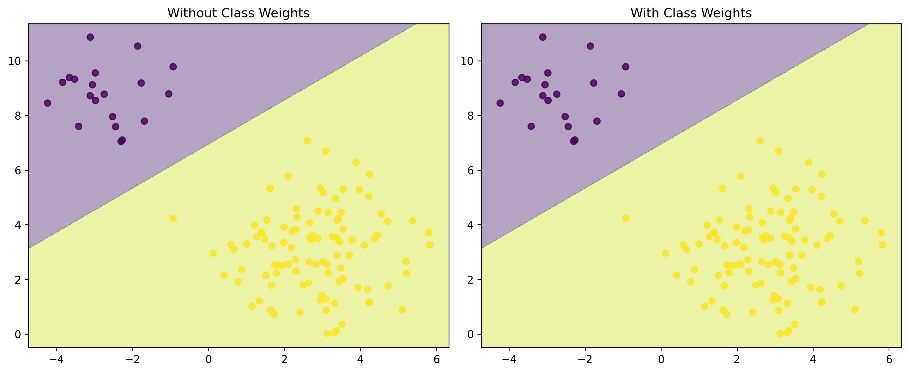

# Implementing SVM with Scikit-learn

**After this lesson:** you can explain Implementing SVM with Scikit-learn and try the examples in your own notebook.

## Overview

**`SVC` / `SVR`** usage in scikit-learn: scaling, `C`, `gamma`, multiclass strategy, and calibration at a glance.

## Getting Started with SVM

### Basic Setup

First, import the necessary libraries:

#### Core imports for SVM in scikit-learn

```python
# Essential imports
from sklearn.svm import SVC, SVR  # For classification and regression
from sklearn.preprocessing import StandardScaler
from sklearn.model_selection import train_test_split
import numpy as np
import matplotlib.pyplot as plt
```

### Why These Libraries?

* `sklearn.svm`: Provides SVM implementations (SVC for classification, SVR for regression)
* `sklearn.preprocessing`: For data scaling (essential for SVM)
* `sklearn.model_selection`: For data splitting and validation
* `numpy`: For numerical operations and array handling
* `matplotlib`: For visualization of data and decision boundaries

## Basic Classification Example

Implement a complete binary classification example:

#### Binary classification with scaling and RBF SVC

2D labeled dataset

`make_classification` generates two clearly separated 2D clusters, a toy problem where SVM should achieve near-perfect accuracy. `n_features=2` keeps it visualizable.

Scale before SVM

SVM finds the maximum-margin hyperplane, a geometry problem. If one feature spans 0-1000 and another 0-1, the large-scale feature dominates the margin calculation. Always `StandardScaler` before fitting.

RBF kernel + C parameter

`kernel='rbf'` implicitly maps data into a higher-dimensional space where a linear boundary becomes possible. `C` is the soft-margin penalty: high C = tighter fit (risk overfitting); low C = wider margin (risk underfitting).

Decision boundary meshgrid

`np.meshgrid` creates a dense grid of (x, y) points covering the feature space. Predicting every point and reshaping back reveals which region belongs to which class, `contourf` fills these regions with color.

```
Model accuracy: 1.00
```

**Explanation:**

1. **Data Creation**: We create a simple 2D dataset with two clearly separated classes
2. **Data Splitting**: We divide the data into training (75%) and testing (25%) sets
3. **Feature Scaling**: This is important for SVM as it's sensitive to the scale of input features
4. **Model Training**: We use the SVC classifier with an RBF kernel, which works well for many problems
5. **Evaluation**: We check model accuracy on the test set
6. **Visualization**: The included function can visualize the decision boundary to help understand how SVM separates the classes

Note that scaling is performed separately on the training and testing data to prevent data leakage (the test set shouldn't influence the scaling parameters).

## Multiclass Classification

SVM naturally extends to multiple classes. Implement a complete example using the Iris dataset:

#### Multiclass Iris classification

Imports

Brings in the Iris loader, `SVC`, scaling, splitting, and the classification report, everything needed for a multiclass pipeline.

Load Iris dataset

The Iris dataset has 150 samples, 4 numeric features, and 3 class labels. Storing `target_names` makes the report human-readable.

Split and scale

A 75/25 split followed by `StandardScaler` fit on training data only, the test set is transformed using training statistics to prevent leakage.

One-vs-one SVC

`decision_function_shape='ovo'` builds a binary classifier for every pair of classes (3 pairs here). `probability=True` enables `predict_proba` via Platt scaling.

Predict and report

`classification_report` prints per-class precision, recall, and F1, far more informative than a single accuracy number for multiclass problems.

2D boundary helper

Since data is 4D, visualization requires selecting two features and padding the others with zeros before scaling and predicting over a dense meshgrid.

```
Classification Report:
              precision    recall  f1-score   support

      setosa       1.00      1.00      1.00        15
  versicolor       1.00      1.00      1.00        11
   virginica       1.00      1.00      1.00        12

    accuracy                           1.00        38
   macro avg       1.00      1.00      1.00        38
weighted avg       1.00      1.00      1.00        38
```

**Explanation:**

1. **Dataset**: We use the famous Iris dataset which has 3 classes (setosa, versicolor, virginica) and 4 features
2. **Scaling**: Again, we scale the features which is particularly important for SVM
3. **Multiclass Strategy**: We use 'ovo' (one-vs-one) which builds a binary classifier for each pair of classes
4. **Evaluation**: The classification report shows precision, recall, and F1-score for each class
5. **Visualization**: The included function can visualize the decision boundaries, but since the data has 4 dimensions, we select 2 dimensions to visualize

This example demonstrates how SVM naturally handles multiclass problems, despite being fundamentally a binary classifier.

## Regression with SVM

SVM can also be used for regression tasks using Support Vector Regression (SVR):

#### Support Vector Regression on synthetic housing data

Imports

Imports `SVR` instead of `SVC`, the regression variant of the SVM family.

Housing dataset

A small 12-sample dataset with three features (square footage, bedrooms, age) and continuous price targets in thousands of dollars.

Split and scale

70/30 split followed by `StandardScaler`. Scaling is critical for SVR because the epsilon-tube is defined in the scaled feature space.

SVR parameters

`C=100` allows tight fitting; `epsilon=10` sets a ±$10k tolerance tube where errors are not penalized. Points outside the tube become support vectors.

Evaluate and predict

MSE and R² measure regression quality. A new house is then scaled with the same fitted scaler before prediction, never refit on the test point.

1D plot helper

Reduces to a single feature (square footage) and refits SVR to produce a smooth curve that can be plotted, a common trick for visualizing high-dimensional regressors.

```
Training MSE: 65.36
Testing MSE: 208.60
R² Score: 0.83
Predicted price for new house: $261.62k
```

**Explanation:**

1. **Data**: We create a dataset of house features (square footage, bedrooms, age) and their prices
2. **Scaling**: As with classification, feature scaling is important for SVR
3. **SVR Parameters**:
   * **C**: Controls the trade-off between model complexity and allowing errors
   * **epsilon**: Defines the width of the tube where errors are ignored
   * **gamma**: Defines the influence radius of each training example
4. **Evaluation**: We use Mean Squared Error (MSE) and R² to evaluate the regression quality
5. **Prediction**: We demonstrate how to predict the price of a new house
6. **Visualization**: The function shows how SVR creates a regression line (simplified to 1D)

SVR works by finding a function that deviates from the observed targets by at most epsilon while being as flat as possible.

## Parameter Tuning

Finding the optimal parameters is important for SVM performance. Here's how to use Grid Search:

#### GridSearchCV for SVC hyperparameters

Imports

Adds `GridSearchCV` and `make_classification` to the standard SVM imports for systematic hyperparameter tuning.

Data and scaling

A 2D synthetic dataset makes results easy to visualize. Features are scaled after splitting so the test set never influences the scaler's parameters.

Parameter grid

32 combinations of `C`, `gamma`, and `kernel` will be evaluated. Searching both `rbf` and `linear` kernels lets grid search pick the right family automatically.

GridSearchCV setup

5-fold CV with `n_jobs=-1` runs folds in parallel. Each of the 32 combinations is evaluated 5 times, 160 fits total, so this uses all CPU cores.

Fit and compare

After fitting, `best_estimator_` is already refitted on the full training set. Comparing it against the default `SVC()` shows the gain from tuning.

Heatmap helper

Filters `cv_results_` for the RBF kernel rows, reshapes into a C × gamma matrix, and renders it as a color-coded heatmap so under/over-regularized regions are immediately visible.

```
Fitting 5 folds for each of 32 candidates, totalling 160 fits
Best parameters: {'C': 0.1, 'gamma': 'scale', 'kernel': 'linear'}
Best cross-validation score: 0.973
Test accuracy with best model: 0.960
Test accuracy with default model: 1.000
```

**Explanation:**

1. **Grid Search**:
   * We create a grid of parameter combinations to try systematically
   * Each combination is evaluated using cross-validation
   * The best parameters are those that achieve the highest cross-validation score
   * We compare the optimized model against the default model to see the improvement

Cross-validation helps prevent overfitting by evaluating model performance on multiple data splits:

#### K-fold cross-validation scores for SVC

Imports

Swaps `train_test_split` for `cross_val_score` and `KFold`, the tools needed for proper k-fold evaluation.

Load and scale

Breast cancer dataset (569 samples, 30 features). `fit_transform` is used here because no held-out test set exists, scaling and CV are the entire evaluation.

5-fold CV

`KFold(shuffle=True)` randomizes fold assignment before splitting. `cross_val_score` trains and evaluates on each fold, returning five accuracy scores.

C sweep helper

Loops over five orders of magnitude of `C`, recording mean and std of CV accuracy. The error-bar plot on a log scale reveals the sweet spot before over- or under-regularization hurts performance.

```
Cross-validation scores: [0.97368421 0.98245614 0.97368421 0.99122807 0.97345133]
Mean CV score: 0.979 (+/- 0.014)
```

**Explanation:**

1. **Cross-Validation**:
   * Instead of a single train-test split, we use multiple splits (folds)
   * This gives a more reliable estimate of model performance
   * We can see the variation in performance across different data subsets
   * The visualization shows how the C parameter affects model performance

These techniques help prevent overfitting and ensure your model will generalize well to new data.

## Handling Common Challenges

### 1. Feature Scaling

Feature scaling is essential for SVM performance:

#### Fit scaler on train, transform test

```python
from sklearn.preprocessing import StandardScaler

# Example usage
scaler = StandardScaler()
X_train_scaled = scaler.fit_transform(X_train)
X_test_scaled = scaler.transform(X_test)
```

**Explanation:**

* SVM is sensitive to the scale of input features
* Standardization transforms features to have zero mean and unit variance
* Always fit the scaler on training data only, then apply to test data

### 2. Imbalanced Data

When dealing with imbalanced classes, use class weights or SMOTE:

#### Class weights vs SMOTE for imbalanced labels

Imports

Adds `SMOTE` from `imbalanced-learn` alongside the standard SVM pipeline imports.

Imbalanced dataset

100 majority-class points vs 20 minority-class points, a 5:1 ratio that would cause a naive model to mostly predict the majority class.

Split and scale

Standard pipeline: split first, then fit the scaler on train only and transform both sets.

Method 1: class weights

`class_weight='balanced'` tells SVC to upweight the minority class inversely proportional to its frequency, no resampling required.

Method 2: SMOTE

SMOTE generates synthetic minority samples by interpolating between existing ones, balancing the training set before fitting a standard `SVC`.

Compare reports

Both models are evaluated on the same untouched test set. Per-class precision and recall reveal which strategy recovers the minority class more effectively.

**Explanation:**

1. **Class Weights**: Automatically adjusts weights inversely proportional to class frequencies
2. **SMOTE**: Creates synthetic examples of the minority class to balance the dataset
3. **Evaluation**: Classification report helps assess performance on imbalanced data by showing per-class metrics

### 3. Text Classification

For text data, combine SVM with TF-IDF vectorization:

#### Linear SVC on TF-IDF text features

Imports

Adds `TfidfVectorizer`, the bridge between raw text and the numeric feature space SVM requires.

Text dataset

Six short reviews labeled positive (1) or negative (0). The 50/50 split is intentionally aggressive given the tiny dataset, in practice use at least 80/20.

TF-IDF vectorization

Fit the vectorizer on training documents only, then `transform` test documents, the same train-only-fit principle as `StandardScaler`. `stop_words='english'` drops common words like "the".

Linear kernel SVC

A linear kernel is ideal for high-dimensional sparse TF-IDF matrices. Each dimension is a word; the hyperplane separates sentiment by word weights.

Feature importance

For a linear SVM, `coef_[0]` gives a weight per word. Sorting by coefficient reveals which words most strongly push predictions toward positive or negative.

**Explanation:**

1. **TF-IDF Vectorization**: Converts text to numerical features by considering term frequency and inverse document frequency
2. **Linear Kernel**: Best for high-dimensional sparse data like text
3. **Feature Importance**: Coefficients of the linear SVM indicate the importance of each word for classification

## Gotchas

* **Calling `scaler.transform` on unscaled test data after fitting on already-scaled train data**: If you accidentally call `scaler.fit_transform(X_train_scaled)` a second time (i.e., the input is already scaled), the scaler fits to a near-zero-mean near-unit-variance distribution and rescales it again, producing subtly wrong features without raising any error.
* **Using `SVC` without `probability=True` then calling `predict_proba`**: `SVC` raises `AttributeError: predict_proba is not available when probability=False` if you call `predict_proba` on a default `SVC`. You must set `probability=True` at construction, which triggers Platt scaling via cross-validation, noticeably slowing training.
* **Setting `max_iter` too low and getting a `ConvergenceWarning`**: The default `max_iter=-1` (no limit) is correct for most cases, but tutorials sometimes set `max_iter=100` to speed up demos. If the solver hasn't converged, scikit-learn raises a `ConvergenceWarning` and returns a partially fitted model that may have poor accuracy. Never ignore this warning.
* **Using `SVC` for multiclass without knowing its default strategy**: `SVC` uses one-vs-one (OVO) by default for multiclass problems. With k classes this creates k(k-1)/2 binary classifiers, which scales quadratically. For many classes, `LinearSVC` with one-vs-rest or `decision_function_shape='ovr'` is faster and often equally accurate.
* **Applying SVR with the default `epsilon=0.1` for data on very different scales**: `SVR`'s epsilon-insensitive tube is in the same units as the target variable. If your target is in the thousands (e.g., house prices), `epsilon=0.1` means the tube is essentially zero-width and the model will overfit. Scale both features and the target before using `SVR`.
* **Plotting decision boundaries on unscaled coordinates when the model was trained on scaled data**: The mesh grid in visualization examples must be built in the original feature space and then transformed with `scaler.transform` before prediction. Building the mesh on scaled coordinates and plotting on raw axes shifts the boundary visually, making it look like the model drew a wrong boundary.

## Common Mistakes to Avoid

1.  **Forgetting to Scale Features**

    #### Anti-pattern: unscaled fit vs scaled fit

    ```python
    # Wrong
    model = SVC()
    model.fit(X_train, y_train)

    # Right
    scaler = StandardScaler()
    X_train_scaled = scaler.fit_transform(X_train)
    X_test_scaled = scaler.transform(X_test)
    model = SVC()
    model.fit(X_train_scaled, y_train)
    ```
2.  **Ignoring Class Imbalance**

    #### Anti-pattern: ignoring imbalance

    ```python
    # Wrong
    model = SVC()

    # Right
    model = SVC(class_weight='balanced')
    ```
3.  **Using Wrong Kernel**

    #### Anti-pattern: RBF on sparse high-dimensional text

    ```python
    # Wrong for text data
    model = SVC(kernel='rbf')

    # Right for text data
    model = SVC(kernel='linear')
    ```

## Next Steps

1. [Advanced Techniques](4-advanced.md) - Learn optimization techniques
2. [Applications](5-applications.md) - See real-world examples

Remember: Start with simple implementations and gradually add complexity!

## Handling Imbalanced Data

When dealing with imbalanced datasets, using class weights can significantly improve model performance:



_Figure: Effect of class weights on decision boundary. Notice how balanced weights help prevent bias towards the majority class._
