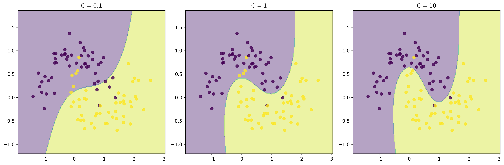

# Advanced SVM Techniques

## Learning Objectives

By the end of this section, you will be able to:

- Implement advanced optimization techniques for SVM
- Create and use custom kernels
- Optimize SVM performance
- Handle large-scale SVM problems

## Advanced Optimization Techniques

### Sequential Minimal Optimization (SMO)

SMO is like breaking a big problem into smaller, manageable pieces. Here's why it's useful:

1. **Faster Training**
   - Works on small subsets of data at a time
   - More efficient than traditional methods
   - Better for large datasets

2. **Memory Efficient**
   - Doesn't need to store entire dataset
   - Works well with limited memory
   - Good for big data applications

### Regularization Parameter (C)

The C parameter controls the trade-off between having a wide margin and correctly classifying training points:



*Figure: Effect of C parameter on decision boundary. Left: Low C (more regularization), Middle: Balanced C, Right: High C (less regularization).*

```python
from sklearn.svm import SVC
import numpy as np

class OptimizedSVM:
    def __init__(self, max_iter=1000):
        """
        Initialize optimized SVM with early stopping.
        
        Parameters:
        - max_iter: Maximum number of iterations
        """
        self.max_iter = max_iter
        self.model = SVC(
            kernel='rbf',
            cache_size=1000,  # Increase cache for faster training
            max_iter=max_iter
        )
        
    def fit_with_early_stopping(self, X, y, tolerance=1e-3):
        """
        Train with early stopping based on convergence.
        
        Parameters:
        - X: Training features
        - y: Training labels
        - tolerance: Convergence threshold
        """
        prev_score = float('-inf')
        for i in range(self.max_iter):
            self.model.max_iter = i + 1
            self.model.fit(X, y)
            score = self.model.score(X, y)
            
            if abs(score - prev_score) < tolerance:
                print(f"Converged after {i+1} iterations")
                break
                
            prev_score = score
```

## Advanced Kernel Techniques

### Custom Kernel Implementation

Sometimes you need a special kernel for your specific problem. Here's how to create one:

```python
import numpy as np
from sklearn.metrics.pairwise import pairwise_kernels

class CustomKernelSVM:
    def __init__(self):
        """Initialize SVM with custom kernel"""
        self.model = SVC(kernel='precomputed')
        
    def custom_kernel(self, X, Y=None):
        """
        Create a custom kernel combining RBF and polynomial.
        
        Parameters:
        - X: First set of points
        - Y: Second set of points (optional)
        
        Returns:
        - Kernel matrix
        """
        if Y is None:
            Y = X
            
        # RBF component
        gamma = 0.1
        rbf = np.exp(-gamma * 
                     pairwise_kernels(X, Y, metric='euclidean')**2)
        
        # Polynomial component
        degree = 2
        poly = (np.dot(X, Y.T) + 1) ** degree
        
        # Combine kernels
        return 0.7 * rbf + 0.3 * poly
        
    def fit(self, X, y):
        """Train model with custom kernel"""
        K = self.custom_kernel(X)
        self.model.fit(K, y)
        self.X_train = X
        
    def predict(self, X):
        """Make predictions using custom kernel"""
        K = self.custom_kernel(X, self.X_train)
        return self.model.predict(K)
```

## Advanced Visualization

### Decision Boundary Visualization

Visualizing decision boundaries helps understand how SVM works:

```python
import matplotlib.pyplot as plt

class SVMVisualizer:
    def __init__(self, model):
        """Initialize visualizer with trained model"""
        self.model = model
        
    def plot_decision_boundary(self, X, y):
        """
        Visualize decision boundary and margins.
        
        Parameters:
        - X: Feature data
        - y: Labels
        """
        # Create mesh grid
        x_min, x_max = X[:, 0].min() - 1, X[:, 0].max() + 1
        y_min, y_max = X[:, 1].min() - 1, X[:, 1].max() + 1
        xx, yy = np.meshgrid(
            np.arange(x_min, x_max, 0.02),
            np.arange(y_min, y_max, 0.02)
        )
        
        # Get predictions
        Z = self.model.predict(np.c_[xx.ravel(), yy.ravel()])
        Z = Z.reshape(xx.shape)
        
        # Plot decision boundary
        plt.figure(figsize=(12, 8))
        plt.contourf(xx, yy, Z, alpha=0.4)
        plt.scatter(X[:, 0], X[:, 1], c=y, alpha=0.8)
        
        # Highlight support vectors
        plt.scatter(
            self.model.support_vectors_[:, 0],
            self.model.support_vectors_[:, 1],
            s=200, linewidth=1, facecolors='none',
            edgecolors='k', label='Support Vectors'
        )
        
        plt.title('SVM Decision Boundary')
        plt.legend()
        plt.show()
```

## Performance Optimization

### Memory-Efficient Implementation

For large datasets, memory efficiency is crucial:

```python
from sklearn.svm import LinearSVC
from sklearn.preprocessing import StandardScaler

class MemoryEfficientSVM:
    def __init__(self, chunk_size=1000):
        """
        Initialize memory-efficient SVM.
        
        Parameters:
        - chunk_size: Size of data chunks to process
        """
        self.chunk_size = chunk_size
        self.scaler = StandardScaler()
        self.model = LinearSVC(
            dual=False,  # More memory efficient
            max_iter=1000
        )
        
    def fit(self, X, y):
        """
        Train model in chunks to save memory.
        
        Parameters:
        - X: Training features
        - y: Training labels
        """
        # Scale features using partial_fit
        for i in range(0, len(X), self.chunk_size):
            chunk = X[i:i + self.chunk_size]
            self.scaler.partial_fit(chunk)
            
        # Train model on scaled data
        X_scaled = self.scaler.transform(X)
        self.model.fit(X_scaled, y)
        
    def predict(self, X):
        """Make predictions"""
        X_scaled = self.scaler.transform(X)
        return self.model.predict(X_scaled)
```

### Parallel Processing

Speed up training with parallel processing:

```python
from joblib import Parallel, delayed

class ParallelSVM:
    def __init__(self, n_jobs=-1):
        """
        Initialize parallel SVM.
        
        Parameters:
        - n_jobs: Number of parallel jobs (-1 for all cores)
        """
        self.n_jobs = n_jobs
        
    def parallel_grid_search(self, X, y):
        """
        Perform parallel parameter search.
        
        Parameters:
        - X: Training features
        - y: Training labels
        
        Returns:
        - Best parameters found
        """
        param_grid = {
            'C': [0.1, 1, 10],
            'gamma': ['scale', 'auto', 0.1, 1],
            'kernel': ['rbf', 'linear']
        }
        
        def evaluate_params(params):
            """Evaluate single parameter set"""
            model = SVC(**params)
            scores = cross_val_score(
                model, X, y,
                cv=5, n_jobs=1
            )
            return params, scores.mean()
            
        # Generate parameter combinations
        param_combinations = [
            dict(zip(param_grid.keys(), v)) 
            for v in product(*param_grid.values())
        ]
        
        # Parallel evaluation
        results = Parallel(n_jobs=self.n_jobs)(
            delayed(evaluate_params)(params)
            for params in param_combinations
        )
        
        # Find best parameters
        best_params = max(results, key=lambda x: x[1])[0]
        return best_params
```

## Advanced Feature Engineering

### Feature Selection with SVM

Select the most important features:

```python
from sklearn.feature_selection import SelectFromModel

class SVMFeatureSelector:
    def __init__(self, threshold='mean'):
        """
        Initialize feature selector.
        
        Parameters:
        - threshold: Feature importance threshold
        """
        self.threshold = threshold
        self.model = LinearSVC(
            penalty='l1',  # L1 regularization for sparsity
            dual=False,
            max_iter=1000
        )
        
    def select_features(self, X, y):
        """
        Select important features using SVM weights.
        
        Parameters:
        - X: Features
        - y: Labels
        
        Returns:
        - Selected feature indices
        """
        # Train linear SVM
        self.model.fit(X, y)
        
        # Create feature selector
        selector = SelectFromModel(
            self.model,
            prefit=True,
            threshold=self.threshold
        )
        
        # Get selected features
        X_selected = selector.transform(X)
        return X_selected
```

## Common Mistakes to Avoid

1. **Memory Issues**

   ```python
   # Wrong
   model = SVC()
   model.fit(large_X, large_y)
   
   # Right
   model = MemoryEfficientSVM()
   model.fit(large_X, large_y)
   ```

2. **Slow Training**

   ```python
   # Wrong
   grid_search = GridSearchCV(SVC(), param_grid)
   
   # Right
   parallel_search = ParallelSVM()
   best_params = parallel_search.parallel_grid_search(X, y)
   ```

3. **Feature Selection**

   ```python
   # Wrong
   model = SVC()
   model.fit(X, y)
   
   # Right
   selector = SVMFeatureSelector()
   X_selected = selector.select_features(X, y)
   model = SVC()
   model.fit(X_selected, y)
   ```

## Next Steps

1. [Applications](5-applications.md) - See these techniques in action
2. Practice with different datasets
3. Experiment with custom kernels
4. Try parallel processing on large datasets

Remember: Advanced techniques should be used when needed, not just because they're available!
