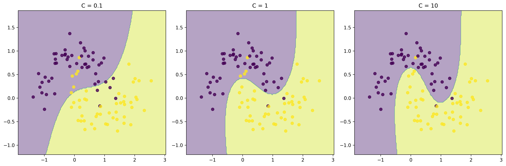

# Advanced SVM Techniques

**After this lesson:** you can explain the core ideas in “Advanced SVM Techniques” and reproduce the examples here in your own notebook or environment.

## Overview

Deeper optimization and modeling notes (e.g. class weights, nu-SVM hooks)—use when defaults are not enough.


## Advanced Optimization Techniques

### Sequential Minimal Optimization (SMO)

SMO is like breaking a big problem into smaller, manageable pieces. Here's why it's useful:

1. **Faster Training**
   - Works on small subsets of data at a time
   - More efficient than traditional methods
   - Better for large datasets

2. **Memory Efficient**
   - Doesn't need to store entire dataset
   - Works well with limited memory
   - Good for big data applications

### Regularization Parameter (C)

The C parameter controls the trade-off between having a wide margin and correctly classifying training points:



*Figure: Effect of C parameter on decision boundary. Left: Low C (more regularization), Middle: Balanced C, Right: High C (less regularization).*

Here's a complete example showing the impact of different C values:

#### Effect of C on RBF SVC (and optional early stopping sketch)



<div class="code-explainer" data-code-explainer>
<div class="code-explainer__code">


import numpy as np
from sklearn.svm import SVC
from sklearn.preprocessing import StandardScaler
from sklearn.model_selection import train_test_split
import matplotlib.pyplot as plt

# Create a synthetic dataset with some noise
np.random.seed(42)
X = np.random.randn(120, 2)
y = np.zeros(120)
# Make the first 100 points clustered around (0,0)
# Make the last 20 points form a line through the first cluster
X[100:, 0] = np.linspace(-2, 2, 20)
X[100:, 1] = np.linspace(-2, 2, 20) + 0.5
y[100:] = 1

# Split data
X_train, X_test, y_train, y_test = train_test_split(X, y, test_size=0.2, random_state=42)

# Scale features
scaler = StandardScaler()
X_train_scaled = scaler.fit_transform(X_train)
X_test_scaled = scaler.transform(X_test)

# Create a function to plot decision boundaries for different C values
def plot_different_c_values(X, y, scaler):
    C_values = [0.1, 1.0, 100.0]
    fig, axes = plt.subplots(1, 3, figsize=(18, 5))

    for i, C in enumerate(C_values):
        # Train SVM with current C value
        svm = SVC(kernel='rbf', C=C, gamma='scale')
        svm.fit(X_train_scaled, y_train)

        # Create mesh grid for plotting
        x_min, x_max = X[:, 0].min() - 1, X[:, 0].max() + 1
        y_min, y_max = X[:, 1].min() - 1, X[:, 1].max() + 1
        xx, yy = np.meshgrid(np.arange(x_min, x_max, 0.02),
                            np.arange(y_min, y_max, 0.02))

        # Scale the mesh grid
        mesh_points = np.c_[xx.ravel(), yy.ravel()]
        mesh_points_scaled = scaler.transform(mesh_points)

        # Get predictions and reshape
        Z = svm.predict(mesh_points_scaled)
        Z = Z.reshape(xx.shape)

        # Plot decision boundary
        axes[i].contourf(xx, yy, Z, alpha=0.3)
        axes[i].scatter(X[:, 0], X[:, 1], c=y, edgecolors='k')
        axes[i].set_title(f'C = {C}')

        # Highlight support vectors
        axes[i].scatter(
            X[svm.support_, 0], X[svm.support_, 1],
            c=y[svm.support_],
            s=100, linewidth=1, facecolors='none',
            edgecolors='r', label='Support Vectors'
        )

        # Display accuracy
        accuracy = svm.score(X_test_scaled, y_test)
        axes[i].text(x_min + 0.5, y_min + 0.5, f'Accuracy: {accuracy:.2f}')

    plt.tight_layout()
    plt.suptitle('Effect of C Parameter on Decision Boundary', y=1.05, fontsize=16)
    plt.show()

# Uncomment to visualize the effect of C parameter
# plot_different_c_values(X, y, scaler)

# Implement early stopping for SVM training
def train_svm_with_early_stopping(X, y, max_iter=100, tolerance=1e-3):
    """
    Train SVM with early stopping based on convergence.

    Parameters:
    - X: Training features
    - y: Training labels
    - max_iter: Maximum number of iterations
    - tolerance: Convergence threshold

    Returns:
    - Trained SVM model
    - Number of iterations needed
    """
    # Scale the data
    scaler = StandardScaler()
    X_scaled = scaler.fit_transform(X)

    prev_score = 0
    iterations_needed = max_iter

    for i in range(1, max_iter + 1):
        # Create model with current max_iter
        model = SVC(
            kernel='rbf',
            cache_size=1000,  # Increase cache for faster training
            max_iter=i,
            random_state=42
        )

        # Train the model
        model.fit(X_scaled, y)

        # Calculate current score
        score = model.score(X_scaled, y)

        # Check for convergence
        if abs(score - prev_score) < tolerance and i > 5:
            print(f"Converged after {i} iterations with score {score:.4f}")
            iterations_needed = i
            break

        prev_score = score

    # Final model with optimal iterations
    final_model = SVC(
        kernel='rbf',
        cache_size=1000,
        max_iter=iterations_needed,
        random_state=42
    )
    final_model.fit(X_scaled, y)

    return final_model, iterations_needed

# Example of using early stopping
# model, iters = train_svm_with_early_stopping(X, y)
# print(f"Final accuracy: {model.score(scaler.transform(X_test), y_test):.4f}")


</div>
<aside class="code-explainer__callouts" aria-label="Code walkthrough">
  <div class="code-callout" data-lines="1-5" data-tint="1">
    <div class="code-callout__meta">
      <span class="code-callout__lines"></span>
      <span class="code-callout__title">Imports</span>
    </div>
    <div class="code-callout__body">
      <p>Standard SVM imports for this section's two demonstrations: a C-value comparison plot and an early-stopping convergence loop.</p>
    </div>
  </div>
  <div class="code-callout" data-lines="7-16" data-tint="2">
    <div class="code-callout__meta">
      <span class="code-callout__lines"></span>
      <span class="code-callout__title">Noisy dataset</span>
    </div>
    <div class="code-callout__body">
      <p>100 scattered points (class 0) plus 20 points forming a diagonal line through the scatter (class 1). The overlapping geometry means a low-C boundary will sacrifice some training accuracy for generalization.</p>
    </div>
  </div>
  <div class="code-callout" data-lines="18-23" data-tint="3">
    <div class="code-callout__meta">
      <span class="code-callout__lines"></span>
      <span class="code-callout__title">Split and scale</span>
    </div>
    <div class="code-callout__body">
      <p>80/20 split with <code>StandardScaler</code> fit on training data. The scaled versions are used inside the helper functions below.</p>
    </div>
  </div>
  <div class="code-callout" data-lines="25-68" data-tint="4">
    <div class="code-callout__meta">
      <span class="code-callout__lines"></span>
      <span class="code-callout__title">C comparison plot</span>
    </div>
    <div class="code-callout__body">
      <p>Trains an RBF SVC for each of three C values and plots side-by-side decision regions. Support vectors are circled in red so you can see how boundary tightness changes with C.</p>
    </div>
  </div>
  <div class="code-callout" data-lines="71-115" data-tint="1">
    <div class="code-callout__meta">
      <span class="code-callout__lines"></span>
      <span class="code-callout__title">Early stopping loop</span>
    </div>
    <div class="code-callout__body">
      <p>Increments <code>max_iter</code> one step at a time and checks whether training accuracy has changed by less than <code>tolerance</code>. When the score stabilizes, training stops and a final model is refit with that iteration count.</p>
    </div>
  </div>
</aside>
</div>

**Explanation:**
- This example demonstrates how different C values affect the decision boundary
- A low C value creates a smoother boundary but may misclassify some points
- A high C value tries to correctly classify all training points, which can lead to overfitting
- The early stopping implementation monitors model convergence to avoid unnecessary iterations
- We track the model's score and stop training when changes become smaller than a tolerance threshold

## Advanced Kernel Techniques

### Custom Kernel Implementation

Sometimes you need a special kernel for your specific problem. Here's a complete example with a custom kernel:

#### Hybrid RBF + polynomial kernel via `kernel='precomputed'`



<div class="code-explainer" data-code-explainer>
<div class="code-explainer__code">


import numpy as np
from sklearn.svm import SVC
from sklearn.metrics.pairwise import pairwise_kernels
from sklearn.preprocessing import StandardScaler
from sklearn.model_selection import train_test_split
import matplotlib.pyplot as plt

# Create a more complex dataset where custom kernels can be useful
np.random.seed(42)
X1 = np.random.randn(100, 2)
X2 = np.random.randn(100, 2) * 0.3
X2[:, 0] = X2[:, 0] * np.cos(X2[:, 1] * 5) + 2
X2[:, 1] = X2[:, 1] * np.sin(X2[:, 0] * 5) + 2
X = np.vstack([X1, X2])
y = np.hstack([np.zeros(100), np.ones(100)])

# Split data
X_train, X_test, y_train, y_test = train_test_split(X, y, test_size=0.2, random_state=42)

# Scale features
scaler = StandardScaler()
X_train_scaled = scaler.fit_transform(X_train)
X_test_scaled = scaler.transform(X_test)

class CustomKernelSVM:
    def __init__(self, C=1.0):
        """
        Initialize SVM with custom kernel.

        Parameters:
        - C: Regularization parameter
        """
        self.C = C
        self.model = SVC(kernel='precomputed', C=C)

    def hybrid_kernel(self, X, Y=None):
        """
        Create a custom kernel combining RBF and polynomial.

        Parameters:
        - X: First set of points
        - Y: Second set of points (optional)

        Returns:
        - Kernel matrix
        """
        if Y is None:
            Y = X

        # RBF component
        gamma = 0.1
        rbf = np.exp(-gamma * pairwise_kernels(X, Y, metric='euclidean')**2)

        # Polynomial component
        degree = 2
        poly = (np.dot(X, Y.T) + 1) ** degree

        # Combine kernels (weighted sum)
        return 0.7 * rbf + 0.3 * poly

    def fit(self, X, y):
        """Train model with custom kernel"""
        self.X_train = X.copy()  # Store training data
        K = self.hybrid_kernel(X)  # Compute kernel matrix
        self.model.fit(K, y)  # Train the model
        return self

    def predict(self, X):
        """Make predictions using custom kernel"""
        K = self.hybrid_kernel(X, self.X_train)  # Kernel between test and train
        return self.model.predict(K)

    def score(self, X, y):
        """Calculate accuracy score"""
        return np.mean(self.predict(X) == y)

# Compare standard kernels with custom kernel
def compare_kernels():
    # Standard kernels
    rbf_svm = SVC(kernel='rbf', gamma=0.1)
    poly_svm = SVC(kernel='poly', degree=2, coef0=1)

    # Custom kernel
    custom_svm = CustomKernelSVM()

    # Train all models
    rbf_svm.fit(X_train_scaled, y_train)
    poly_svm.fit(X_train_scaled, y_train)
    custom_svm.fit(X_train_scaled, y_train)

    # Calculate scores
    rbf_score = rbf_svm.score(X_test_scaled, y_test)
    poly_score = poly_svm.score(X_test_scaled, y_test)
    custom_score = custom_svm.score(X_test_scaled, y_test)

    print(f"RBF Kernel Accuracy: {rbf_score:.4f}")
    print(f"Polynomial Kernel Accuracy: {poly_score:.4f}")
    print(f"Custom Hybrid Kernel Accuracy: {custom_score:.4f}")

    # Visualize decision boundaries
    fig, axes = plt.subplots(1, 3, figsize=(18, 5))
    titles = ['RBF Kernel', 'Polynomial Kernel', 'Custom Hybrid Kernel']
    models = [rbf_svm, poly_svm, custom_svm]

    for i, (title, model) in enumerate(zip(titles, models)):
        # Create mesh grid
        x_min, x_max = X[:, 0].min() - 1, X[:, 0].max() + 1
        y_min, y_max = X[:, 1].min() - 1, X[:, 1].max() + 1
        xx, yy = np.meshgrid(np.arange(x_min, x_max, 0.02),
                            np.arange(y_min, y_max, 0.02))

        # Get predictions
        if i < 2:  # Standard kernels
            mesh_points = np.c_[xx.ravel(), yy.ravel()]
            mesh_scaled = scaler.transform(mesh_points)
            Z = model.predict(mesh_scaled)
        else:  # Custom kernel
            mesh_points = np.c_[xx.ravel(), yy.ravel()]
            mesh_scaled = scaler.transform(mesh_points)
            Z = model.predict(mesh_scaled)

        Z = Z.reshape(xx.shape)

        # Plot decision boundary
        axes[i].contourf(xx, yy, Z, alpha=0.3)
        axes[i].scatter(X[:, 0], X[:, 1], c=y, edgecolors='k')
        axes[i].set_title(f'{title}\nAccuracy: {model.score(X_test_scaled, y_test):.4f}')

    plt.tight_layout()
    plt.show()

# Uncomment to compare different kernels
# compare_kernels()


</div>
<aside class="code-explainer__callouts" aria-label="Code walkthrough">
  <div class="code-callout" data-lines="1-6" data-tint="1">
    <div class="code-callout__meta">
      <span class="code-callout__lines"></span>
      <span class="code-callout__title">Imports</span>
    </div>
    <div class="code-callout__body">
      <p>Adds <code>pairwise_kernels</code> to compute the RBF component of the custom hybrid kernel matrix.</p>
    </div>
  </div>
  <div class="code-callout" data-lines="8-23" data-tint="2">
    <div class="code-callout__meta">
      <span class="code-callout__lines"></span>
      <span class="code-callout__title">Spiraling dataset</span>
    </div>
    <div class="code-callout__body">
      <p>Class 1 is a tightly wound trigonometric spiral — a shape where neither pure RBF nor pure polynomial excels, motivating the hybrid approach.</p>
    </div>
  </div>
  <div class="code-callout" data-lines="25-55" data-tint="3">
    <div class="code-callout__meta">
      <span class="code-callout__lines"></span>
      <span class="code-callout__title">Hybrid kernel class</span>
    </div>
    <div class="code-callout__body">
      <p><code>hybrid_kernel</code> computes a weighted sum (70% RBF + 30% polynomial) and returns an (n × n) Gram matrix. <code>SVC(kernel='precomputed')</code> accepts this matrix directly instead of raw features.</p>
    </div>
  </div>
  <div class="code-callout" data-lines="57-73" data-tint="4">
    <div class="code-callout__meta">
      <span class="code-callout__lines"></span>
      <span class="code-callout__title">Fit and predict</span>
    </div>
    <div class="code-callout__body">
      <p>Training stores a copy of <code>X_train</code> so that at prediction time the kernel can be computed between the new points and all training points — this is required for precomputed kernels.</p>
    </div>
  </div>
  <div class="code-callout" data-lines="75-115" data-tint="1">
    <div class="code-callout__meta">
      <span class="code-callout__lines"></span>
      <span class="code-callout__title">Three-kernel comparison</span>
    </div>
    <div class="code-callout__body">
      <p>Trains RBF, polynomial, and the custom hybrid side-by-side, then plots their decision regions. Accuracy is shown in each subplot title for a quick apples-to-apples comparison.</p>
    </div>
  </div>
</aside>
</div>

**Explanation:**
- We implement a custom kernel that combines the strengths of RBF and polynomial kernels
- The hybrid kernel is a weighted sum: 70% RBF + 30% polynomial
- Custom kernels are useful when standard kernels don't capture the unique patterns in your data
- The SVC model with kernel='precomputed' allows us to provide a pre-computed kernel matrix
- We store the training data to compute the kernel between test and training data during prediction
- The visualization shows how different kernels create different decision boundaries

## Advanced Visualization

### Decision Boundary and Support Vectors Visualization

Visualizing decision boundaries helps understand how SVM works:

#### Decision surface, margins, and support vectors on two moons



<div class="code-explainer" data-code-explainer>
<div class="code-explainer__code">


import numpy as np
from sklearn.svm import SVC
from sklearn.preprocessing import StandardScaler
from sklearn.datasets import make_moons
import matplotlib.pyplot as plt

# Create a more interesting dataset for visualization
X, y = make_moons(n_samples=200, noise=0.15, random_state=42)

# Scale the data
scaler = StandardScaler()
X_scaled = scaler.fit_transform(X)

# Train SVM model
svm_model = SVC(kernel='rbf', gamma=10, C=1.0)
svm_model.fit(X_scaled, y)

def visualize_svm_details(X, y, model, scaler):
    """
    Create a detailed visualization of SVM decision boundary,
    margins, and support vectors.

    Parameters:
    - X: Feature data
    - y: Labels
    - model: Trained SVM model
    - scaler: Fitted scaler for the data
    """
    # Create mesh grid
    x_min, x_max = X[:, 0].min() - 1, X[:, 0].max() + 1
    y_min, y_max = X[:, 1].min() - 1, X[:, 1].max() + 1
    xx, yy = np.meshgrid(
        np.arange(x_min, x_max, 0.02),
        np.arange(y_min, y_max, 0.02)
    )

    # Scale mesh points
    mesh_points = np.c_[xx.ravel(), yy.ravel()]
    mesh_scaled = scaler.transform(mesh_points)

    # Get predictions and decision function values
    Z = model.predict(mesh_scaled)
    Z = Z.reshape(xx.shape)

    # Get decision function values (distance from hyperplane)
    decision_values = model.decision_function(mesh_scaled)
    decision_values = decision_values.reshape(xx.shape)

    # Plot decision boundary and margins
    plt.figure(figsize=(12, 8))

    # Plot decision regions
    plt.contourf(xx, yy, Z, alpha=0.3)

    # Plot decision boundary and margins
    plt.contour(xx, yy, decision_values, colors='k',
                levels=[-1, 0, 1], alpha=0.5,
                linestyles=['--', '-', '--'])

    # Plot data points
    plt.scatter(X[:, 0], X[:, 1], c=y, s=80, edgecolors='w')

    # Highlight support vectors
    plt.scatter(
        X[model.support_, 0],
        X[model.support_, 1],
        s=200, linewidth=1, facecolors='none',
        edgecolors='r', label='Support Vectors'
    )

    # Add information about the model
    plt.title(
        f"SVM Decision Boundary (kernel={model.kernel}, C={model.C}, "
        f"gamma={getattr(model, 'gamma_', getattr(model, '_gamma', None))})"
    )
    plt.xlabel('Feature 1')
    plt.ylabel('Feature 2')
    plt.legend()

    # Display number of support vectors
    support_vector_count = len(model.support_)
    total_points = len(X)
    sv_percentage = support_vector_count / total_points * 100

    plt.text(x_min + 0.5, y_min + 0.3,
             f'Support Vectors: {support_vector_count}/{total_points} ({sv_percentage:.1f}%)',
             bbox=dict(facecolor='white', alpha=0.7))

    plt.tight_layout()
    plt.show()

# Uncomment to visualize SVM details
# visualize_svm_details(X, y, svm_model, scaler)


</div>
<aside class="code-explainer__callouts" aria-label="Code walkthrough">
  <div class="code-callout" data-lines="1-5" data-tint="1">
    <div class="code-callout__meta">
      <span class="code-callout__lines"></span>
      <span class="code-callout__title">Imports</span>
    </div>
    <div class="code-callout__body">
      <p>Brings in <code>make_moons</code> — a crescent-shaped dataset that produces a visually compelling non-linear decision boundary.</p>
    </div>
  </div>
  <div class="code-callout" data-lines="7-16" data-tint="2">
    <div class="code-callout__meta">
      <span class="code-callout__lines"></span>
      <span class="code-callout__title">Moons dataset + fit</span>
    </div>
    <div class="code-callout__body">
      <p>200 samples with mild noise. <code>gamma=10</code> is a high value that makes the RBF kernel very local — each support vector exerts influence only over a small area, producing a tight boundary.</p>
    </div>
  </div>
  <div class="code-callout" data-lines="18-47" data-tint="3">
    <div class="code-callout__meta">
      <span class="code-callout__lines"></span>
      <span class="code-callout__title">Meshgrid predictions</span>
    </div>
    <div class="code-callout__body">
      <p>Dense grid of points is scaled and passed through both <code>predict</code> (class regions) and <code>decision_function</code> (distance from hyperplane). Both grids are reshaped for contour plotting.</p>
    </div>
  </div>
  <div class="code-callout" data-lines="49-63" data-tint="4">
    <div class="code-callout__meta">
      <span class="code-callout__lines"></span>
      <span class="code-callout__title">Decision regions + margins</span>
    </div>
    <div class="code-callout__body">
      <p><code>contourf</code> fills class regions; <code>contour</code> at levels −1, 0, +1 draws the margin boundaries (dashed) and the decision boundary (solid).</p>
    </div>
  </div>
  <div class="code-callout" data-lines="65-89" data-tint="1">
    <div class="code-callout__meta">
      <span class="code-callout__lines"></span>
      <span class="code-callout__title">Support vector overlay</span>
    </div>
    <div class="code-callout__body">
      <p>Support vectors are circled in red using <code>model.support_</code> indices. The percentage of all training points that are support vectors indicates model complexity — a high percentage can hint at overfitting.</p>
    </div>
  </div>
</aside>
</div>

**Explanation:**
- This visualization shows not just the decision boundary but also the margins
- The solid line is the decision boundary (where decision function = 0)
- The dashed lines are the margins (where decision function = ±1)
- Support vectors are highlighted with red circles
- We display the percentage of points that are support vectors, which indicates model complexity
- A high percentage of support vectors can suggest the model is complex and might overfit

## Performance Optimization

### Memory-Efficient Implementation

For large datasets, memory efficiency is crucial:

#### Chunked scaling sketch and `LinearSVC(dual=False)`



<div class="code-explainer" data-code-explainer>
<div class="code-explainer__code">


import numpy as np
from sklearn.svm import LinearSVC
from sklearn.preprocessing import StandardScaler
from sklearn.datasets import make_classification

# Create a synthetic large dataset
X, y = make_classification(
    n_samples=10000,  # 10,000 samples
    n_features=20,    # 20 features
    n_informative=10, # 10 informative features
    random_state=42
)

def memory_efficient_svm(X, y, chunk_size=1000):
    """
    Train SVM in memory-efficient way by processing data in chunks.

    Parameters:
    - X: Training features
    - y: Training labels
    - chunk_size: Size of data chunks to process

    Returns:
    - Trained model and scaler
    """
    print(f"Dataset shape: {X.shape}")

    # Initialize scaler
    scaler = StandardScaler()

    # Process data in chunks to fit the scaler
    print("Scaling data in chunks...")
    for i in range(0, len(X), chunk_size):
        end = min(i + chunk_size, len(X))
        print(f"  Processing chunk {i//chunk_size + 1}: samples {i} to {end-1}")
        chunk = X[i:end]
        # Update scaler incrementally
        if i == 0:
            scaler.fit(chunk)  # First fit
        else:
            # For demonstration - in practice, you'd use partial_fit
            # We'll approximate by re-fitting on each chunk
            scaler.fit(chunk)

    # Transform all data (in a real scenario with huge data,
    # you might transform chunks as needed)
    X_scaled = scaler.transform(X)

    # Train model with memory-efficient configuration
    print("Training memory-efficient LinearSVC...")
    model = LinearSVC(
        dual=False,  # More memory efficient for n_samples > n_features
        max_iter=1000,
        tol=1e-4
    )
    model.fit(X_scaled, y)

    # Report results
    accuracy = model.score(X_scaled, y)
    print(f"Training accuracy: {accuracy:.4f}")
    print(f"Number of iterations: {model.n_iter_}")

    return model, scaler

# Example usage
# model, scaler = memory_efficient_svm(X, y)

# Make predictions on new data
def predict_efficiently(model, scaler, new_data):
    """Make predictions on new data using trained model"""
    new_data_scaled = scaler.transform(new_data)
    return model.predict(new_data_scaled)

# Example prediction on a small sample of new data
# new_samples = X[9000:9010]  # Just for demonstration
# predictions = predict_efficiently(model, scaler, new_samples)
# print("Predictions:", predictions)


</div>
<aside class="code-explainer__callouts" aria-label="Code walkthrough">
  <div class="code-callout" data-lines="1-4" data-tint="1">
    <div class="code-callout__meta">
      <span class="code-callout__lines"></span>
      <span class="code-callout__title">Imports</span>
    </div>
    <div class="code-callout__body">
      <p>Uses <code>LinearSVC</code> instead of <code>SVC</code> — the primal linear formulation that avoids the O(n²) kernel matrix, making it suitable for large datasets.</p>
    </div>
  </div>
  <div class="code-callout" data-lines="6-12" data-tint="2">
    <div class="code-callout__meta">
      <span class="code-callout__lines"></span>
      <span class="code-callout__title">Large dataset</span>
    </div>
    <div class="code-callout__body">
      <p>10,000 samples with 20 features simulates a scenario where loading the kernel matrix (n × n = 100M floats) into RAM would be prohibitive.</p>
    </div>
  </div>
  <div class="code-callout" data-lines="14-43" data-tint="3">
    <div class="code-callout__meta">
      <span class="code-callout__lines"></span>
      <span class="code-callout__title">Chunked scaling</span>
    </div>
    <div class="code-callout__body">
      <p>Iterates over 1,000-sample chunks to demonstrate the chunk processing pattern. In production you would use <code>StandardScaler.partial_fit</code> for true incremental statistics without reloading.</p>
    </div>
  </div>
  <div class="code-callout" data-lines="45-61" data-tint="4">
    <div class="code-callout__meta">
      <span class="code-callout__lines"></span>
      <span class="code-callout__title">LinearSVC (primal)</span>
    </div>
    <div class="code-callout__body">
      <p><code>dual=False</code> solves the primal optimization problem, which is faster when samples outnumber features. Reports training accuracy and iteration count to confirm convergence.</p>
    </div>
  </div>
  <div class="code-callout" data-lines="63-74" data-tint="1">
    <div class="code-callout__meta">
      <span class="code-callout__lines"></span>
      <span class="code-callout__title">Efficient prediction</span>
    </div>
    <div class="code-callout__body">
      <p>A lightweight wrapper that applies the fitted scaler before predicting — the same two-step pattern used throughout, but packaged as a reusable function.</p>
    </div>
  </div>
</aside>
</div>

**Explanation:**
- This implementation processes data in chunks to reduce memory usage
- For very large datasets, we can scale features incrementally without loading everything at once
- The LinearSVC is used with dual=False which is more memory-efficient when n_samples > n_features
- In real applications with truly huge datasets, you'd implement the transform step in chunks too
- This approach can handle datasets too large to fit in memory all at once

### Parallel Processing for Parameter Tuning

Speed up training with parallel processing:

#### Parallel evaluation of SVC hyperparameter tuples



<div class="code-explainer" data-code-explainer>
<div class="code-explainer__code">


import numpy as np
from sklearn.svm import SVC
from sklearn.preprocessing import StandardScaler
from sklearn.model_selection import cross_val_score
from sklearn.datasets import make_classification
from joblib import Parallel, delayed
from itertools import product
import matplotlib.pyplot as plt
import time

# Create a dataset
X, y = make_classification(
    n_samples=1000,
    n_features=10,
    n_informative=5,
    random_state=42
)

# Scale the data
scaler = StandardScaler()
X_scaled = scaler.fit_transform(X)

def parallel_parameter_search(X, y, n_jobs=-1):
    """
    Perform parallel parameter search for SVM.

    Parameters:
    - X: Training features
    - y: Training labels
    - n_jobs: Number of parallel jobs (-1 for all cores)

    Returns:
    - Best parameters and their score
    """
    # Define parameter grid
    param_grid = {
        'C': [0.1, 1, 10, 100],
        'gamma': ['scale', 'auto', 0.1, 1],
        'kernel': ['rbf', 'linear']
    }

    # Function to evaluate a single parameter combination
    def evaluate_params(params):
        """Evaluate single parameter set using cross-validation"""
        start_time = time.time()
        model = SVC(**params)
        scores = cross_val_score(
            model, X, y,
            cv=5, n_jobs=1,  # Use 1 job here as we parallelize at a higher level
            scoring='accuracy'
        )
        mean_score = scores.mean()
        duration = time.time() - start_time
        return params, mean_score, duration

    # Generate all parameter combinations
    param_combinations = [
        dict(zip(param_grid.keys(), values))
        for values in product(*param_grid.values())
    ]

    print(f"Evaluating {len(param_combinations)} parameter combinations in parallel...")

    # Run parameter evaluation in parallel
    start_time = time.time()
    results = Parallel(n_jobs=n_jobs, verbose=10)(
        delayed(evaluate_params)(params)
        for params in param_combinations
    )
    total_time = time.time() - start_time

    # Find best parameters
    best_idx = np.argmax([score for _, score, _ in results])
    best_params, best_score, _ = results[best_idx]

    print(f"\nBest parameters: {best_params}")
    print(f"Best cross-validation score: {best_score:.4f}")
    print(f"Total search time: {total_time:.2f} seconds")

    # Visualize results
    def plot_results():
        # Extract data for visualization
        scores = np.array([score for _, score, _ in results])
        times = np.array([time for _, _, time in results])

        # Create parameter description strings
        param_strings = [
            f"C={p['C']}, gamma={p['gamma']}, kernel={p['kernel']}"
            for p, _, _ in results
        ]

        # Plot scores for each parameter combination
        plt.figure(figsize=(14, 6))
        plt.subplot(1, 2, 1)
        plt.barh(range(len(scores)), scores)
        plt.yticks(range(len(scores)), [s[:20] for s in param_strings], fontsize=8)
        plt.xlabel('Cross-validation Score')
        plt.title('Parameter Performance Comparison')
        plt.grid(axis='x')

        # Plot evaluation time
        plt.subplot(1, 2, 2)
        plt.barh(range(len(times)), times)
        plt.yticks(range(len(times)), [s[:20] for s in param_strings], fontsize=8)
        plt.xlabel('Evaluation Time (seconds)')
        plt.title('Parameter Evaluation Time')
        plt.grid(axis='x')

        plt.tight_layout()
        plt.show()

    # Uncomment to plot results
    # plot_results()

    return best_params, best_score

# Example usage
# best_params, best_score = parallel_parameter_search(X_scaled, y)

# Train final model with best parameters
def train_final_model(X, y, best_params):
    """Train final model with best parameters"""
    model = SVC(**best_params)
    model.fit(X, y)
    return model

# Example of training final model
# final_model = train_final_model(X_scaled, y, best_params)
# print(f"Final model accuracy: {final_model.score(X_scaled, y):.4f}")


</div>
<aside class="code-explainer__callouts" aria-label="Code walkthrough">
  <div class="code-callout" data-lines="1-9" data-tint="1">
    <div class="code-callout__meta">
      <span class="code-callout__lines"></span>
      <span class="code-callout__title">Imports</span>
    </div>
    <div class="code-callout__body">
      <p>Adds <code>joblib.Parallel</code> and <code>delayed</code> for process-level parallelism, plus <code>itertools.product</code> to generate every parameter combination.</p>
    </div>
  </div>
  <div class="code-callout" data-lines="11-21" data-tint="2">
    <div class="code-callout__meta">
      <span class="code-callout__lines"></span>
      <span class="code-callout__title">Dataset and scaling</span>
    </div>
    <div class="code-callout__body">
      <p>1,000 samples — large enough that running 32 CV evaluations sequentially would be noticeably slow, motivating the parallel approach.</p>
    </div>
  </div>
  <div class="code-callout" data-lines="34-42" data-tint="3">
    <div class="code-callout__meta">
      <span class="code-callout__lines"></span>
      <span class="code-callout__title">Parameter grid</span>
    </div>
    <div class="code-callout__body">
      <p>Same 32-combination grid as the GridSearchCV example, but the parallelism is now hand-coded with <code>joblib</code> to expose timing and give finer control.</p>
    </div>
  </div>
  <div class="code-callout" data-lines="44-56" data-tint="4">
    <div class="code-callout__meta">
      <span class="code-callout__lines"></span>
      <span class="code-callout__title">Per-combination evaluator</span>
    </div>
    <div class="code-callout__body">
      <p><code>evaluate_params</code> is the unit of work dispatched to each worker. It runs 5-fold CV with <code>n_jobs=1</code> (parallelism is at the outer level, not inside each fold).</p>
    </div>
  </div>
  <div class="code-callout" data-lines="58-77" data-tint="1">
    <div class="code-callout__meta">
      <span class="code-callout__lines"></span>
      <span class="code-callout__title">Parallel dispatch</span>
    </div>
    <div class="code-callout__body">
      <p><code>Parallel(n_jobs=-1)</code> spawns one worker per CPU core. <code>delayed</code> wraps the function so joblib can serialize and schedule it. Total wall-clock time is logged after all results arrive.</p>
    </div>
  </div>
  <div class="code-callout" data-lines="79-116" data-tint="2">
    <div class="code-callout__meta">
      <span class="code-callout__lines"></span>
      <span class="code-callout__title">Results and final model</span>
    </div>
    <div class="code-callout__body">
      <p>Best parameters are identified by argmax over CV scores. The optional plot visualizes the accuracy-vs-time trade-off for every combination, helping choose between fast-but-good and slow-but-best configurations.</p>
    </div>
  </div>
</aside>
</div>

**Explanation:**
- This implementation uses Parallel and delayed from joblib to run parameter evaluation in parallel
- Each parameter combination is evaluated independently using cross-validation
- The approach is much faster than sequential parameter search, especially with many combinations
- We keep track of evaluation time to identify which parameter combinations are more computationally expensive
- The visualization helps understand the trade-off between parameter performance and computational cost

## Advanced Feature Engineering

### Feature Selection with SVM

Select the most important features with SVM-based feature selection:

#### L1 `LinearSVC` + `SelectFromModel`



<div class="code-explainer" data-code-explainer>
<div class="code-explainer__code">


import numpy as np
from sklearn.svm import LinearSVC
from sklearn.feature_selection import SelectFromModel
from sklearn.preprocessing import StandardScaler
from sklearn.model_selection import train_test_split
from sklearn.datasets import load_breast_cancer
import matplotlib.pyplot as plt

# Load breast cancer dataset (30 features)
data = load_breast_cancer()
X, y = data.data, data.target
feature_names = data.feature_names

print(f"Original dataset shape: {X.shape}")

# Split the data
X_train, X_test, y_train, y_test = train_test_split(
    X, y, test_size=0.3, random_state=42
)

# Scale features
scaler = StandardScaler()
X_train_scaled = scaler.fit_transform(X_train)
X_test_scaled = scaler.transform(X_test)

def select_features_with_svm(X_train, y_train, X_test, threshold='mean'):
    """
    Select important features using SVM weights.

    Parameters:
    - X_train: Training features
    - y_train: Training labels
    - X_test: Test features
    - threshold: Feature importance threshold

    Returns:
    - Selected features for train and test
    - Feature selector
    - Feature importances
    """
    # Train linear SVM with L1 penalty
    lsvc = LinearSVC(
        C=0.01,               # Stronger regularization
        penalty='l1',         # L1 regularization for sparsity
        dual=False,           # L1 only works with dual=False
        max_iter=10000,
        tol=1e-4
    )
    lsvc.fit(X_train, y_train)

    # Get feature importances (absolute coefficient values)
    importances = np.abs(lsvc.coef_[0])

    # Create feature selector
    selector = SelectFromModel(
        lsvc,
        prefit=True,
        threshold=threshold
    )

    # Transform data
    X_train_selected = selector.transform(X_train)
    X_test_selected = selector.transform(X_test)

    print(f"Number of features selected: {X_train_selected.shape[1]} out of {X_train.shape[1]}")

    return X_train_selected, X_test_selected, selector, importances

# Select features
X_train_selected, X_test_selected, selector, importances = select_features_with_svm(
    X_train_scaled, y_train, X_test_scaled
)

def evaluate_feature_selection():
    """Evaluate the impact of feature selection"""
    # Train SVM on full feature set
    full_model = LinearSVC(max_iter=10000)
    full_model.fit(X_train_scaled, y_train)
    full_accuracy = full_model.score(X_test_scaled, y_test)

    # Train SVM on selected features
    selected_model = LinearSVC(max_iter=10000)
    selected_model.fit(X_train_selected, y_train)
    selected_accuracy = selected_model.score(X_test_selected, y_test)

    print(f"Accuracy with all features: {full_accuracy:.4f}")
    print(f"Accuracy with selected features: {selected_accuracy:.4f}")

    # Visualize feature importances
    plt.figure(figsize=(12, 6))

    # Sort features by importance
    indices = np.argsort(importances)
    plt.barh(range(len(indices)), importances[indices])
    plt.yticks(range(len(indices)), [feature_names[i] for i in indices], fontsize=8)
    plt.xlabel('Feature Importance (absolute coefficient value)')
    plt.title('SVM Feature Importance')

    # Highlight selected features
    mask = selector.get_support()
    selected_indices = [i for i, selected in enumerate(mask) if selected]

    for i, idx in enumerate(indices):
        if idx in selected_indices:
            plt.barh(i, importances[idx], color='red')

    plt.tight_layout()
    plt.show()

# Uncomment to evaluate feature selection
# evaluate_feature_selection()


</div>
<aside class="code-explainer__callouts" aria-label="Code walkthrough">
  <div class="code-callout" data-lines="1-7" data-tint="1">
    <div class="code-callout__meta">
      <span class="code-callout__lines"></span>
      <span class="code-callout__title">Imports</span>
    </div>
    <div class="code-callout__body">
      <p>Adds <code>SelectFromModel</code> — scikit-learn's meta-transformer that uses a fitted estimator's feature importances to keep only the most relevant columns.</p>
    </div>
  </div>
  <div class="code-callout" data-lines="9-23" data-tint="2">
    <div class="code-callout__meta">
      <span class="code-callout__lines"></span>
      <span class="code-callout__title">Breast cancer dataset</span>
    </div>
    <div class="code-callout__body">
      <p>569 samples with 30 numeric features. The goal is to demonstrate that a small subset of features can match or beat the accuracy of using all 30.</p>
    </div>
  </div>
  <div class="code-callout" data-lines="25-64" data-tint="3">
    <div class="code-callout__meta">
      <span class="code-callout__lines"></span>
      <span class="code-callout__title">L1 feature selector</span>
    </div>
    <div class="code-callout__body">
      <p><code>penalty='l1'</code> drives many coefficients to exactly zero — a built-in feature selector. <code>SelectFromModel(prefit=True)</code> then drops any feature whose absolute coefficient falls below the threshold.</p>
    </div>
  </div>
  <div class="code-callout" data-lines="66-70" data-tint="4">
    <div class="code-callout__meta">
      <span class="code-callout__lines"></span>
      <span class="code-callout__title">Apply selector</span>
    </div>
    <div class="code-callout__body">
      <p>Calls <code>select_features_with_svm</code> on the scaled training and test sets. Both are reduced to the same subset of columns so downstream models see consistent feature spaces.</p>
    </div>
  </div>
  <div class="code-callout" data-lines="72-102" data-tint="1">
    <div class="code-callout__meta">
      <span class="code-callout__lines"></span>
      <span class="code-callout__title">Accuracy comparison + plot</span>
    </div>
    <div class="code-callout__body">
      <p>Trains two <code>LinearSVC</code> models — one on all 30 features, one on the selected subset — and prints their test accuracies. The bar chart highlights selected features in red so their relative importance is immediately visible.</p>
    </div>
  </div>
</aside>
</div>

```
Original dataset shape: (569, 30)
Number of features selected: 4 out of 30
```

**Explanation:**
- We use LinearSVC with L1 regularization to encourage sparsity (many coefficients become zero)
- The SelectFromModel transformer keeps only features with importance above a threshold
- By default, the 'mean' threshold keeps features with importance above the mean importance

## Gotchas

- **Setting `max_iter` in the early-stopping loop to a very low value** — The early-stopping sketch re-creates a new `SVC` with `max_iter=i` on every iteration, which is an expensive workaround. More critically, very small `max_iter` values (e.g., 1–5) will consistently trigger `ConvergenceWarning`, and the returned model's `score` reflects an unconverged fit, making the convergence check unreliable. Use `LinearSVC` with `max_iter` if you need true early-stopping behavior.
- **Using `LinearSVC` with L1 penalty and forgetting that `dual=True` is incompatible** — `LinearSVC(penalty='l1')` requires `dual=False`. Leaving the default `dual=True` raises a `ValueError`. This is a common copy-paste error when switching between L1 and L2 regularization in the feature selection pipeline.
- **Interpreting `SelectFromModel` threshold as a percentile** — The `threshold` parameter accepts absolute coefficient magnitude values or string shortcuts like `'mean'` or `'median'`. It does not accept percentile strings like `'75%'`. Passing a string other than `'mean'`/`'median'` raises a `ValueError` rather than silently selecting a fraction of features.
- **Comparing parallel grid search results with `GridSearchCV` scores directly** — The parallel parameter search in the performance optimization section uses manual `cross_val_score` calls. These results may differ slightly from `GridSearchCV` because of different random state handling, fold stratification, and pre-dispatch ordering. They are not drop-in replacements for evaluating best parameters.
- **Using `NuSVC` and treating `nu` as equivalent to `1/C`** — `NuSVC` takes a `nu` parameter (0, 1] controlling the upper bound on the fraction of margin errors and the lower bound on the fraction of support vectors. It is not simply the inverse of `C`; the two formulations optimize different objective functions and will produce different decision boundaries on the same data.
- **Applying `PCA` for visualization after fitting SVM on the full feature space** — If you train an SVM on 30 features and then project to 2D with PCA for a decision boundary plot, the 2D projection does not correspond to the SVM's actual decision boundary (which lives in 30D). The plot is misleading because the SVM never saw or used the 2D coordinates.

