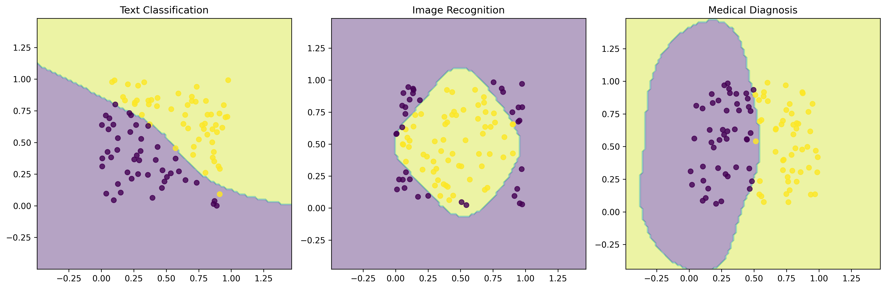

# Real-World Applications of SVM

## Learning Objectives 🎯

By the end of this section, you will be able to:

- Implement SVM for real-world problems
- Choose appropriate SVM configurations for different applications
- Evaluate and optimize SVM performance in practical scenarios
- Handle common challenges in real-world deployments

## SVM in Different Domains

SVM can be applied to various real-world problems, each requiring different configurations:



*Figure: SVM applied to different domains. Left: Text Classification (linear boundary), Middle: Image Recognition (circular boundary), Right: Medical Diagnosis (complex boundary).*

## 1. Text Classification

### Spam Detection System

Let's build a spam detector that can classify emails:

```python
from sklearn.feature_extraction.text import TfidfVectorizer
from sklearn.svm import LinearSVC
from sklearn.pipeline import Pipeline
import numpy as np

class EmailClassifier:
    def __init__(self):
        """
        Initialize email classifier with TF-IDF and SVM.
        """
        self.pipeline = Pipeline([
            ('vectorizer', TfidfVectorizer(
                max_features=10000,  # Limit vocabulary size
                ngram_range=(1, 2),  # Use single words and pairs
                stop_words='english'  # Remove common words
            )),
            ('classifier', LinearSVC(
                C=1.0,
                class_weight='balanced',  # Handle imbalanced classes
                max_iter=1000
            ))
        ])
        
    def train(self, emails, labels):
        """
        Train the spam detector.
        
        Parameters:
        - emails: List of email texts
        - labels: 1 for spam, 0 for not spam
        """
        self.pipeline.fit(emails, labels)
        
    def predict(self, emails, threshold=0.8):
        """
        Predict with confidence threshold.
        
        Parameters:
        - emails: List of emails to classify
        - threshold: Confidence threshold
        
        Returns:
        - Predictions and confidence scores
        """
        # Get decision function scores
        scores = self.pipeline.decision_function(emails)
        
        # Apply threshold
        predictions = np.where(
            np.abs(scores) >= threshold,
            np.sign(scores),
            0  # Mark as uncertain
        )
        
        return predictions, np.abs(scores)

# Example usage
emails = [
    "Get rich quick! Buy now!",
    "Meeting at 3pm tomorrow",
    "Win a free iPhone today!",
    "Project deadline reminder"
]
labels = [1, 0, 1, 0]  # 1 for spam, 0 for not spam

# Create and train classifier
classifier = EmailClassifier()
classifier.train(emails, labels)

# Make predictions
new_emails = ["Special offer just for you!", "Team meeting notes"]
predictions, confidences = classifier.predict(new_emails)
```

## 2. Image Recognition

### Face Detection System

Let's build a simple face detector:

```python
import cv2
import numpy as np
from sklearn.svm import SVC
from sklearn.preprocessing import StandardScaler

class FaceDetector:
    def __init__(self):
        """
        Initialize face detector with Haar Cascade and SVM.
        """
        self.face_cascade = cv2.CascadeClassifier(
            cv2.data.haarcascades + 
            'haarcascade_frontalface_default.xml'
        )
        self.model = Pipeline([
            ('scaler', StandardScaler()),
            ('svm', SVC(kernel='rbf', probability=True))
        ])
        
    def extract_features(self, image):
        """
        Extract features from face image.
        
        Parameters:
        - image: Input image
        
        Returns:
        - Feature vector
        """
        # Convert to grayscale
        gray = cv2.cvtColor(image, cv2.COLOR_BGR2GRAY)
        
        # Resize to standard size
        resized = cv2.resize(gray, (64, 64))
        
        # Extract HOG features
        hog = cv2.HOGDescriptor()
        features = hog.compute(resized)
        
        return features.flatten()
        
    def train(self, face_images, labels):
        """
        Train the face detector.
        
        Parameters:
        - face_images: List of face images
        - labels: Person labels
        """
        # Extract features from all images
        features = np.array([
            self.extract_features(img)
            for img in face_images
        ])
        
        # Train model
        self.model.fit(features, labels)
        
    def detect(self, image, min_confidence=0.8):
        """
        Detect faces in image.
        
        Parameters:
        - image: Input image
        - min_confidence: Minimum confidence threshold
        
        Returns:
        - List of detected faces with confidence
        """
        # Detect faces using cascade
        faces = self.face_cascade.detectMultiScale(
            image, 
            scaleFactor=1.1,
            minNeighbors=5
        )
        
        results = []
        for (x, y, w, h) in faces:
            # Extract face region
            face = image[y:y+h, x:x+w]
            
            # Get features
            features = self.extract_features(face)
            
            # Predict
            prob = self.model.predict_proba([features])[0]
            if max(prob) >= min_confidence:
                results.append({
                    'bbox': (x, y, w, h),
                    'confidence': max(prob)
                })
                
        return results
```

## 3. Medical Diagnosis

### Disease Classification System

Let's build a system to help diagnose diseases:

```python
from sklearn.preprocessing import StandardScaler
from sklearn.model_selection import StratifiedKFold
from sklearn.metrics import roc_auc_score

class MedicalDiagnosisSystem:
    def __init__(self):
        """
        Initialize medical diagnosis system.
        """
        self.model = Pipeline([
            ('scaler', StandardScaler()),
            ('svm', SVC(
                kernel='rbf',
                probability=True,
                class_weight='balanced'
            ))
        ])
        
    def train_with_validation(self, X, y):
        """
        Train with cross-validation.
        
        Parameters:
        - X: Patient features
        - y: Disease labels
        """
        # Setup cross-validation
        cv = StratifiedKFold(n_splits=5)
        
        # Store validation results
        self.cv_results = []
        
        for fold, (train_idx, val_idx) in enumerate(cv.split(X, y)):
            # Split data
            X_train = X[train_idx]
            y_train = y[train_idx]
            X_val = X[val_idx]
            y_val = y[val_idx]
            
            # Train model
            self.model.fit(X_train, y_train)
            
            # Evaluate
            y_pred = self.model.predict_proba(X_val)[:, 1]
            auc = roc_auc_score(y_val, y_pred)
            
            self.cv_results.append({
                'fold': fold,
                'auc': auc
            })
            
        # Train final model on all data
        self.model.fit(X, y)
        
    def diagnose(self, patient_data, threshold=0.5):
        """
        Make diagnosis with confidence.
        
        Parameters:
        - patient_data: Patient features
        - threshold: Decision threshold
        
        Returns:
        - Diagnosis results
        """
        # Get probability
        prob = self.model.predict_proba([patient_data])[0]
        
        # Make decision
        diagnosis = 1 if prob[1] >= threshold else 0
        
        return {
            'diagnosis': diagnosis,
            'confidence': prob[1],
            'needs_review': 0.4 <= prob[1] <= 0.6
        }
```

## 4. Financial Applications

### Credit Risk Assessment

Let's build a system to assess credit risk:

```python
from sklearn.preprocessing import StandardScaler
from sklearn.model_selection import cross_val_predict

class CreditRiskAssessor:
    def __init__(self):
        """
        Initialize credit risk assessment system.
        """
        self.model = Pipeline([
            ('scaler', StandardScaler()),
            ('svm', SVC(
                kernel='rbf',
                probability=True,
                class_weight='balanced'
            ))
        ])
        
    def train_with_monitoring(self, X, y):
        """
        Train with performance monitoring.
        
        Parameters:
        - X: Applicant features
        - y: Risk labels
        """
        # Get cross-validated predictions
        y_pred = cross_val_predict(
            self.model, X, y,
            cv=5,
            method='predict_proba'
        )
        
        # Calculate metrics
        self.performance_metrics = {
            'auc': roc_auc_score(y, y_pred[:, 1]),
            'precision': precision_score(
                y, y_pred[:, 1] > 0.5
            ),
            'recall': recall_score(
                y, y_pred[:, 1] > 0.5
            )
        }
        
        # Train final model
        self.model.fit(X, y)
        
    def assess_risk(self, applicant_data):
        """
        Assess credit risk.
        
        Parameters:
        - applicant_data: Applicant features
        
        Returns:
        - Risk assessment results
        """
        # Get probability
        prob = self.model.predict_proba([applicant_data])[0]
        
        # Define risk levels
        if prob[1] < 0.2:
            risk_level = 'Low'
        elif prob[1] < 0.5:
            risk_level = 'Medium'
        else:
            risk_level = 'High'
            
        return {
            'risk_level': risk_level,
            'probability': prob[1],
            'recommendation': 'Approve' if prob[1] < 0.3 else 'Review'
        }
```

## Common Challenges and Solutions

### 1. Data Quality Issues

```python
def handle_missing_data(X):
    """
    Handle missing values in data.
    
    Parameters:
    - X: Input features
    
    Returns:
    - Cleaned features
    """
    from sklearn.impute import SimpleImputer
    
    imputer = SimpleImputer(strategy='mean')
    return imputer.fit_transform(X)
```

### 2. Feature Scaling

```python
def scale_features(X):
    """
    Scale features for SVM.
    
    Parameters:
    - X: Input features
    
    Returns:
    - Scaled features
    """
    scaler = StandardScaler()
    return scaler.fit_transform(X)
```

### 3. Class Imbalance

```python
def handle_imbalance(X, y):
    """
    Handle imbalanced classes.
    
    Parameters:
    - X: Features
    - y: Labels
    
    Returns:
    - Balanced dataset
    """
    from imblearn.over_sampling import SMOTE
    
    smote = SMOTE()
    X_balanced, y_balanced = smote.fit_resample(X, y)
    return X_balanced, y_balanced
```

## Best Practices

1. **Data Preparation**
   - Clean and preprocess data
   - Handle missing values
   - Scale features
   - Balance classes if needed

2. **Model Selection**
   - Start with simple kernels
   - Use cross-validation
   - Monitor performance metrics
   - Consider computational cost

3. **Deployment**
   - Save trained models
   - Implement monitoring
   - Handle new data properly
   - Update models regularly

## Next Steps

1. Practice with real datasets
2. Experiment with different kernels
3. Try different preprocessing techniques
4. Implement monitoring systems

Remember: Real-world applications require careful consideration of data quality, model performance, and deployment requirements!
