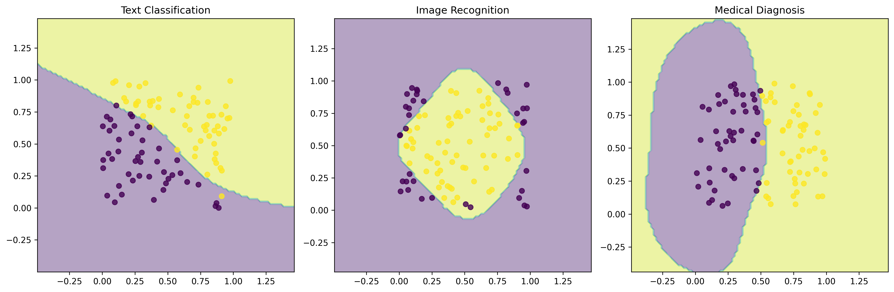

# Real-World Applications of SVM

**After this lesson:** you can explain Real-World Applications of SVM and try the examples in your own notebook.

## Overview

Text (linear SVM), bioinformatics-style high-$p$ settings, and other cases where margins still shine.

## SVM in Different Domains

SVM can be applied to various real-world problems, each requiring different configurations:



_Figure: SVM applied to different domains. Left: Text Classification (linear boundary), Middle: Image Recognition (circular boundary), Right: Medical Diagnosis (complex boundary)._

## 1. Text Classification

### Spam Detection System

Build a simple spam detector that can classify emails:

#### TF-IDF + linear SVC spam classifier

Imports

NumPy for label arrays, `TfidfVectorizer` to convert text to numeric features, `SVC` as the classifier, and `train_test_split` to hold out test emails.

Vectorize and Train

TF-IDF converts each email into a sparse word-frequency vector; a linear-kernel SVC with `class_weight='balanced'` and `probability=True` is then fit on those vectors.

Classify Email

`classify_email` transforms a new message with the fitted vectorizer and returns a dict with label, spam probability, and an `uncertain` flag for borderline cases near the 0.5 boundary.

Usage Demo

A sample promotional email is passed through `classify_email`; the result prints classification, confidence, and a manual-review notice when the decision is uncertain.

```
Accuracy: 0.33
Email classified as: NOT SPAM
Confidence: 0.16
```

**Explanation:**

* This example demonstrates a complete spam detection system using SVM
* We use TF-IDF vectorization to convert email text into numerical features
* The linear kernel works well for text classification as it performs well in high-dimensional, sparse spaces
* The `class_weight='balanced'` parameter helps handle the common imbalance in spam datasets
* We include a confidence score to identify uncertain classifications that might need manual review
* The example includes both training on a small dataset and a practical function for classifying new emails

## 2. Image Recognition

### Simple Image Classifier

Create a simple image classifier using SVM:

#### Synthetic 2D features and RBF SVC for two classes

Imports and Data

Two Gaussian clusters centered at \[2,2] and \[-2,-2] stand in for cat and dog feature vectors; the combined array is split 80/20 for train and test.

Scale and Train

`StandardScaler` normalizes both feature dimensions before an RBF SVC (C=10) is fit; scaling is critical since the RBF kernel measures Euclidean distance.

Classify Image

`classify_image` scales a raw feature vector, runs `predict_proba`, and returns a dict with class name, confidence, and per-class probabilities.

Plot Classifier

`plot_classifier` builds a meshgrid, predicts every grid point to shade decision regions, and overlays data points, support vectors, and the new image star marker.

```
Accuracy: 1.00
Classified as: Dog
Confidence: 0.99
```

**Explanation:**

* This example demonstrates an image classifier using SVM with an RBF kernel
* We use synthetic data to represent extracted features from cat and dog images
* In a real application, these features would come from techniques like HOG, SIFT, or deep learning features
* The RBF kernel works well for image data as it can capture complex, non-linear patterns
* We include a visualization function to see the decision boundary and support vectors
* The classifier provides not just a prediction but also confidence scores
* Feature scaling is important for SVM performance, especially with the RBF kernel

## 3. Medical Diagnosis

### Disease Classifier

Here's how SVM can be used to demonstrate a medical-screening workflow on synthetic vitals. The example is for practising ROC-AUC, sensitivity, and specificity, not for clinical decision-making.

#### Synthetic vitals + ROC-AUC, sensitivity, and specificity

Data Setup

100 healthy and 50 sick patients are drawn from Gaussian distributions over five vitals; stratified split preserves the 2:1 class ratio in both train and test sets.

CV, Fit, and Metrics

Five-fold cross-validation measures ROC-AUC on the training fold before the final model is fit; sensitivity and specificity are derived from the confusion matrix on the held-out test set.

Diagnose Patient

`diagnose_patient` scales a new measurement vector, maps the disease probability to a four-level risk band, and flags borderline cases (0.4-0.6) for specialist review.

Usage Demo

A new patient with elevated glucose and blood pressure is passed through the helper; the output prints diagnosis, numeric probability, risk level, and care recommendation.

```
Cross-validation ROC-AUC: 1.00 ± 0.00
Test ROC-AUC: 1.00
Sensitivity: 1.00
Specificity: 1.00

Patient Diagnosis:
Diagnosis: POSITIVE
Disease Probability: 0.92
Risk Level: Very High Risk
Recommendation: Refer to specialist
```

**Explanation:**

* This example shows how SVM can be used to create a medical diagnosis system
* We use synthetic data representing medical measurements like blood glucose, blood pressure, etc.
* In medical applications, performance metrics beyond accuracy are critical:
  * ROC-AUC: Measures the model's ability to distinguish between classes
  * Sensitivity: Proportion of actual positives correctly identified (critical for not missing disease cases)
  * Specificity: Proportion of actual negatives correctly identified (important for avoiding unnecessary treatments)
* Cross-validation is essential in medical applications to ensure the model is reliable
* The `class_weight='balanced'` parameter helps handle class imbalance (usually fewer sick than healthy patients)
* The diagnosis function provides not just a binary outcome but also:
  * Risk assessment on a scale
  * Confidence measurement
  * Recommendation for cases that need specialist review
* Real medical systems would include many more features and would require rigorous validation

## 4. Financial Applications

### Credit Risk Assessment

Here's how SVM can demonstrate a credit-risk workflow on synthetic applicant data. The model and thresholds are teaching examples, not lending-policy recommendations.

#### Credit risk labels and `assess_credit_risk` helper

Data and Split

200 low-risk and 100 high-risk applicants are synthesized from Gaussian distributions over income, credit score, employment, and debt ratio; stratified split preserves the 2:1 ratio.

Scale, Fit, and Evaluate

Features are standardized, then an RBF SVC with `class_weight='balanced'` is fit; `classification_report` and the confusion matrix summarize precision, recall, and error types.

Assess Credit Risk

`assess_credit_risk` converts raw applicant data to a risk probability and maps it to five tiers, each tier carries a lending recommendation, interest rate band, and manual-review flag.

Usage Demo

A mid-range applicant (income 65 k, credit score 680) is scored; the output prints risk tier, probability, recommendation, suggested rate, and a manual-review notice if applicable.

```
Credit Risk Model Evaluation:
              precision    recall  f1-score   support

    Low Risk       1.00      1.00      1.00        50
   High Risk       1.00      1.00      1.00        25

    accuracy                           1.00        75
   macro avg       1.00      1.00      1.00        75
weighted avg       1.00      1.00      1.00        75


Confusion Matrix:
[[50  0]
 [ 0 25]]

New Applicant Risk Assessment:
Risk Level: Very Low Risk
Risk Probability: 0.12
Recommendation: Approve
Suggested Interest Rate: Low
```

**Explanation:**

* This example demonstrates using SVM for credit risk assessment
* We use synthetic data with features like income, credit score, employment history, and debt ratio
* The model uses an RBF kernel which can capture complex, non-linear relationships in financial data
* `class_weight='balanced'` helps handle the typical imbalance in credit risk data (fewer defaults than good loans)
* The risk assessment function provides:
  * A risk level categorization
  * A specific lending recommendation
  * A suggested interest rate tier based on risk
  * Flag for applications that need manual review
* In real financial applications, the model would be further tuned to minimize specific costs:
  * False positives (denying credit to good applicants) have opportunity costs
  * False negatives (approving bad credit risks) have default costs
* The confusion matrix helps evaluate these trade-offs

## Common Challenges and Solutions

### 1. Data Quality Issues

Here's a simple solution for handling missing values:

#### Mean imputation before modeling

Sample Data

A 4×4 array is constructed with several `np.nan` entries scattered across rows and columns, representing a realistic scenario where some sensor readings or survey responses are missing.

Mean Imputation

`SimpleImputer(strategy='mean')` replaces each NaN with the column mean computed from non-missing values; `fit_transform` does both steps in one call and returns a dense array safe for SVM pipelines.

```
Original data with missing values:
[[ 1.  2. nan  4.]
 [ 5. nan nan  8.]
 [ 9. 10. 11. 12.]
 [nan 14. 15. 16.]]

Data after imputation:
[[ 1.          2.         13.          4.        ]
 [ 5.          8.66666667 13.          8.        ]
 [ 9.         10.         11.         12.        ]
 [ 5.         14.         15.         16.        ]]
```

**Explanation:**

* Missing data is common in real-world applications and must be handled before using SVM
* The SimpleImputer replaces missing values with statistical measures like mean, median, or most frequent value
* For complex datasets, you might use different strategies for different types of features
* Advanced techniques might include using algorithms like KNN to impute values based on similar samples
* It's important to handle missing data appropriately as SVM cannot process missing values directly

### 2. Feature Scaling

Proper feature scaling is essential for SVM:

#### StandardScaler vs MinMaxScaler on mixed-scale features

Mixed-Scale Data

Two features are artificially skewed, one scaled ×1000, the other ×0.1, to exaggerate the scale mismatch that motivates feature normalization before SVM training.

Apply and Print Stats

Both scalers are fit and applied; mean, std, min, and max are printed for all three versions so you can verify that StandardScaler centers to zero and MinMaxScaler compresses to \[0, 1].

Side-by-Side Scatter

Three subplots show the original data, the standardized version, and the min-max version side by side, making the visual effect of each scaling method immediately apparent.

<figure><figcaption><p>Figure 1: Original Data (Unscaled)</p></figcaption></figure>

```
Original data statistics:
Mean: [-1.15564255e+02  3.40223244e-03]
Std: [8.52020887e+02 9.93851716e-02]
Min: [-2.61974510e+03 -1.98756891e-01]
Max: [1.88618590e+03 2.72016917e-01]

StandardScaler statistics:
Mean: [ 6.57807142e-17 -2.44249065e-17]
Std: [1. 1.]
Min: [-2.93910735 -2.03409745]
Max: [2.34941442 2.7027642 ]

MinMaxScaler statistics:
Mean: [0.55575215 0.4294188 ]
Std: [0.18908876 0.21111024]
Min: [0. 0.]
Max: [1. 1.]
```

**Explanation:**

* Feature scaling is important for SVM performance as it's sensitive to the scale of input features
* Two common scaling methods:
  * StandardScaler: Transforms features to have mean=0 and std=1
  * MinMaxScaler: Scales features to a specific range, typically \[0,1]
* StandardScaler is generally preferred for SVM, especially with RBF kernels
* Without scaling, features with larger ranges would dominate the distance calculations
* The visualization shows how scaling makes the data more balanced across dimensions
* In real applications, you should use the same scaler instance to transform both training and test data

### 3. Class Imbalance

Handling imbalanced classes in SVM:

#### Standard SVM vs `class_weight` vs SMOTE

Imbalanced Setup

500 majority-class and 50 minority-class samples create a 10:1 imbalance; stratified split ensures the same ratio appears in both train and test sets.

Standard SVM

A plain RBF SVC with no imbalance correction; its predictions will be biased toward the majority class, typically showing poor minority-class recall.

Balanced and SMOTE

The second SVC uses `class_weight='balanced'` to up-weight minority errors; the third resamples the training set with SMOTE before fitting a standard SVC.

Report Comparison

All three `classification_report` calls are printed back-to-back so you can compare per-class precision, recall, and F1 across all three strategies on the same test set.

**Explanation:**

* Imbalanced classes are common in real-world problems (e.g., fraud detection, rare disease diagnosis)
* Without handling the imbalance, SVM tends to be biased toward the majority class
* Three common approaches to handle imbalance:
  1. Class weights: Using `class_weight='balanced'` in SVM to give more importance to minority class
  2. Oversampling: Creating synthetic samples of minority class using SMOTE
  3. Undersampling: Reducing samples from majority class (not shown in example)
* Each method has trade-offs:
  * Class weights: Simple to implement but may not work well for very imbalanced datasets
  * SMOTE: Creates synthetic samples but may introduce artificial patterns
  * Undersampling: Loses information from majority class
* The choice depends on your specific problem and data characteristics
* In practice, it's often best to try multiple approaches and compare their performance

## Gotchas

* **Using `SVC` with TF-IDF features when `LinearSVC` is orders of magnitude faster**: TF-IDF produces sparse high-dimensional matrices. `SVC(kernel='linear')` densifies the kernel matrix internally (O(n²) in samples), making it impractical for thousands of documents. `LinearSVC` or `SGDClassifier(loss='hinge')` operate directly in the primal on sparse data and can be 100x faster on typical text corpora.
* **Trusting high accuracy on medical diagnosis examples with tiny training sets**: The medical diagnosis examples in this file use only a handful of labeled patients. SVM (like all models) can overfit severely on small samples; the reported accuracy on a 1-2 patient test set has essentially zero statistical meaning. In real biomedical applications, nested cross-validation and proper power analysis are required before trusting any accuracy figure.
* **Passing raw pixel arrays to SVM without normalization for image classification**: Pixel values range from 0 to 255. Without normalization, the SVM margin calculation is dominated by absolute pixel intensity differences rather than structural patterns. Always divide by 255.0 (or use `StandardScaler`) before fitting an SVM on pixel features.
* **Interpreting `class_weight='balanced'` as solving all imbalance problems**: `class_weight='balanced'` adjusts the C penalty per class but does not change the decision threshold. On a 99:1 imbalanced dataset, you may still need to adjust the classification threshold (via `decision_function` scores) or use SMOTE to achieve acceptable recall on the minority class.
* **Fitting SMOTE outside the cross-validation loop for financial or fraud data**: Applying `SMOTE.fit_resample(X, y)` before splitting into folds leaks synthetic minority samples across fold boundaries. This inflates CV performance estimates by up to 10-15 percentage points on heavily imbalanced datasets. Always use `imblearn.Pipeline` to apply SMOTE inside each CV fold.
* **Assuming `confusion_matrix` row/column order matches class label order**: `confusion_matrix(y_true, y_pred)` orders rows and columns by sorted unique labels. If your binary labels are `[0, 1]`, row 0 = true negatives/false negatives and row 1 = false positives/true positives. Swapping rows and columns (a common mistake) flips precision and recall, leading to incorrect cost-benefit conclusions in applications like credit scoring.
