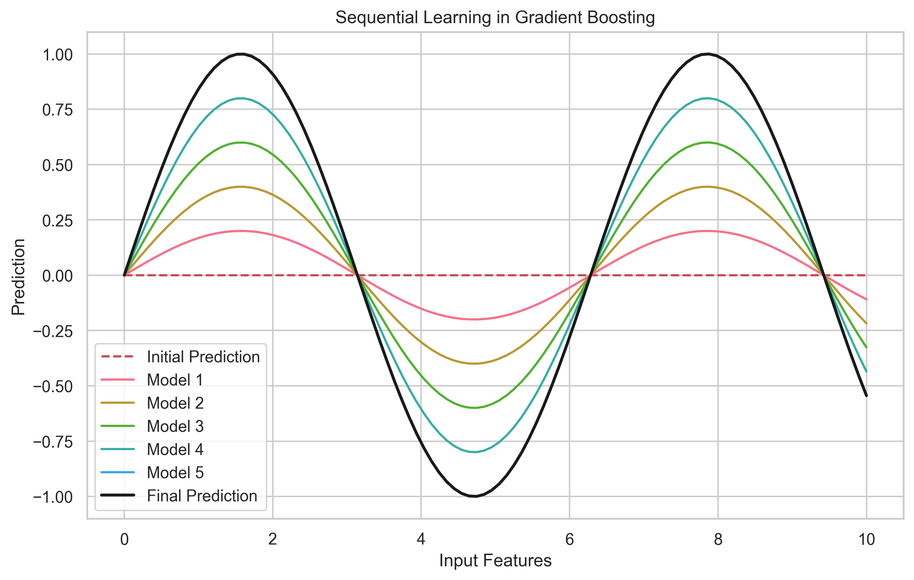
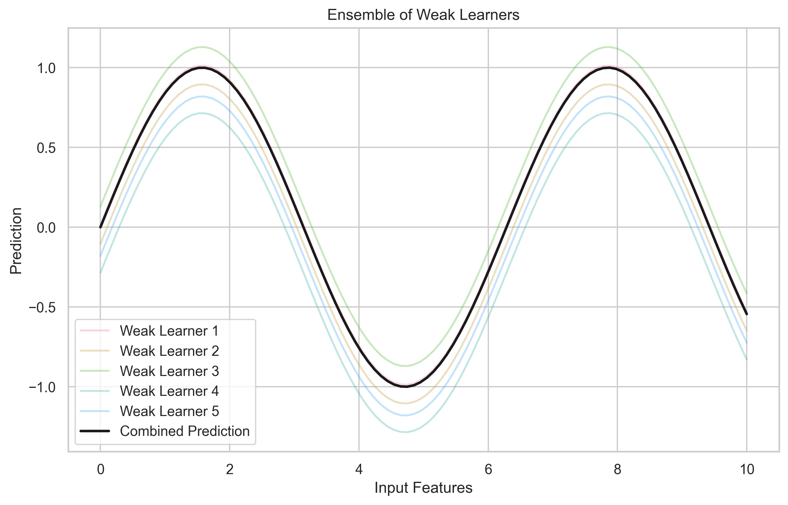

# Introduction to Gradient Boosting

Imagine you're learning to play a musical instrument. At first, you make many mistakes, but with each practice session, you focus on correcting your previous errors. Gradient Boosting works similarly - it's a smart way of learning from mistakes to create a powerful prediction model.

## What is Gradient Boosting?

Think of Gradient Boosting as a team of experts working together to solve a problem. Each expert (model) learns from the mistakes of the previous ones, gradually improving the overall solution. Here's how it works:

1. **Sequential Learning**: Like a relay race where each runner builds on the progress of the previous one
2. **Error Correction**: Each new model focuses on the mistakes the previous models made
3. **Combined Strength**: The final prediction is a weighted combination of all models' predictions

### Why This Matters

Gradient Boosting is particularly powerful because:

- It can handle complex patterns in data that simpler models might miss
- It's versatile - works for both classification (e.g., spam detection) and regression (e.g., house price prediction)
- It often achieves state-of-the-art results in many machine learning competitions

## Real-World Analogies

1. **Learning a New Language**
   - First, you learn basic vocabulary (first model)
   - Then you focus on grammar mistakes (second model)
   - Next, you work on pronunciation (third model)
   - Each step builds on previous knowledge

2. **Medical Diagnosis**
   - First doctor makes an initial assessment
   - Second doctor reviews and corrects any misdiagnosis
   - Third doctor adds specialized knowledge
   - Final diagnosis combines all insights

## When to Use Gradient Boosting?

### Perfect For

- Predicting customer churn in telecom companies
- Credit risk assessment in banking
- Medical diagnosis support systems
- Sales forecasting in retail
- Image classification tasks

### Less Suitable For

- Real-time fraud detection requiring instant decisions
- Mobile apps with limited processing power
- Simple problems where a single decision tree would suffice
- When model interpretability is the top priority

## Popular Implementations

1. **XGBoost (eXtreme Gradient Boosting)**
   - Like a high-performance sports car: fast, efficient, and powerful
   - Used by winning teams in Kaggle competitions
   - Great for structured/tabular data

2. **LightGBM (Light Gradient Boosting Machine)**
   - Like a fuel-efficient hybrid car: fast and resource-friendly
   - Perfect for large datasets
   - Uses a unique leaf-wise growth strategy

3. **CatBoost**
   - Like a specialized tool: great for specific tasks
   - Handles categorical data automatically
   - Reduces the need for data preprocessing

## Advantages and Limitations

### Advantages

1. **High Accuracy**: Often beats other algorithms in prediction tasks
2. **Flexibility**: Works with different types of data (numbers, categories, text)
3. **Feature Importance**: Helps understand which factors matter most
4. **Robustness**: Less affected by outliers and missing values
5. **Minimal Preprocessing**: Works well with raw data

### Limitations

1. **Training Time**: Can be slower than some other algorithms
2. **Memory Usage**: Requires more RAM for large datasets
3. **Complexity**: More parameters to tune than simpler models
4. **Overfitting Risk**: Can memorize training data if not careful
5. **Interpretability**: Harder to explain than single decision trees

## Common Mistakes to Avoid

1. **Not Tuning Parameters**: Like driving a car without adjusting the seat
2. **Using Too Many Trees**: Like studying too long without breaks
3. **Ignoring Feature Importance**: Like not learning from your mistakes
4. **Skipping Cross-Validation**: Like testing a new recipe without tasting

## Prerequisites

Before diving deeper, you should be familiar with:

1. Basic Python programming
2. Simple decision trees
3. Basic statistics concepts
4. Understanding of training and testing data
5. Common evaluation metrics (accuracy, precision, recall)

## Next Steps

Ready to learn more? Continue to [Mathematical Foundation](2-math-foundation.md) where we'll explore the theory behind Gradient Boosting in a beginner-friendly way!

## Additional Resources

For further learning:

- [XGBoost Documentation](https://xgboost.readthedocs.io/)
- [LightGBM Documentation](https://lightgbm.readthedocs.io/)
- [CatBoost Documentation](https://catboost.ai/docs/)
- [Kaggle Gradient Boosting Tutorials](https://www.kaggle.com/learn/intro-to-deep-learning)
