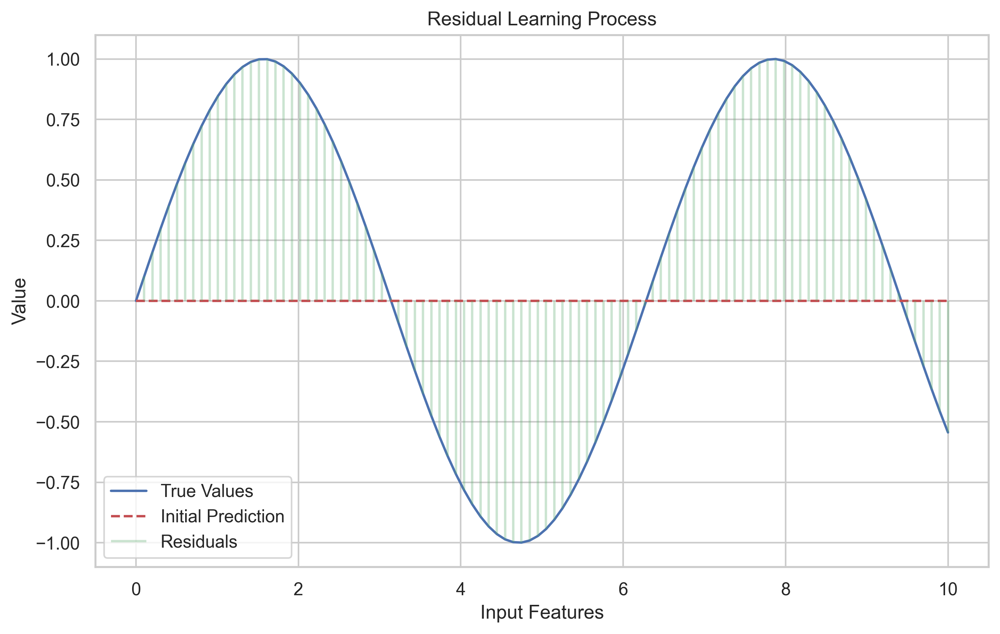
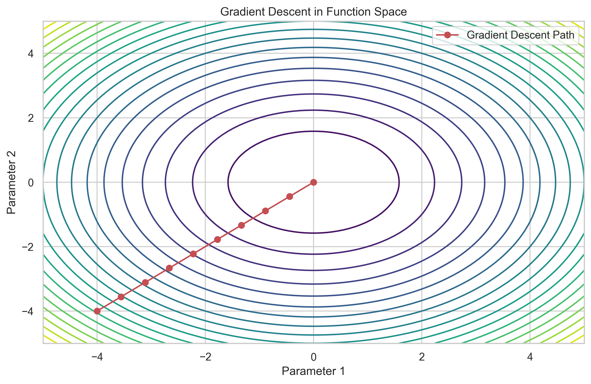
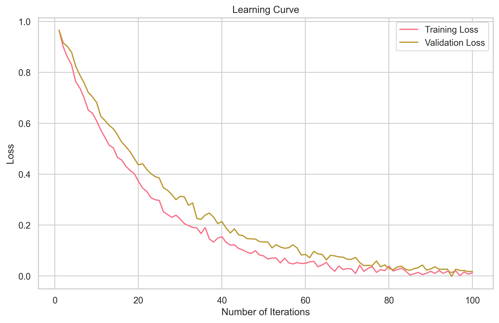
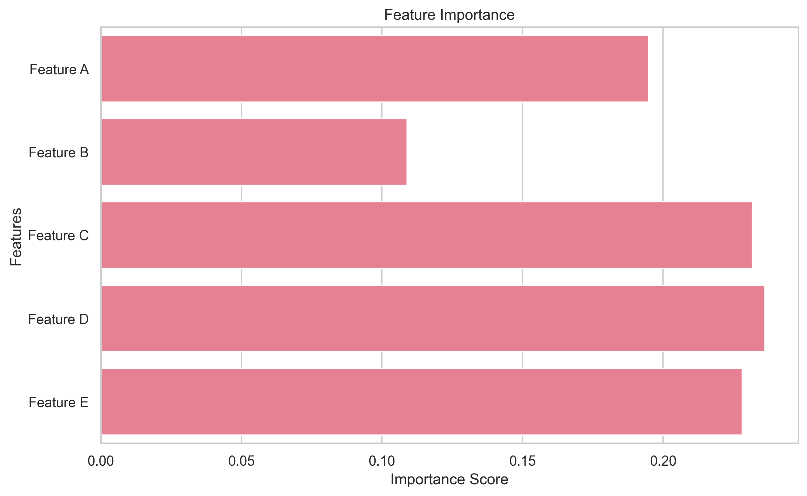

# Mathematical Foundation of Gradient Boosting

Think of Gradient Boosting as building a tower of blocks, where each block (model) is carefully placed to correct the mistakes of the previous ones. Let's break down the math behind this process in a way that's easy to understand!

## The Boosting Framework

### Additive Model: Building Blocks of Prediction

Imagine you're trying to predict house prices. Instead of using one complex model, Gradient Boosting uses multiple simple models (like small decision trees) that work together:



$$F_M(x) = \sum_{m=1}^M \gamma_m h_m(x)$$

Let's break this down:

- $F_M(x)$ is your final prediction (like the total price)
- $h_m(x)$ are simple models (like individual features: location, size, etc.)
- $\gamma_m$ are weights (how important each feature is)
- $M$ is how many models we use

**Why This Matters**: This approach is like having multiple experts review a house - each focusing on different aspects, then combining their opinions for a better overall assessment.

## Gradient Descent in Function Space

### Understanding Loss Functions

A loss function tells us how wrong our predictions are. It's like a teacher grading your answers:



```python
def mse_loss(y_true, y_pred):
    """Mean Squared Error loss - measures average squared difference"""
    return np.mean((y_true - y_pred) ** 2)

def log_loss(y_true, y_pred):
    """Binary Cross Entropy loss - measures probability errors"""
    return -np.mean(
        y_true * np.log(y_pred) + 
        (1 - y_true) * np.log(1 - y_pred)
    )
```

**Real-World Analogy**: Think of loss functions like a GPS navigation system. The loss tells us how far we are from our destination (correct prediction), and gradient descent helps us find the best route to minimize this distance.

## Residual Learning: Learning from Mistakes

### Computing Residuals

Residuals are like the mistakes our current model makes. Each new model tries to fix these mistakes:

$$r_{im} = -\left[\frac{\partial L(y_i, F(x_i))}{\partial F(x_i)}\right]_{F=F_{m-1}}$$

```python
def compute_residuals(y_true, y_pred, loss='mse'):
    """Compute how wrong our predictions are"""
    if loss == 'mse':
        return y_true - y_pred  # Simple difference for regression
    elif loss == 'log':
        return y_true - 1 / (1 + np.exp(-y_pred))  # Probability difference for classification
```

**Why This Matters**: It's like learning to play a musical instrument - you focus on the notes you're playing wrong and practice those specific parts.

## Learning Rate and Shrinkage: Taking Small Steps

### The Learning Rate Parameter

The learning rate ($\nu$) controls how much each new model can change the predictions:



$$F_m(x) = F_{m-1}(x) + \nu \gamma_m h_m(x)$$

Think of it like adjusting the volume on your TV:

- Too high (large $\nu$): You might overshoot the perfect volume
- Too low (small $\nu$): It takes forever to reach the right volume
- Just right: You make smooth, precise adjustments

```python
def update_predictions(y_pred, tree_pred, learning_rate=0.1):
    """Update predictions carefully using learning rate"""
    return y_pred + learning_rate * tree_pred
```

## Tree Building Process: Making Smart Splits

### Finding the Best Split

When building decision trees, we need to find the best way to split the data:

$$\text{Gain}(s) = \frac{1}{2} \left[\frac{G_L^2}{H_L + \lambda} + \frac{G_R^2}{H_R + \lambda} - \frac{(G_L + G_R)^2}{H_L + H_R + \lambda}\right]$$

**Analogy**: It's like organizing a library:

- $G$ tells us how many books are in each section
- $H$ tells us how diverse the books are
- $\lambda$ prevents us from creating too many tiny sections

```python
def find_best_split(gradients, hessians, feature_values):
    """Find the best way to split our data"""
    best_gain = 0
    best_split = None
    
    for value in feature_values:
        # Split data into left and right groups
        left_mask = feature_values <= value
        right_mask = ~left_mask
        
        # Calculate statistics for each group
        G_L = gradients[left_mask].sum()
        G_R = gradients[right_mask].sum()
        H_L = hessians[left_mask].sum()
        H_R = hessians[right_mask].sum()
        
        # Calculate how good this split is
        gain = calculate_split_gain(G_L, G_R, H_L, H_R)
        
        if gain > best_gain:
            best_gain = gain
            best_split = value
    
    return best_split, best_gain
```

## Regularization: Preventing Overfitting

### The Objective Function

Regularization helps prevent our model from memorizing the training data:

$$\text{Obj} = \sum_{i=1}^n L(y_i, \hat{y}_i) + \sum_{k=1}^K \Omega(f_k)$$

**Why This Matters**: It's like having a budget when shopping:

- First term: How well our predictions match the actual values
- Second term: Penalty for making the model too complex

## Early Stopping: Knowing When to Stop

### Validation-based Stopping

We stop training when the model stops improving:

```python
class EarlyStopping:
    """Stop training when the model stops improving"""
    def __init__(self, patience=5, min_delta=0):
        self.patience = patience  # How many rounds to wait
        self.min_delta = min_delta  # Minimum improvement required
        self.counter = 0
        self.best_loss = None
        self.early_stop = False
    
    def __call__(self, val_loss):
        if self.best_loss is None:
            self.best_loss = val_loss
        elif val_loss > self.best_loss - self.min_delta:
            self.counter += 1
            if self.counter >= self.patience:
                self.early_stop = True
        else:
            self.best_loss = val_loss
            self.counter = 0
```

**Analogy**: It's like studying for an exam - you stop when additional studying doesn't improve your practice test scores.

## Feature Importance: Understanding What Matters

### Gain-based Importance

This tells us which features are most important for making predictions:



$$\text{Importance}(f) = \sum_{t=1}^T \sum_{j \in \{splits on f\}} \text{Gain}(j)$$

```python
def calculate_feature_importance(trees, feature_names):
    """Calculate how important each feature is"""
    importance = defaultdict(float)
    
    for tree in trees:
        for feature, gain in tree.feature_gains.items():
            importance[feature_names[feature]] += gain
    
    # Normalize to get percentages
    total = sum(importance.values())
    return {f: v/total for f, v in importance.items()}
```

**Why This Matters**: It's like understanding which ingredients matter most in a recipe - helping us focus on what's important.

## Common Mistakes to Avoid

1. **Ignoring Learning Rate**: Like driving too fast and missing your exit
2. **Too Many Trees**: Like studying the same material over and over
3. **Skipping Regularization**: Like memorizing answers instead of understanding concepts
4. **Not Using Early Stopping**: Like continuing to study when you're already prepared

## Next Steps

Now that you understand the mathematics behind Gradient Boosting, let's move on to [Implementation](3-implementation.md) to see how to put these concepts into practice!

## Additional Resources

For deeper understanding:

- [XGBoost Mathematics](https://xgboost.readthedocs.io/en/latest/tutorials/model.html)
- [Gradient Boosting Explained](https://explained.ai/gradient-boosting/)
- [Statistical Learning Theory](https://web.stanford.edu/~hastie/ElemStatLearn/)
