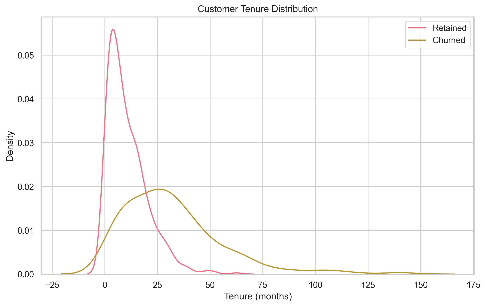

# Implementing Gradient Boosting

Welcome to the practical side of Gradient Boosting! In this guide, we'll walk through implementing Gradient Boosting using popular frameworks like XGBoost, LightGBM, and CatBoost. Think of this as learning to cook - we'll start with simple recipes and gradually move to more complex dishes.

## Getting Started: Basic Implementation with XGBoost

### Classification Example: Spam Detection

Let's build a spam detector as our first project. This is like creating a filter that can tell if an email is spam or not.

Before we dive into the code, let's understand what we're trying to achieve:

1. We want to classify emails as spam or not spam
2. We'll use features like word counts and sender information
3. We'll train a model to learn patterns from these features

Here's how we'll do it step by step:


```python
# First, let's import the tools we need
# Think of these as our kitchen utensils
import numpy as np
import pandas as pd
import xgboost as xgb
from sklearn.model_selection import train_test_split
from sklearn.metrics import classification_report

# Now, let's create some sample email data
# This is like preparing our ingredients
from sklearn.datasets import make_classification
X, y = make_classification(
    n_samples=1000,        # Number of emails
    n_features=20,         # Number of features per email
    n_informative=15,      # Number of useful features
    n_redundant=5,         # Number of redundant features
    random_state=42        # For reproducibility
)

# Let's split our data into training and testing sets
# This is like dividing our ingredients for practice and final cooking
X_train, X_test, y_train, y_test = train_test_split(
    X, y, 
    test_size=0.2,         # 20% for testing
    random_state=42
)

# Now, let's prepare our data for XGBoost
# This is like organizing our ingredients before cooking
dtrain = xgb.DMatrix(X_train, label=y_train)
dtest = xgb.DMatrix(X_test, label=y_test)

# Let's set our model's parameters
# These are like the settings on our cooking equipment
params = {
    'max_depth': 3,        # How deep each tree can grow
    'eta': 0.1,            # Learning rate (how fast it learns)
    'objective': 'binary:logistic',  # We're doing binary classification
    'eval_metric': 'logloss',        # How we measure success
    'nthread': 4           # Use 4 CPU cores
}

# Time to train our model!
# This is like cooking our dish
model = xgb.train(
    params,
    dtrain,
    num_boost_round=100,   # Number of trees to build
    evals=[(dtrain, 'train'), (dtest, 'test')],  # Track progress
    early_stopping_rounds=10,  # Stop if no improvement
    verbose_eval=False
)

# Let's test our model on new emails
# This is like tasting our dish
y_pred = model.predict(dtest)
y_pred_binary = (y_pred > 0.5).astype(int)  # Convert probabilities to 0/1

# Finally, let's see how well we did
# This is like getting feedback on our cooking
print("Classification Report:")
print(classification_report(y_test, y_pred_binary))
```

Great job! You've just built your first spam detector. Let's break down what we did:

1. We prepared our data (emails and their features)
2. We split the data for training and testing
3. We set up our model with appropriate parameters
4. We trained the model and evaluated its performance

Now that you understand the basics, let's try something a bit more complex: predicting house prices!

## LightGBM Implementation: House Price Prediction

Predicting house prices is like helping a real estate agent estimate property values. We'll use LightGBM, which is particularly good at handling large datasets efficiently.

Before we start coding, let's think about what we need:

1. Features like square footage, number of bedrooms, location, etc.
2. A way to measure how accurate our predictions are
3. A model that can learn from these features

Let's implement this step by step:


```python
# First, let's import our tools
# These are different from XGBoost, but serve similar purposes
import lightgbm as lgb
from sklearn.metrics import mean_squared_error, r2_score

# Let's create some sample house data
# Think of this as collecting information about different houses
X, y = make_regression(
    n_samples=1000,        # Number of houses
    n_features=20,         # Number of features per house
    noise=0.1,             # Some randomness in prices
    random_state=42
)

# Let's split our data
# This is similar to what we did before
X_train, X_test, y_train, y_test = train_test_split(
    X, y, 
    test_size=0.2,
    random_state=42
)

# Now, let's prepare our data for LightGBM
# Notice how this is slightly different from XGBoost
train_data = lgb.Dataset(X_train, label=y_train)
test_data = lgb.Dataset(X_test, label=y_test, reference=train_data)

# Let's set our model parameters
# These are similar to XGBoost but with some differences
params = {
    'objective': 'regression',  # We're predicting continuous values
    'metric': 'rmse',          # Root Mean Squared Error
    'num_leaves': 31,          # Number of leaves in each tree
    'learning_rate': 0.05,     # How fast to learn
    'feature_fraction': 0.9    # Use 90% of features in each tree
}

# Time to train our model!
model = lgb.train(
    params,
    train_data,
    num_boost_round=100,
    valid_sets=[train_data, test_data],
    callbacks=[lgb.early_stopping(10)]  # Stop if no improvement
)

# Let's make predictions
y_pred = model.predict(X_test)

# Finally, let's evaluate our model
# We'll use RMSE and R² to measure accuracy
print(f"RMSE: {np.sqrt(mean_squared_error(y_test, y_pred)):.4f}")
print(f"R²: {r2_score(y_test, y_pred):.4f}")
```

Excellent! You've now built a house price predictor. Notice how this implementation is similar to our spam detector but with some key differences:

1. We're predicting continuous values (prices) instead of categories
2. We're using different evaluation metrics
3. The data preparation is slightly different

Now, let's try something even more interesting: customer segmentation with CatBoost!

## CatBoost Implementation: Customer Segmentation

Customer segmentation is like grouping customers for targeted marketing. CatBoost is particularly good at handling categorical data, which is perfect for this task.

Before we start coding, let's understand what we're working with:

1. Customer data like age, income, education, and occupation
2. Categorical features that need special handling
3. A way to identify high-value customers

Let's implement this step by step:


```python
# First, let's import CatBoost
# This is our third framework, but the concepts are similar
from catboost import CatBoostClassifier, Pool

# Let's create some sample customer data
# Think of this as collecting customer information
data = pd.DataFrame({
    'age': np.random.normal(40, 10, 1000),           # Customer age
    'income': np.random.normal(50000, 20000, 1000),  # Annual income
    'education': np.random.choice(                    # Education level
        ['HS', 'BS', 'MS', 'PhD'], 1000
    ),
    'occupation': np.random.choice(                   # Job type
        ['Tech', 'Finance', 'Healthcare'], 1000
    )
})

# Let's create our target variable
# This identifies high-value customers
data['target'] = (
    (data['age'] > 35) & 
    (data['income'] > 45000) |
    (data['education'].isin(['MS', 'PhD']))
).astype(int)

# Let's prepare our features
X = data.drop('target', axis=1)
y = data['target']

# Let's split our data
X_train, X_test, y_train, y_test = train_test_split(
    X, y, 
    test_size=0.2,
    random_state=42
)

# Here's something new: we need to specify categorical features
cat_features = ['education', 'occupation']

# Let's prepare our data for CatBoost
# Notice how we specify categorical features
train_pool = Pool(X_train, y_train, cat_features=cat_features)
test_pool = Pool(X_test, y_test, cat_features=cat_features)

# Time to train our model!
model = CatBoostClassifier(
    iterations=100,        # Number of trees
    learning_rate=0.1,     # Learning rate
    depth=6,              # Tree depth
    loss_function='Logloss',
    verbose=False
)
model.fit(train_pool, eval_set=test_pool)

# Let's make predictions
y_pred = model.predict(test_pool)

# Finally, let's evaluate our model
print("Classification Report:")
print(classification_report(y_test, y_pred))
```

Great work! You've now built a customer segmentation model. Notice how CatBoost makes it easy to handle categorical data:

1. We specified which features are categorical
2. CatBoost automatically handles the encoding
3. The rest of the process is similar to our previous examples

Now, let's put everything together in a real-world example: predicting customer churn!

## Real-World Example: Customer Churn Prediction

Customer churn prediction is like having a crystal ball for customer retention. We'll use everything we've learned to build a practical system.

Before we start coding, let's understand what we're building:

1. A system that predicts which customers might leave
2. Features that help identify at-risk customers
3. A way to categorize customers by risk level

Let's implement this step by step:



```python
# Let's create realistic customer data
# Think of this as collecting customer service information
data = pd.DataFrame({
    'tenure': np.random.normal(30, 15, 1000),           # Months with company
    'monthly_charges': np.random.normal(70, 20, 1000),  # Monthly bill
    'total_charges': np.random.normal(2000, 800, 1000), # Total spent
    'contract_type': np.random.choice(                   # Contract length
        ['Month-to-month', 'One year', 'Two year'], 1000
    ),
    'payment_method': np.random.choice(                  # How they pay
        ['Electronic check', 'Mailed check', 'Bank transfer'], 1000
    ),
    'internet_service': np.random.choice(                # Service type
        ['DSL', 'Fiber optic', 'No'], 1000
    )
})

# Let's create our target variable
# This identifies customers who might leave
data['churn'] = (
    (data['tenure'] < 12) & 
    (data['monthly_charges'] > 80) |
    (data['contract_type'] == 'Month-to-month')
).astype(int)

# Let's prepare our features
cat_features = ['contract_type', 'payment_method', 'internet_service']
X = data.drop('churn', axis=1)
y = data['churn']

# Let's split our data
X_train, X_test, y_train, y_test = train_test_split(
    X, y, 
    test_size=0.2,
    random_state=42
)

# Time to train our model!
model = CatBoostClassifier(
    iterations=200,
    learning_rate=0.1,
    depth=6,
    loss_function='Logloss',
    verbose=False
)
model.fit(
    X_train, y_train,
    cat_features=cat_features,
    eval_set=(X_test, y_test)
)

# Let's analyze which features are most important
# This helps us understand what drives churn
importance = pd.DataFrame({
    'feature': X.columns,
    'importance': model.feature_importances_
}).sort_values('importance', ascending=False)

print("\nFeature Importance:")
print(importance)

# Finally, let's categorize customers by risk
# This helps prioritize retention efforts
y_prob = model.predict_proba(X_test)[:, 1]
risk_categories = pd.cut(
    y_prob,
    bins=[0, 0.3, 0.6, 1],
    labels=['Low', 'Medium', 'High']
)

print("\nRisk Distribution:")
print(risk_categories.value_counts())
```

Congratulations! You've now built a complete customer churn prediction system. Notice how we've combined everything we've learned:

1. We used CatBoost for handling categorical data
2. We analyzed feature importance to understand what drives churn
3. We created risk categories to help prioritize retention efforts

## Best Practices and Common Mistakes

Now that you've seen several implementations, let's review some best practices and common mistakes to avoid:

### 1. Data Preparation

- Always check for missing values
- Scale numerical features
- Handle categorical variables properly
- Remove irrelevant features

### 2. Model Tuning

- Start with default parameters
- Use cross-validation
- Tune one parameter at a time
- Keep track of changes

### 3. Evaluation

- Use appropriate metrics
- Check for overfitting
- Analyze feature importance
- Monitor training progress

## Common Mistakes to Avoid

1. **Using Too Many Trees**
   - Like studying the same material over and over
   - Can lead to overfitting
   - Solution: Use early stopping

2. **Ignoring Categorical Features**
   - Like not considering important customer segments
   - Can miss valuable patterns
   - Solution: Use proper encoding or CatBoost

3. **Skipping Feature Importance**
   - Like not learning from your mistakes
   - Miss insights about your data
   - Solution: Always analyze feature importance

## Next Steps

Ready to try these implementations? Start with the spam detection example and gradually move to more complex projects. Remember, practice makes perfect!

## Additional Resources

For more learning:

- [XGBoost Documentation](https://xgboost.readthedocs.io/)
- [LightGBM Documentation](https://lightgbm.readthedocs.io/)
- [CatBoost Documentation](https://catboost.ai/docs/)
- [Kaggle Gradient Boosting Tutorials](https://www.kaggle.com/learn/intro-to-deep-learning)
